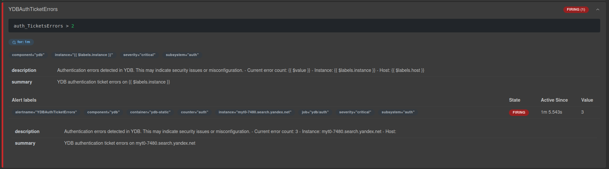

<!-- markdownlint-disable MD014, MD031, MD038, MD040, MD046, MD048 -->

# Alerting

Alerting is a mechanism for automatic notifications that informs administrators or DevOps engineers about events that require their attention or intervention.

It lets you monitor critical database parameters in real time (such as overall system health, CPU utilization, authentication errors, and disk space usage) and respond quickly to failures, errors, or load above acceptable thresholds.

The following sections describe configurable alerting rules and how they are implemented in {{ ydb-short-name }}.

## Alerting in {{ ydb-short-name }} with Prometheus Alerting Rules

[Prometheus Alerting Rules](https://prometheus.io/docs/prometheus/latest/configuration/alerting_rules/) are a set of rules written in YAML that define conditions for generating alerts. These rules use the PromQL (Prometheus Query Language) and let you automatically detect issues based on collected metrics. For example, you can configure a rule that fires when CPU load exceeds 70% or when disk usage is above 60%.

## Before you begin

- You need a Prometheus server set up. For installation details, see the [Prometheus documentation](https://prometheus.io/docs/prometheus/latest/installation/).
- You should have a basic understanding of [recording rules](https://prometheus.io/docs/prometheus/latest/configuration/recording_rules/#rule).
- Notifications must be configured so that alerts are delivered to your preferred channels. For configuration details, see the [Alertmanager documentation](https://prometheus.io/docs/alerting/latest/alertmanager/).

**Key rule parameters:**

```yaml
- alert: YDBAuthTicketErrors  # Alert name
  expr: auth_TicketsErrors > 2  # Condition that triggers the alert
  for: 1m  # Time the condition must hold before the alert fires
  ...
```

- **Where are they stored?** Rules are typically defined in separate files (for example, `rules.yml`) and loaded into the Prometheus configuration.
- **How are they evaluated?** The Prometheus server periodically (by default every 1–2 minutes) evaluates the `expr` expressions in the rules. If the condition is true for the duration specified in `for`, an alert is generated.

**Alert states:**

  - **Pending:** The alert condition (`expr`) is satisfied (the expression evaluates to `true`), but the `for` duration has not elapsed yet.
  - **Firing:** The condition has remained true for the full `for` duration; the alert is active.
  - **Resolved:** The condition no longer holds; the alert is closed.

For more details on the system and rule structure, see the [official Prometheus documentation](https://prometheus.io/docs/prometheus/latest/configuration/alerting_rules/).

## Recommended alerting rules for every cluster

### {{ ydb-short-name }} ExecPool High Utilization

**Description:** This rule monitors [resource pool](../../concepts/glossary.md#resource-pool) utilization in {{ ydb-short-name }}. It fires when utilization exceeds 90%, which can lead to performance degradation and higher query latency.
**What to do:** Analyze the load. The alert message includes the name of the pool where the threshold is exceeded. For more on diagnosing CPU-related issues, see [CPU bottleneck](../../troubleshooting/performance/hardware/cpu-bottleneck.md).



If you change the alert configuration, update the `for` parameter together with the `utils_ElapsedMicrosec` window so that their values stay consistent.



```yaml
- alert: YDBExecPoolHighUtilization
  expr: |
    (
      sum by (instance, execpool) (
        rate(utils_ElapsedMicrosec[1m])
      ) / 1000000
    ) / (
      sum by(instance, execpool) (
        utils_CurrentThreadCount
      ) 
    ) > 0.9
  for: 1m
  labels:
    severity: critical
    component: ydb
    subsystem: execpool
    instance: "{{ $labels.instance }}"
    execpool: "{{ $labels.execpool }}"
  annotations:
    summary: "YDB ExecPool high utilization on {{ $labels.instance }}"
    description: |
      ExecPool {{ $labels.execpool }} on host {{ $labels.instance }}
      is loaded at {{ $value | humanizePercentage }}.
      This may lead to performance degradation.
      - Instance: {{ $labels.instance }}
      - ExecPool: {{ $labels.execpool }}
      - Current utilization: {{ $value | humanizePercentage }}
```

**Example of a firing alert:**


### {{ ydb-short-name }} Authentication Errors

**Description:** This rule tracks authentication errors in {{ ydb-short-name }}. It fires when more than 2 errors occur within the `for` period. This may indicate incorrect credentials, security misconfiguration, or a system configuration issue.
**What to do:** Search [logs](./logging.md) for authentication errors and identify the cause.

```yaml
- alert: YDBAuthTicketErrors
  expr: auth_TicketsErrors > 2
  for: 1m
  labels:
    severity: critical
    component: ydb
    subsystem: auth
    instance: "{{ $labels.instance }}"
  annotations:
    summary: "YDB authentication ticket errors on {{ $labels.instance }}"
    description: |
      Authentication errors detected in YDB.
      This may indicate security issues or misconfiguration.
      - Current error count: {{ $value }}
      - Instance: {{ $labels.instance }}
      - Host: {{ $labels.host }}
```

**Example of a firing alert:**



### {{ ydb-short-name }} Storage Usage

**Description:** This rule monitors disk space usage. It fires when storage utilization reaches critical levels. We recommend configuring two thresholds: a warning at 80% usage and a critical alert at 90%.
**What to do:** Determine why the database has grown beyond the expected size. Remove unneeded data (for example, old logs) or increase the database size limit if appropriate. For more on diagnosing disk space issues, see [Disk space](../../troubleshooting/performance/hardware/disk-space.md).

#### Warning Storage Usage (80%)

```yaml
- alert: YDBStorageUsageWarning
  expr: |
    (ydb_resources_storage_used_bytes / ydb_resources_storage_limit_bytes) * 100 > 80
    and ydb_resources_storage_limit_bytes > 0
  for: 5m
  labels:
    severity: warning
    component: ydb
    subsystem: storage
    database: "{{ $labels.database }}"
  annotations:
    summary: "High storage usage in YDB database {{ $labels.database }}"
    description: |
      Storage usage is above warning threshold.
      Consider cleaning up old data or increasing storage capacity.
      - Database: {{ $labels.database }}
      - Current usage: {{ printf "%.2f" $value }}%
      - Threshold: 80%
      - Duration: more than 5 minutes
```

#### Critical Storage Usage (90%)

```yaml
- alert: YDBStorageUsageCritical
  expr: |
    (ydb_resources_storage_used_bytes / ydb_resources_storage_limit_bytes) * 100 > 90
    and ydb_resources_storage_limit_bytes > 0
  for: 5m
  labels:
    severity: critical
    component: ydb
    subsystem: storage
    database: "{{ $labels.database }}"
  annotations:
    summary: "Critical storage usage in YDB database {{ $labels.database }}"
    description: |
      Storage usage is critically high. Immediate action required!
      Database may stop accepting writes soon.
      - Database: {{ $labels.database }}
      - Current usage: {{ printf "%.2f" $value }}%
      - Threshold: 90%
      - Duration: more than 5 minutes
```

**Example of a firing alert:**


## Full configuration file

A full configuration file with all of the rules above is available at this [link](https://github.com/ydb-platform/ydb/blob/main/ydb/deploy/helm/ydb-prometheus/examples/ydb_prometheus_example.yaml).

## Configuration recommendations

- **Thresholds:** Adjust the thresholds in the `expr` parameter to match your SLAs and load profile.
- **Pending duration:** Increase the `for` parameter for less critical alerts to reduce false positives.
