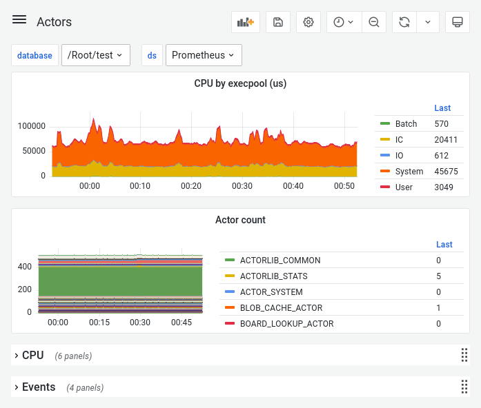

# Setting Up {{ ydb-short-name }} Cluster Monitoring

This page explains how to set up monitoring for a {{ ydb-short-name }} cluster.

{{ ydb-short-name }} provides numerous system state metrics. Instant metric values can be viewed in the web interface:

```text
http://<ydb-server-address>:<ydb-port>/counters/
```

where:

- `<ydb-server-address>` – {{ ydb-short-name }} server address.

  For a local single-node {{ ydb-short-name }} cluster started using the [Quick start](../../quickstart.md) instructions, use the address `localhost`.

- `<ydb-port>` – {{ ydb-short-name }} port. Default value: 8765.

Related metrics are grouped into subgroups (for example `counters auth`). To view metric values for a specific subgroup only, navigate to a URL of the following form:

```text
http://<ydb-server-address>:<ydb-port>/counters/counters=<servicename>/
```

- `<servicename>` — metric subgroup name.

For example, server hardware resource utilization data is available at the following URL:

```text
http://<ydb-server-address>:<ydb-port>/counters/counters=utils
```

To collect metric values, you can use the popular open-source tool [Prometheus](https://prometheus.io/) or any other system that supports this format. {{ ydb-short-name }} metric values in [Prometheus format](https://prometheus.io/docs/instrumenting/exposition_formats/) are available at URLs of the following form:

```text
http://<ydb-server-address>:<ydb-port>/counters/counters=<servicename>/prometheus
```

- `<servicename>` — metric subgroup name.

Data can be visualized using any system that supports the Prometheus format, such as [Grafana](https://grafana.com/), [Zabbix](https://www.zabbix.com/ru/) or [Amazon CloudWatch](https://aws.amazon.com/ru/cloudwatch/):



## Setting Up Monitoring with Prometheus and Grafana {#prometheus-grafana}

To set up {{ ydb-short-name }} cluster monitoring using [Prometheus](https://prometheus.io/) and [Grafana](https://grafana.com/):

1. [Install](https://prometheus.io/docs/prometheus/latest/getting_started) Prometheus.

1. Edit the Prometheus [configuration file](https://github.com/ydb-platform/ydb/tree/main/ydb/deploy/grafana_dashboards/local_ydb_prometheus.yml):

    1. In the `targets` section, specify the addresses of all {{ ydb-short-name }} cluster servers and the ports of each storage node and database node running on the server.

        For example, for a cluster of three servers, where each server runs one storage node on port 8765 and two database nodes on ports 8766 and 8767, you need to specify nine addresses for all metric subgroups except disk metrics (for disk metric subgroups, you only need to specify storage node addresses):

        ```json
        static_configs:
        - targets:
          - ydb-s1.example.com:8765
          - ydb-s1.example.com:8766
          - ydb-s1.example.com:8767
          - ydb-s2.example.com:8765
          - ydb-s2.example.com:8766
          - ydb-s2.example.com:8767
          - ydb-s3.example.com:8765
          - ydb-s3.example.com:8766
          - ydb-s3.example.com:8767
        ```

        For a local single-node YDB cluster, specify one address in the `targets` section:

        ```json
        - targets: ["localhost:8765"]
        ```

    1. If necessary, in the `tls_config` section, specify the [Certificate Authority (CA) certificate](../deployment-options/manual/initial-deployment.md#tls-certificates) that signed the other TLS certificates of the {{ ydb-short-name }} cluster:

       ```json
       scheme: https
       tls_config:
           ca_file: '<ydb-ca-file>'
       ```

1. [Start](https://prometheus.io/docs/prometheus/latest/getting_started/#starting-prometheus) Prometheus using the edited configuration file.

1. [Install and start](https://grafana.com/docs/grafana/latest/getting-started/getting-started/) Grafana.

1. [Create](https://prometheus.io/docs/visualization/grafana/#creating-a-prometheus-data-source) a data source with type `prometheus` in Grafana and connect it to the running Prometheus instance.

1. Upload [{{ ydb-short-name }} dashboards](https://github.com/ydb-platform/ydb/tree/main/ydb/deploy/helm/ydb-prometheus/dashboards) to Grafana.

    You can upload dashboards using the Grafana UI [Import](https://grafana.com/docs/grafana/latest/dashboards/export-import/#import-dashboard) tool or run the [script](https://github.com/ydb-platform/ydb/tree/main/ydb/deploy/grafana_dashboards/local_upload_dashboards.sh). Note that the script uses [basic authentication](https://grafana.com/docs/grafana/latest/http_api/create-api-tokens-for-org/#authentication) in Grafana. For other cases, modify the script.

    See the [Grafana dashboards reference](../../reference/observability/metrics/grafana-dashboards.md).