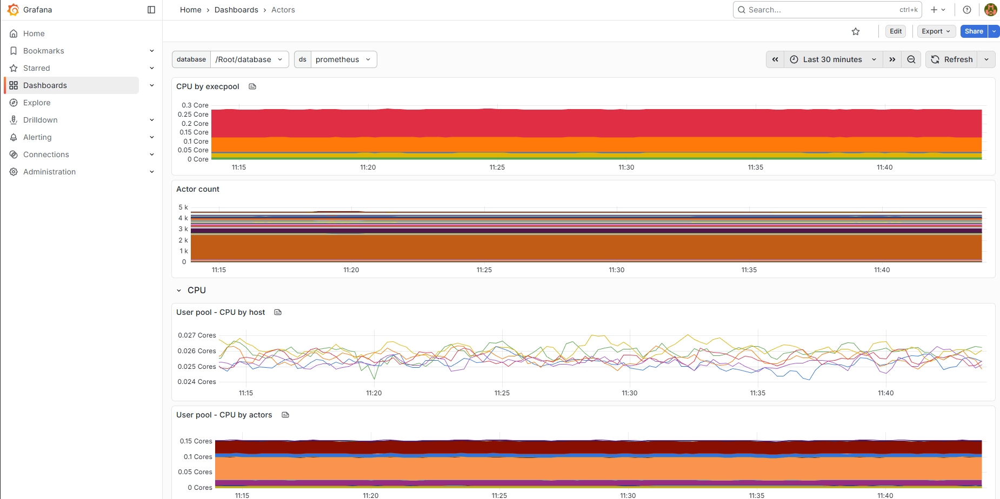
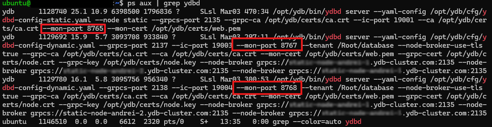
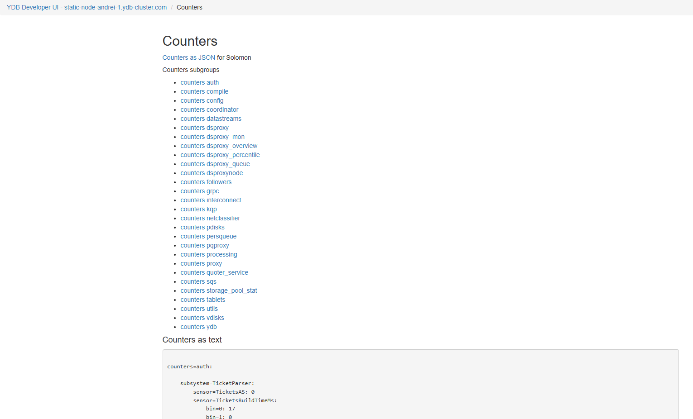

# Setting up cluster monitoring {{ ydb-short-name }}

This page is part of the [Observability overview](index.md) and describes how to configure metric collection for the {{ ydb-short-name }} cluster in [Prometheus](https://prometheus.io/) and visualization in [Grafana](https://grafana.com/). On each node, metrics are also available in the built-in HTTP monitoring interface — the section [Accessing metrics via the web interface](#web-metrics).



Before you begin, review the [metrics description](../../reference/observability/metrics/index.md) and [Grafana dashboards reference](../../reference/observability/metrics/grafana-dashboards.md).

Determine how the {{ ydb-short-name }} cluster is deployed:

- using [one of the cluster deployment methods](../deployment-options/index.md) (Ansible, Kubernetes, or manually)
- or in the [quick start](../../quickstart.md) configuration (single-node local cluster).



## Setting up monitoring with Prometheus and Grafana {#prometheus-grafana}

### Preparing for installation {#installation-preparation}

- [Install](https://prometheus.io/docs/prometheus/latest/getting_started) Prometheus.
- [Install](https://grafana.com/docs/grafana/latest/setup-grafana/) Grafana.

The full deployment cycle of Prometheus and Grafana is not covered in this section — refer to the documentation of the selected products.

### Options for preparing metric collection configuration {#prometheus-config-variants}

Configuration of metric collection from {{ ydb-short-name }} nodes can be prepared using one of the methods below. In all cases, you will need the `prometheus_ydb.yml` file, which describes the collection of {{ ydb-short-name }} metrics.

The list of [storage nodes](../../concepts/glossary.md#storage-node) and [dynamic nodes](../../concepts/glossary.md#dynamic-node) of the database is specified in the `ydbd-storage.yml` and `ydbd-database.yml` files, respectively. The paths to these files are set in `prometheus_ydb.yml` (for more details, see the [Running Prometheus with a prepared configuration](#prometheus-start) section).



- Ansible (with TLS)

  The recommended way to get a consistent set of files is to generate a metric collection configuration using the `generate_promconf` playbook.

  Go to the working directory of the Ansible playbook for your cluster:


  ```bash
  cd <path_to_ansible_project>
  ```


  Run the configuration generation playbook for Prometheus:


  ```bash
  ansible-playbook ydb_platform.ydb.generate_promconf
  ```


  The playbook will create a directory `promconf` with the following contents:

  - `prometheus_ydb.yml` — Prometheus configuration file.
  - `ydbd-storage.yml`: list of cluster storage nodes.
  - `ydbd-database.yml` — list of dynamic database nodes.
  - `ca.crt`: certificate used when deploying the cluster.
  - `grafana-dashboards` — directory with Grafana dashboard templates. Templates are loaded from the [GitHub repository](https://github.com/ydb-platform/ydb/tree/main/ydb/deploy/helm/ydb-prometheus/dashboards).

  Check the contents of the generated files `ydbd-storage.yml` and `ydbd-database.yml`. The list of nodes and ports must match the actual cluster topology, including the nodes displayed in the [{{ ydb-ui-name }}](../../reference/ydb-ui/ydb-monitoring.md).

  Example of checking the contents of the configuration directory:


  ```bash
  cd promconf
  ls -la
  ```


  Example output:


  ```text
  -rw-rw-r-- 1 1818 ca.crt
  drwxrwxr-x 2 4096 grafana-dashboards
  -rw-rw-r-- 1 17532 prometheus_ydb.yml
  -rw-rw-r-- 1 165 ydbd-database.yml
  -rw-rw-r-- 1 164 ydbd-storage.yml
  ```


  Checking node availability — via HTTPS; see [Metrics in Prometheus format](#web-metrics-prometheus).

- Manually without TLS

  Copy files from the [ydb/deploy/prometheus](https://github.com/ydb-platform/ydb/tree/main/ydb/deploy/prometheus) directory of the {{ ydb-short-name }} repository.

  Fill in the `targets` sections in [`ydbd-storage.yml`](https://github.com/ydb-platform/ydb/tree/main/ydb/deploy/prometheus/ydbd-storage.yml) and [`ydbd-database.yml`](https://github.com/ydb-platform/ydb/tree/main/ydb/deploy/prometheus/ydbd-database.yml): specify the hosts and monitoring ports (`--mon-port`) of all storage nodes and dynamic database nodes from which to collect metrics (to determine the port, see [How to determine the monitoring port](#web-metrics-mon-port)).

  In [`prometheus_ydb.yml`](https://github.com/ydb-platform/ydb/tree/main/ydb/deploy/prometheus/prometheus_ydb.yml), for metric collection tasks, set `scheme: http` and disable or remove the `tls_config` parameters.

  Checking node availability — via HTTP; see [Metrics in Prometheus format](#web-metrics-prometheus).

- Manually with TLS

  Copy the files from the [ydb/deploy/prometheus](https://github.com/ydb-platform/ydb/tree/main/ydb/deploy/prometheus) directory of the {{ ydb-short-name }} repository.

  Fill in the `targets` sections in [`ydbd-storage.yml`](https://github.com/ydb-platform/ydb/tree/main/ydb/deploy/prometheus/ydbd-storage.yml) and [`ydbd-database.yml`](https://github.com/ydb-platform/ydb/tree/main/ydb/deploy/prometheus/ydbd-database.yml): specify the hosts and monitoring ports (`--mon-port`) of all storage nodes and dynamic database nodes from which metrics should be collected (to determine the port, see [How to determine the monitoring port](#web-metrics-mon-port)).

  In [`prometheus_ydb.yml`](https://github.com/ydb-platform/ydb/tree/main/ydb/deploy/prometheus/prometheus_ydb.yml), for metric collection tasks, set `scheme: https` and configure `tls_config`. Specify the path to the [certificate authority certificate](../deployment-options/manual/initial-deployment/deployment-preparation.md#tls-certificates) (CA) that signed the cluster's TLS certificates:


  ```yaml
  scheme: https
  tls_config:
      ca_file: '<ydb-ca-file>'
  ```


  Make sure that all paths in `tls_config` point to existing files and that the user under which Prometheus is running has read permissions for them.

  If your configuration uses a client certificate and key, add them to `tls_config`:


  ```yaml
  tls_config:
      ca_file: '<ydb-ca-file>'
      cert_file: '<ydb-client-cert-file>'
      key_file: '<ydb-client-key-file>'
  ```


  Check availability nodes — over HTTPS (`curl` with `https://`, see [Metrics in Prometheus format](#web-metrics-prometheus)). Specify in `curl` flag `--cacert` with the same path as in `ca_file`.

- Local single-node cluster (quick start)

  If {{ ydb-short-name }} is running locally in a single-node configuration and monitoring listens on one port (often `8765`), in both files — `ydbd-storage.yml` and `ydbd-database.yml` — in the `targets` section, specify the same address, for example `localhost:8765` or `<hostname>:8765`.



Regardless of the chosen method for preparing the configuration, the steps for starting and checking Prometheus below are the same.

### Starting Prometheus with the prepared configuration {#prometheus-start}

Place the edited files in any convenient directory on the machine where Prometheus is running (next to the binary or separately, for example `/etc/prometheus`). Place the files `prometheus_ydb.yml`, `ydbd-storage.yml`, and `ydbd-database.yml` in the same folder.

In `prometheus_ydb.yml`, in each job of the `scrape_configs` section, the `file_sd_configs` parameter specifies which files to take the target list from — `ydbd-storage.yml` and `ydbd-database.yml`. By default, the paths in `file_sd_configs` are relative: Prometheus looks for these files relative to the process's working directory at startup. If you specify absolute paths, you can start Prometheus from any working directory.

If Prometheus is started only for {{ ydb-short-name }}, in the `--config.file` parameter specify the full or relative path to `prometheus_ydb.yml`. Before starting, navigate to the configuration directory and start the process from there:


```bash
cd <path_to_config_dir>
prometheus --config.file=prometheus_ydb.yml
```


If Prometheus is already used for other systems, do not replace the main config with the `prometheus_ydb.yml` file in `--config.file`. Add to the existing configuration file (usually `prometheus.yml`) the jobs from the `scrape_configs` section in `prometheus_ydb.yml` — all entries with `job_name` starting with `ydb/`.

Make sure that `ydbd-storage.yml` and `ydbd-database.yml` are accessible via the paths in `file_sd_configs` of the transferred jobs (see the paragraph about `file_sd_configs` [above](#prometheus-start)).

Transfer the `global:` section from `prometheus_ydb.yml` only if necessary and check the values against those already set in your config. Start Prometheus with your config, for example:


```bash
prometheus --config.file=<your_prometheus.yml>
```


After changes, check the configuration:


```bash
promtool check config <your_prometheus.yml>
```


Check that Prometheus is running and responding:


```bash
curl "http://localhost:9090/-/healthy"
```


In the Prometheus web interface (usually port `9090`), open **Status** → **Targets** and make sure the metric scrape groups are in **UP** state (successful collection). The exception is the group related to topics: if there are no topics in the database, it may display a `204 No content` response. This is not a sign of a configuration error.

### Configuring Grafana {#grafana-setup}

#### Connecting Prometheus as a data source {#grafana-data-source}

1. Open the Grafana web interface.
2. Go to **Connections** → **Data sources** → **Add data source**.
3. Select the **Prometheus** type.
4. In the **Name** field, specify an arbitrary data source name, for example `ydb`.
5. In the **Prometheus server URL** field, specify the URL of the Prometheus instance that already has metric collection configured from the {{ ydb-short-name }} cluster (for example, `http://localhost:9090` if Grafana and Prometheus are on the same machine and Prometheus listens on the default port).
6. If necessary, fill in the authentication, TLS, and timeout fields according to your installation's policy.
7. Click **Save & test** at the bottom of the screen. If configured correctly, a message about a successful request to the Prometheus API will be displayed (for example, `Successfully queried the Prometheus API`).

Additionally, see the [Prometheus instructions for creating a data source in Grafana](https://prometheus.io/docs/visualization/grafana/#creating-a-prometheus-data-source).

#### Importing dashboards {#grafana-dashboards-import}

Ready-made {{ ydb-short-name }} dashboards are located in the [repository](https://github.com/ydb-platform/ydb/tree/main/ydb/deploy/helm/ydb-prometheus/dashboards). If you used an Ansible playbook to generate the Prometheus configuration, the dashboard templates will be placed in the `grafana-dashboards` subdirectory. Import the JSON files into Grafana via the web interface or [provisioning](https://grafana.com/docs/grafana/latest/administration/provisioning/).

The composition of panels and recommendations for using dashboards are provided in the [Grafana dashboards reference](../../reference/observability/metrics/grafana-dashboards.md).

### Result {#result}



After importing, open the **YDB Essential Metrics** dashboard. At the top, select the Prometheus data source (as in [connecting](#grafana-data-source)) and the database name.





After configuration, make sure that the {{ ydb-short-name }} targets in Prometheus are in **UP** state (see [Starting Prometheus with the prepared configuration](#prometheus-start)), and that metrics are displayed on the **YDB Essential Metrics** dashboard.

## Accessing metrics via the web interface {#web-metrics}

In addition to collection in Prometheus, each cluster node provides a built-in HTTP interface for viewing metrics in a browser. The interface shows the current metric values at the time of the request, without history; continuous collection and storage are configured in Prometheus (see [above](#prometheus-grafana)). The interface listens on port `--mon-port` (default `8765`) on the node host.

The main page is `http://<ydb-server-address>:<ydb-port>/counters/`: it displays a list of metric groups (subsystems). The names of groups and metrics are in the [metric description](../../reference/observability/metrics/index.md).

where:

- `<ydb-server-address>` — address of the {{ ydb-short-name }} server.
- `<ydb-port>` — the node monitoring port, the `--mon-port` parameter at startup. Default value: `8765`. To determine the port on a specific host, see [below](#web-metrics-mon-port).

When TLS is enabled on the node, use the `https://` scheme in the URL.

### How to determine the monitoring port (`--mon-port`) {#web-metrics-mon-port}

If the port is unknown, determine it on the host where the {{ ydb-short-name }} node is running (via SSH or local console). If the cluster has multiple servers, run the command on each of them if necessary.


```bash
ps aux | grep ydbd
```




The output may contain several `ydbd` processes with different `--mon-port` values (for example, a static and a dynamic node on the same server). Add to monitoring all ports of the nodes whose metrics you need to collect. The screenshot highlights individual values only as an example — refer to the actual command output on your hosts.

### Metric groups on the main page {#web-metrics-groups}

The main page lists metric groups by subsystem — `auth`, `compile`, `grpc`, `kqp`, `pdisks`, `vdisks`, and others. Each group is a link to a page with metrics of that subsystem.



### Viewing metrics of a group (subsystem) {#web-metrics-subgroup}

To open the metrics of a single group (subsystem), go to the URL:


```text
http://<ydb-server-address>:<ydb-port>/counters/counters=<servicename>/
```


- `<servicename>` — the group (subsystem) name. Available groups are displayed on the main page of the monitoring web interface (see [Metric groups on the main page](#web-metrics-groups)).

Use `http` or `https` according to the cluster TLS configuration (as in [Metrics in Prometheus format](#web-metrics-prometheus)).

For example, server resource utilization metrics are in the `utils` group:


```text
http://<ydb-server-address>:<ydb-port>/counters/counters=utils
```


### Metrics in Prometheus format {#web-metrics-prometheus}

The same node provides metrics in [Prometheus format](https://prometheus.io/docs/instrumenting/exposition_formats/) — at a URL with the `/prometheus` suffix. These are the addresses that Prometheus scrapes (the `metrics_path` parameter in `scrape_configs`).



- Without TLS

  ```text
  http://<ydb-server-address>:<ydb-port>/counters/counters=<servicename>/prometheus
  ```


  Check endpoint availability:


  ```bash
  curl "http://<ydb-server-address>:<ydb-port>/counters/counters=<servicename>/prometheus"
  ```

- With TLS

  ```text
  https://<ydb-server-address>:<ydb-port>/counters/counters=<servicename>/prometheus
  ```


  Check endpoint availability:


  ```bash
  curl --cacert <path-to-ca.crt> "https://<ydb-server-address>:<ydb-port>/counters/counters=<servicename>/prometheus"
  ```


  Specify in `--cacert` the same path as in `ca_file` in `tls_config` (see [configuration preparation](#prometheus-grafana)). With a self-signed certificate, you can add the `-k` flag for diagnostics.



### Relationship with Prometheus configuration {#web-metrics-prom-config}

In the template `prometheus_ydb.yml`, hosts and ports match `ydbd-storage.yml` and `ydbd-database.yml`. For each metric group in `scrape_configs`, a `metrics_path` of the form `/counters/counters=<servicename>/prometheus` is set — the same subsystems as in the list on the [main page](#web-metrics-groups) of the web interface.

Other systems that support the Prometheus format (Zabbix, Amazon CloudWatch, etc.) connect to the same URLs.

## See also {#see-also}

- [{#T}](../../reference/observability/metrics/index.md)
- [{#T}](../../reference/observability/metrics/grafana-dashboards.md)
- [{#T}](../../quickstart.md)
- [{#T}](../deployment-options/index.md)
