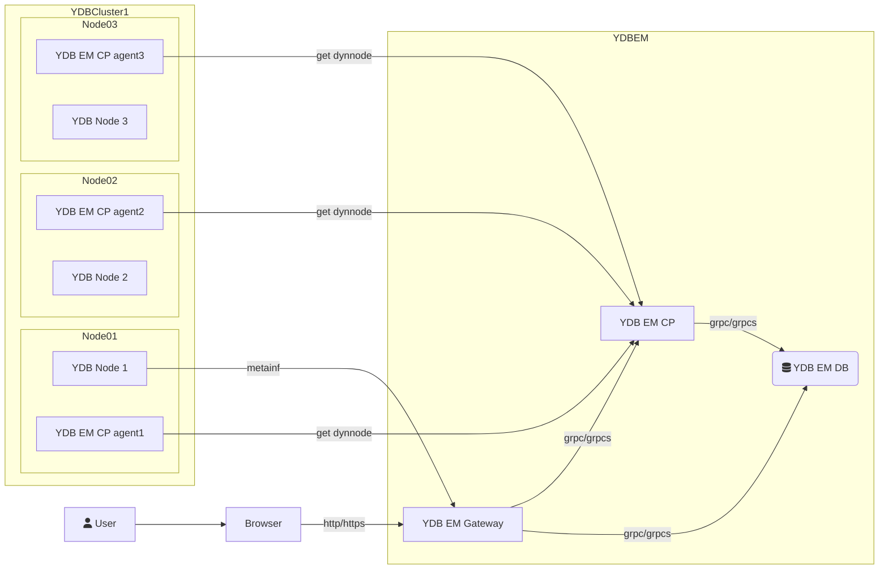

# YDB Enterprise Manager Overview

YDB Enterprise Manager (YDB EM) is a system for managing YDB clusters, handling resources, databases, and dynamic slots on hosts.

## Components

YDB EM consists of the following main components:

- **Gateway**: Provides the UI and the API backend for the UI.
- **Control Plane (CP)**: Responsible for controlling the YDB cluster, managing resources, and configuring databases.
- **Agent**: A system for controlling dynamic slots on a host.

## Architecture

The diagram below illustrates the high-level architecture of YDB EM and its interactions with the browser and YDB clusters.

## Usage

<!-- TODO: Add more detailed usage instructions or overview information here if necessary -->

To access the YDB Enterprise Manager UI, open the following URL in your browser:

`https://<fqdn>:8789/ui/clusters`

*Note*: Ensure you replace `<fqdn>` with the Fully Qualified Domain Name of any host from the `ydb_em` host group (for example, `ydb-node01.ru-central1.internal`).
