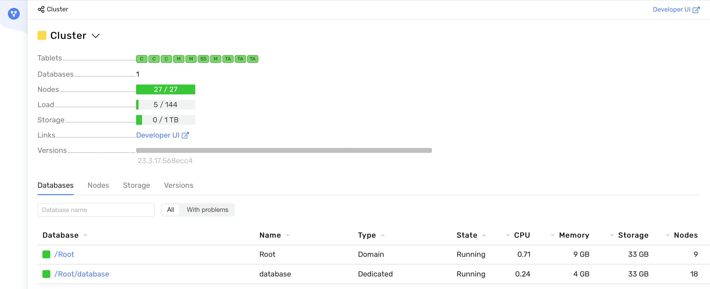

# Deploying {{ ydb-short-name }} cluster with Ansible

This guide outlines the process of deploying a {{ ydb-short-name }} cluster on a group of servers using Ansible. {{ ydb-short-name }} can be deployed on any desired number of servers, but the minimum number of servers in the cluster should not be less than eight for the `block-4-2` redundancy model and nine servers for the `mirror-3-dc` redundancy model. You can learn about redundancy models from the article [{#T}](../../../deploy/configuration/config.md#domains-blob).

During operation, the cluster can be [expanded](../../../maintenance/manual/cluster_expansion.md) without suspending access to the databases for users.



**Recommended Server Requirements**:
* 16 CPUs (calculated based on the utilization of 8 CPUs by the storage node and 8 CPUs by the dynamic node).
* 16 GB RAM (recommended minimum RAM).
* An additional 120 GB network SSD drive (cannot be smaller – installation requirements for {{ ydb-short-name }}).
* SSH access;
* Network connectivity between machines in the cluster.
* OS: Ubuntu 18+, Debian 9+. 
* Internet access for updating repositories and downloading necessary packages.



You can download the repository with the playbook for installing {{ ydb-short-name }} on the cluster from GitHub – `git clone https://github.com/ydb-platform/ydb-ansible-examples.git`. This repository contains: installation templates for deploying {{ ydb-short-name }} on a cluster of eight servers – `8-nodes-block-4-2`, and nine servers – `9-nodes-mirror-3-dc`, as well as scripts for generating TLS certificates and requirement files for installing necessary Python packages.








To work with the project on a local (intermediate or installation) machine, you will need: Python 3 version 3.10+ and Ansible core version 2.15.2 or higher. Ansible can be installed and run globally (installed in the system) or in a virtual environment. If Ansible is already installed – you can move on to the step ["Configuring the Ansible project"](#ansible-project-setup), if Ansible is not yet installed, install it using one of the following methods:



- Installing Ansible globally (in the system)

  * Update the apt package list – `sudo apt update`.
  * Upgrade packages – `sudo apt upgrade`.
  * Install the `software-properties-common` package to manage your distribution's software sources – `sudo apt install software-properties-common`.
  * Add a new PPA to apt – `sudo add-apt-repository --yes --update ppa:ansible/ansible`.
  * Install Ansible – `sudo apt install ansible-core`.
  * Check the Ansible core version – `ansible --version`

- Installing Ansible in a Python virtual environment

  * Update the apt package list – `sudo apt update`.
  * Install the `venv` package for Python3 – `sudo apt install python3-venv`
  * Create a directory where the virtual environment will be created and where the playbooks will be downloaded. For example, `mkdir ydb-install-ansible`.
  * Go to the created directory and create a virtual environment – `python3 -m venv ydb-ansible`.
  * Activate the virtual environment – `source venv/bin/activate`. All further actions with Ansible are performed inside the virtual environment. You can exit it with the command `deactivate`.
  * Install the recommended version of Ansible using the command `pip install -r requirements.txt`, while in the root directory of the downloaded repository.
  * Check the Ansible core version – `ansible --version`




## Configuring the Ansible project {#ansible-project-setup}

Navigate to the root directory of the downloaded repository and execute the command `ansible-galaxy install -r requirements.yaml` – this will download the Ansible collections `ydb_platform.ydb` and `community.general`, which contain roles and plugins for installing {{ ydb-short-name }}.

[Download](../../../downloads/index.md#ydb-server) the archive of the current version of {{ ydb-short-name }} into the project's root directory. For example, using wget: `wget https://binaries.ydb.tech/release/23.3.17/ydbd-23.3.17-linux-amd64.tar.gz` and also copy the private part of the SSH key for accessing the {{ ydb-short-name }} cluster servers to the same location. The SSH key should have the following permissions:
```text
-rw------- (600)  # Only the owner has read and write permission.

You can set the required permissions with the command `sudo chmod 600 <ssh-key name>`.

Next, you can go to the TLS directory and specify in the file ydb-ca-nodes.txt a list of FQDNs for which TLS certificates will be generated. By default, the list looks as follows:
```text
static-node-1 static-node-1.ydb-cluster.com
static-node-2 static-node-2.ydb-cluster.com
static-node-3 static-node-3.ydb-cluster.com
static-node-4 static-node-4.ydb-cluster.com
static-node-5 static-node-5.ydb-cluster.com
static-node-6 static-node-6.ydb-cluster.com
static-node-7 static-node-7.ydb-cluster.com
static-node-8 static-node-8.ydb-cluster.com
static-node-9 static-node-9.ydb-cluster.com
```

Generate a set of TLS certificates, which will be placed in the CA subdirectory (`TLS/CA/certs/<create date_crete time>`) using the script `ydb-ca-update.sh`.

After generating the TLS certificates, installing the Ansible collections, uploading the private part of the SSH key, and downloading the current version of {{ ydb-short-name }}, you need to update the inventory files according to the chosen type of cluster for deployment.

### Editing the project's inventory files {#inventory-edit}

Regardless of the type of cluster being created (eight servers – `8-nodes-block-4-2` or nine servers – `9-nodes-mirror-3-dc`), the main parameters for installing and configuring {{ ydb-short-name }} are contained in the inventory file `50-inventory.yaml`, which is located in the `<cluster model>/inventory/` directory.

In the inventory file `50-inventory.yaml`, you need to specify the current list of FQDNs of the servers where {{ ydb-short-name }} will be installed. By default, the list appears as follows:
  ```yaml
  all:
    children:
        ydb:
        hosts:
          static-node-1.ydb-cluster.com:
          static-node-2.ydb-cluster.com:
          static-node-3.ydb-cluster.com:
          static-node-4.ydb-cluster.com:
          static-node-5.ydb-cluster.com:
          static-node-6.ydb-cluster.com:
          static-node-7.ydb-cluster.com:
          static-node-8.ydb-cluster.com:
          static-node-9.ydb-cluster.com:
  ```

Next, you need to make the following changes in the `vars` section of the inventory file:
  * `ansible_user` – specify the user for Ansible to connect via SSH.
  * `ansible_ssh_private_key_file` – change the default ssh-key name to the actual one: `"../<ssh-private-key-name>"`.
  * `ydb_tls_dir` – specify the current path part (`/files/CA/certs/<date_time create certs>`) to the security certificates after they have been generated by the `ydb-ca-update.sh` script.
  * `ydb_brokers` – list the FQDNs of the broker nodes. For example:
    ```yaml
    ydb_brokers:
        - static-node-1.ydb-cluster.com
        - static-node-2.ydb-cluster.com
        - static-node-3.ydb-cluster.com
    ``` 
  * `ydb_cores_static` – set the number of CPU cores consumed by the static node;
  * `ydb_cores_dynamic` – set the number of CPU cores consumed by the dynamic node;

The value of the `ydb_database_groups` variable in the `vars` section has a fixed value tied to the redundancy type and does not depend on the size of the cluster:
* For the redundancy type `block-4-2`, the value of `ydb_database_groups` is seven.
* For the redundancy type `mirror-3-dc`, the value of `ydb_database_groups` is eight.

No changes to other sections of the `50-inventory.yaml` configuration file are required. Next, you can change the standard YDB root user password contained in the encrypted inventory file `99-inventory-vault.yaml` and in the file `ansible_vault_password_file.txt`. To change the password – specify the new password in the `ansible_vault_password_file.txt` file and duplicate it in the `99-inventory-vault.yaml` file in the format:
  ```yaml
  all:
        children:
          ydb:
            vars:
              ydb_password: <new password>
  ```

To encrypt `99-inventory-vault.yaml`, execute the command `ansible-vault encrypt inventory/99-inventory-vault.yaml`.

After modifying the inventory files, you can proceed to prepare the {{ ydb-short-name }} configuration file.


### Preparing the {{ ydb-short-name }} Configuration File {#ydb-config-prepare}

The {{ ydb-short-name }} configuration file contains the settings for {{ ydb-short-name }} nodes and is located in the subdirectory `/files/config.yaml`. A detailed description of the configuration file settings for {{ ydb-short-name }} can be found in the article [{#T}](../../../deploy/configuration/config.md).

The default {{ ydb-short-name }} configuration file already includes almost all the necessary settings for deploying the cluster. You need to replace the standard FQDNs of hosts with the current FQDNs in the `hosts` and `blob_storage_config` sections:
* `hosts` section:
  ```yaml
  ...
  hosts:
  - host: static-node-1.ydb-cluster.com
    host_config_id: 1
    walle_location:
      body: 1
      data_center: 'zone-a'
      rack: '1'
  ...    
  ```  
* `blob_storage_config` section:
  ```yaml
  ...
  - fail_domains:
      - vdisk_locations:
        - node_id: static-node-1.ydb-cluster.com
          pdisk_category: SSD
          path: /dev/disk/by-partlabel/ydb_disk_1
  ...        
  ```

The rest of the sections and settings in the configuration file can remain unchanged.


## Deploying the {{ ydb-short-name }} cluster {#erasure-setup}



The minimum number of servers in a {{ ydb-short-name }} cluster is eight servers for the `block-4-2` redundancy model and nine servers for the `mirror-3-dc` redundancy model.

In `mirror-3-dc` servers should be distributed across three availability zones or datacenters as evenly as possible.



The [repository](https://github.com/ydb-platform/ydb-ansible-examples) contains two ready sets of templates for deploying a {{ ydb-short-name }} cluster of eight (redundancy model `block-4-2`) and nine servers (`mirror-3-dc`). Either of the provided options can be scaled to any required number of servers, taking into account a number of technical requirements.

To prepare your own template, you can follow the instructions below:
1. Create a copy of the directory with the ready example (`9-nodes-mirror-3-dc` or `8-nodes-block-4-2`).
2. Specify the FQDNs of the servers in the file `TLS/ydb-ca-nodes.txt` and execute the script `ydb-ca-update.sh` to generate sets of TLS certificates.
3. Make changes to the inventory files of the template according to the [instructions](#inventory-edit).
4. Make changes to the {{ ydb-short-name }} configuration file according to the [instructions](#ydb-config-prepare).
5. Execute the command `ansible-playbook setup_playbook.yaml`, while in the directory of the cloned template.


## Installation script execution plan for {{ ydb-short-name }} {#ydb-playbook-run}

The sequence of role executions and their brief descriptions:
1. The `packages` role configures repositories, manages APT preferences and configurations, fixes unconfigured packages, and installs necessary software packages depending on the distribution version.
2. The `system` role sets up system settings, including clock and timezone configuration, time synchronization via NTP with `systemd-timesyncd`, configuring `systemd-journald` for log management, kernel module loading configuration, kernel parameter optimization through `sysctl`, and CPU performance tuning using `cpufrequtils`.
3. The `ydb` role performs tasks related to checking necessary variables, installing base components and dependencies, setting up system users and groups, deploying and configuring {{ ydb-short-name }}, including managing TLS certificates and updating configuration files.
4. The `ydb-static` role prepares and launches static nodes of {{ ydb-short-name }}, including checking necessary variables and secrets, formatting and preparing disks, creating and launching `systemd unit` for the storage node, as well as initializing the storage and managing database access.
5. The `ydb-dynamic` role configures and manages dynamic nodes of {{ ydb-short-name }}, including checking necessary variables, creating configuration and `systemd unit` files for each dynamic node, launching these nodes, obtaining a token for {{ ydb-short-name }} access, and creating a database in {{ ydb-short-name }}.







As a result of executing the playbook, a {{ ydb-short-name }} cluster will be created, with a test database – `database`, a `root` user with maximum access rights created, and Embedded UI running on port 8765. To connect to the Embedded UI, you can set up SSH tunneling. For this, execute the command `ssh -L 8765:localhost:8765 -i <ssh private key> <user>@<first ydb static node ip>` on your local machine. After successfully establishing the connection, you can navigate to the URL [localhost:8765](http://localhost:8765):


## Monitoring the cluster state {#troubleshooting}

After successfully creating the {{ ydb-short-name }} cluster, you can check its state using the Embedded UI – [http://localhost:8765/monitoring/cluster/tenants](http://localhost:8765/monitoring/cluster/tenants):



This section displays the following parameters of the {{ ydb-short-name }} cluster, reflecting its state:
* `Tablets` – a list of running [tablets](../../../concepts/cluster/common_scheme_ydb.md#tablets). All tablet state indicators should be green;
* `Nodes` – the number and state of static and dynamic nodes launched in the cluster. The node state indicator should be green, and the ratio of created to launched nodes should be equal. For example, 27/27 for a nine-node cluster.
The `Load` indicators (amount of RAM used) and `Storage` (amount of disk space used) should also be green.

You can check the state of the storage group in the `storage` section – [http://localhost:8765/monitoring/cluster/storage](http://localhost:8765/monitoring/cluster/storage):


The `VDisks` indicators should be green, and the `state` status (found in the tooltip when hovering over the Vdisk indicator) should be `Ok`. More about the cluster state indicators and monitoring can be read in the article [{#T}](../../../maintenance/embedded_monitoring/ydb_monitoring.md).

## Cluster Testing { #testing }

You can test the cluster using the built-in load tests in YDB CLI. To do this, download YDB CLI version [2.5.0](https://storage.yandexcloud.net/yandexcloud-ydb/release/2.5.0/linux/amd64/ydb) to the machine where Ansible is installed. For example, using wget: `wget https://storage.yandexcloud.net/yandexcloud-ydb/release/2.5.0/linux/amd64/ydb`.

Make the downloaded binary file executable – `chmod +x ydb` and execute the connection check command:
```shell
ydb -d /Root/database \
-e grpcs://static-node-1.ydb-cluster.com:2135 \
--ca-file <path to generated certs>/ca.crt \
--user root \
--password-file <path to template folder>/ansible_vault_password_file \
yql -s 'select 1;'
```
Command parameters and their values:
* `-e` – endpoint - a string in the format `protocol://host:port`. You can specify the FQDN of any node in the cluster without specifying a port. By default, port 2135 will be used.
* `--ca-file` – path to the root certificate for connecting to the database via `grpcs`. The certificate is created by the `ydb-ca-update.sh` script in the `TLS` directory and is located at `TLS/CA/certs/`.
* `--user` – the user for connecting to the database. By default, when executing the `setup_playbook.yaml` playbook, the user root is created.
* `--password-file` – path to the password file. In every folder with a YDB cluster deployment template, there is an ansible_vault_password_file that contains the root user's password.
* `yql -s` – YQL command that will be executed after connecting to the database.

The command will execute the YQL query `select 1;` and return the result in a table format to the terminal. After verifying the connection, you can create a test table with the command:
`... database connection launch parameters ... workload kv init --init-upserts 1000 --cols 4`. This will create a test table `kv_test`, consisting of 4 columns and 1000 rows. You can check that the `kv_test` table has been created and filled with test data with the command `... database connection launch parameters ... yql -s 'select * from kv_test limit 10;'`.

A table of 10 rows will be displayed in the terminal. Now, you can perform cluster performance testing. The article [{#T}](../../../reference/ydb-cli/workload-kv.md) describes 5 types of loads (`upsert`, `insert`, `select`, `read-rows`, `mixed`) and their execution parameters. An example of executing a test load `upsert` with the parameter to output the execution time `--print-timestamp` and standard execution parameters: `... database connection launch parameters ... workload kv run upsert --print-timestamp`.

A report of the following type will be displayed in the terminal:
```
Window	Txs/Sec	Retries	Errors	p50(ms)	p95(ms)	p99(ms)	pMax(ms)	Timestamp
1	    727	0	0	11	27	71	116	2024-02-14T12:56:39Z
2	    882	0	0	10	21	29	38	2024-02-14T12:56:40Z
3	    848	0	0	10	22	30	105	2024-02-14T12:56:41Z
...
```

After completing the tests, the `kv_test` table can be deleted with the command: `... database connection launch parameters ... workload kv clean`. More details on the options for creating a test table and tests can be read in the article [{#T}](../../../reference/ydb-cli/workload-kv.md).
