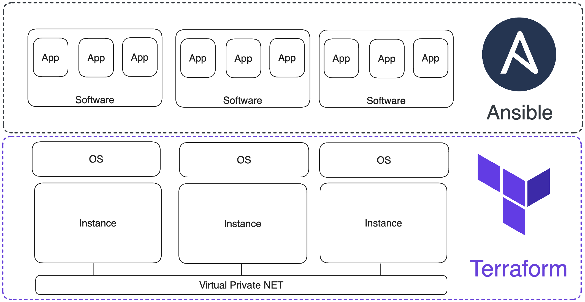

# Deploying Infrastructure for {{ ydb-short-name }} Cluster with Terraform

Deploying a {{ ydb-short-name }} cluster for production use can be done in three recommended ways: using [Ansible](ansible.md), [Kubernetes](kubernetes.md), or [manually](../deploy/index.md). While the Kubernetes option is almost self-sufficient, the Ansible and manual options require SSH access to properly configured servers or virtual machines.

This article describes how to create and configure the necessary set of virtual machines in various cloud providers for the {{ ydb-short-name }} cluster to work, using Terraform.

**[Terraform](https://www.terraform.io/)** is an open-source software for managing infrastructure as code (Infrastructure as Code). This same approach is used in Ansible, a configuration management system. Terraform and Ansible operate at different levels: Terraform manages infrastructure, while Ansible configures environments on VMs:



The configuration for setting up a VM environment is described in YAML format, while the infrastructure code is written in [HCL](https://github.com/hashicorp/hcl) (Terraform Configuration Language). The basic logical unit of writing in HCL is a "block". A block consists of a keyword identifying its type, a name, and curly brackets that denote the body of the block. For example, this is how a block for managing a virtual server in AWS might look:
```hcl
resource "aws_instance" "ydb-vm" {
  count                  = var.instance_count
  ami                    = "ami-008fe2fc65df48dac"
  instance_type          = "t2.micro"
  key_name               = var.req_key_pair
  vpc_security_group_ids = [var.input_security_group_id]
  subnet_id              = element(var.input_subnet_ids, count.index % length(var.input_subnet_ids))
  
  tags = {
    Name                 = "ydb-node-${count.index +1}"
    Username             = "ubuntu"
  }

}
```

Blocks can be placed one after another in a single file and be independent, they can refer to each other and be dependent, and they can also be nested within each other.

Main types of blocks:
* `resource` – a block for initializing an infrastructure resource (VM, network, subnet, disk, DNS zone, etc.);
* `provider` – a block for initializing the provider, API versions, and authentication data;
* `variable` – a variable either with a default value or empty for storing data entered by the user or passed by other blocks;
* `output` – outputs data to the terminal and saves it in a variable;
* `data` – a variable for requesting data from external cloud resources not presented in the created infrastructure;
* `module` – a logical grouping of resources that can be reused several times within the same or different projects;
* `terraform` – a block for configuring the behavior of Terraform itself, including the version of Terraform and used providers, as well as the backend settings, which are used for storing Terraform's state.

Blocks are written in files with the `.tf` extension and are logically grouped in directories, which in Terraform terminology are called modules. A module usually consists of the following files:
* `main.tf` – the main file where the infrastructure code is located. There can be several files containing infrastructure code.
* `variables.tf` – local variables of the module, which receive data from other modules or have default values.
* `outputs.tf` – variables that contain the results of the resource's operation (VM IP addresses, network/subnet IDs, etc.).

Modules are connected to the project in the root `main.tf` file as follows:
```
module "vpc" {
  source                     = "./modules/vpc"
  subnets_count              = var.subnets_count
  subnets_availability_zones = var.availability_zones
}
```
In the example, the `vpc` module is connected (the module name is assigned during connection). The mandatory parameter is `source` - the path to the directory where the module is located. `subnets_count` and `subnets_availability_zones` are variables inside the `vpc` module, which receive values from the global-level variables `var.subnets_count`, `var.availability_zones`.

Modules, just like blocks, are placed one after another in the root `main.tf` file of the project. The main advantage of the modular approach to project organization is the ability to easily manage logically related sets of resources. Therefore, our [repository](https://github.com/ydb-platform/ydb-terraform) with ready-made Terraform scenarios is organized as follows:
```txt
.
├── README.md
├── README_RU.md
├── aws
│   ├── README.md
│   ├── README_RU.md
│   ├── main.tf
│   ├── modules
│   │   ├── dns
│   │   ├── eip
│   │   ├── instance
│   │   ├── key_pair
│   │   ├── security
│   │   └── vpc
│   └── variables.tf
├── azure
│   ├── README.md
│   ├── README_RU.md
│   ├── main.tf
│   ├── modules
│   │   ├── dns
│   │   ├── resource_group
│   │   ├── security
│   │   ├── vm
│   │   └── vpc
│   └── variables.tf
├── ...
```

Subdirectories contain two `readme` files, a `variables.tf` file with the module's local variables, and the main file `main.tf`, which connects modules from the `modules` subdirectory. The set of modules depends on the cloud provider. Basic modules, functionally identical for all providers, have the same names:
* `vpc` – module for managing the cloud network and subnets.
* `dns` – module for managing the DNS zone and DNS records.
* `security` – module for managing security groups.
* `instance` – module for managing VMs.

To use the ready-made Terraform scenarios from the repository, you need to download the repository with the command `git clone https://github.com/ydb-platform/ydb-terraform.git`, make changes in the Terraform configuration file `~/.terraformrc`, set the actual values of the global variables of the scenario, and download the CLI of the cloud provider where the infrastructure will be created.

If you plan to use multiple providers, you can add the following code to `~/.terraformrc`, which will set download paths for all the providers described below:
```
provider_installation {
  network_mirror {
    url     = "https://terraform-mirror.yandexcloud.net/"
    include = ["registry.terraform.io/*/*"]
  }
  direct {
    exclude = ["registry.terraform.io/*/*"]
    exclude = ["terraform.storage.ydb.tech/*/*"]
  }

  filesystem_mirror {
    path    = "/Applications/
    }
  }
```

If you are already using Terraform providers from the [official repository](https://registry.terraform.io/browse/providers), they will continue to work as expected.

Below are the step-by-step instructions for creating infrastructure in [AWS](#aws-cluster), [Azure](#aws-cluster), [GCP](#gcp-cluster), and [Yandex Cloud](#gcp-cluster). The proposed Terraform scenarios deploy a uniform infrastructure:

* Nine VMs (16 CPU, 32 GB RAM, an additional disk of 200 GB).
* Cloud network, public and private subnets (one subnet per availability zone).
* Private DNS zone.
* Security groups allowing traffic on ports: 22, icmp, 65535, 19001, 8765, 2135.

Most of the cluster parameters are adjustable (number of VMs, volume and type of attached disk, number of networks, DNS zone domain, etc.), however, note that there are recommended parameter values for the cluster, which are already defined as default values. Reducing these values may render the cluster inoperative.

**Recommended Cluster Parameter Values**:
* Number of CPU cores. The minimum recommended number of CPU cores is 16.
* RAM size. The minimum recommended amount of RAM is 32 GB.
* Volume of attached disk. The minimum recommended volume of the attached disk is 200 GB.

## Creating Infrastructure in AWS for Deploying {{ ydb-short-name }} Cluster {#aws-cluster}

 

## Creating Infrastructure in Azure for Deploying {{ ydb-short-name }} Cluster {#azure-cluster}

 

## Creating Infrastructure in Google Cloud Platform for Deploying {{ ydb-short-name }} Cluster {#gcp-cluster}

 

## Creating Infrastructure in Yandex Cloud for Deploying {{ ydb-short-name }} Cluster {#yc-cluster}

 

With the Yandex Cloud provider, not only can you create infrastructure for further deployment of the {{ ydb-short-name }} cluster using [Ansible](./ansible.md), but you can also manage [serverless or dedicated](https://cloud.yandex.ru/ru/services/ydb) versions of {{ ydb-short-name }} directly from Terraform. To learn about the capabilities of working with {{ ydb-short-name }} in Yandex Cloud, read the section [Working with YDB through Terraform](https://cloud.yandex.ru/ru/docs/ydb/terraform/intro) in the Yandex Cloud documentation.
