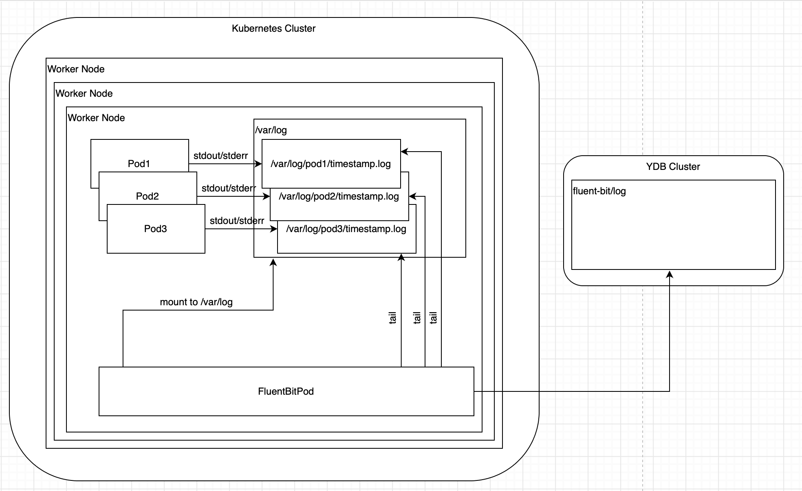

# Log records collection in a Kubernetes cluster using FluentBit and YDB

This section presents the implementation of integration between the Kubernetes cluster log shipping tool - FluentBit, with subsequent saving for viewing or analysis in {{ ydb-short-name }}.

## Introduction

FluentBit is a tool that can collect text data, manipulate it (change, transform, merge) and send it to various storage facilities for further processing.

To deploy a scheme for delivering logs of running applications to Kubernetes using FluentBit and then saving them in YDB, you need to:

* Create table in YDB

* Configure [FluentBit](https://fluentbit.io)

* Deploy [FluentBit](https://fluentbit.io) in Kubernetes cluster using [HELM](https://helm.sh)

The work diagram looks like this:


<small>Figure 1 — Interaction diagram between FluentBit and YDB in the Kubernetes cluster</small>

In this diagram:

* Application pods write logs to stdout/stderr

* Text from stdout/stderr is saved as files on Kubernetes worker nodes

* Pod with FluentBit

  * Mounts a folder with log files for itself

  * Reads the contents from them

  * Enriches posts with additional metadata

  * Saves records to YDB cluster

## Creating a table in YDB

On the selected YDB cluster, you need to run the following query:

```sql
CREATE TABLE `fluent-bit/log` (
	`timestamp`         Timestamp NOT NULL,
    `file`              Text NOT NULL,
    `pipe`              Text NOT NULL,
    `message`           Text NULL,
    `message_parsed`    JSON NULL,
    `kubernetes`        JSON NULL,

    PRIMARY KEY (
         `timestamp`, `input`
    )
)
```

Column purpose:

* timestamp – the log timestamp

* file – name of the source from which the log was read. In the case of Kubernetes, this will be the name of the file on the worker node in which the logs of a specific pod are written

* pipe – stdout or stderr stream where application-level writing was done

* message – the log message

* message_parsed – a structured log message, if it could be parsed using the fluent-bit parsers

* kubernetes – information about the pod, for example: name, namespace, logs and annotations

Optionally, you can set TTL for table rows

## FluentBit configuration

It is necessary to replace the repository and image version:

```yaml
image:
  repository: ghcr.io/ydb-platform/fluent-bit-ydb
  tag: v1.0.0
```

In this image, a plugin library has been added that implements YDB support. Source code is available [here](https://github.com/ydb-platform/fluent-bit-ydb)

The following lines define the rules for mounting log folders in FluentBit pods:

```yaml
volumeMounts:
  - name: config
    mountPath: /fluent-bit/etc/conf

daemonSetVolumes:
  - name: varlog
    hostPath:
      path: /var/log
  - name: varlibcontainers
    hostPath:
      path: /var/lib/containerd/containers
  - name: etcmachineid
    hostPath:
      path: /etc/machine-id
      type: File

daemonSetVolumeMounts:
  - name: varlog
    mountPath: /var/log
  - name: varlibcontainers
    mountPath: /var/lib/containerd/containers
    readOnly: true
  - name: etcmachineid
    mountPath: /etc/machine-id
    readOnly: true
```

Also, you need to redefine the command and launch arguments:

```yaml
command:
  - /fluent-bit/bin/fluent-bit

args:
  - --workdir=/fluent-bit/etc
  - --plugin=/fluent-bit/lib/out_ydb.so
  - --config=/fluent-bit/etc/conf/fluent-bit.conf
```

And the pipeline itself for collecting, converting and delivering logs:

```yaml
config:
  inputs: |
    [INPUT]
        Name tail
        Path /var/log/containers/*.log
        multiline.parser cri
        Tag kube.*
        Mem_Buf_Limit 5MB
        Skip_Long_Lines On

  filters: |
    [FILTER]
        Name kubernetes
        Match kube.*
        Keep_Log On
        Merge_Log On
        Merge_Log_Key log_parsed
        K8S-Logging.Parser On
        K8S-Logging.Exclude On

    [FILTER]
        Name modify
        Match kube.*
        Remove time
        Remove _p

  outputs: |
    [OUTPUT]
        Name ydb
        Match kube.*
        TablePath fluent-bit/log
        Columns {".timestamp":"timestamp",".input":"file","log":"message","log_parsed":"message_structured","stream":"pipe","kubernetes":"metadata"}
        ConnectionURL ${OUTPUT_YDB_CONNECTION_URL}
        CredentialsToken ${OUTPUT_YDB_CREDENTIALS_TOKEN}
```

Blocks description:

* Inputs. This block specifies where to read and how to parse logs. In this case, *.log files will be read from the /var/log/containers/ folder, which was mounted from the host

* Filters. This block specifies how logs will be processed. In this case: for each log the corresponding metadata will be found (using the kubernetes filter), and unused fields (_p, time) will be cut out

* Outputs. This block specifies where the logs will be sent. In this case, to the `fluent-bit/log` table in the {{ ydb-short-name }} cluster. Cluster connection parameters (ConnectionURL, CredentialsToken) are set using the corresponding environment variables – `OUTPUT_YDB_CONNECTION_URL`, `OUTPUT_YDB_CREDENTIALS_TOKEN`

Environment variables are defined as follows:

```yaml
env:
  - name: OUTPUT_YDB_CONNECTION_URL
    value: grpc://ydb-endpoint:2135/path/to/database
  - name: OUTPUT_YDB_CREDENTIALS_TOKEN
    valueFrom:
      secretKeyRef:
        key: token
        name: fluent-bit-ydb-plugin-token
```

The secret authorization token must be created in advance in the cluster. For example, using the command:

```sh
kubectl create secret -n ydb-fluent-bit-integration generic fluent-bit-ydb-plugin-token --from-literal=token=<YDB TOKEN>
```

## FluentBit deployment

HELM is a way to package and install applications in a Kubernetes cluster. To deploy FluentBit, you need to add a chart repository using the command:

```sh
helm repo add fluent https://fluent.github.io/helm-charts
```

Installing FluentBit on a Kubernetes cluster is done using the following command:

```sh
helm upgrade --install fluent-bit fluent/fluent-bit \
  --version 0.37.1 \
  --namespace ydb-fluent-bit-integration \
  --create-namespace \
  --values values.yaml
```

## Verify the installation

Check that fluent-bit has started by reading its logs (there should be no [error] level entries):

```sh
kubectl logs -n ydb-fluent-bit-integration -l app.kubernetes.io/instance=fluent-bit
```

Check that there are records in the YDB table (they will appear approximately a few minutes after launching FluentBit):

```sql
SELECT * FROM `fluent-bit/log` LIMIT 10 ORDER BY `timestamp` DESC
```

## Resource cleanup

It is enough to remove the namespace with fluent-bit:

```sh
kubectl delete namespace ydb-fluent-bit-integration
```

And a table with logs:

```sql
DROP TABLE `fluent-bit/log`
```
