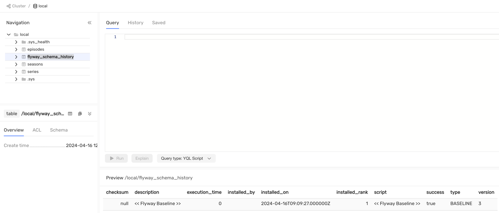

# Migrating {{ ydb-short-name }} data schemas with the Flyway migration tool

## Introduction {#introduction}

[Flyway](https://documentation.red-gate.com/fd/) is an open-source database migration tool. It strongly favors simplicity and convention over configuration. It has extensions for various database management systems (DBMS), including {{ ydb-short-name }}.

## Install {#install}

To use Flyway with {{ ydb-short-name }} in a Java / Kotlin application or a Gradle / Maven plugin, you need to add a dependency for the Flyway extension for {{ ydb-short-name }} and the [{{ ydb-short-name }} JDBC Driver](https://github.com/ydb-platform/ydb-jdbc-driver):



- Maven

  ```xml
  <!-- Set an actual versions -->
  <dependency>
      <groupId>org.flywaydb</groupId>
      <artifactId>flyway-core</artifactId>
      <version>${flyway.core.version}</version>
  </dependency>
  
  <dependency>
      <groupId>tech.ydb.jdbc</groupId>
      <artifactId>ydb-jdbc-driver</artifactId>
      <version>${ydb.jdbc.version}</version>
  </dependency>
  
  <dependency>
      <groupId>tech.ydb.dialects</groupId>
      <artifactId>flyway-ydb-dialect</artifactId>
      <version>${flyway.ydb.dialect.version}</version>
  </dependency>
  ```

- Gradle

  ```groovy
  dependencies {
      // Set an actual versions
      implementation "org.flywaydb:flyway-core:$flywayCoreVersion"
      implementation "tech.ydb.dialects:flyway-ydb-dialect:$flywayYdbDialecVersion"
      implementation "tech.ydb.jdbc:ydb-jdbc-driver:$ydbJdbcVersion"
  }
  ```



To work with {{ ydb-short-name }} via Flyway CLI you need to install the flyway utility itself [one of the recommended methods](https://documentation.red-gate.com/fd/command-line-184127404.html).

Then the utility needs to be extended with the {{ ydb-short-name }} dialect and the JDBC driver.

```bash
# install flyway
# cd $(which flyway) // prepare this command for your environment

cd libexec
# set an actual versions .jar files

cd drivers && curl -L -o ydb-jdbc-driver-shaded-2.1.0.jar https://repo.maven.apache.org/maven2/tech/ydb/jdbc/ydb-jdbc-driver-shaded/2.1.0/ydb-jdbc-driver-shaded-2.1.0.jar

cd ..

cd lib && curl -L -o flyway-ydb-dialect.jar https://repo.maven.apache.org/maven2/tech/ydb/dialects/flyway-ydb-dialect/1.0.0-RC0/flyway-ydb-dialect-1.0.0-RC0.jar
```

## Migration management using Flyway {#flyway-main-commands}

### baseline {#flyway-baseline}

Command [baseline](https://documentation.red-gate.com/flyway/flyway-cli-and-api/usage/command-line/command-line-baseline) initializes Flyway in an existing database, excluding all migrations up to and including `baselineVersion`.

Suppose we have an existing project with the current database schema:


Let's write down our existing migrations as follows:

```
db/migration:
  V1__create_series.sql
  V2__create_seasons.sql
  V3__create_episodes.sql
```

Set `baselineVersion = 3`, then run the following command:

```bash
flyway -url=jdbc:ydb:grpc://localhost:2136/local -locations=db/migration -baselineVersion=3 baseline
```

The result of the execution will be the creation of a table `flyway_schema_history` with a `baseline` record.



### migrate {#flyway-migrate}

Command [migrate](https://documentation.red-gate.com/flyway/flyway-cli-and-api/usage/command-line/command-line-migrate) evolves the database schema to the latest version. Flyway will create the schema history table automatically if it doesn't exist.

Let's add the migration of [data downloads](../yql/tutorial/fill_tables_with_data.md) to the previous example:

```
db/migration:
  V1__create_series.sql
  V2__create_seasons.sql
  V3__create_episodes.sql
  V4__load_data.sql
```

Let's apply the latest migration using the following command:

```bash
flyway -url=jdbc:ydb:grpc://localhost:2136/local -locations=db/migration migrate
```

The result of the execution will be loaded data in the `series`, `season` and `episode` tables:


We evolve the scheme by adding a [secondary index](../yql/reference/syntax/alter_table.md):

```
db/migration:
  V1__create_series.sql
  V2__create_seasons.sql
  V3__create_episodes.sql
  V4__load_data.sql
  V5__create_series_title_index.sql
```

Let's apply the latest migration using the following command:

```bash
flyway -url=jdbc:ydb:grpc://localhost:2136/local -locations=db/migration migrate
```

The result will be the creation of a secondary index on the `series` table.


### info {#flyway-info}

Command [info](https://documentation.red-gate.com/flyway/flyway-cli-and-api/usage/command-line/command-line-info) prints the details and status information about all the migrations.

Let's add another migration that renames the previously added secondary index:

```
db/migration:
  V1__create_series.sql
  V2__create_seasons.sql
  V3__create_episodes.sql
  V4__load_data.sql
  V5__create_series_title_index.sql
  V6__rename_series_title_index.sql
```

The result of executing the `flyway -url=jdbc:ydb:grpc://localhost:2136/local -locations=db/migration info` will provide detailed information about the status of the migrations:

```
+-----------+---------+---------------------------+----------+---------------------+--------------------+----------+
| Category  | Version | Description               | Type     | Installed On        | State              | Undoable |
+-----------+---------+---------------------------+----------+---------------------+--------------------+----------+
| Versioned | 1       | create series             | SQL      |                     | Below Baseline     | No       |
| Versioned | 2       | create seasons            | SQL      |                     | Below Baseline     | No       |
| Versioned | 3       | create episodes           | SQL      |                     | Ignored (Baseline) | No       |
|           | 3       | << Flyway Baseline >>     | BASELINE | 2024-04-16 12:09:27 | Baseline           | No       |
| Versioned | 4       | load data                 | SQL      | 2024-04-16 12:35:12 | Success            | No       |
| Versioned | 5       | create series title index | SQL      | 2024-04-16 12:59:20 | Success            | No       |
| Versioned | 6       | rename series title index | SQL      |                     | Pending            | No       |
+-----------+---------+---------------------------+----------+---------------------+--------------------+----------+
```

### validate {#flyway-validate}

Command [validate](https://documentation.red-gate.com/flyway/flyway-cli-and-api/usage/command-line/command-line-validate) validates the applied migrations against the available ones.

After applying the `flyway -url=jdbc:ydb:grpc://localhost:2136/local -locations=db/migration validate` command with current migrations, the logs will show that the latest migration was not applied to our database:

```bash
ERROR: Validate failed: Migrations have failed validation
Detected resolved migration not applied to database: 6.
To fix this error, either run migrate, or set -ignoreMigrationPatterns='*:pending'.
```

Let's apply this by doing `flyaway .. migrate`. Validation is now successful, and the secondary index has been renamed.

Next, we will modify the file of the previously applied migration `V4__load_date.sql` by deleting comments from the SQL script.

After executing the validation command, we got a logical error because the `checksum` differed in the modified migration:

```bash
ERROR: Validate failed: Migrations have failed validation
Migration checksum mismatch for migration version 4
-> Applied to database : 591649768
-> Resolved locally    : 1923849782
```

### repair {#flyway-repair}

Command [repair](https://documentation.red-gate.com/flyway/flyway-cli-and-api/usage/command-line/command-line-repair) tries to eliminate the identified errors and discrepancies from the database schema history table.

Fix the problem with different `checksums` by running the following command:

```bash
flyway -url=jdbc:ydb:grpc://localhost:2136/local -locations=db/migration repair
```

The result will be an update to the `checksum` column in the `flyway_schema_history` table for the migration entry `V4__load_data.sql`:


After restoring the log table, validation is successful.

Also, using the `repair` command, you can delete a failed DDL script.

### clean {#flyway-repair}

Command [clean](https://documentation.red-gate.com/flyway/flyway-cli-and-api/usage/command-line/command-line-clean) drops all objects in the configured schemas.



{{ ydb-short-name }} does not have a concept like `schema`. The `clean` command drops all the tables in your database.



Let's delete all the tables in our database using the following command:

```bash
flyway -url=jdbc:ydb:grpc://localhost:2136/local -locations=db/migration -cleanDisabled=false clean
```

The result will be an empty database:


