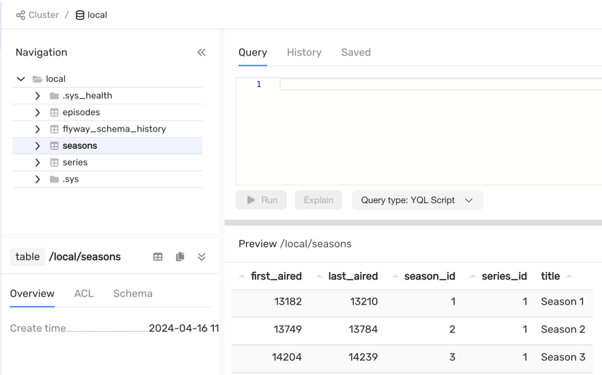

# Migrating {{ ydb-short-name }} data schemas with the Flyway migration tool

## Introduction {#introduction}

[Flyway](https://documentation.red-gate.com/fd/) is an open-source database migration tool. It strongly favors simplicity and convention over configuration. It has extensions for various database management systems (DBMS), including {{ ydb-short-name }}.

## Install {#install}

To use Flyway with {{ ydb-short-name }} in a Java / Kotlin application or a Gradle / Maven plugin, you need to add dependencies for the Flyway core, the Flyway extension for {{ ydb-short-name }}, and the [{{ ydb-short-name }} JDBC Driver](https://github.com/ydb-platform/ydb-jdbc-driver):



- Maven

  ```xml
  <!-- Set actual versions -->
  <dependency>
      <groupId>org.flywaydb</groupId>
      <artifactId>flyway-core</artifactId>
      <version>${flyway.core.version}</version>
  </dependency>

  <dependency>
      <groupId>tech.ydb.jdbc</groupId>
      <artifactId>ydb-jdbc-driver</artifactId>
      <version>${ydb.jdbc.version}</version>
  </dependency>

  <dependency>
      <groupId>tech.ydb.dialects</groupId>
      <artifactId>flyway-ydb-dialect</artifactId>
      <version>${flyway.ydb.dialect.version}</version>
  </dependency>
  ```

- Gradle

  ```groovy
  dependencies {
      // Set actual versions
      implementation "org.flywaydb:flyway-core:$flywayCoreVersion"
      implementation "tech.ydb.dialects:flyway-ydb-dialect:$flywayYdbDialecVersion"
      implementation "tech.ydb.jdbc:ydb-jdbc-driver:$ydbJdbcVersion"
  }
  ```



To work with {{ ydb-short-name }} via Flyway CLI, you need to install the `flyway` utility itself using [one of the recommended methods](https://documentation.red-gate.com/fd/command-line-184127404.html).

Then the utility must be extended with the {{ ydb-short-name }} dialect and the JDBC driver:

```bash
# install flyway
# cd $(which flyway) // prepare this command for your environment

cd libexec
# set actual versions of .jar files

cd drivers && curl -L -o ydb-jdbc-driver-shaded-2.1.0.jar https://repo.maven.apache.org/maven2/tech/ydb/jdbc/ydb-jdbc-driver-shaded/2.1.0/ydb-jdbc-driver-shaded-2.1.0.jar

cd ..

cd lib && curl -L -o flyway-ydb-dialect.jar https://repo.maven.apache.org/maven2/tech/ydb/dialects/flyway-ydb-dialect/1.0.0-RC0/flyway-ydb-dialect-1.0.0-RC0.jar
```



[Flyway Desktop](https://documentation.red-gate.com/fd/flyway-desktop-138346953.html) is currently not supported.



## Migration management using Flyway {#flyway-main-commands}

### baseline {#flyway-baseline}

Command [baseline](https://documentation.red-gate.com/flyway/flyway-cli-and-api/usage/command-line/command-line-baseline) initializes Flyway in an existing database, excluding all migrations up to and including the `baselineVersion`.

Suppose we have an existing project with the current database schema:


Let's write down our existing migrations as follows:

```
db/migration:
  V1__create_series.sql
  V2__create_seasons.sql
  V3__create_episodes.sql
```

Contents of `SQL` files:



- V1__create_series.sql

  ```sql
  CREATE TABLE series -- series is the table name.
  (                           -- Must be unique within the folder.
      series_id    Int64,
      title        Text,
      series_info  Text,
      release_date Int64,
      PRIMARY KEY (series_id) -- The primary key is a column or
      -- combination of columns that uniquely identifies
      -- each table row (contains only
      -- non-repeating values). A table can have
      -- only one primary key. For every table
      -- in {{ ydb-short-name }}, the primary key is required.
  );
  ```

- V2__create_seasons.sql

  ```sql
  CREATE TABLE seasons
  (
      series_id Uint64,
      season_id Uint64,
      title Utf8,
      first_aired Uint64,
      last_aired Uint64,
      PRIMARY KEY (series_id, season_id)
  );
  ```

- V3__create_episodes.sql

```sql
CREATE TABLE episodes
(
    series_id Uint64,
    season_id Uint64,
    episode_id Uint64,
    title Utf8,
    air_date Uint64,
    PRIMARY KEY (series_id, season_id, episode_id)
);
```



Set `baselineVersion = 3`, then run the following command:

```bash
flyway -url=jdbc:ydb:grpc://localhost:2136/local -locations=db/migration -baselineVersion=3 baseline
```



All examples use a Docker container, which does not require any additional authentication parameters.

You can see how to connect to {{ ydb-short-name }} in the [next section](./liquibase.md#connect-to-ydb).



As a result, a table named `flyway_schema_history` will be created, and it will contain a `baseline` record:


### migrate {#flyway-migrate}

Command [migrate](https://documentation.red-gate.com/flyway/flyway-cli-and-api/usage/command-line/command-line-migrate) evolves the database schema to the latest version. Flyway will create the schema history table automatically if it doesn't exist.

Let's add the migration of data downloads to the previous example:

```
db/migration:
  V1__create_series.sql
  V2__create_seasons.sql
  V3__create_episodes.sql
  V4__load_data.sql
```



```sql
INSERT INTO series (series_id, title, release_date, series_info)
VALUES

    -- By default, numeric literals have type Int32
    -- if the value is within the range.
    -- Otherwise, they automatically expand to Int64.
    (1,
     "IT Crowd",
     CAST(Date ("2006-02-03") AS Uint64), -- CAST converts one datatype into another.
        -- You can convert a string
        -- literal into a primitive literal.
        -- The Date() function converts a string
        -- literal in ISO 8601 format into a date.

     "The IT Crowd is a British sitcom produced by Channel 4, written by Graham Linehan, produced by Ash Atalla and starring Chris O'Dowd, Richard Ayoade, Katherine Parkinson, and Matt Berry."),
    (2,
     "Silicon Valley",
     CAST(Date ("2014-04-06") AS Uint64),
     "Silicon Valley is an American comedy television series created by Mike Judge, John Altschuler and Dave Krinsky. The series focuses on five young men who founded a startup company in Silicon Valley.")
;

INSERT INTO seasons (series_id, season_id, title, first_aired, last_aired)
VALUES (1, 1, "Season 1", CAST(Date ("2006-02-03") AS Uint64), CAST(Date ("2006-03-03") AS Uint64)),
       (1, 2, "Season 2", CAST(Date ("2007-08-24") AS Uint64), CAST(Date ("2007-09-28") AS Uint64)),
       (1, 3, "Season 3", CAST(Date ("2008-11-21") AS Uint64), CAST(Date ("2008-12-26") AS Uint64)),
       (1, 4, "Season 4", CAST(Date ("2010-06-25") AS Uint64), CAST(Date ("2010-07-30") AS Uint64)),
       (2, 1, "Season 1", CAST(Date ("2014-04-06") AS Uint64), CAST(Date ("2014-06-01") AS Uint64)),
       (2, 2, "Season 2", CAST(Date ("2015-04-12") AS Uint64), CAST(Date ("2015-06-14") AS Uint64)),
       (2, 3, "Season 3", CAST(Date ("2016-04-24") AS Uint64), CAST(Date ("2016-06-26") AS Uint64)),
       (2, 4, "Season 4", CAST(Date ("2017-04-23") AS Uint64), CAST(Date ("2017-06-25") AS Uint64)),
       (2, 5, "Season 5", CAST(Date ("2018-03-25") AS Uint64), CAST(Date ("2018-05-13") AS Uint64))
;

INSERT INTO episodes (series_id, season_id, episode_id, title, air_date)
VALUES (1, 1, 1, "Yesterday's Jam", CAST(Date ("2006-02-03") AS Uint64)),
       (1, 1, 2, "Calamity Jen", CAST(Date ("2006-02-03") AS Uint64)),
       (1, 1, 3, "Fifty-Fifty", CAST(Date ("2006-02-10") AS Uint64)),
       (1, 1, 4, "The Red Door", CAST(Date ("2006-02-17") AS Uint64)),
       (1, 1, 5, "The Haunting of Bill Crouse", CAST(Date ("2006-02-24") AS Uint64)),
       (1, 1, 6, "Aunt Irma Visits", CAST(Date ("2006-03-03") AS Uint64)),
       (1, 2, 1, "The Work Outing", CAST(Date ("2006-08-24") AS Uint64)),
       (1, 2, 2, "Return of the Golden Child", CAST(Date ("2007-08-31") AS Uint64)),
       (1, 2, 3, "Moss and the German", CAST(Date ("2007-09-07") AS Uint64)),
       (1, 2, 4, "The Dinner Party", CAST(Date ("2007-09-14") AS Uint64)),
       (1, 2, 5, "Smoke and Mirrors", CAST(Date ("2007-09-21") AS Uint64)),
       (1, 2, 6, "Men Without Women", CAST(Date ("2007-09-28") AS Uint64)),
       (1, 3, 1, "From Hell", CAST(Date ("2008-11-21") AS Uint64)),
       (1, 3, 2, "Are We Not Men?", CAST(Date ("2008-11-28") AS Uint64)),
       (1, 3, 3, "Tramps Like Us", CAST(Date ("2008-12-05") AS Uint64)),
       (1, 3, 4, "The Speech", CAST(Date ("2008-12-12") AS Uint64)),
       (1, 3, 5, "Friendface", CAST(Date ("2008-12-19") AS Uint64)),
       (1, 3, 6, "Calendar Geeks", CAST(Date ("2008-12-26") AS Uint64)),
       (1, 4, 1, "Jen The Fredo", CAST(Date ("2010-06-25") AS Uint64)),
       (1, 4, 2, "The Final Countdown", CAST(Date ("2010-07-02") AS Uint64)),
       (1, 4, 3, "Something Happened", CAST(Date ("2010-07-09") AS Uint64)),
       (1, 4, 4, "Italian For Beginners", CAST(Date ("2010-07-16") AS Uint64)),
       (1, 4, 5, "Bad Boys", CAST(Date ("2010-07-23") AS Uint64)),
       (1, 4, 6, "Reynholm vs Reynholm", CAST(Date ("2010-07-30") AS Uint64)),
       (2, 1, 1, "Minimum Viable Product", CAST(Date ("2014-04-06") AS Uint64)),
       (2, 1, 2, "The Cap Table", CAST(Date ("2014-04-13") AS Uint64)),
       (2, 1, 3, "Articles of Incorporation", CAST(Date ("2014-04-20") AS Uint64)),
       (2, 1, 4, "Fiduciary Duties", CAST(Date ("2014-04-27") AS Uint64)),
       (2, 1, 5, "Signaling Risk", CAST(Date ("2014-05-04") AS Uint64)),
       (2, 1, 6, "Third Party Insourcing", CAST(Date ("2014-05-11") AS Uint64)),
       (2, 1, 7, "Proof of Concept", CAST(Date ("2014-05-18") AS Uint64)),
       (2, 1, 8, "Optimal Tip-to-Tip Efficiency", CAST(Date ("2014-06-01") AS Uint64)),
       (2, 2, 1, "Sand Hill Shuffle", CAST(Date ("2015-04-12") AS Uint64)),
       (2, 2, 2, "Runaway Devaluation", CAST(Date ("2015-04-19") AS Uint64)),
       (2, 2, 3, "Bad Money", CAST(Date ("2015-04-26") AS Uint64)),
       (2, 2, 4, "The Lady", CAST(Date ("2015-05-03") AS Uint64)),
       (2, 2, 5, "Server Space", CAST(Date ("2015-05-10") AS Uint64)),
       (2, 2, 6, "Homicide", CAST(Date ("2015-05-17") AS Uint64)),
       (2, 2, 7, "Adult Content", CAST(Date ("2015-05-24") AS Uint64)),
       (2, 2, 8, "White Hat/Black Hat", CAST(Date ("2015-05-31") AS Uint64)),
       (2, 2, 9, "Binding Arbitration", CAST(Date ("2015-06-07") AS Uint64)),
       (2, 2, 10, "Two Days of the Condor", CAST(Date ("2015-06-14") AS Uint64)),
       (2, 3, 1, "Founder Friendly", CAST(Date ("2016-04-24") AS Uint64)),
       (2, 3, 2, "Two in the Box", CAST(Date ("2016-05-01") AS Uint64)),
       (2, 3, 3, "Meinertzhagen's Haversack", CAST(Date ("2016-05-08") AS Uint64)),
       (2, 3, 4, "Maleant Data Systems Solutions", CAST(Date ("2016-05-15") AS Uint64)),
       (2, 3, 5, "The Empty Chair", CAST(Date ("2016-05-22") AS Uint64)),
       (2, 3, 6, "Bachmanity Insanity", CAST(Date ("2016-05-29") AS Uint64)),
       (2, 3, 7, "To Build a Better Beta", CAST(Date ("2016-06-05") AS Uint64)),
       (2, 3, 8, "Bachman's Earnings Over-Ride", CAST(Date ("2016-06-12") AS Uint64)),
       (2, 3, 9, "Daily Active Users", CAST(Date ("2016-06-19") AS Uint64)),
       (2, 3, 10, "The Uptick", CAST(Date ("2016-06-26") AS Uint64)),
       (2, 4, 1, "Success Failure", CAST(Date ("2017-04-23") AS Uint64)),
       (2, 4, 2, "Terms of Service", CAST(Date ("2017-04-30") AS Uint64)),
       (2, 4, 3, "Intellectual Property", CAST(Date ("2017-05-07") AS Uint64)),
       (2, 4, 4, "Teambuilding Exercise", CAST(Date ("2017-05-14") AS Uint64)),
       (2, 4, 5, "The Blood Boy", CAST(Date ("2017-05-21") AS Uint64)),
       (2, 4, 6, "Customer Service", CAST(Date ("2017-05-28") AS Uint64)),
       (2, 4, 7, "The Patent Troll", CAST(Date ("2017-06-04") AS Uint64)),
       (2, 4, 8, "The Keenan Vortex", CAST(Date ("2017-06-11") AS Uint64)),
       (2, 4, 9, "Hooli-Con", CAST(Date ("2017-06-18") AS Uint64)),
       (2, 4, 10, "Server Error", CAST(Date ("2017-06-25") AS Uint64)),
       (2, 5, 1, "Grow Fast or Die Slow", CAST(Date ("2018-03-25") AS Uint64)),
       (2, 5, 2, "Reorientation", CAST(Date ("2018-04-01") AS Uint64)),
       (2, 5, 3, "Chief Operating Officer", CAST(Date ("2018-04-08") AS Uint64)),
       (2, 5, 4, "Tech Evangelist", CAST(Date ("2018-04-15") AS Uint64)),
       (2, 5, 5, "Facial Recognition", CAST(Date ("2018-04-22") AS Uint64)),
       (2, 5, 6, "Artificial Emotional Intelligence", CAST(Date ("2018-04-29") AS Uint64)),
       (2, 5, 7, "Initial Coin Offering", CAST(Date ("2018-05-06") AS Uint64)),
       (2, 5, 8, "Fifty-One Percent", CAST(Date ("2018-05-13") AS Uint64));
```



Let's apply the latest migration using the following command:

```bash
flyway -url=jdbc:ydb:grpc://localhost:2136/local -locations=db/migration migrate
```

As a result, `series`, `season`, and `episode` tables will be created and filled with data:



Then, we evolve the schema by adding a [secondary index](../yql/reference/syntax/alter_table.md) to the `series` table:

```
db/migration:
  V1__create_series.sql
  V2__create_seasons.sql
  V3__create_episodes.sql
  V4__load_data.sql
  V5__create_series_title_index.sql
```



```sql
ALTER TABLE `series` ADD INDEX `title_index` GLOBAL ON (`title`);
```



Let's apply the latest migration using the following command:

```bash
flyway -url=jdbc:ydb:grpc://localhost:2136/local -locations=db/migration migrate
```

As a result, a secondary index for the `series` table will be created:


### info {#flyway-info}

Command [info](https://documentation.red-gate.com/flyway/flyway-cli-and-api/usage/command-line/command-line-info) prints the details and status information about all the migrations.

Let's add another migration that renames the previously added secondary index:

```
db/migration:
  V1__create_series.sql
  V2__create_seasons.sql
  V3__create_episodes.sql
  V4__load_data.sql
  V5__create_series_title_index.sql
  V6__rename_series_title_index.sql
```



```sql
ALTER TABLE `series` RENAME INDEX `title_index` TO `title_index_new`;
```



The result of executing the `flyway -url=jdbc:ydb:grpc://localhost:2136/local -locations=db/migration info` will provide detailed information about the status of the migrations:

```
+-----------+---------+---------------------------+----------+---------------------+--------------------+----------+
| Category  | Version | Description               | Type     | Installed On        | State              | Undoable |
+-----------+---------+---------------------------+----------+---------------------+--------------------+----------+
| Versioned | 1       | create series             | SQL      |                     | Below Baseline     | No       |
| Versioned | 2       | create seasons            | SQL      |                     | Below Baseline     | No       |
| Versioned | 3       | create episodes           | SQL      |                     | Ignored (Baseline) | No       |
|           | 3       | << Flyway Baseline >>     | BASELINE | 2024-04-16 12:09:27 | Baseline           | No       |
| Versioned | 4       | load data                 | SQL      | 2024-04-16 12:35:12 | Success            | No       |
| Versioned | 5       | create series title index | SQL      | 2024-04-16 12:59:20 | Success            | No       |
| Versioned | 6       | rename series title index | SQL      |                     | Pending            | No       |
+-----------+---------+---------------------------+----------+---------------------+--------------------+----------+
```

### validate {#flyway-validate}

Command [validate](https://documentation.red-gate.com/flyway/flyway-cli-and-api/usage/command-line/command-line-validate) validates the applied migrations against the available ones.

After applying the `flyway -url=jdbc:ydb:grpc://localhost:2136/local -locations=db/migration validate` command with current migrations, the logs will show that the latest migration was not applied to our database:

```bash
ERROR: Validate failed: Migrations have failed validation
Detected resolved migration not applied to database: 6.
To fix this error, either run migrate, or set -ignoreMigrationPatterns='*:pending'.
```

Let's apply this error by executing `flyaway .. migrate` again. The validation will now be successful, and the secondary index will be renamed.

Next, we will modify the file of the previously applied migration `V4__load_date.sql` by deleting comments from the SQL script.

After executing the validation command, we got a logical error because the `checksum` differed in the modified migration:

```bash
ERROR: Validate failed: Migrations have failed validation
Migration checksum mismatch for migration version 4
-> Applied to database : 591649768
-> Resolved locally    : 1923849782
```

### repair {#flyway-repair}

Command [repair](https://documentation.red-gate.com/flyway/flyway-cli-and-api/usage/command-line/command-line-repair) tries to fix the identified errors and discrepancies from the database schema history table.

Fix the problem with different `checksum`'s by running the following command:

```bash
flyway -url=jdbc:ydb:grpc://localhost:2136/local -locations=db/migration repair
```

The result will be an update to the `checksum` column in the `flyway_schema_history` table for the migration entry `V4__load_data.sql`:


After restoring the log table, validation is successful.

Also, using the `repair` command, you can delete a failed DDL script.

### clean {#flyway-repair}

Command [clean](https://documentation.red-gate.com/flyway/flyway-cli-and-api/usage/command-line/command-line-clean) drops all objects in the configured schemas.



Unlike other database management systems, {{ ydb-short-name }} does not have a concept of `SCHEMA`. Thus, the `clean` command **drops all the user tables** in a given database.



Let's delete all the tables in our database using the following command:

```bash
flyway -url=jdbc:ydb:grpc://localhost:2136/local -locations=db/migration -cleanDisabled=false clean
```

The result will be an empty database:


