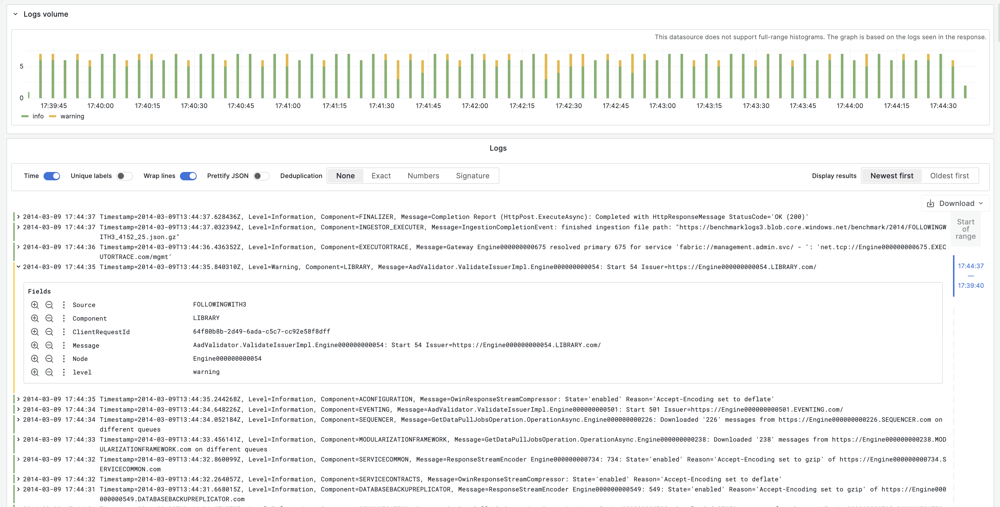

# {{ ydb-short-name }} data source for Grafana

The [{{ ydb-short-name }} data source plugin](https://grafana.com/grafana/plugins/ydbtech-ydb-datasource/) allows you to use [Grafana](https://grafana.com) to query and visualize data from {{ ydb-short-name }}.

## Installation

Prerequisites: the plugin requires Grafana `v9.2` or higher.

Follow the Grafana's [plugin installation docs](https://grafana.com/docs/grafana/latest/plugins/installation/) to install a plugin named `ydb-grafana-datasource-plugin`.

## Configuration

### {{ ydb-short-name }} user for the data source

Set up an {{ ydb-short-name }} user account with **read-only** permissions [(more about permissions)](../security/access-management.md) and access to databases and tables you want to query.



Please note that Grafana does not validate that queries are safe. Queries can contain any SQL statements, including data modification instructions.



### Data transfer protocol support

The plugin supports [gRPC and gRPCS](https://grpc.io/) transport protocols.

### Configuration via UI

Once the plugin is installed on your Grafana instance, follow [these instructions](https://grafana.com/docs/grafana/latest/datasources/add-a-data-source/) to add a new {{ ydb-short-name }} data source, and enter configuration options.

### Configuration with provisioning system

Alternatively, Grafana's provisioning system allows you to configure data sources using configuration files. To read about how it works, including all the settings you can set for this data source, refer to the [Provisioning Grafana data sources](https://grafana.com/docs/grafana/latest/administration/provisioning/#data-sources) documentation.

### Authentication

The Grafana plugin supports the following [authentication methods](../reference/ydb-sdk/auth.md): Anonymous, Access Token, Metadata, Service Account Key and Static Credentials.

Below is an example config for authenticating a {{ ydb-short-name }} data source using username and password:

```yaml
apiVersion: 1
datasources:
  - name: YDB
    type: ydbtech-ydb-datasource
    jsonData:
      authKind: '<password>'
      endpoint: 'grpcs://<hostname>:2135'
      dbLocation: '<location_to_db>'
      user: '<username>'
    secureJsonData:
      password: '<userpassword>'
      certificate: |
        <full content of *.pem file>
```

Here are fields that are supported in connection configuration:

| Name  | Description         |         Type          |
| :---- | :------------------ | :-------------------: |
| authKind | Authentication type |       `"Anonymous"`, `"ServiceAccountKey"`, `"AccessToken"`, `"UserPassword"`, `"MetaData"`        |
| endpoint | Database endpoint  | `string` |
| dbLocation | Database location  | `string` |
| user | User name  | `string` |
| serviceAccAuthAccessKey | Service account access key  | `string` (secured) |
| accessToken | Access token  | `string` (secured) |
| password | User password  | `string` (secured) |
| certificate | If self-signed certificates are used on your {{ ydb-short-name }} cluster nodes, specify the [Certificate Authority](https://en.wikipedia.org/wiki/Certificate_authority) certificate used to issue them  | `string` (secured) |

## Building queries

{{ ydb-short-name }} is queried with a SQL dialect named [YQL](../yql/reference/index.md).
The query editor allows to get data in different representations: time series, table, or logs.

### Time series

Time series visualization options are selectable if the query returns at least one field with `Date`, `Datetime`, or `Timestamp` type (for now, working with time is supported only in UTC timezone) and at least one field with `Int64`, `Int32`, `Int16`, `Int8`, `Uint64`, `Uint32`, `Uint16`, `Uint8`, `Double` or `Float` type. Then, you can select time series visualization options. Any other column is treated as a value column.


#### Multi-line time series

To create a multi-line time series, the query must return at least 3 fields:

- field with `Date`, `Datetime` or `Timestamp` type (for now, working with time is supported only in UTC timezone)
- metric - field with `Int64`, `Int32`, `Int16`, `Int8`, `Uint64`, `Uint32`, `Uint16`, `Uint8`, `Double` or `Float` type
- either metric or field with `String` or `Utf8` type - the value for splitting metrics into separate series.

For example:

```sql
SELECT
    `timestamp`,
    `responseStatus`
    AVG(`requestTime`) AS `avgReqTime`
FROM `/database/endpoint/my-logs`
GROUP BY `responseStatus`, `timestamp`
ORDER BY `timestamp`
```

### Tables { #tables }

Table visualizations will always be available for any valid {{ ydb-short-name }} query that returns exactly one result set.


### Visualizing logs with the Logs Panel

To use the Logs panel, your query must return a `Date`, `Datetime`, or `Timestamp` value and a `String` value. You can select logs visualizations using the visualization options.

Only the first text field will be represented as a log line by default. This behavior can be customized using the query builder.



### Macros

The query can contain macros, which simplify syntax and allow for dynamic parts, like date range filters.
There are two kinds of macros - [Grafana-level](#macros) and {{ ydb-short-name }}-level. The plugin will parse query text and, before sending it to {{ ydb-short-name }}, substitute variables and Grafana-level macros with particular values. After that {{ ydb-short-name }}-level macroses will be treated by {{ ydb-short-name }} server-side.

Here is an example of a query with a macro that will use Grafana's time filter:

```sql
SELECT `timeCol`
FROM `/database/endpoint/my-logs`
WHERE $__timeFilter(`timeCol`)
```

```sql
SELECT `timeCol`
FROM `/database/endpoint/my-logs`
WHERE $__timeFilter(`timeCol` + Interval("PT24H"))
```

Macro                                        | Description                                                                                                                      | Output example                                                                                  |
| -------------------------------------------- | -------------------------------------------------------------------------------------------------------------------------------- | ----------------------------------------------------------------------------------------------- |
| `$__timeFilter(expr)`                | Replaced by a conditional that filters the data (using the provided column or expression) based on the time range of the panel in microseconds | `foo >= CAST(1636717526371000 AS Timestamp) AND foo <=  CAST(1668253526371000 AS Timestamp)' )` |
| `$__fromTimestamp`                         | Replaced by the starting time of the range of the panel cast to Timestamp                                                      | `CAST(1636717526371000 AS Timestamp)`                                                           |
| `$__toTimestamp`                           | Replaced by the ending time of the range of the panel cast to Timestamp                                                        | `CAST(1636717526371000 AS Timestamp)`                                                           |
| `$__varFallback(condition, $templateVar)` | Replaced by the first parameter when the template variable in the second parameter is not provided.                              | `$__varFallback('foo', $bar)` `foo` if variable `bar` is not provided, or `$bar`'s value                                                               |

### Templates and variables

To add a new {{ ydb-short-name }} query variable, refer to [Add a query variable](https://grafana.com/docs/grafana/latest/variables/variable-types/add-query-variable/).
After creating a variable, you can use it in your {{ ydb-short-name }} queries by using [Variable syntax](https://grafana.com/docs/grafana/latest/variables/syntax/).
For more information about variables, refer to [Templates and variables](https://grafana.com/docs/grafana/latest/variables/).

## Learn more

- Add [Annotations](https://grafana.com/docs/grafana/latest/dashboards/annotations/).
- Configure and use [Templates and variables](https://grafana.com/docs/grafana/latest/variables/).
- Add [Transformations](https://grafana.com/docs/grafana/latest/panels/transformations/).
- Set up alerting; refer to [Alerts overview](https://grafana.com/docs/grafana/latest/alerting/).
