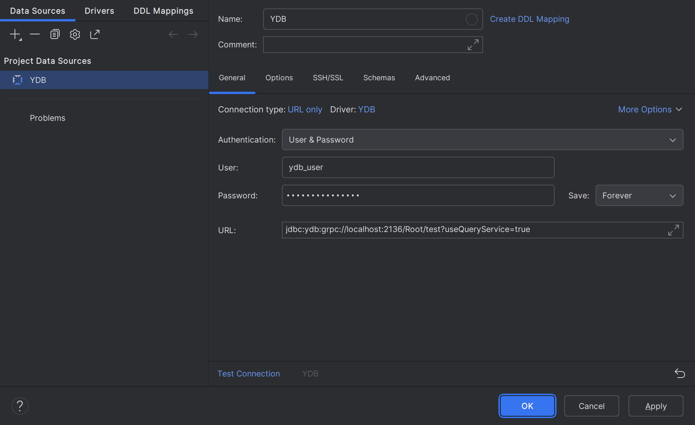
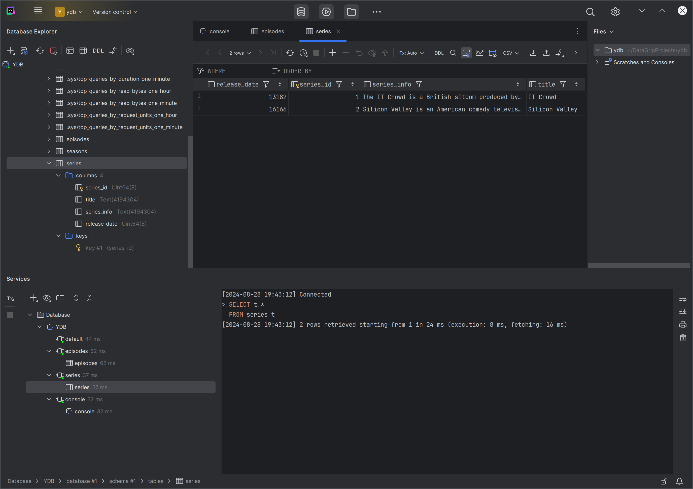

# Connecting to {{ ydb-short-name }} with DataGrip

[DataGrip](https://www.jetbrains.com/datagrip/) is a powerful cross-platform tool for relational and NoSQL databases.

DataGrip allows you to work with {{ ydb-short-name }} using the Java DataBase Connectivity ([JDBC](https://en.wikipedia.org/wiki/Java_Database_Connectivity)) protocol. This article demonstrates how to set up this integration.


### Adding the {{ ydb-short-name }} JDBC Driver to DataGrip {#datagrip_ydb}


To connect to {{ ydb-name }} from DataGrip, you need the {{ ydb-name }} JDBC driver. 

To download the {{ ydb-short-name }} JDBC driver, follow these steps:

1. Go to the [ydb-jdbc-driver repository](https://github.com/ydb-platform/ydb-jdbc-driver/releases).

1. Select the latest release (tagged as `Latest`) and save the `ydb-jdbc-driver-shaded-<driver-version>.jar` file.

To add the downloaded JDBC driver to DataGrip, follow these steps:

1. In DataGrip, go to **File | Data Sources…**.

    The **Data Sources and Drivers** dialog box appears.

1. In the **Data Sources and Drivers** dialog box, open the **Drivers** tab and click the **+** button.

1. In the **Name** field, specify `YDB`.


1. In the **Driver Files** section, click the **+** button, choose **Custom JARs…**, specify the path to the previously downloaded {{ ydb-short-name }} JDBC driver (the `ydb-jdbc-driver-shaded-<driver-version>.jar` file), and click **OK**:

1. In the **Class** drop-down list, select `tech.ydb.jdbc.YdbDriver`.

    

1. Click **OK**.

### Creating a Connection to {{ ydb-name }} {#datagrip_ydb_connection}

To establish a connection, perform the following steps:

1. In DataGrip, go to **File | Data Sources…**.

    The **Data Sources and Drivers** dialog box appears.

1. In the **Data Sources and Drivers** dialog box, on the **Data Sources** tab, click the **+** button and select `YDB`.

1. In the **Authentication** drop-down list, select an authentication method.

1. If you selected the `User & Password` authentication method, in the **User** and **Password** fields, enter your YDB login and password.

1. On the **General** tab, in the **URL** field, specify the following connection string:

    ```
    jdbc:ydb:<ydb_endpoint>/<ydb_database>?useQueryService=true
    ```

    Where:
    - `ydb_endpoint` — the [endpoint](../../concepts/connect.md#endpoint) of the {{ydb-name}} cluster.
    - `ydb_database` — the path to the [database](../../concepts/glossary.md#database) in the {{ydb-name}} cluster.

    A complete list of authentication methods and connection strings for {{ ydb-name }} is provided in the [JDBC driver](https://github.com/ydb-platform/ydb-jdbc-driver) description.

    

1. Click **Test Connection** to verify the settings.

   If all the settings are correct, a message appears indicating a successful connection test.

1. Click **OK** to save the connection.


### Working with {{ ydb-name }} {#datagrip_ydb_connection}

With DataGrip you can view the list and structure of tables.



You can also execute queries on the data.


