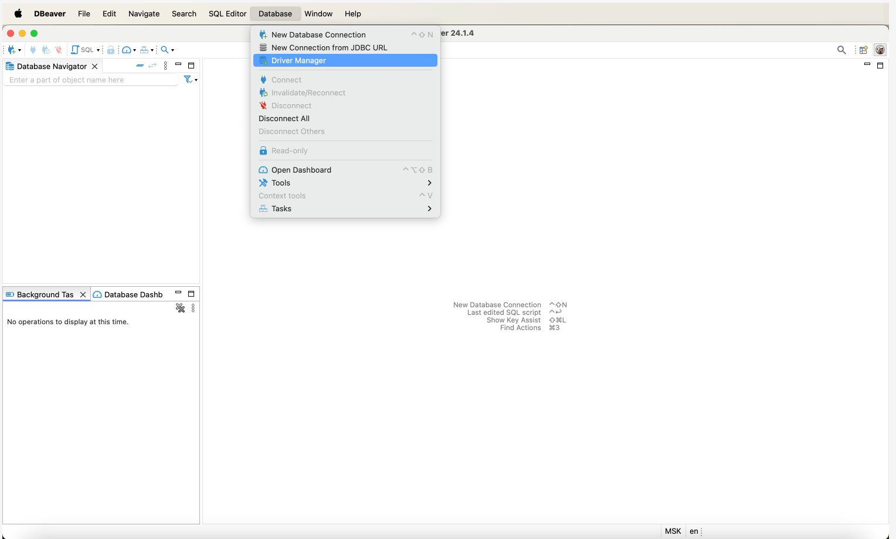
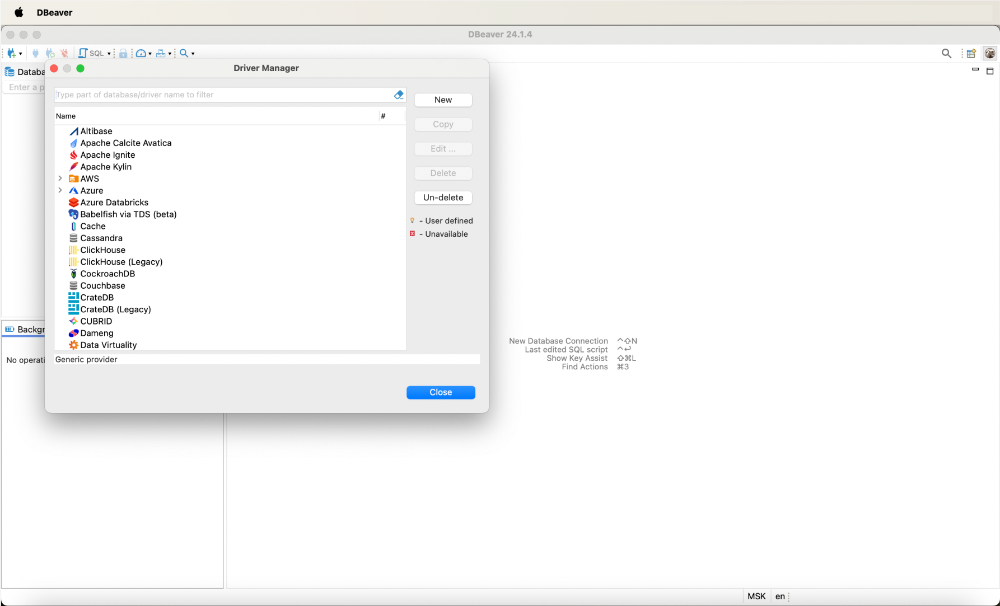
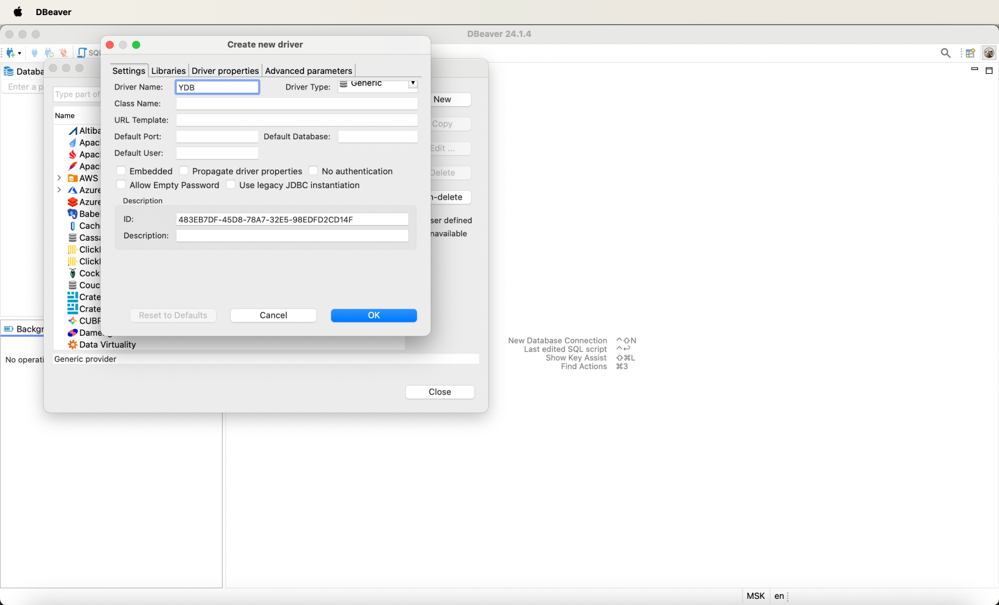
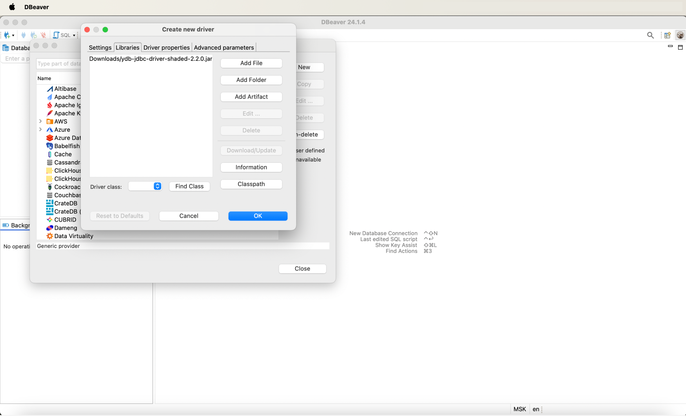
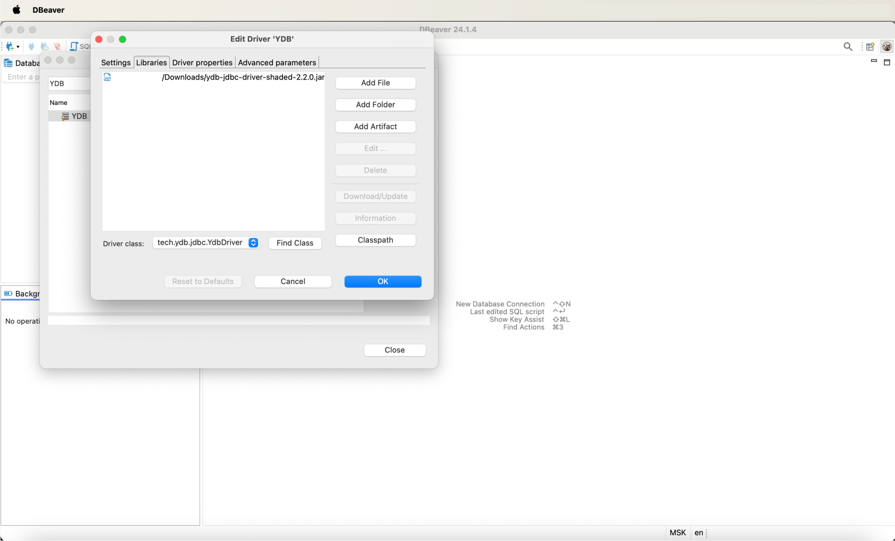
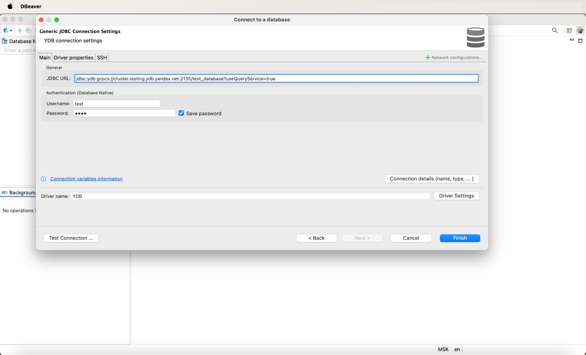
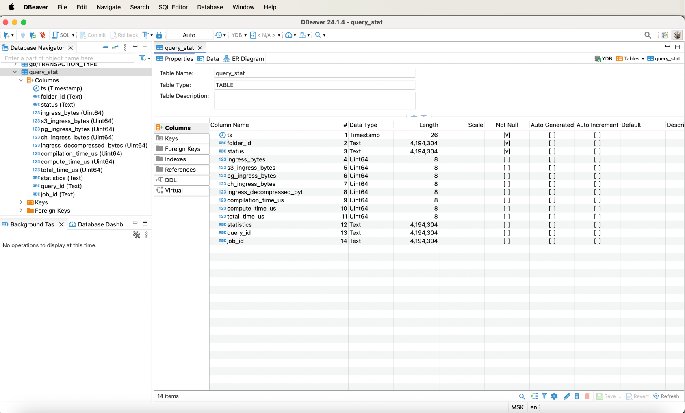
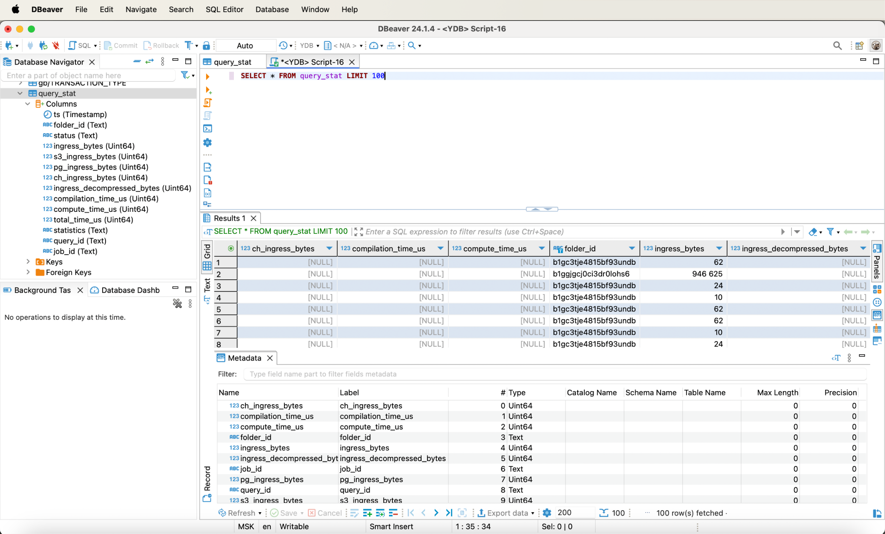

# Connecting to {{ ydb-short-name }} with DBeaver

[DBeaver](https://dbeaver.com) is a free, cross-platform, open-source database management tool that provides a visual interface for connecting to various databases and executing SQL queries. It supports many database management systems, including MySQL, PostgreSQL, Oracle, and SQLite.

DBeaver allows you to work with {{ ydb-short-name }} using the Java DataBase Connectivity ([JDBC](https://en.wikipedia.org/wiki/Java_Database_Connectivity)) protocol. This article demonstrates how to set up this integration.


## Connecting the {{ ydb-name }} JDBC Driver to DBeaver {#dbeaver_ydb}


To connect to {{ ydb-name }} from DBeaver, you will need the JDBC driver. Follow these steps to download the JDBC driver:
1. Go to the [ydb-jdbc-driver repository](https://github.com/ydb-platform/ydb-jdbc-driver/releases).
1. Select the latest release (tagged as `Latest`) and save the `ydb-jdbc-driver-shaded-<driver-version>.jar` file.

Follow these steps to connect the downloaded JDBC driver:
1. In the top menu of DBeaver, select the **Database** option, then select **Driver Manager**:
    

1. To create a new driver, click the **New** button in the **Driver Manager** window that opens
    

1. In the **Create Driver** window that opens, specify `YDB` in the **Driver Name** field:

    

1.  Go to the **Libraries** section, click **Add File**, specify the path to the previously downloaded {{ ydb-short-name }} JDBC driver (the `ydb-jdbc-driver-shaded-<driver-version>.jar` file), and click **OK**:

    

1. The **YDB** item will appear in the list of drivers. Double-click the new driver and go to the **Libraries** tab, click **Find Class**, and select `tech.ydb.jdbc.YdbDriver` from the dropdown list.

    

    Be sure to explicitly select the `tech.ydb.jdbc.YdbDriver` item from the dropdown list by clicking on it. Otherwise, DBeaver will consider that the driver has not been selected.

    

    

## Creating a Connection to {{ ydb-name }} {#dbeaver_ydb_connection}

Perform the following steps to establish a connection:

1. In DBeaver, create a new connection, specifying the `YDB` connection type.
1. In the window that opens, go to the **Main** section.
1. In the **General** subsection, in the **JDBC URL** input field, specify the following connection string:

    ```
    jdbc:ydb:<ydb_endpoint>/<ydb_database>?useQueryService=true
    ```

    Where:
    - `ydb_endpoint` — the [endpoint](../../concepts/connect.md#endpoint) of the {{ydb-name}} cluster to which the connection will be made.
    - `ydb_database` — the path to the [database](../../concepts/glossary.md#database) in the {{ydb-name}} cluster to which queries will be made.

    

1. In the **User** and **Password** fields, enter the login and password for connecting to the database. A complete list of authentication methods and connection strings for {{ ydb-name }} is provided in the [JDBC driver](https://github.com/ydb-platform/ydb-jdbc-driver) description.

1. Click **Test Connection...** to verify the settings.

    If all settings are correct, a message indicating successful connection testing will appear:

    

1. Click **Finish** to save the connection.


## Working with {{ ydb-name }} {#dbeaver_ydb_connection}

With DBeaver, you can view the list and structure of tables:



As well as execute queries on the data:


