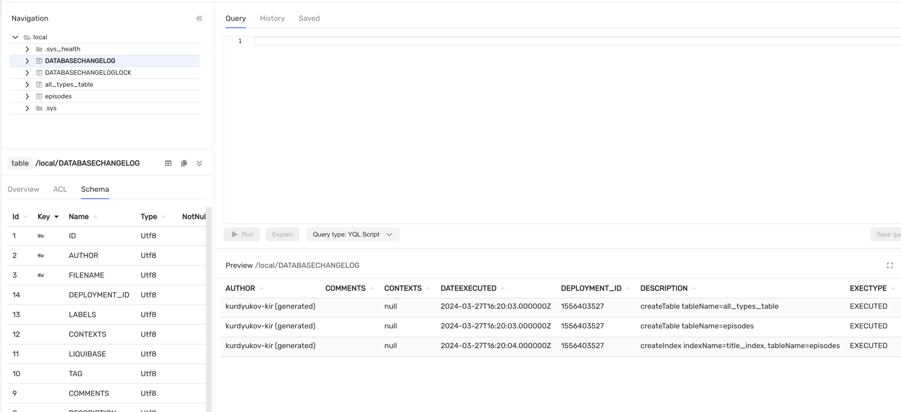

# Support for the {{ ydb-short-name }} dialect in the Liquibase migration tool. 

## Introduction {#introductuin}

[Liquibase](https://www.liquibase.com/) is an open-source library for tracking, managing, and applying changes to database schemas. It is expanded with dialects for different DBMS.

Dialect is the main entity in the Liquibase framework, which helps form SQL queries for the database, taking into account the specific features of a particular DBMS.

## Features of the {{ ydb-short-name }} Dialect {#ydb-dialect}

Liquibase's main functionality is the abstract description of database schemas in `.xml`, `.json`, or `.yaml` format. This ensures portability when switching between different database management systems (DBMS).

The dialect supports basic constructions in the migration description standard (changeset).

### Creating a table

The `сreateTable` changeset is responsible for creating a table. The descriptions of types from the SQL standard are mapped to primitive types in {{ ydb-short-name }}. For example, the `bigint` type will be converted to `Int64`.



You can also explicitly specify the original name. For example, types like `Int32`, `Json`, `Json Document`, `Bytes` and `Interval`. But in that case, the portability of the schema is lost.



Table of comparison of Liquibase types descriptions with [{{ ydb-short-name }} types](https://db.tech/docs/en/yql/reference/types/primitive):

| Liquibase types                                                                                                                                                                                                                                                                                                                                                                                                                                                                                               | {{ ydb-short-name }} type  |
|---------------------------------------------------------------------------------------------------------------------------------------------------------------------------------------------------------------------------------------------------------------------------------------------------------------------------------------------------------------------------------------------------------------------------------------------------------------------------------------------------------------|----------------------------|
| `boolean`, `java.sql.Types.BOOLEAN`, `java.lang.Boolean`, `bit`, `bool`                                                                                                                                                                                                                                                                                                                                                                                                                                       | `Bool`                     |
| `blob`, `longblob`, `longvarbinary`, `String`, `java.sql.Types.BLOB`, `java.sql.Types.LONGBLOB`, `java.sql.Types.LONGVARBINARY`, `java.sql.Types.VARBINARY`,`java.sql.Types.BINARY`, `varbinary`, `binary`, `image`, `tinyblob`, `mediumblob`, `long binary`, `long varbinary`                                                                                                                                                                                                                                | `Bytes` (synonym `String`) |
| `java.sql.Types.DATE`, `smalldatetime`, `date`                                                                                                                                                                                                                                                                                                                                                                                                                                                                | `Date`                     |
| `decimal`, `java.sql.Types.DECIMAL`, `java.math.BigDecimal`                                                                                                                                                                                                                                                                                                                                                                                                                                                   | `Decimal(22,9)`            |
| `double`, `java.sql.Types.DOUBLE`, `java.lang.Double`                                                                                                                                                                                                                                                                                                                                                                                                                                                         | `Double`                   |
| `float`, `java.sql.Types.FLOAT`, `java.lang.Float`, `real`, `java.sql.Types.REAL`                                                                                                                                                                                                                                                                                                                                                                                                                             | `Float`                    |
| `int`, `integer`, `java.sql.Types.INTEGER`, `java.lang.Integer`, `int4`, `int32`                                                                                                                                                                                                                                                                                                                                                                                                                              | `Int32`                    |
| `bigint`, `java.sql.Types.BIGINT`, `java.math.BigInteger`, `java.lang.Long`, `integer8`, `bigserial`, `long`                                                                                                                                                                                                                                                                                                                                                                                                  | `Int64`                    |
| `java.sql.Types.SMALLINT`, `int2`, `smallserial`, `smallint`                                                                                                                                                                                                                                                                                                                                                                                                                                                  | `Int16`                    |
| `java.sql.Types.TINYINT`, `tinyint`                                                                                                                                                                                                                                                                                                                                                                                                                                                                           | `Int8`                     |
| `char`, `java.sql.Types.CHAR`, `bpchar`, `character`, `nchar`, `java.sql.Types.NCHAR`, `nchar2`, `text`, `varchar`, `java.sql.Types.VARCHAR`, `java.lang.String`, `varchar2`, `character varying`, `nvarchar`, `java.sql.Types.NVARCHAR`, `nvarchar2`, `national`, `clob`, `longvarchar`, `longtext`, `java.sql.Types.LONGVARCHAR`, `java.sql.Types.CLOB`, `nclob`, `longnvarchar`, `ntext`, `java.sql.Types.LONGNVARCHAR`, `java.sql.Types.NCLOB`, `tinytext`, `mediumtext`, `long varchar`, `long nvarchar` | `Text`                     |
| `timestamp`, `java.sql.Types.TIMESTAMP`, `java.sql.TIMESTAMP`                                                                                                                                                                                                                                                                                                                                                                                                                                                 | `Timestamp`                |
| `java.util.Date`, `time`, `java.sql.Types.TIME`, `java.sql.Time`                                                                                                                                                                                                                                                                                                                                                                                                                                              | `Datetime`                 |



The case of the data type does not matter.



### Изменение структуры таблицы

`dropTable` - delete table. For example: `<dropTable tableName="episodes"/>`

`addColumn` - add column in table. For example:

```xml

<addColumn tableName="seasons">
    <column name="is_deleted" type="bool"/>
</addColumn>
```

`createIndex` - create index. For example:

```xml

<createIndex tableName="episodes" indexName="episodes_index" unique="false">
    <column name="title"/>
</createIndex>
```



Asynchronous indexes should be created using native SQL migrations.



`dropIndex` - drop index. For example: `<dropIndex tableName="series" indexName="series_index"/>`

### Inserting data into a table

`loadData`, `loadUpdateData` - download data from CSV file. *loadUpdate* loads data using the UPSERT command. Data will be automatically converted to the required types, taking into account the strict typing in {{ ydb-short-name }}.

`insert` is a changeset that performs a single insert into a table. The value can be specified in the `value` field, for example, `<column name="timestamp_column" value="2023-07-31T17:00:00.123123Z"/>`.



To understand which SQL statements {{ydb-short-name}} can perform, read the documentation for the query language [YQL](https://ydb.tech/docs/en/yql/reference/).





It is important to note that custom YQL instructions can be applied via native SQL queries.



## How to use it? {#using}

There are two ways:



- Programmatically from Java / Kotlin applications

  How to use Java / Kotlin is described in detail in [README](https://github.com/ydb-platform/ydb-java-dialects/tree/main/liquibase-dialect) of the project, there is also a link to an example of a Spring Boot application.

- Liquibase CLI

  First, you need to install Liquibase itself using [one of the recommended methods](https://docs.liquibase.com/start/install/home.html). Then you need to place the actual .jar archives [{{ ydb-short-name }} JDBC driver](https://github.com/ydb-platform/ydb-jdbc-driver/releases) and Liquibase [dialect {{ ydb-short-name }}](https://mvnrepository.com/artifact/tech.ydb.dialects/liquibase-ydb-dialect/1.0.0)

  ```bash
  # $(which liquibase)
  cd ./internal/lib/
  
  # you may need to sudo
  # set an actual versions .jar files
  curl -L -o ydb-jdbc-driver.jar https://repo1.maven.org/maven2/tech/ydb/jdbc/ydb-jdbc-driver-shaded/2.0.7/ydb-jdbc-driver-shaded-2.0.7.jar
  curl -L -o liquibase-ydb-dialect.jar https://repo1.maven.org/maven2/tech/ydb/dialects/liquibase-ydb-dialect/1.0.0/liquibase-ydb-dialect-1.0.0.jar
  ```
  
  For a more detailed description, see the [Manual library management](https://docs.liquibase.com/start/install/home.html ). Now the liquibase utility can be used in standard ways.



## Liquibase usage scenarios

### Initializing liquibase to an empty {{ ydb-short-name }}

The main command is 'liquibase update', which applies migrations if the current schema {{ ydb-short-name }} lags behind the user description.

Let's apply this changeset to an empty database:

```xml
<?xml version="1.0" encoding="UTF-8"?>
<databaseChangeLog
        xmlns="http://www.liquibase.org/xml/ns/dbchangelog"
        xmlns:xsi="http://www.w3.org/2001/XMLSchema-instance"
        xsi:schemaLocation="http://www.liquibase.org/xml/ns/dbchangelog
                      http://www.liquibase.org/xml/ns/dbchangelog/dbchangelog-3.8.xsd">

    <changeSet id="episodes" author="kurdyukov-kir">
        <comment>Table episodes.</comment>

        <createTable tableName="episodes">
            <column name="series_id" type="bigint">
                <constraints primaryKey="true"/>
            </column>
            <column name="season_id" type="bigint">
                <constraints primaryKey="true"/>
            </column>
            <column name="episode_id" type="bigint">
                <constraints primaryKey="true"/>
            </column>

            <column name="title" type="text"/>
            <column name="air_date" type="timestamp"/>
        </createTable>
        <rollback>
            <dropTable tableName="episodes"/>
        </rollback>
    </changeSet>
    <changeSet id="index_episodes_title" author="kurdyukov-kir">
        <createIndex tableName="episodes" indexName="index_episodes_title" unique="false">
            <column name="title"/>
        </createIndex>
    </changeSet>
</databaseChangeLog>
```

After executing the `liquibase update` command, Liquibase will print the following log.

```bash
UPDATE SUMMARY
Run:                          2
Previously run:               0
Filtered out:                 0
-------------------------------
Total change sets:            2

Liquibase: Update has been successful. Rows affected: 2
Liquibase command 'update' was executed successfully.
```

After applying migrations, the data schema now looks like this:


You can see that Liquibase has created two service tables: `DATABASECHANGELOG`, which is the migration log, and `DATABASECHANGELOGLOCK`, which is a table for acquiring a distributed lock.

Contents of the `DATABASECHANGELOG` table:

| AUTHOR        | COMMENTS        | CONTEXTS | DATEEXECUTED | DEPLOYMENT_ID | DESCRIPTION                                                    | EXECTYPE | FILENAME               | ID                   | LABELS | LIQUIBASE | MD5SUM                             | ORDEREXECUTED | TAG |
|:--------------|:----------------|:---------|:-------------|:--------------|:---------------------------------------------------------------|:---------|:-----------------------|:---------------------|:-------|:----------|:-----------------------------------|:--------------|:----|
| kurdyukov-kir | Table episodes. |          | 12:53:27     | 1544007500    | createTable tableName=episodes                                 | EXECUTED | migration/episodes.xml | episodes             |        | 4.25.1    | 9:4067056a5ab61db09b379a93625870ca | 1             |
| kurdyukov-kir | ""              |          | 12:53:28     | 1544007500    | createIndex indexName=index_episodes_title, tableName=episodes | EXECUTED | migration/episodes.xml | index_episodes_title |        | 4.25.1    | 9:49b8b0b22d18c7fd90a3d6b2c561455d | 2             |

### Evolution of the database schema

Let's say we need to create a {{ydb-short-name }} topic and turn off auto partitioning of the table. This can be done with a native SQL script:

```sql
--liquibase formatted sql

--changeset kurdyukov-kir:10
CREATE
TOPIC `my_topic` (
    CONSUMER my_consumer
    ) WITH (retention_period = Interval('P1D')
);

--changeset kurdyukov-kir:auto-partitioning-disabled
ALTER TABLE episodes SET (AUTO_PARTITIONING_BY_SIZE = DISABLED);
```

Also add a new column `is_deleted` and remove the index `index_episodes_title`:

```xml

<changeSet id="alter-episodes" author="kurdyukov-kir">
    <comment>Alter table episodes.</comment>

    <dropIndex tableName="episodes" indexName="index_episodes_title"/>

    <addColumn tableName="episodes">
        <column name="is_deleted" type="bool"/>
    </addColumn>
</changeSet>
<include file="/migration/sql/yql.sql" relativeToChangelogFile="true"/>
```

After executing `liquibase update`, the database schema will be successfully updated:

```bash
UPDATE SUMMARY
Run:                          3
Previously run:               2
Filtered out:                 0
-------------------------------
Total change sets:            5

Liquibase: Update has been successful. Rows affected: 3
Liquibase command 'update' was executed successfully.
```

The result will be deleting the index, adding the `is_deleted` column, disabling the auto partitioning setting, and creating a topic:


### Initializing liquibase in a project with a non-empty data schema

Suppose I have an existing project with the current database schema:


To start using liquibase, you need to run `liquibase generate-changelog --changelog-file=changelog.xml`.

The content of the generated changelog.xml:

```xml
<changeSet author="kurdyukov-kir (generated)" id="1711556283305-1">
    <createTable tableName="all_types_table">
        <column name="id" type="INT32">
            <constraints nullable="false" primaryKey="true"/>
        </column>
        <column name="bool_column" type="BOOL"/>
        <column name="bigint_column" type="INT64"/>
        <column name="smallint_column" type="INT16"/>
        <column name="tinyint_column" type="INT8"/>
        <column name="float_column" type="FLOAT"/>
        <column name="double_column" type="DOUBLE"/>
        <column name="decimal_column" type="DECIMAL(22, 9)"/>
        <column name="uint8_column" type="UINT8"/>
        <column name="uint16_column" type="UINT16"/>
        <column name="unit32_column" type="UINT32"/>
        <column name="unit64_column" type="UINT64"/>
        <column name="text_column" type="TEXT"/>
        <column name="binary_column" type="BYTES"/>
        <column name="json_column" type="JSON"/>
        <column name="jsondocument_column" type="JSONDOCUMENT"/>
        <column name="date_column" type="DATE"/>
        <column name="datetime_column" type="DATETIME"/>
        <column name="timestamp_column" type="TIMESTAMP"/>
        <column name="interval_column" type="INTERVAL"/>
    </createTable>
</changeSet>
<changeSet author="kurdyukov-kir (generated)" id="1711556283305-2">
    <createTable tableName="episodes">
        <column name="series_id" type="INT64">
            <constraints nullable="false" primaryKey="true"/>
        </column>
        <column name="season_id" type="INT64">
            <constraints nullable="false" primaryKey="true"/>
        </column>
        <column name="episode_id" type="INT64">
            <constraints nullable="false" primaryKey="true"/>
        </column>
        <column name="title" type="TEXT"/>
        <column name="air_date" type="DATE"/>
    </createTable>
</changeSet>
<changeSet author="kurdyukov-kir (generated)" id="1711556283305-3">
    <createIndex indexName="title_index" tableName="episodes">
        <column name="title"/>
    </createIndex>
</changeSet>
```

Then you need to synchronize the generated changelog.xml the file, this is done by the command `liquibase changelog-sync --changelog-file=dbchangelog.xml`.

The result will be liquibase synchronization in your project:

