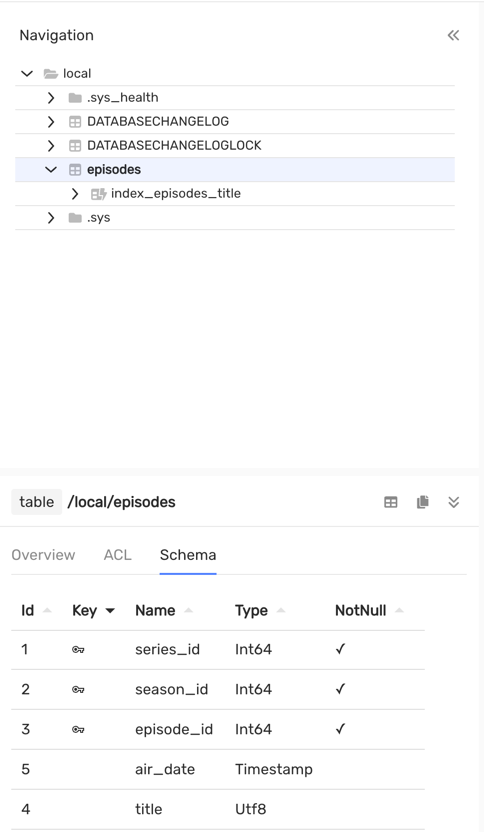
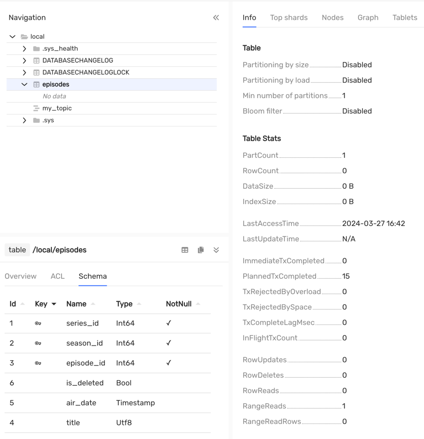
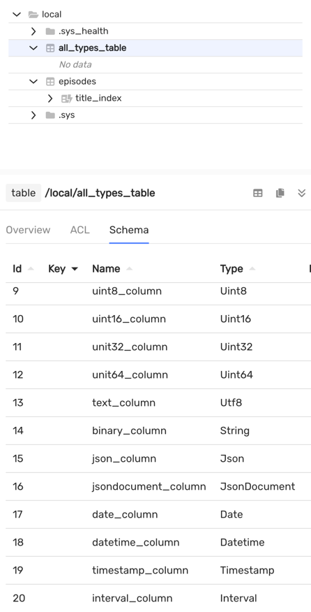

# Migrating {{ ydb-short-name }} data schemas with the Liquibase migration tool

## Introduction {#introduction}

[Liquibase](https://www.liquibase.com/) is an open-source library for tracking, managing, and applying changes to database schemas. It is extended with dialects for different database management systems (DBMS), including {{ ydb-short-name }}.

Dialect is the main component in the Liquibase framework, which assists in creating SQL queries for a database, considering the specific features of a given DBMS.

## Features of the {{ ydb-short-name }} Dialect {#ydb-dialect}

Liquibase's main functionality is the abstract description of database schemas in a `.xml`, `.json`, or `.yaml` format. This ensures portability when switching between different DBMSs.

The {{ ydb-short-name }} dialect supports the following basic constructs in the standard migration description (changeset).

### Creating a table

The `сreateTable` changeset is responsible for creating a table. The descriptions of types from the SQL standard are mapped to primitive types in {{ ydb-short-name }}. For example, the `bigint` type will be converted to `Int64`.



You can also explicitly specify the original type name, such as `Int32`, `Json`, `JsonDocument`, `Bytes`, or `Interval`. However, in this case, the schema won't be portable.



Table of comparison of Liquibase types descriptions with [{{ ydb-short-name }} types](../yql/reference/types/primitive.md):

| Liquibase types                                                                                                                                                                                                                                                                                                                                                                                                                                                                                               | {{ ydb-short-name }} type  |
|---------------------------------------------------------------------------------------------------------------------------------------------------------------------------------------------------------------------------------------------------------------------------------------------------------------------------------------------------------------------------------------------------------------------------------------------------------------------------------------------------------------|----------------------------|
| `boolean`, `java.sql.Types.BOOLEAN`, `java.lang.Boolean`, `bit`, `bool`                                                                                                                                                                                                                                                                                                                                                                                                                                       | `Bool`                     |
| `blob`, `longblob`, `longvarbinary`, `String`, `java.sql.Types.BLOB`, `java.sql.Types.LONGBLOB`, `java.sql.Types.LONGVARBINARY`, `java.sql.Types.VARBINARY`,`java.sql.Types.BINARY`, `varbinary`, `binary`, `image`, `tinyblob`, `mediumblob`, `long binary`, `long varbinary`                                                                                                                                                                                                                                | `Bytes` (synonym `String`) |
| `java.sql.Types.DATE`, `smalldatetime`, `date`                                                                                                                                                                                                                                                                                                                                                                                                                                                                | `Date`                     |
| `decimal`, `java.sql.Types.DECIMAL`, `java.math.BigDecimal`                                                                                                                                                                                                                                                                                                                                                                                                                                                   | `Decimal(22,9)`            |
| `double`, `java.sql.Types.DOUBLE`, `java.lang.Double`                                                                                                                                                                                                                                                                                                                                                                                                                                                         | `Double`                   |
| `float`, `java.sql.Types.FLOAT`, `java.lang.Float`, `real`, `java.sql.Types.REAL`                                                                                                                                                                                                                                                                                                                                                                                                                             | `Float`                    |
| `int`, `integer`, `java.sql.Types.INTEGER`, `java.lang.Integer`, `int4`, `int32`                                                                                                                                                                                                                                                                                                                                                                                                                              | `Int32`                    |
| `bigint`, `java.sql.Types.BIGINT`, `java.math.BigInteger`, `java.lang.Long`, `integer8`, `bigserial`, `long`                                                                                                                                                                                                                                                                                                                                                                                                  | `Int64`                    |
| `java.sql.Types.SMALLINT`, `int2`, `smallserial`, `smallint`                                                                                                                                                                                                                                                                                                                                                                                                                                                  | `Int16`                    |
| `java.sql.Types.TINYINT`, `tinyint`                                                                                                                                                                                                                                                                                                                                                                                                                                                                           | `Int8`                     |
| `char`, `java.sql.Types.CHAR`, `bpchar`, `character`, `nchar`, `java.sql.Types.NCHAR`, `nchar2`, `text`, `varchar`, `java.sql.Types.VARCHAR`, `java.lang.String`, `varchar2`, `character varying`, `nvarchar`, `java.sql.Types.NVARCHAR`, `nvarchar2`, `national`, `clob`, `longvarchar`, `longtext`, `java.sql.Types.LONGVARCHAR`, `java.sql.Types.CLOB`, `nclob`, `longnvarchar`, `ntext`, `java.sql.Types.LONGNVARCHAR`, `java.sql.Types.NCLOB`, `tinytext`, `mediumtext`, `long varchar`, `long nvarchar` | `Text` (synonym `Utf8`)    |
| `timestamp`, `java.sql.Types.TIMESTAMP`, `java.sql.Timestamp`                                                                                                                                                                                                                                                                                                                                                                                                                                                 | `Timestamp`                |
| `datetime`, `time`, `java.sql.Types.TIME`, `java.sql.Time`                                                                                                                                                                                                                                                                                                                                                                                                                                                    | `Datetime`                 |



In YDB, the `Timestamp` data type stores dates with microsecond precision. The `java.sql.Timestamp` or `java.time.Instant` store timestamps with nanosecond precision, so you should be aware of this when using these data types.

The type names are case insensitive.



The `dropTable` changeset - delete a table. For example: `<dropTable tableName="episodes"/>`

### Changing the table structure

`addColumn` - add a column to a table. For example:



- xml

  ```xml
  <addColumn tableName="seasons">
      <column name="is_deleted" type="bool"/>
  </addColumn>
  ```

- json

  ```json
  "changes": [
      {
        "addColumn": {
          "tableName": "seasons",
          "columns": [
            {
              "column": {
                "name": "is_deleted",
                "type": "bool"
              }
            }
          ]
        }
      }
    ]
  ```

- yaml

  ```yaml
  changes:
  - addColumn:
      tableName: seasons
      columns:
      - column:
          name: is_deleted
          type: bool
  ```



`createIndex` - create a secondary index. For example:



- xml

  ```xml
  <createIndex tableName="episodes" indexName="episodes_index" unique="false">
      <column name="title"/>
  </createIndex>
  ```

- json

  ```json
  "changes": [
      {
        "createIndex": {
          "tableName": "episodes",
          "indexName": "episodes_index",
          "unique": "false",
          "columns": {
            "column": {
              "name": "title"
            }
          }
        }
      }
  ```

- yaml

  ```yaml
  changes:
  - createIndex:
      tableName: episodes
      indexName: episodes_index
      unique: false
      columns:
      - column:
          name: title
  ```





YDB doesn't support unique secondary indexes.





Asynchronous indexes should be created using [native SQL migrations](https://docs.liquibase.com/concepts/changelogs/sql-format.html).



`dropIndex` - drop a secondary index. For example:



- xml

  ```xml
  <dropIndex tableName="series" indexName="series_index"/>
  ```

- json

  ```json
  "changes": [
    {
      "dropIndex": {
        "tableName": "series",
        "indexName": "series_index"
      }
    }
  ]
  ```

- yaml

  ```yaml
  changes:
  - dropIndex:
      tableName: series
      indexName: series_index
  ```



### Ingesting data into a table

`loadData`, `loadUpdateData` - upload data from a `CSV` file into a table. `loadUpdateData` loads data using the [{#T}](../yql/reference/syntax/upsert_into.md) command.

`insert` is a changeset that performs a single insert into a table using the [{#T}](../yql/reference/syntax/insert_into.md) command. For example:



- xml

  ```xml
  <insert tableName="episodes">
      <column name="series_id" valueNumeric="1"/>
      <column name="season_id" valueNumeric="1"/>
      <column name="episode_id" valueNumeric="1"/>
      <column name="title" value="Yesterday's Jam"/>
      <column name="air_date" valueDate="2023-04-03T08:46:23.456"/>
  </insert>
  ```

- json

  ```json
  "changes": [
    {
      "insert": {
        "tableName": "episodes",
        "columns": [
          {
            "column": {
              "name": "series_id",
              "valueNumeric": "1"
            }
          },
          {
            "column": {
              "name": "season_id",
              "valueNumeric": "1"
            }
          },
          {
            "column": {
              "name": "episode_id",
              "valueNumeric": "1"
            }
          },
          {
            "column": {
              "name": "title",
              "value": "Yesterday's Jam"
            }
          },
          {
            "column": {
              "name": "air_date",
              "valueDate": "2023-04-03T08:46:23.456"
            }
          }
        ]
      }
    }
  ]
  ```

- yaml

  ```yaml
  changes:
  - insert:
      tableName: episodes
      columns:
        - column:
            name: series_id
            valueNumeric: 1
        - column:
            name: season_id
            valueNumeric: 1
        - column:
            name: episode_id
            valueNumeric: 1
        - column:
            name: title
            value: Yesterday's Jam
        - column:
            name: air_date
            valueDate: 2023-04-03T08:46:23.456
  ```



You can also specify any value in the `value` field. Data from the `value` field in `insert` changeset or `CSV` files will be automatically converted to the required types, taking into account strict typing in {{ydb-short-name }}.

The type formatting table to load into the table:

| YDB type                                | Description format                                                                                                                                                                                                                               |
|-----------------------------------------|--------------------------------------------------------------------------------------------------------------------------------------------------------------------------------------------------------------------------------------------------|
| `Bool`                                  | `true` or `false`                                                                                                                                                                                                                                |
| `Int8`, `Int16`, `Int32`, `Int64`       | A signed integer                                                                                                                                                                                                                                 |
| `Uint8`, `Uint16`, `Uint32`, `Uint64`   | An unsigned integer                                                                                                                                                                                                                              |
| `Text`, `Bytes`, `Json`, `JsonDocument` | Represent as text                                                                                                                                                                                                                                |
| `Float`, `Double`, `Decimal(22, 9)`     | A real number                                                                                                                                                                                                                                    |
| `Interval`                              | [ISO-8601](https://en.wikipedia.org/wiki/ISO_8601#Durations), corresponds to the `java.time.Duration` in Java.                                                                                                                                   |
| `Date`                                  | Pattern `YYYY-MM-DD` calendar date from standard [ISO-8601](https://en.wikipedia.org/wiki/ISO_8601)                                                                                                                                              |
| `Datetime`                              | Pattern `YYYY-MM-DDThh:mm:ss`, timezone will be set to `UTC`                                                                                                                                                                                     |
| `Timestamp`                             | The timestamp from the [ISO-8601](https://en.wikipedia.org/wiki/ISO_8601) standard corresponds to the `java.time.Instant` in Java, timezone will be set to `UTC` (precision in microseconds - `Timestamp` type {{ ydb-short-name }} restriction) |                                                                               |


Example `CSV` file:

```csv
id,bool,bigint,smallint,tinyint,float,double,decimal,uint8,uint16,uint32,uint64,text,binary,json,jsondocument,date,datetime,timestamp,interval
2,true,123123,13000,112,1.123,1.123123,1.123123,12,13,14,15,kurdyukov-kir,binary,{"asd": "asd"},{"asd": "asd"},2014-04-06,2023-09-16T12:30,2023-07-31T17:00:00.00Z,PT10S
```



To understand which SQL statements {{ydb-short-name}} can perform and what are the restrictions on data types, read the documentation for the query language [YQL](../yql/reference/index.md).





It is important to note that custom YQL instructions can be applied via [native SQL queries](https://docs.liquibase.com/concepts/changelogs/sql-format.html).



## How to use it? {#using}

There are two ways:



- Programmatically from Java / Kotlin applications

  The project's [README](https://github.com/ydb-platform/ydb-java-dialects/tree/main/liquibase-dialect) describes how to use it from Java or Kotlin in detail. There is also an [example of a Spring Boot application](https://github.com/ydb-platform/ydb-java-examples/tree/master/jdbc/spring-liquibase-app) using it.

- Liquibase CLI

  First, you need to install Liquibase itself using [one of the recommended methods](https://docs.liquibase.com/start/install/home.html). Then you need to place the `.jar` archives of [{{ ydb-short-name }} JDBC driver](https://github.com/ydb-platform/ydb-jdbc-driver/releases) and Liquibase [{{ ydb-short-name }} dialect](https://mvnrepository.com/artifact/tech.ydb.dialects/liquibase-ydb-dialect/1.0.0) into the `internal/lib` folder.

  ```bash
  # $(which liquibase)
  cd ./internal/lib/

  # you may need to sudo
  # set actual versions of .jar files
  curl -L -o ydb-jdbc-driver.jar https://repo.maven.apache.org/maven2/tech/ydb/jdbc/ydb-jdbc-driver-shaded/2.0.7/ydb-jdbc-driver-shaded-2.0.7.jar
  curl -L -o liquibase-ydb-dialect.jar https://repo.maven.apache.org/maven2/tech/ydb/dialects/liquibase-ydb-dialect/1.0.0/liquibase-ydb-dialect-1.0.0.jar
  ```

  For a more detailed description, see the [Manual library management](https://docs.liquibase.com/start/install/home.html) in Liquibase documentation.

  Now the `liquibase` command line utility can be used with {{ ydb-short-name }}.



## Liquibase usage scenarios

### Initializing Liquibase on an empty {{ ydb-short-name }} cluster

The main command is `liquibase update`, which applies migrations if the current schema in {{ ydb-short-name }} lags behind the user-defined description.

Let's apply this changeset to an empty database:

```xml
<?xml version="1.0" encoding="UTF-8"?>
<databaseChangeLog
        xmlns="http://www.liquibase.org/xml/ns/dbchangelog"
        xmlns:xsi="http://www.w3.org/2001/XMLSchema-instance"
        xsi:schemaLocation="http://www.liquibase.org/xml/ns/dbchangelog
                      http://www.liquibase.org/xml/ns/dbchangelog/dbchangelog-3.8.xsd">

    <changeSet id="episodes" author="kurdyukov-kir">
        <comment>Table episodes.</comment>

        <createTable tableName="episodes">
            <column name="series_id" type="bigint">
                <constraints primaryKey="true"/>
            </column>
            <column name="season_id" type="bigint">
                <constraints primaryKey="true"/>
            </column>
            <column name="episode_id" type="bigint">
                <constraints primaryKey="true"/>
            </column>

            <column name="title" type="text"/>
            <column name="air_date" type="timestamp"/>
        </createTable>
        <rollback>
            <dropTable tableName="episodes"/>
        </rollback>
    </changeSet>
    <changeSet id="index_episodes_title" author="kurdyukov-kir">
        <createIndex tableName="episodes" indexName="index_episodes_title" unique="false">
            <column name="title"/>
        </createIndex>
    </changeSet>
</databaseChangeLog>
```

After executing the `liquibase update` command, Liquibase will print the following log:

```bash
UPDATE SUMMARY
Run:                          2
Previously run:               0
Filtered out:                 0
-------------------------------
Total change sets:            2

Liquibase: Update has been successful. Rows affected: 2
Liquibase command 'update' was executed successfully.
```

After applying migrations, the data schema now looks like this:



You can see that Liquibase has created two service tables: `DATABASECHANGELOG`, which is the migration log, and `DATABASECHANGELOGLOCK`, which is a table for acquiring a distributed lock.

Example contents of the `DATABASECHANGELOG` table:

| AUTHOR        | COMMENTS        | CONTEXTS | DATEEXECUTED | DEPLOYMENT_ID | DESCRIPTION                                                    | EXECTYPE | FILENAME               | ID                   | LABELS | LIQUIBASE | MD5SUM                             | ORDEREXECUTED | TAG |
|:--------------|:----------------|:---------|:-------------|:--------------|:---------------------------------------------------------------|:---------|:-----------------------|:---------------------|:-------|:----------|:-----------------------------------|:--------------|:----|
| kurdyukov-kir | Table episodes. |          | 12:53:27     | 1544007500    | createTable tableName=episodes                                 | EXECUTED | migration/episodes.xml | episodes             |        | 4.25.1    | 9:4067056a5ab61db09b379a93625870ca | 1             |
| kurdyukov-kir | ""              |          | 12:53:28     | 1544007500    | createIndex indexName=index_episodes_title, tableName=episodes | EXECUTED | migration/episodes.xml | index_episodes_title |        | 4.25.1    | 9:49b8b0b22d18c7fd90a3d6b2c561455d | 2             |

### Database schema evolution

Let's say we need to create a {{ydb-short-name }} topic and turn off the param `AUTO_PARTITIONING_BY_SIZE` of the table. This can be done with a native SQL script:

```sql
--liquibase formatted sql

--changeset kurdyukov-kir:create-a-topic
CREATE TOPIC `my_topic` (
    CONSUMER my_consumer
) WITH (
     retention_period = Interval('P1D')
);

--changeset kurdyukov-kir:auto-partitioning-disabled
ALTER TABLE episodes SET (AUTO_PARTITIONING_BY_SIZE = DISABLED);
```

Also, let's add a new column `is_deleted` and remove the `index_episodes_title` index:

```xml

<changeSet id="alter-episodes" author="kurdyukov-kir">
    <comment>Alter table episodes.</comment>

    <dropIndex tableName="episodes" indexName="index_episodes_title"/>

    <addColumn tableName="episodes">
        <column name="is_deleted" type="bool"/>
    </addColumn>
</changeSet>
<include file="/migration/sql/yql.sql" relativeToChangelogFile="true"/>
```

After executing `liquibase update`, the database schema will be successfully updated with all of these changes:

```bash
UPDATE SUMMARY
Run:                          3
Previously run:               2
Filtered out:                 0
-------------------------------
Total change sets:            5

Liquibase: Update has been successful. Rows affected: 3
Liquibase command 'update' was executed successfully.
```

The result will be deleting the index, adding the `is_deleted` column, disabling the auto partitioning setting, and creating a topic:



### Initializing liquibase in a project with a non-empty data schema

Let's suppose there's an existing project with the following database schema:



In this case to start using Liquibase, you need to run:

```bash
liquibase generate-changelog --changelog-file=changelog.xml
```

The contents of the generated changelog.xml:

```xml
<changeSet author="kurdyukov-kir (generated)" id="1711556283305-1">
    <createTable tableName="all_types_table">
        <column name="id" type="INT32">
            <constraints nullable="false" primaryKey="true"/>
        </column>
        <column name="bool_column" type="BOOL"/>
        <column name="bigint_column" type="INT64"/>
        <column name="smallint_column" type="INT16"/>
        <column name="tinyint_column" type="INT8"/>
        <column name="float_column" type="FLOAT"/>
        <column name="double_column" type="DOUBLE"/>
        <column name="decimal_column" type="DECIMAL(22, 9)"/>
        <column name="uint8_column" type="UINT8"/>
        <column name="uint16_column" type="UINT16"/>
        <column name="unit32_column" type="UINT32"/>
        <column name="unit64_column" type="UINT64"/>
        <column name="text_column" type="TEXT"/>
        <column name="binary_column" type="BYTES"/>
        <column name="json_column" type="JSON"/>
        <column name="jsondocument_column" type="JSONDOCUMENT"/>
        <column name="date_column" type="DATE"/>
        <column name="datetime_column" type="DATETIME"/>
        <column name="timestamp_column" type="TIMESTAMP"/>
        <column name="interval_column" type="INTERVAL"/>
    </createTable>
</changeSet>
<changeSet author="kurdyukov-kir (generated)" id="1711556283305-2">
    <createTable tableName="episodes">
        <column name="series_id" type="INT64">
            <constraints nullable="false" primaryKey="true"/>
        </column>
        <column name="season_id" type="INT64">
            <constraints nullable="false" primaryKey="true"/>
        </column>
        <column name="episode_id" type="INT64">
            <constraints nullable="false" primaryKey="true"/>
        </column>
        <column name="title" type="TEXT"/>
        <column name="air_date" type="DATE"/>
    </createTable>
</changeSet>
<changeSet author="kurdyukov-kir (generated)" id="1711556283305-3">
    <createIndex indexName="title_index" tableName="episodes">
        <column name="title"/>
    </createIndex>
</changeSet>
```

Then you need to synchronize the generated changelog.xml the file, this is done by the command:

```bash
liquibase changelog-sync --changelog-file=changelog.xml
```

The result will be liquibase synchronization in your project:


## Connecting to {{ ydb-short-name }} {#connect-to-ydb}

In the examples above, a Docker container was used, which didn't require any additional authentication settings.

List of different authentication options through URL parameters:

* Local or remote Docker (anonymous authentication):<br/>`jdbc:ydb:grpc://localhost:2136/local`
* Self-hosted cluster:<br/>`jdbc:ydb:grpcs://<host>:2135/Root/testdb?secureConnectionCertificate=file:~/myca.cer`
* Connect with token to the cloud instance:<br/>`jdbc:ydb:grpcs://<host>:2135/path/to/database?token=file:~/my_token`
* Connect with service account to the cloud instance:<br/>`jdbc:ydb:grpcs://<host>:2135/path/to/database?saFile=file:~/sa_key.json`

Also, if your cluster is configured using username and password, authentication is done through Liquibase parameters.

For more info about different authentication settings, refer to the [section](../concepts/auth.md).
