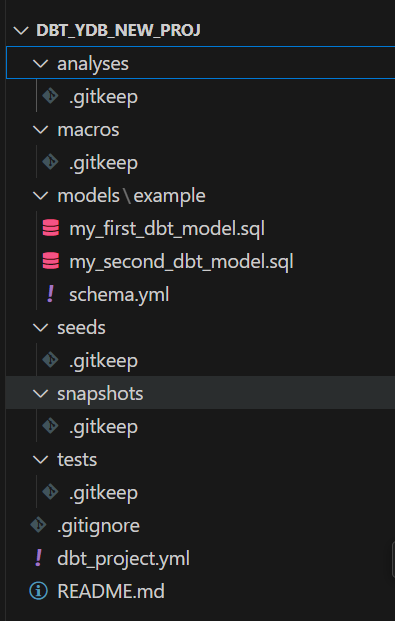

# Integration of {{ dbt }} with {{ ydb }}

## Introduction

[{{ dbt }}](https://www.getdbt.com) (data build tool) is a tool for data transformation in analytical data platforms, designed to organize data model development using software engineering practices. It covers the transformation (T) stage in ETL pipelines and enables structured modeling of data logic — from raw data to data marts — with support for testing, documentation, and [data lineage](https://en.wikipedia.org/wiki/Data_lineage), providing end-to-end traceability of data from source to final model.

Models in {{ dbt }} are defined uniformly as `SELECT` statements, simplifying their maintenance and composability. The tool handles their materialization in the target system and tracks dependencies between models, including the evolution of data across transformation stages.

To integrate {{ dbt }} with {{ ydb }}, the [{{ dbt-ydb }}](https://github.com/ydb-platform/dbt-ydb) connector is used. It enables connecting to {{ ydb }} as a target platform and supports model materialization as tables and views, incremental data processing, loading test datasets (seeds), as well as running data tests and generating documentation.

This section describes the connector's capabilities and provides steps to set up and start using it.



The {{ dbt-ydb }} connector is in the Preview stage and does not currently support all {{ dbt }} features. The sections below list the supported features and known limitations.



## Features

### Models and Their Materialization

A core concept in {{ dbt }} is a [data model](https://docs.getdbt.com/docs/build/sql-models). A model is essentially a SQL query that can reference any data source in your data warehouse, including other models. The {{ dbt-ydb }} connector supports the following approaches to materializing models in {{ ydb }}:

1. **View** — stored as a [{{ ydb }} view](../../concepts/datamodel/view.md).
2. **Table** — stored as a [table](../../concepts/datamodel/table.md) in {{ ydb }} and re-created by {{ dbt }} on each model update.

   The {{ dbt-ydb }} connector allows you to specify the following table parameters using [model configuration](https://docs.getdbt.com/reference/model-configs):

   | Parameter                           | Required | Default Value             | Description                                                                 |
   |-------------------------------------|----------|---------------------------|-----------------------------------------------------------------------------|
   | primary_key                         | Yes      |                           | [Primary key](../../dev/primary-key/index.md) of the table |
   | store_type                          | No       | `row`                       | Table type. `row` for [row-oriented table](../../concepts/datamodel/table.md#row-oriented-tables) or `column` for [column-oriented table](../../concepts/datamodel/table.md#column-oriented-tables) |
   | auto_partitioning_by_size           | No       |                           | [Automatic partitioning by size](../../concepts/datamodel/table.md#auto_partitioning_by_size) |
   | auto_partitioning_partition_size_mb | No       |                           | [Partition size threshold](../../concepts/datamodel/table.md#auto_partitioning_partition_size_mb) |
   | ttl                                 | No       |                           | [Time-To-Live](../../concepts/ttl.md) rule |

   Example of a model materialized as a table based on another model (using [ref](https://docs.getdbt.com/reference/dbt-jinja-functions/ref)).  
   Configured with a primary key, TTL, and automatic partitioning by size.

   ```text
   {{ config(
      primary_key='id, created_at',
      store_type='row',
      auto_partitioning_by_size='ENABLED',
      auto_partitioning_partition_size_mb=256,
      ttl='Interval("P30D") on created_at'
   ) }}

   select
      id,
      name,
      created_at
   from {{ ref('source_table') }}
   ```

3. [Incremental model](https://docs.getdbt.com/docs/build/incremental-models-overview) — created as a table inside {{ ydb }}, but instead of being recreated, it is updated with changed and new rows when refreshed by {{ dbt }}.

   The {{ dbt-ydb }} connector supports the same parameters as for table materialization, plus unique parameters for the incremental model:

   | Parameter             | Required | Default Value | Description                                                                 |
   |-----------------------|----------|---------------|-----------------------------------------------------------------------------|
   | incremental_strategy  | No       | `MERGE`         | [Incremental materialization strategy](https://docs.getdbt.com/docs/build/incremental-strategy). The `MERGE` strategy is supported, using the {{ ydb-short-name }} [`UPSERT`](../../yql/reference/syntax/upsert_into.md) operation. `APPEND` strategy support is under development. |



Another materialization type, [ephemeral model](https://docs.getdbt.com/docs/build/materializations#ephemeral), is not currently supported by the connector.



### Snapshots

The [snapshot](https://docs.getdbt.com/docs/build/snapshots) mechanism is not currently supported by {{ dbt-ydb }}.

### Seeds (CSV-based reference/test data)

The {{ dbt-ydb }} connector supports {{ dbt }} [seeds](https://docs.getdbt.com/docs/build/seeds) to upload reference and test data from CSV files into your project and use them in other models.

### Data Testing

{{ dbt-ydb }} supports standard [{{ dbt }} data tests](https://docs.getdbt.com/docs/build/data-tests#generic-data-tests), as well as [singular tests](https://docs.getdbt.com/docs/build/data-tests#singular-data-tests) within the capabilities of [YQL](../../yql/reference/index.md).

### Documentation Generation

{{ dbt-ydb }} supports generating [documentation](https://docs.getdbt.com/docs/build/documentation) from {{ dbt }} projects for {{ ydb }}.

## Getting Started

### Requirements

To start working with {{ dbt }} on {{ ydb }}, you will need:

- Python 3.10+;
- {{ dbt }} Core 1.8+;
- An existing {{ ydb-short-name }} cluster (a single-node installation from the [quickstart](../../quickstart.md) is sufficient).



{{ dbt }} Fusion 2.0 is not supported at this time.



### Installation

To install {{ dbt-ydb }}, run:

```bash
pip install dbt-ydb
```

### Connecting {{ dbt }} to a {{ ydb }} Cluster

{{ dbt }} connects to {{ ydb }} via the {{ dbt-ydb }} connector using the [standard way](../../concepts/connect.md) for {{ ydb }}. To connect successfully, specify the endpoint, database path, and authentication parameters in the {{ dbt }} [profiles](https://docs.getdbt.com/docs/core/connect-data-platform/connection-profiles) file.

Example profile file with possible authentication options and default values (in square brackets):

```yml
profile_name:
target: dev
outputs:
   dev:
      type: ydb
      host: [localhost] # YDB host
      port: [2136] # YDB port
      database: [/local] # YDB database
      schema: [<empty string>] # Optional subfolder for DBT models
      secure: [False] # If enabled, grpcs protocol will be used
      root_certificates_path: [<empty string>] # Optional path to root certificates file

      # Static Credentials
      username: [<empty string>]
      password: [<empty string>]

      # Access Token Credentials
      token: [<empty string>]

      # Service Account Credentials
      service_account_credentials_file: [<empty string>]
```

## Creating a Project from Scratch via {{ dbt }} init

1. Initialize a project:

   ```bash
   dbt init
   ```

2. Follow {{ dbt }}’s interactive prompts to select the {{ dbt-ydb }} connector and authentication settings for your {{ ydb }} cluster.

3. As a result, your project directory will be created along with a {{ dbt }} [profiles](https://docs.getdbt.com/docs/core/connect-data-platform/connection-profiles) file in your home directory, containing a new connection to {{ydb}}:

   ```bash
   ~/.dbt/profiles.yml
   ```

4. Run `dbt debug` to verify the connection:

   ```bash
   dbt debug
   ```

5. Inside your project directory, you will find the following structure:

   

6. Adapt the model `my_first_dbt_model`.

   Currently, {{ dbt }} does not support customizing the auto-generated example per connector. Therefore, to run this model with {{ dbt-ydb }}, you need to update it as follows:

   ```text
   /*
      Welcome to your first dbt model!
      Did you know that you can also configure models directly within SQL files?
      This will override configurations stated in dbt_project.yml

      Try changing "table" to "view" below
   */

   {{ config(materialized='table', primary_key='id') }}

   select *
   from (
      select 1 as id
      union all
      select null as id
   )
   ```

7. Now you can run your project:

   ```bash
   dbt run
   ```

## Running the Example Project

The {{ dbt-ydb }} connector comes with an [example](https://github.com/ydb-platform/dbt-ydb/tree/main/examples/jaffle_shop) you can use to quickly test dbt functionality with {{ ydb }}.

1. Clone the repository:

   ```bash
   git clone https://github.com/ydb-platform/dbt-ydb.git
   cd dbt-ydb/examples/jaffle_shop
   ```

2. Configure the connection profile in the `profiles.yml` file. For a single-node installation from the [quickstart](../../quickstart.md), the file should look like this:

   ```text
   profile_name:
      target: dev
      outputs:
         dev:
         type: ydb
         host: localhost # YDB host
         port: 2136 # YDB port
         database: /local # YDB database
         schema: jaffle_shop
   ```

3. Verify the connection:

   ```bash
   dbt debug
   ```

4. Load test data (via seeds):

   This command will load CSV files from `data/` into `raw_*` tables in {{ ydb }}.

   ```bash
   dbt seed
   ```

5. Run models:

   This will create tables and views based on the project’s example models.

   ```bash
   dbt run
   ```

6. Test model data:

   This will run standard data tests described in the example — such as checks for `null`, allowed values lists, and others.

   ```bash
   dbt test
   ```

7. Generate documentation and start a local web server to view it:

   The project documentation will be available in your browser at [http://localhost:8080](http://localhost:8080).

   ```bash
   dbt docs generate
   dbt docs serve --port 8080
   ```

## Next Steps

You can find the official {{ dbt }} documentation [here](https://docs.getdbt.com/docs).
Additionally, you can explore the connector’s source code and contribute to its development in the public [{{ dbt-ydb }}](https://github.com/ydb-platform/dbt-ydb) repository on GitHub.