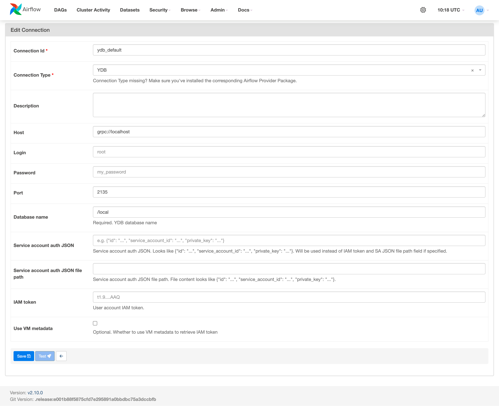
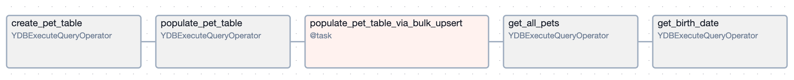

# {{ airflow-name }}

Integration of {{ ydb-short-name }} with [{{ airflow-name }}](https://airflow.apache.org) allows you to automate and manage complex workflows. {{ airflow-name }} provides features for scheduling tasks, monitoring their execution, and managing dependencies between them, such as orchestration. Using Airflow to orchestrate tasks such as uploading data to {{ ydb-short-name }}, executing queries, and managing transactions allows you to automate and optimize operational processes. This is especially important for ETL tasks, where large amounts of data require regular extraction, transformation, and loading.

{{ ydb-short-name }} [provider package](https://airflow.apache.org/docs/apache-airflow-providers) [apache-airflow-providers-ydb](https://pypi.org/project/apache-airflow-providers-ydb/) allows to work with {{ ydb-short-name }} from {{ airflow-name }}. [{{ airflow-name }} tasks](https://airflow.apache.org/docs/apache-airflow/stable/index.html) are Python applications consisting of a set of [{{ airflow-name }} operators](https://airflow.apache.org/docs/apache-airflow/stable/core-concepts/operators.html) and their [dependencies](https://airflow.apache.org/docs/apache-airflow/stable/core-concepts/dags.html), defining the order of execution.

## Setup {#setup}

Execute the following command on all {{ airflow-name }} hosts to install the `apache-airflow-providers-ydb` package:

```shell
pip install ydb apache-airflow-providers-ydb
```

Python version 3.8 or higher is required.

## Object model {#object_model}

The `airflow.providers.ydb` package contains a set of components for interacting with {{ ydb-full-name }}:

- Operator [`YDBExecuteQueryOperator`](#ydb_execute_query_operator) for integrating tasks into the {{ airflow-name }} scheduler.
- Hook [`YDBHook`](#ydb_hook) for direct interaction with {{ ydb-name }}.

### YDBExecuteQueryOperator {#ydb_execute_query_operator}

To make requests to {{ ydb-full-name }}, use the {{ airflow-name }} operator `YDBExecuteQueryOperator`.

#### Required arguments

- `task_id` — the name of the {{ airflow-name }} task.
- `sql` — the text of the SQL query to be executed in {{ ydb-full-name }}.

#### Optional arguments

- `ydb_conn_id` — the connection identifier with the `YDB` type, containing the connection parameters for {{ ydb-full-name }}. If omitted, a connection named [`ydb_default`](#ydb_default) is used. The `ydb_default` connection is preinstalled as part of {{ airflow-name }} and does not need to be configured separately.
- `is_ddl` — indicates that [SQL DDL](https://en.wikipedia.org/wiki/Data_definition_language) is running. If omitted or set to `False`, then [SQL DML](https://en.wikipedia.org/wiki/Data_Manipulation_Language) is running.
- `params` — a dictionary of [query parameters](https://airflow.apache.org/docs/apache-airflow/stable/core-concepts/params.html).

Example:

```python
ydb_operator = YDBExecuteQueryOperator(task_id="ydb_operator", sql="SELECT 'Hello, world!'")
```

In this example, a {{ airflow-name }} task is created with the ID `ydb_operator`, which executes the query `SELECT 'Hello, world!'`.


### YDBHook {#ydb_hook}

The {{ airflow-name }} class `YDBHook` is used to execute low-level commands in {{ ydb-full-name }}.

#### Optional arguments

- `ydb_conn_id` — the connection identifier with the `YDB` type, containing the connection parameters for {{ ydb-full-name }}. If omitted, a connection named [`ydb_default`](#ydb_default) is used. The `ydb_default` connection is preinstalled as part of {{ airflow-name }} and does not need to be configured separately.
- `is_ddl` — indicates that [SQL DDL](https://en.wikipedia.org/wiki/Data_definition_language) is running. If omitted or set to `False`, then [SQL DML](https://en.wikipedia.org/wiki/Data_Manipulation_Language) is running.

`YDBHook` supports the following methods:

- [`bulk_upsert`](#bulk_upsert)
- [`get_conn`](#get_conn)

#### bulk_upsert {#bulk_upsert}

Performs [batch data insertion](../../recipes/ydb-sdk/bulk-upsert.md) into {{ ydb-full-name }} tables.

#### Required arguments

- `table_name` — the name of the {{ ydb-full-name }} table where the data will be inserted.
- `rows` — an array of rows to insert.
- `column_types` — a description of column types.

Example:

```python
hook = YDBHook(ydb_conn_id=...)
column_types = (
        ydb.BulkUpsertColumns()
        .add_column("pet_id", ydb.OptionalType(ydb.PrimitiveType.Int32))
        .add_column("name", ydb.PrimitiveType.Utf8)
        .add_column("pet_type", ydb.PrimitiveType.Utf8)
        .add_column("birth_date", ydb.PrimitiveType.Utf8)
        .add_column("owner", ydb.PrimitiveType.Utf8)
    )

rows = [
    {"pet_id": 3, "name": "Lester", "pet_type": "Hamster", "birth_date": "2020-06-23", "owner": "Lily"},
    {"pet_id": 4, "name": "Quincy", "pet_type": "Parrot", "birth_date": "2013-08-11", "owner": "Anne"},
]
hook.bulk_upsert("pet", rows=rows, column_types=column_types)
```

In this example, a `YDBHook` object is created, through which the `bulk_upsert` batch data insertion operation is performed.

#### get_conn {#get_conn}

Returns the `YDBConnection` object, which implements the [`DbApiConnection` interface](https://pypi.python.org/pep-0249/#connection-objects) for working with data. The `DbApiConnection` class provides a standardized interface for interacting with the database, allowing operations such as establishing connections, executing SQL queries, and managing transactions, regardless of the specific database management system.

Example:

```python
hook = YDBHook(ydb_conn_id=...)

# Execute the SQL query and get the cursor
connection = hook.get_conn()
cursor = connection.cursor()
cursor.execute("SELECT * from pet;")

# Extract the result and column names
result = cursor.fetchall()
columns = [desc[0] for desc in cursor.description]

# Close cursor and connection
cursor.close()
connection.close()
```

In this example, a `YDBHook` object is created, and a `YDBConnection` object is requested from the created object. This connection is then used to read data and retrieve a list of columns.

## Connection to {{ ydb-full-name }} {#ydb_default}

To connect to {{ ydb-full-name }}, you must create a new or edit an existing [{{ airflow-name }} connection](https://airflow.apache.org/docs/apache-airflow/stable/howto/connection.html) with the `YDB` type.



Where:

- `Connection Id` — the {{ airflow-name }} connection identifier.
- `Host` — the protocol and cluster address of {{ ydb-full-name }}.
- `Port` — the port of {{ ydb-full-name }}.
- `Database name` — the name of the {{ ydb-full-name }} database.

Specify the details for one of the following authentication methods on the {{ ydb-full-name }} cluster:

- `Login` and `Password` — specify user credentials for using [static credentials](../../security/authentication.md#static-credentials).
- `Service account auth JSON` — specify the value of the [`Service Account Key`](../../security/authentication.md#iam).
- `Service account auth JSON file path` — specify the path to the `Service Account Key` file.
- `IAM token` — specify the [IAM token](../../security/authentication.md#iam).
- `Use VM metadata` — enable this option to use [virtual machine metadata](../../security/authentication.md#iam).

## Matching between YQL and Python types

Below are the rules for converting YQL types to Python results. Types not listed below are not supported.

### Scalar types {#scalars-types}

| YQL type | Python type | Example in Python |
| --- | --- | --- |
| `Int8`, `Int16`, `Int32`, `Uint8`, `Uint16`, `Uint32`, `Int64`, `Uint64` | `int` | `647713` |
| `Bool` | `bool` | `True` |
| `Float`, `float` | `float`<br/>NaN and Inf are represented as `None` | `7.88731023`<br/>`None` |
| `Decimal` | `Decimal` | `45.23410083` |
| `Utf8` | `str` | `"Text of string"` |
| `String` | `str` | `"Text of string"` |

### Complex types {#complex-types}

| YQL type | Python type | Example in Python |
| --- | --- | --- |
| `Json`, `JsonDocument` | `str` (the entire node is inserted as a string) | `{"a":[1,2,3]}` |
| `Date` | `datetime.date` | `2022-02-09` |
| `Datetime`, `Timestamp` | `datetime.datetime` | `2022-02-09 10:13:11` |

### Optional types {#optional-types}

| YQL type | Python type | Example in Python |
| --- | --- | --- |
| `Optional` | Original type or `None` | `1` |

### Containers {#containers}

| YQL type | Python type | Example in Python |
| --- | --- | --- |
| `List<Type>` | `list` | `[1,2,3,4]` |
| `Dict<KeyType, ValueType>` | `dict` | `{"key1": "value1", "key2": "value2"}` |
| `Set<KeyType>` | `set` | `{"key_value1", "key_value2"}` |
| `Tuple<Type1, Type2>` | `tuple` | `(element1, element2)` |
| `Struct<Name:Utf8, Age:Int32>` | `dict` | `{"Name": "value1", "Age": value2}` |

### Special types {#special-types}

| YQL type | Python type |
| --- | --- |
| `Void`, `Null` | `None` |
| `EmptyList` | `[]` |
| `EmptyDict` | `{}` |

## Example {#example}

To make requests to {{ ydb-full-name }}, the package provides the {{ airflow-name }} operator [`YDBExecuteQueryOperator`](https://airflow.apache.org/docs/apache-airflow-providers-ydb/stable/_api/airflow/providers/ydb/operators/ydb/index.html) and hook [`YDBHook`](https://airflow.apache.org/docs/apache-airflow-providers-ydb/stable/_api/airflow/providers/ydb/hooks/ydb/index.html).

In the example below, a `create_pet_table` task is launched to create a table in {{ ydb-full-name }}. After the table is successfully created, the `populate_pet_table` task runs to populate the table with data using `UPSERT` commands. Additionally, the `populate_pet_table_via_bulk_upsert` task fills the table using [`bulk_upsert`](../../recipes/ydb-sdk/bulk-upsert.md). After data insertion, a read operation is performed using the `get_all_pets` task and the `get_birth_date` task for parameterized data reading.



To execute queries in {{ ydb-short-name }}, a pre-created connection of type [YDB Connection](https://airflow.apache.org/docs/apache-airflow-providers-ydb/stable/connections/ydb.html) named `test_ydb_connection` is used.

```python
from __future__ import annotations

import datetime

import ydb
from airflow import DAG
from airflow.decorators import task
from airflow.providers.ydb.hooks.ydb import YDBHook
from airflow.providers.ydb.operators.ydb import YDBExecuteQueryOperator

@task
def populate_pet_table_via_bulk_upsert():
    hook = YDBHook(ydb_conn_id="test_ydb_connection")
    column_types = (
        ydb.BulkUpsertColumns()
        .add_column("pet_id", ydb.OptionalType(ydb.PrimitiveType.Int32))
        .add_column("name", ydb.PrimitiveType.Utf8)
        .add_column("pet_type", ydb.PrimitiveType.Utf8)
        .add_column("birth_date", ydb.PrimitiveType.Utf8)
        .add_column("owner", ydb.PrimitiveType.Utf8)
    )

    rows = [
        {"pet_id": 3, "name": "Lester", "pet_type": "Hamster", "birth_date": "2020-06-23", "owner": "Lily"},
        {"pet_id": 4, "name": "Quincy", "pet_type": "Parrot", "birth_date": "2013-08-11", "owner": "Anne"},
    ]
    hook.bulk_upsert("pet", rows=rows, column_types=column_types)


with DAG(
    dag_id="ydb_demo_dag",
    start_date=datetime.datetime(2020, 2, 2),
    schedule="@once",
    catchup=False,
) as dag:
    create_pet_table = YDBExecuteQueryOperator(
        task_id="create_pet_table",
        sql="""
            CREATE TABLE pet (
            pet_id INT,
            name TEXT NOT NULL,
            pet_type TEXT NOT NULL,
            birth_date TEXT NOT NULL,
            owner TEXT NOT NULL,
            PRIMARY KEY (pet_id)
            );
          """,
        is_ddl=True,  # must be specified for DDL queries
        ydb_conn_id="test_ydb_connection"
    )

    populate_pet_table = YDBExecuteQueryOperator(
        task_id="populate_pet_table",
        sql="""
              UPSERT INTO pet (pet_id, name, pet_type, birth_date, owner)
              VALUES (1, 'Max', 'Dog', '2018-07-05', 'Jane');

              UPSERT INTO pet (pet_id, name, pet_type, birth_date, owner)
              VALUES (2, 'Susie', 'Cat', '2019-05-01', 'Phil');
            """,
        ydb_conn_id="test_ydb_connection"
    )

    get_all_pets = YDBExecuteQueryOperator(task_id="get_all_pets", sql="SELECT * FROM pet;", ydb_conn_id="test_ydb_connection")

    get_birth_date = YDBExecuteQueryOperator(
        task_id="get_birth_date",
        sql="SELECT * FROM pet WHERE birth_date BETWEEN 'not_var{{params.begin_date}}' AND 'not_var{{params.end_date}}'",
        params={"begin_date": "2020-01-01", "end_date": "2020-12-31"},
        ydb_conn_id="test_ydb_connection"
    )

    (
        create_pet_table
        >> populate_pet_table
        >> populate_pet_table_via_bulk_upsert()
        >> get_all_pets
        >> get_birth_date
    )
```
