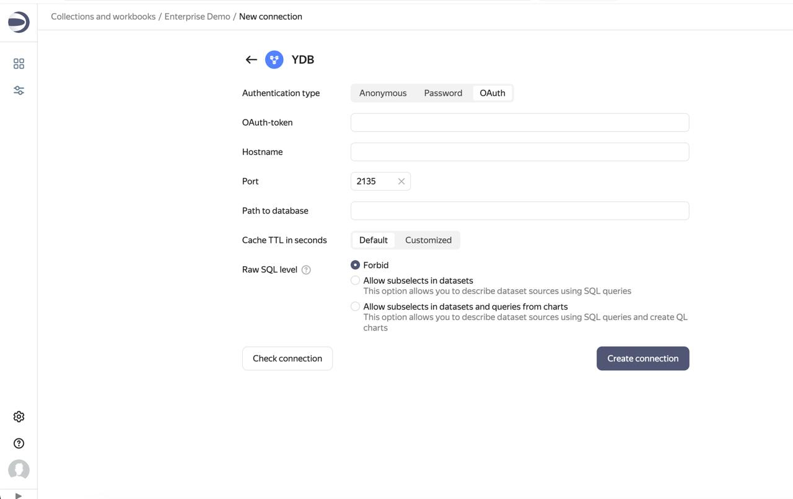

# DataLens

[DataLens](https://datalens.tech) is an open-source business intelligence (BI) and data visualization tool that enables users to analyze and display data from various sources, including {{ ydb-short-name }}. DataLens allows you to describe data models, create charts and other visualizations, build dashboards, and provide collaborative access to analytics.

## Prerequisites

DataLens must be [deployed and configured](https://datalens.tech/docs/en/quickstart.html).



This article covers the integration of self-managed {{ ydb-short-name }} and DataLens. For documentation on integrating the respective managed services, refer to the [Yandex Cloud documentation](https://yandex.cloud/en/docs/datalens/operations/connection/create-ydb).



## Adding a database connection to {{ ydb-short-name }} {#add-database-connection}

To create a connection to {{ ydb-short-name }}:

1. Go to the [workbook](https://datalens.tech/docs/en/workbooks-collections/index.html) page or create a new one.
2. In the top right corner, click **Create** → **Connection**.
3. Select the **{{ ydb-short-name }}** connection.
4. Choose an authentication type:

   

   - Anonymous {#anonymous}

     * **Host name**. Specify the hostname for {{ ydb-short-name }} connection.
     * **Port**. Specify the connection port for {{ ydb-short-name }}. The default port is 2135.
     * **Database path**. Specify the name of the database to connect to.

   - Password {#password}

     * **Host name**. Specify the hostname for {{ ydb-short-name }} connection.
     * **Port**. Specify the connection port for {{ ydb-short-name }}. The default port is 2135.
     * **Database path**. Specify the name of the database to connect to.
     * **Username**. Enter the username to connect to {{ ydb-short-name }}.
     * **Password**. Enter the user password.

   - OAuth {#oauth}

     * **OAuth token**. Provide the OAuth token to access {{ ydb-short-name }}.
     * **Host name**. Specify the hostname for {{ ydb-short-name }} connection.
     * **Port**. Specify the connection port for {{ ydb-short-name }}. The default port is 2135.
     * **Database path**. Specify the name of the database to connect to.

   

   * **Cache lifetime in seconds**. Set the cache lifetime or leave the default value. The recommended value is 300 seconds (5 minutes).
   * **SQL query access level**. Allows the use of custom SQL queries to create a dataset.

5. Click **Create connection**.
6. Specify a connection name and click **Create**.
7. Proceed to [creating a dataset](https://datalens.tech/docs/en/dataset/index.html).

## Example

