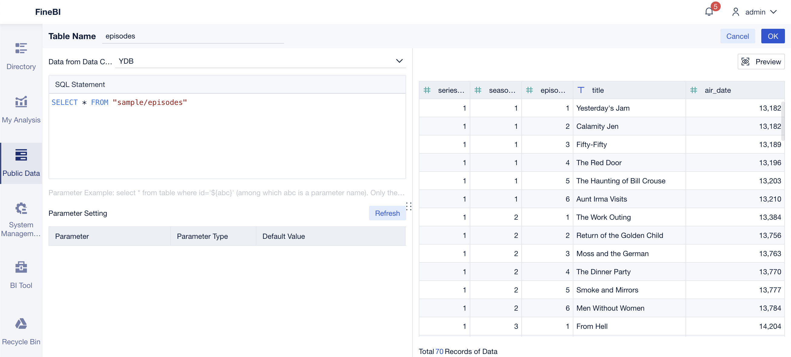
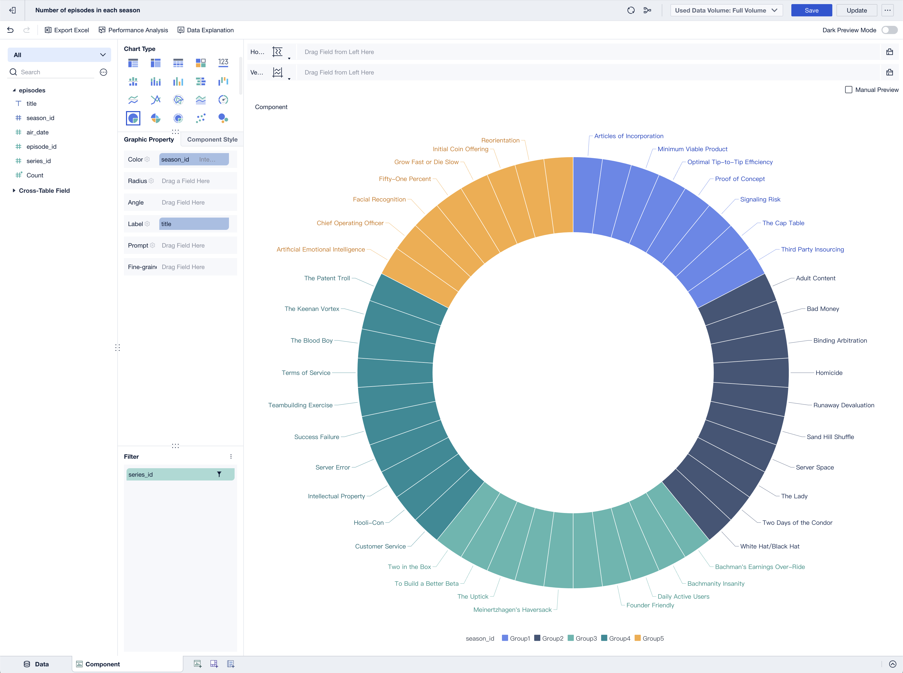

# FineBI

FineBI is a powerful big data analytics tool. FineBI allows organizations to analyze and share data for informed decision-making. It helps transform raw data into insightful visualizations, track KPIs, identify trends, and predict future outcomes.

[PostgreSQL compatibility mode in {{ ydb-short-name }}](../../postgresql/intro.md) enables the use of [FineBI](https://intl.finebi.com/) to query and visualize data from {{ ydb-short-name }}. In this case FineBI works with {{ ydb-short-name }} just like with PostgreSQL.



## Prerequisites

Before you begin, make sure that the following software is installed:

* [FineBI](https://intl.finebi.com/).
* PostgreSQL JDBC driver uploaded to FineBI.

    

    You can download the latest PostgreSQL JDBC driver from the [Download page](https://jdbc.postgresql.org/download/) of the PostgreSQL web site. For information on how to upload the PostgreSQL JDBC driver to FineBI, refer to the [FineBI documentation](https://help.fanruan.com/finebi-en/doc-view-1540.html).

    


## Adding a database connection to {{ ydb-short-name }} {#add-database-connection}

To connect to {{ ydb-short-name }} from FineBI using the PostgreSQL wire protocol, follow these steps:

1. Log in to FineBI as the `admin` user.

1. Navigate to **System Management** > **Data Connection** > **Data Connection Management**.

1. Click the **New Data Connection** button.

1. In the **Search** field, type `postgresql` to find the PostgreSQL icon.

1. Click the PostgreSQL icon.

1. Enter the {{ ydb-short-name }} credentials in the corresponding fields:

    * **Data Connection Name**. The {{ ydb-short-name }} connection name in FineBI.

    * **Driver**. The driver that FineBI uses to connect to {{ ydb-short-name }}.

        Select `Custom` and the installed JDBC driver `org.postgresql.Driver`.

    * **Database Name**. The path to the [database](../../concepts/glossary.md#database) in the {{ ydb-short-name }} cluster where queries will be executed.

        

        Special characters in the path string must be [URL encoded](https://en.wikipedia.org/wiki/Percent-encoding). For example, ensure that you replace slash (`/`) characters with `%2F`.

        

    * **Host**. The [endpoint](https://ydb.tech/docs/en/concepts/connect#endpoint) of the {{ ydb-short-name }} cluster to which the connection will be made.

    * **Port**. The port of the {{ ydb-short-name }} endpoint.

    * **Username**. The login for connecting to the {{ ydb-short-name }} database.

    * **Password**. The password for connecting to the {{ ydb-short-name }} database.

    

1. Click **Test Connection**.

    If the connection details are correct, a message confirming a successful connection will appear.

1. To save the database connection, click **Save**.

    A new database connection will appear in the **Data Connection** list.

## Adding an SQL Dataset {#add-dataset}

To create a dataset for a {{ ydb-short-name }} table, follow these steps:

1. In FineBI, open the **Public Data** tab.

1. Select a folder, to which you want to add a dataset.

    

    You must have the [Public Data Management](https://help.fanruan.com/finebi-en/doc-view-5734.html) permission for the selected folder in FineBI.

    

1. Click **Add Dataset** and select **SQL Dataset** from the drop-down list.

1. In the **Table Name** field, enter a name for the dataset.

1. In the **Data from Data Connection** drop-down list, select the {{ ydb-short-name }} connection you created.

1. In the **SQL Statement** field, enter the SQL query to retrieve the necessary columns from a {{ ydb-short-name }} table. For example, `SELECT * FROM <ydb_table_name>` for all columns.

    

    To create a dataset for a table located in a subdirectory of a {{ ydb-short-name }} database, specify the table path in the table name. For example:

    ```sql
    SELECT * FROM "<path/to/subdirectory/table_name>";
    ```

    

1. To test the SQL query, click **Preview**. If the query is correct, the table data will appear in the preview pane.

    

1. To save the dataset, click **OK**.

After creating datasets, you can use data from {{ ydb-short-name }} to create charts in FineBI. For more information, refer to the [FineBI](https://help.fanruan.com/finebi-en/) documentation.

## Creating a chart {#create-chart}

Let's create a sample chart using the dataset from the `episodes` table, as described in the [YQL tutorial](../../dev/yql-tutorial/index.md). Among other things, this tutorial covers how to [create](../../dev/yql-tutorial/create_demo_tables.md) this table and [populate it with data](../../dev/yql-tutorial/fill_tables_with_data.md). It will be a pie chart that demonstrates how many episodes each season of a given series contains.

The table contains the following columns:

* `series_id`
* `season_id`
* `episode_id`
* `title`
* `air_date`

To create a chart, follow these steps:

1. In FineBI, open the **My Analysis** tab.

1. Click **New Subject**.

    The **Select Data** dialog box will appear.

1. In the **Select Data** dialog box, navigate to the dataset for the `episodes` table and click **OK**.

1. Click the **Component** tab at the bottom of the page.

1. In the **Chart Type** pane, click the **Pie Chart** icon.

1. In the list of columns in the `episodes` dataset, click the arrow next to the `episode_id` column and select **Convert to Dimension** from the drop-down list.

    

1. Drag the `season_id` column to the **Color** field.

1. Drag the `title` column to the **Label** field.

1. Drag the `series_id` column to the **Filter** field.

    The **Add Filter to episodes.series_id** dialog box will appear.

1. In the **Add Filter to episodes.series_id** dialog box, select `Detailed Value` and click **Next Step**.

1. Specify the following condition:

    `series_id` `Equal To` `Fixed Value` `2`

1. Click **OK**.

    The diagram will display data only for the series that has the ID of `2`.

    

1. Click **Save**.