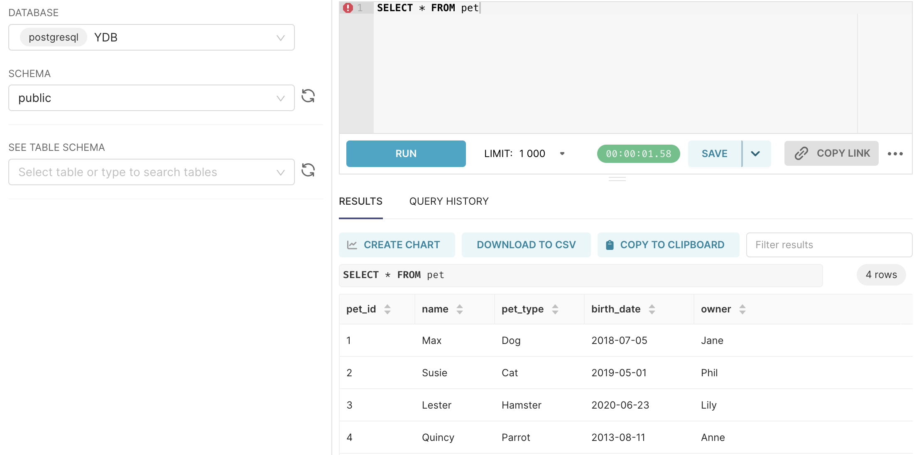
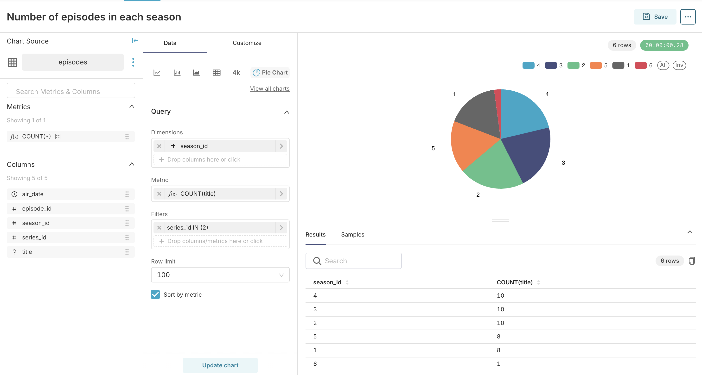

# Apache Superset

[Apache Superset](https://superset.apache.org/) is a modern data exploration and visualization platform. This article explains how to create visualizations using data stored in {{ ydb-short-name }}.

## Installation of dependencies {#prerequisites}

To connect to {{ ydb-short-name }} from Superset, install the [ydb-sqlalchemy](https://pypi.org/project/ydb-sqlalchemy) driver.

The installation method depends on your Superset setup. For detailed instructions, see the [official documentation](https://superset.apache.org/docs/configuration/databases/#installing-drivers-in-docker-images).

## Adding a database connection to {{ ydb-short-name }} {#add-database-connection}

There are two ways to connect to {{ ydb-short-name }}:

1. Native connection using the SQLAlchemy driver (starting from version 5.0.0)
1. Connect using the PostgreSQL wire protocol

It is recommended to use a native connection whenever possible.

### Native connection using SQLAlchemy driver

To connect to {{ ydb-short-name }} from Apache Superset **version 5.0.0 and higher**, follow these steps:

1. In the Apache Superset toolbar, hover over **Settings** and select **Database Connections**.
1. Click the **+ DATABASE** button.

    The **Connect a database** wizard will appear.

1. In **Step 1** of the wizard, choose **YDB** from the **Supported databases** list. If the **YDB** option is not available, make sure that all the steps from [prerequisites](#prerequisites) are completed.
1. In **Step 2** of the wizard, enter the {{ ydb-short-name }} credentials in the corresponding fields:

    * **Display Name**. The {{ ydb-short-name }} connection name in Apache Superset.
    * **SQLAlchemy URI**. A string in the format `ydb://{host}:{port}/{database_name}`, where **host** and **port** are parts of the [endpoint](../../concepts/connect.md#endpoint) of the {{ ydb-short-name }} cluster to which the connection will be made, and **database_name** is the path to the [database](../../concepts/glossary.md#database).

    

1. To enhance security, you can specify credentials parameters in the **Secure Extra** field under the **Advanced / Security** tab.

    Define the parameters as follows:

    

    - Password {#static-credentials}

        ```json
        {
            "credentials": {
                "username": "...",
                "password": "..."
            }
        }
        ```

    - Access Token {#access-token-credentials}

        ```json
        {
            "credentials": {
                "token": "...",
            }
        }
        ```


    - Service Account {#service-account-credentials}

        ```json
        {
            "credentials": {
                "service_account_json": {
                    "id": "...",
                    "service_account_id": "...",
                    "created_at": "...",
                    "key_algorithm": "...",
                    "public_key": "...",
                    "private_key": "..."
                }
            }
        }
        ```

    

1. Click **CONNECT**.

1. To save the database connection, click **FINISH**.

For more information about configuring a {{ ydb-short-name }} connection, refer to the [{{ ydb-short-name }} section in the official documentation](https://superset.apache.org/docs/configuration/databases#ydb).

### Connect using the PostgreSQL wire protocol

To connect to {{ ydb-short-name }} from Apache Superset using the PostgreSQL wire protocol, follow these steps:

1. In the Apache Superset toolbar, hover over **Settings** and select **Database Connections**.
1. Click the **+ DATABASE** button.

     The **Connect a database** wizard will appear.

1. In **Step 1** of the wizard, click the **PostgreSQL** button.
1. In **Step 2** of the wizard, enter the {{ ydb-short-name }} credentials in the corresponding fields:

    * **HOST**. The [endpoint](../../concepts/connect.md#endpoint) of the {{ ydb-short-name }} cluster to connect to.
    * **PORT**. The port of the {{ ydb-short-name }} endpoint.
    * **DATABASE NAME**. The path to the [database](../../concepts/glossary.md#database) in the {{ ydb-short-name }} cluster where queries will be executed.
    * **USERNAME**. The login for connecting to the {{ ydb-short-name }} database.
    * **PASSWORD**. The password for connecting to the {{ ydb-short-name }} database.
    * **DISPLAY NAME**. The {{ ydb-short-name }} connection name in Apache Superset.

    

1. Click **CONNECT**.

1. To save the database connection, click **FINISH**.

## Creating a dataset {#create-dataset}

To create a dataset for a {{ ydb-short-name }} table, follow these steps:

1. In the Apache Superset toolbar, hover over the **+** button and select **SQL query**.
1. In the **DATABASE** drop-down list, select the {{ ydb-short-name }} database connection.

1. Enter the SQL query in the right section of the page. For example, `SELECT * FROM <ydb_table_name>`.

    

    To create a dataset for a table located in a subdirectory of a {{ ydb-short-name }} database, specify the table path in the table name. For example:

    ```yql
    SELECT * FROM "<path/to/subdirectory/table_name>";
    ```

  

1. Click **RUN** to test the SQL query.

    

1. Click the down arrow next to the **SAVE** button, then click **Save dataset**.

    The **Save or Overwrite Dataset** dialog box appears.

1. In the **Save or Overwrite Dataset** dialog box, select **Save as new**, enter the dataset name, and click **SAVE & EXPLORE**.

After creating datasets, you can use data from {{ ydb-short-name }} to create charts in Apache Superset. For more information, refer to the [Apache Superset](https://superset.apache.org/docs/intro/) documentation.

## Creating a chart {#create-chart}

Let's create a sample chart with the dataset from the `episodes` table that is described in the [YQL tutorial](../../dev/yql-tutorial/index.md).

The table contains the following columns:

* series_id
* season_id
* episode_id
* title
* air_date

Let's say that we want to make a pie chart to show how many episodes each season contains.

To create a chart, follow these steps:

1. In the Apache Superset toolbar, hover over the **+** button and select **Chart**.
1. In the **Choose a dataset** drop-down list, select a dataset for the `episodes` table.
1. In the **Choose chart type** pane, select `Pie chart`.
1. Click **CREATE NEW CHART**.
1. In the **Query** pane, configure the chart:

    * In the **DIMENSIONS** drop-down list, select the `season_id` column.
    * In the **METRIC** field, specify the `COUNT(title)` function.
    * In the **FILTERS** field, specify the `series_id in (2)` filter.

1. Click **CREATE CHART**.

    The pie chart will appear in the preview pane on the right.

    

1. Click **SAVE**.

    The **Save chart** dialog box will appear.

1. In the **Save chart** dialog box, in the **CHART NAME** field, enter the chart name.
1. Click **SAVE**.
