# Blob Depot

Blob depot extends the functionality of the storage subsystem by adding virtual group functionality.

A virtual group, like a physical group, is a fault tolerance unit of the storage subsystem in the cluster. However, a virtual group stores its data in other groups (unlike a physical group, which stores data on VDisks).

This method of data storage allows for more flexible use of the {{ ydb-short-name }} storage subsystem, in particular:

* Using more "heavy" tablets in conditions where the size of one physical group is limited.
* Providing tablets with a wider write bandwidth by balancing writes across all groups on which the blob depot is running.
* Ensuring transparent data migration between different groups for client tablets.

Blob depot can also be used for group decommissioning, that is, to remove a VDisk within a physical group while preserving all data that was written to this group. In this usage scenario, data from the physical group is transparently transferred to the virtual group for the client, then all VDisks of the physical group are removed to free up the resources they occupy.

## Virtual Group Mode

In virtual group mode, blob depot allows combining several groups into a single space for storing large amounts of data. Load balancing by occupied space is provided, as well as increased throughput by distributing writes across different groups. Background (completely transparent to the client) data transfer is also possible.

Virtual groups are also created within Storage Pools, like physical groups, but for virtual groups it is recommended to create a separate pool with the command `dstool pool create virtual`. These pools can be specified in Hive for creating other tablets. However, to avoid latency degradation, channels 0 and 1 of tablets are recommended to be placed on physical groups, and only data channels should be placed on virtual groups with blob depot.

### How to Launch {#vg-create-params}

A virtual group is created through BS_CONTROLLER by passing a special command. The virtual group creation command is idempotent, so to avoid creating extra blob depots, each virtual group is assigned a name. The name must be unique within the entire cluster. In case of repeated command execution, an error will be returned with the `Already: true` field filled and indicating the number of the previously created virtual group.

```bash
dstool -e ... --direct group virtual create --name vg1 vg2 --hive-id=72057594037968897 --storage-pool-name=/Root:virtual --log-channel-sp=/Root:ssd --data-channel-sp=/Root:ssd*8
```

Command line parameters:

* `--name` — unique name for the virtual group (or several virtual groups with similar parameters)
* `--hive-id=N` — number of the Hive tablet that will manage this blob depot; you must specify the Hive of the tenant within which the blob depot is launched
* `--storage-pool-name=POOL_NAME` — name of the Storage Pool within which the blob depot needs to be created
* `--storage-pool-id=BOX:POOL` — alternative to `--storage-pool-name`, where you can specify an explicit numeric pool identifier
* `--log-channel-sp=POOL_NAME` — name of the pool where channel 0 of the blob depot tablet will be placed
* `--snapshot-channel-sp=POOL_NAME` — name of the pool where channel 0 of the blob depot tablet will be placed; if not specified, the value from --log-channel-sp is used
* `--data-channel-sp=POOL_NAME[*COUNT]` — name of the pool where data channels are placed; if the COUNT parameter is specified (after the asterisk), COUNT data channels are created in the specified pool; it is recommended to create a large number of data channels for blob depot in virtual group mode (64..250) to most efficiently use storage
* `--wait wait` — for blob depot creation to complete; if this option is not specified, the command terminates immediately after responding to the blob depot creation request, without waiting for the creation and launch of the tablets themselves

### How to Check that the Virtual Group is Running {#vg-check-running}

You can view the result of virtual group creation in the following ways:

* via the BS_CONTROLLER monitoring page
* via the `dstool group list --virtual-groups-only` command

In both cases, creation should be controlled through the `VirtualGroupName` field, which should match what was passed in the `--name` parameter. If the `dstool group virtual create` command completed successfully, the virtual group unconditionally appears in the group list, but the `VirtualGroupState` field can take one of the following values:

* `NEW` — group is waiting for initialization (tablet creation through Hive, its configuration and launch is in progress)
* `WORKING` — group is created and working, ready to execute user requests
* `CREATE_FAILED` — an error occurred during group creation, the text description of which can be seen in the ErrorReason field

```bash
$ dstool --cluster=$CLUSTER --direct group list --virtual-groups-only
┌────────────┬──────────────┬───────────────┬────────────┬────────────────┬─────────────────┬──────────────┬───────────────────┬──────────────────┬───────────────────┬─────────────┬────────────────┐
│ GroupId    │ BoxId:PoolId │ PoolName      │ Generation │ ErasureSpecies │ OperatingStatus │ VDisks_TOTAL │ VirtualGroupState │ VirtualGroupName │ BlobDepotId       │ ErrorReason │ DecommitStatus │
├────────────┼──────────────┼───────────────┼────────────┼────────────────┼─────────────────┼──────────────┼───────────────────┼──────────────────┼───────────────────┼─────────────┼────────────────┤
│ 4261412864 │ [1:2]        │ /Root:virtual │ 0          │ none           │ DISINTEGRATED   │ 0            │ WORKING           │ vg1              │ 72075186224037888 │             │ NONE           │
│ 4261412865 │ [1:2]        │ /Root:virtual │ 0          │ none           │ DISINTEGRATED   │ 0            │ WORKING           │ vg2              │ 72075186224037890 │             │ NONE           │
│ 4261412866 │ [1:2]        │ /Root:virtual │ 0          │ none           │ DISINTEGRATED   │ 0            │ WORKING           │ vg3              │ 72075186224037889 │             │ NONE           │
│ 4261412867 │ [1:2]        │ /Root:virtual │ 0          │ none           │ DISINTEGRATED   │ 0            │ WORKING           │ vg4              │ 72075186224037891 │             │ NONE           │
└────────────┴──────────────┴───────────────┴────────────┴────────────────┴─────────────────┴──────────────┴───────────────────┴──────────────────┴───────────────────┴─────────────┴────────────────┘
```

## Architecture

Blob depot is a tablet that, in addition to two system channels (0 and 1), also contains a set of additional channels where the actual data written to the storage. Client data is written to these additional channels.

Blob depot as a tablet can be launched on any cluster node.

When blob depot operates in virtual group mode, agents (BlobDepotAgent) are used to access it. These are actors that perform functions similar to DS proxy — they are launched on each node that uses a virtual group with blob depot. These same actors convert storage requests into commands for blob depot and provide data exchange with it.

## Diagnostic Mechanisms

The following mechanisms are provided for diagnosing blob depot operability:

* [BS_CONTROLLER monitoring page](#diag-bscontroller)
* [blob depot monitoring page](#diag-blobdepot)
* [internal viewer](#diag-viewer)
* [event log](#diag-log)
* [charts](#diag-sensors)

### BS_CONTROLLER Monitoring Page {#diag-bscontroller}

On the BS_CONTROLLER monitoring page there is a special Virtual groups tab, which shows all groups that use blob depot:

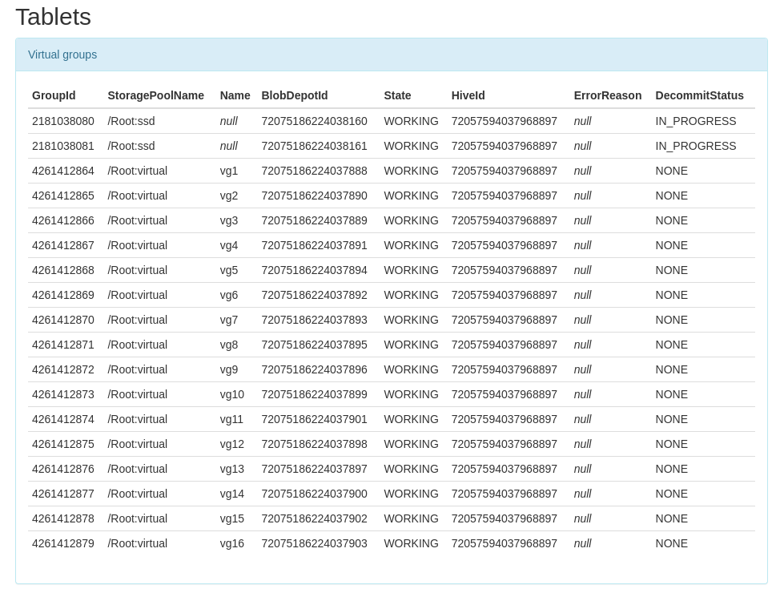

The table provides the following columns:

Field | Description
---- | --------
GroupId | Group number.
StoragePoolName | Name of the pool where the group is located.
Name | Virtual group name; it is unique for the entire cluster. For decommissioned groups this will be null.
BlobDepotId | Number of the blob depot tablet responsible for serving this group.
State | [Blob depot state](#vg-check-running); can be NEW, WORKING, CREATED_FAILED.
HiveId | Number of the Hive tablet within which the specified blob depot was created.
ErrorReason | For CREATE_FAILED state contains a text description of the creation error reason.
DecommitStatus | [Group decommission state](blobdepot_decommit.md#decommit-check-running); can be NONE, PENDING, IN_PROGRESS, DONE.

### Blob Depot Monitoring Page {#diag-blobdepot}

The blob depot monitoring page presents the main tablet operation parameters, which are grouped by tabs available via the "Contained data" link:

* [data](#mon-data)
* [refcount](#mon-refcount)
* [trash](#mon-trash)
* [barriers](#mon-barriers)
* [blocks](#mon-blocks)
* [storage](#mon-storage)

In addition, the main page provides brief information about the blob depot state:

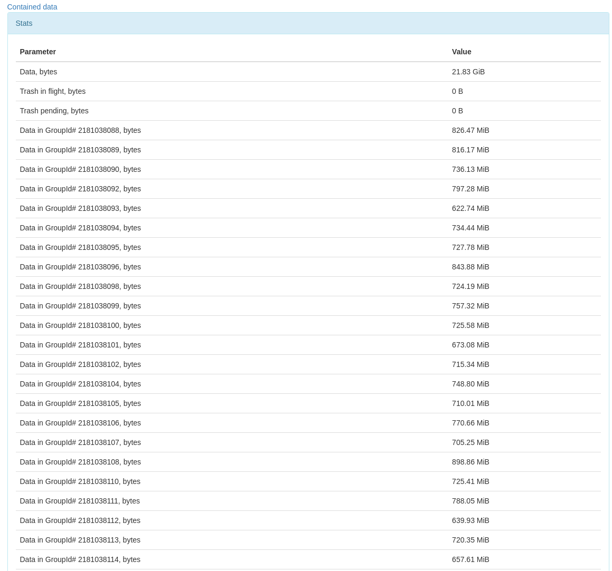

This table provides the following data:

* Data, bytes — amount of saved data bytes ([TotalStoredDataSize](#diag-sensors)).
* Trash in flight, bytes — amount of bytes of unnecessary data waiting for transactions to complete to become garbage ([InFlightTrashSize](#diag-sensors)).
* Trash pending, bytes — amount of garbage bytes that have not yet been passed to garbage collection ([TotalStoredTrashSize](#diag-sensors)).
* Data in GroupId# XXX, bytes — amount of data bytes in group XXX (both useful data and not yet collected garbage).

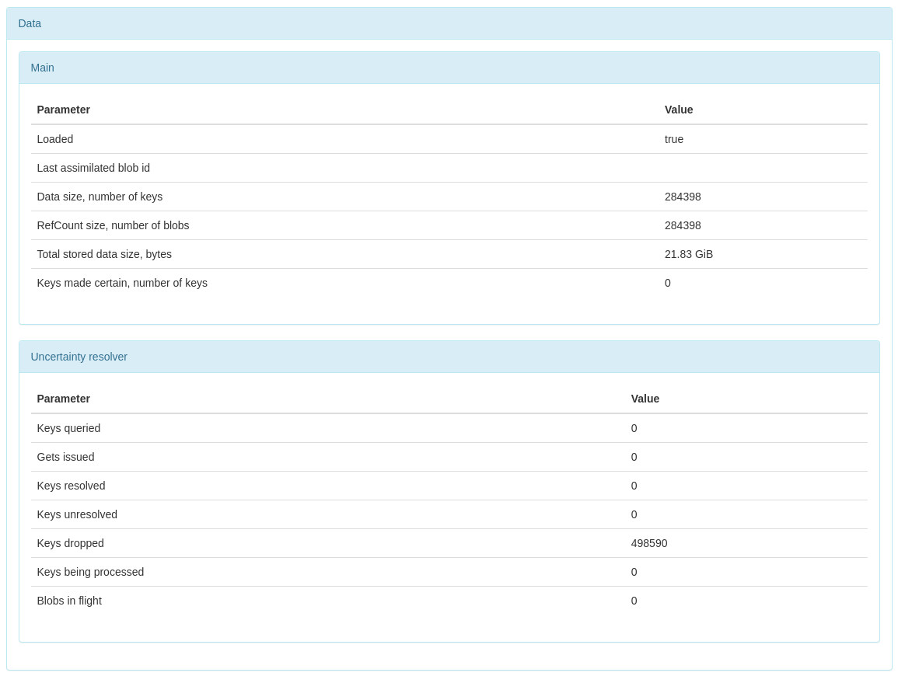

Parameter purposes are as follows:

* Loaded — boolean value showing whether all metadata from the tablet's local database is loaded into memory.
* Last assimilated blob id — BlobId of the last read blob (metadata copying during decommission).
* Data size, number of keys — number of saved data keys.
* RefCount size, number of blobs — number of unique data blobs that the blob depot stores in its namespace.
* Total stored data size, bytes — similar to "Data, bytes" from the table above.
* Keys made certain, number of keys — number of unwritten keys that were then confirmed by reading.

The "Uncertainty resolver" section relates to the component that works with data written but not confirmed to the blob depot.

#### data {#mon-data}

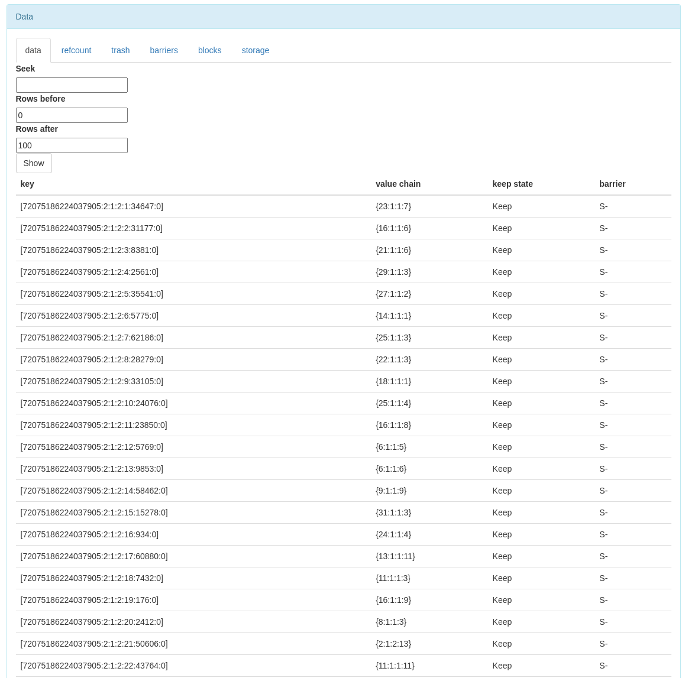

The data table contains the following columns:

* key — key identifier (BlobId in the client namespace)
* value chain — key value formed by concatenating blob fragments from the blob depot namespace (this field lists these blobs)
* keep state — keep flag values for this blob from the client's perspective (Default, Keep, DoNotKeep)
* barrier — field showing which barrier this blob falls under (S — under soft barrier, H — under hard barrier; actually H never happens because blobs are synchronously deleted from the table when a hard barrier is set)

Given the potentially large table size, only part of it is shown on the monitoring page. To search for a specific blob, you can fill in the "seek" field by entering the BlobId of the desired blob, then specify the number of rows of interest before and after this blob and click the "Show" button.

#### refcount {#mon-refcount}

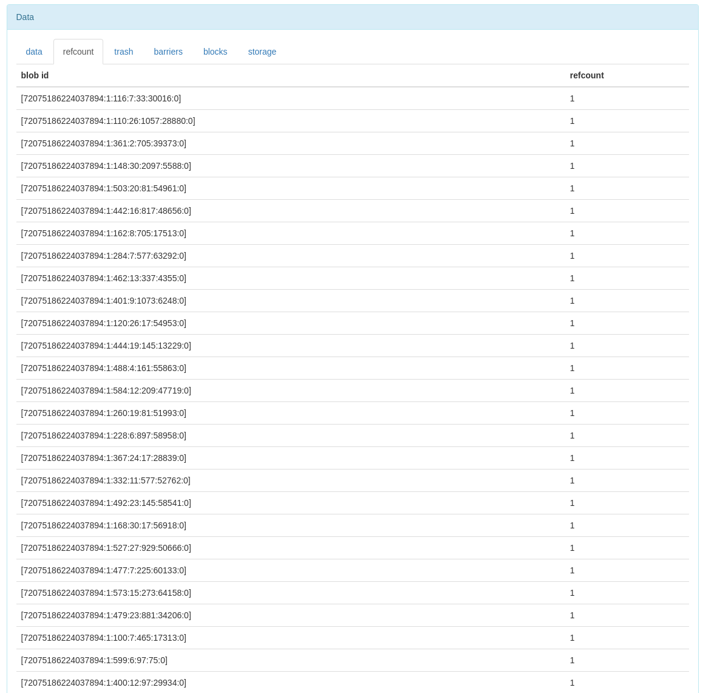

The refcount table contains two columns: "blob id" and "refcount". Blob id is the identifier of the stored blob written on behalf of the blob depot to storage. Refcount is the number of references to this blob from the data table (from the value chain column).

The TotalStoredDataSize metric is formed from the sum of sizes of all blobs in this table, each of which is counted exactly once, without considering the refcount field.

#### trash {#mon-trash}

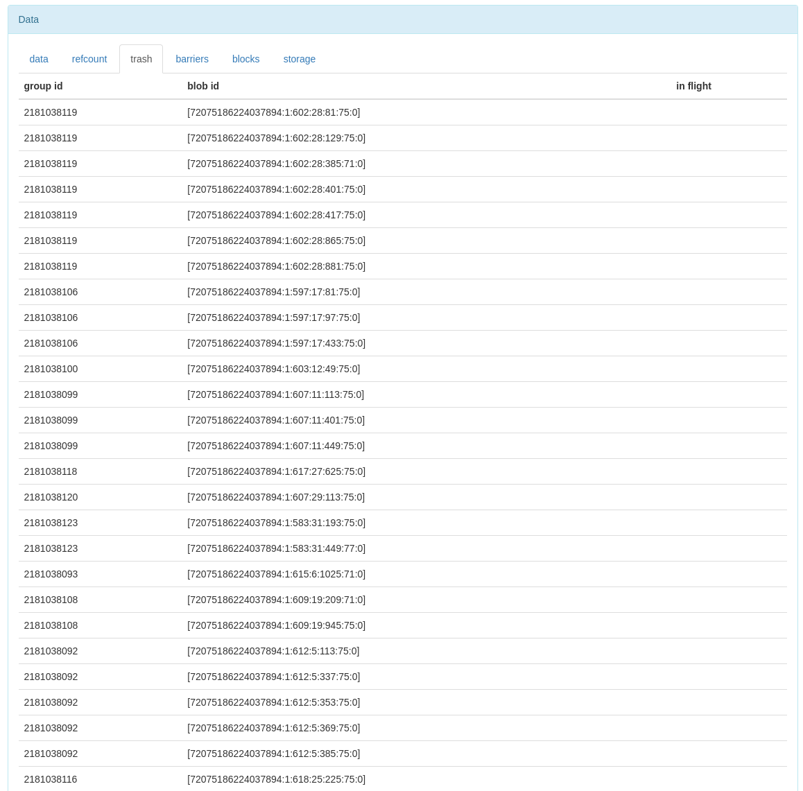

The table contains three columns: "group id", "blob id" and "in flight". Group id is the number of the group where the no longer needed blob is stored. Blob id is the identifier of the blob itself. In flight is a sign that the blob is still going through a transaction, only after which it can be passed to the garbage collector.

The TotalStoredTrashSize and InFlightTrashSize metrics are formed from this table by summing blob sizes without the in flight flag and with it, respectively.

#### barriers {#mon-barriers}

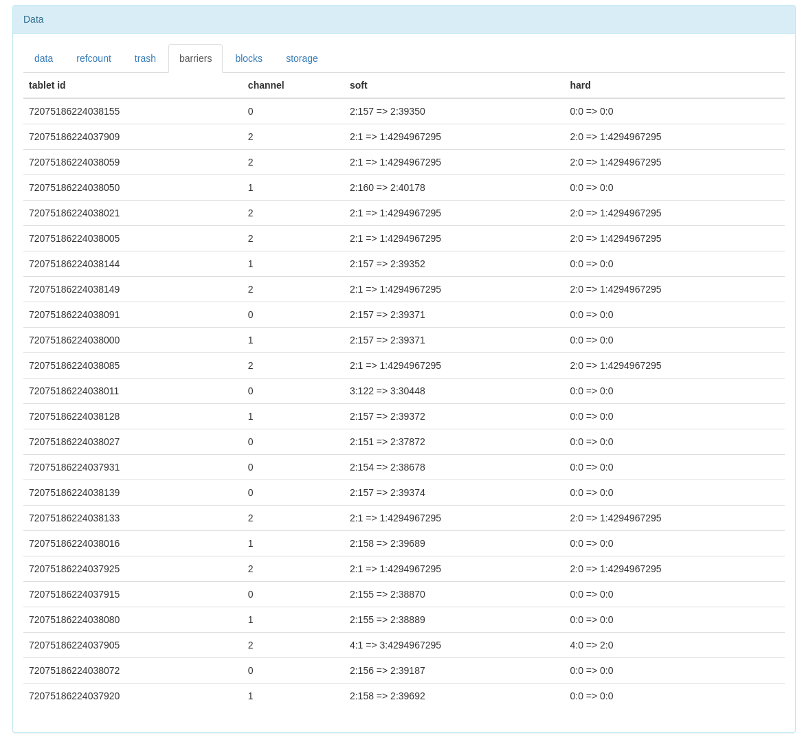

The barriers table contains information about client barriers that were passed to the blob depot. It consists of columns "tablet id" (tablet number), "channel" (channel number for which the barrier is written), as well as barrier values: "soft" and "hard". The value has the format `gen:counter => collect_gen:collect_step`, where gen is the tablet generation number in which this barrier was set, counter is the sequential number of the garbage collection command, `collect_gen:collect_step` is the barrier value (all blobs whose generation and step within the generation are less than or equal to the specified barrier are deleted).

#### blocks {#mon-blocks}

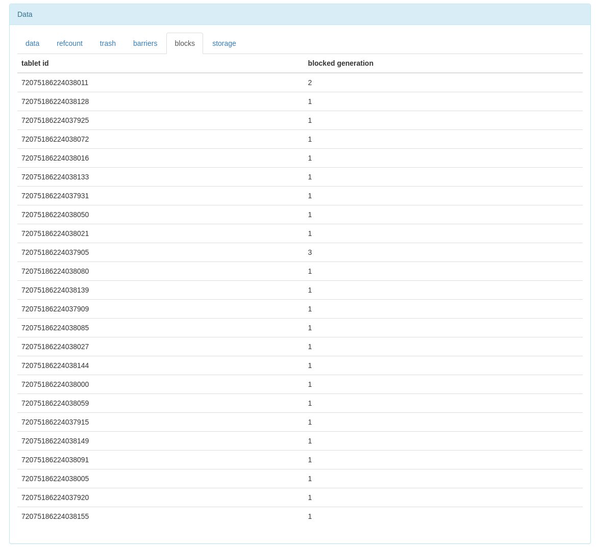

The blocks table contains a list of client tablet locks and consists of columns "tablet id" (tablet number) and "blocked generation" (generation number of this tablet in which nothing can be written anymore).

#### storage {#mon-storage}

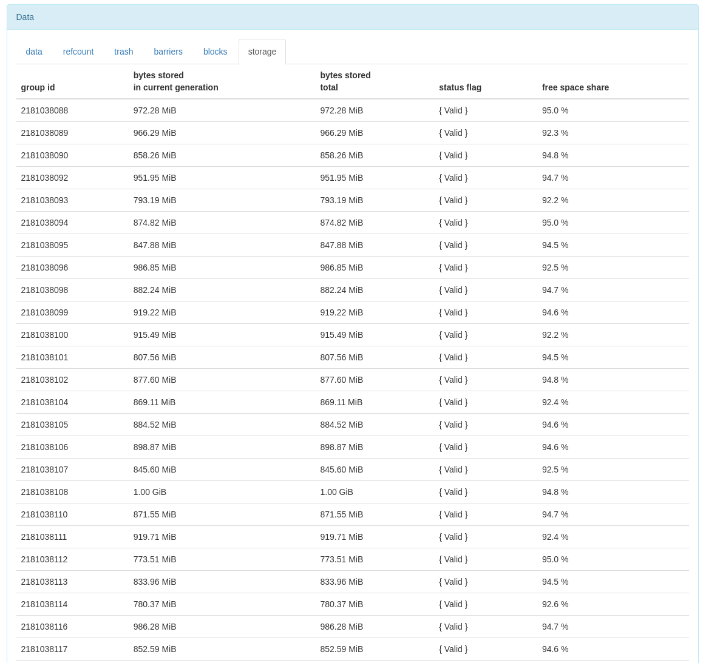

The storage table shows statistics on stored data for each group where the blob depot stores data. This table contains the following columns:

* group id — number of the group where data is stored
* bytes stored in current generation — volume of data written to this group in the current tablet generation (only useful data is counted, excluding garbage)
* bytes stored total — volume of all data saved by this blob depot to the specified group
* status flag — color status flags of the group
* free space share — group occupancy indicator (value 0 corresponds to a group completely filled by space, 1 — completely free)

### Internal Viewer {#diag-viewer}

On the Internal viewer monitoring page shown below, blob depots can be seen in the Storage sections and as BD tablets.

In the Nodes section, BD tablets running on different system nodes are visible:

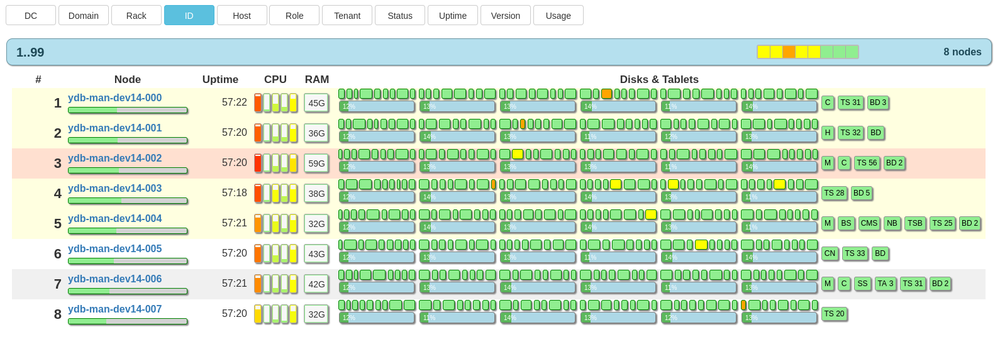

In the Storage section, you can see virtual groups that work through blob depot. They can be distinguished by the link with the text BlobDepot in the Erasure column. The link in this column leads to the tablet monitoring page. Otherwise, virtual groups are displayed the same way, except that they have no PDisk and VDisk. However, decommissioned groups will look the same as virtual ones, but have PDisk and VDisk until decommission is complete.

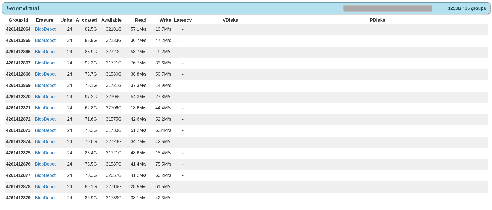

### Event Log {#diag-log}

The blob depot tablet writes events to the log with the following component names:

* `BLOB_DEPOT` — blob depot tablet component.
* `BLOB_DEPOT_AGENT` — blob depot agent component.
* `BLOB_DEPOT_TRACE` — special component for debug tracing of all data-related events.

BLOB_DEPOT and BLOB_DEPOT_AGENT are output as structured records that have fields allowing identification of the blob depot and the group it serves. For BLOB_DEPOT this is the Id field and it has the format {TabletId:GroupId}:Generation, where TabletId is the blob depot tablet number, GroupId is the group number it serves, Generation is the generation in which the running blob depot writes messages to the log. For BLOB_DEPOT_AGENT this field is called AgentId and has the format {TabletId:GroupId}.

At DEBUG level, most occurring events will be logged, both on the tablet side and on the agent side. This mode is used for debugging and is not recommended in production environments due to the large number of generated events.

### Charts {#diag-sensors}

Each blob depot tablet provides the following charts:

Chart               | Type          | Description
-------------------- | ------------ | --------
TotalStoredDataSize  | simple      | Amount of saved user data net (if there are multiple references to one blob, it is counted once).
TotalStoredTrashSize | simple      | Amount of bytes in garbage data that is no longer needed but has not yet been passed to garbage collection.
InFlightTrashSize    | simple      | Amount of garbage bytes that are still waiting for write confirmation to the local database (they cannot even start being collected yet).
BytesToDecommit      | simple      | Amount of data bytes remaining to be [decommissioned](blobdepot_decommit.md#decommit-progress) (if this blob depot is operating in group decommission mode).
Puts/Incoming        | cumulative | Rate of incoming write requests (in pieces per unit time).
Puts/Ok              | cumulative | Number of successfully executed write requests.
Puts/Error           | cumulative | Number of write requests completed with an error.
Decommit/GetBytes    | cumulative | Data read rate during [decommission](blobdepot_decommit.md#decommit-progress).
Decommit/PutOkBytes  | cumulative | Data write rate during [decommission](blobdepot_decommit.md#decommit-progress) (only successfully executed writes are counted).