# BlobDepot

BlobDepot extends the functionality of the storage subsystem by adding virtual group functionality.

A virtual group, along with a physical group, is a unit of fault tolerance of the storage subsystem in a cluster; however, a virtual group stores its data in other groups (unlike a physical group, which stores data on VDisks).

This method of data storage makes it possible to use the storage subsystem more flexibly {{ ydb-name }}, in particular:

* use "heavier" tablets in conditions where the size of one physical group is limited;
* provide tablets with a wider write bandwidth by balancing writes across all groups on top of which BlobDepot is running;
* ensure transparent migration of data between different groups for client tablets.

BlobDepot can also be used for group decommissioning, that is, for removing a VDisk inside a physical group while preserving all data that was written to that group. In this usage scenario, data from the physical group is transparently moved to the virtual group, then all VDisks of the physical group are removed to free up the resources they occupy.

## Virtual group mode

In virtual group mode, BlobDepot allows combining multiple groups into a single space for storing large amounts of data. Balancing by occupied space is provided, as well as increased throughput by distributing writes across different groups. Background (and completely transparent to the client) data transfer is also possible.

Virtual groups are also created within Storage Pools, like physical groups, but for virtual groups it is recommended to create a separate pool using the command `dstool pool create virtual`. These pools can be specified in Hive to create other tablets. However, to avoid latency degradation, it is recommended to place tablet channels 0 and 1 on physical groups, and place only data channels on virtual groups with BlobDepot.

### How to run {#vg-create-params}

A virtual group is created through BS\_CONTROLLER by sending a special command. The virtual group creation command is idempotent, so to avoid creating extra BlobDepots, each virtual group is assigned a name. The name must be unique within the entire cluster. If the command is executed again, an error will be returned with the field filled in `Already: true` and the number of the previously created virtual group.

```bash
dstool -e ... --direct group virtual create --name vg1 vg2 --hive-id=72057594037968897 --storage-pool-name=/Root:virtual --log-channel-sp=/Root:ssd --data-channel-sp=/Root:ssd*8
```

Command line parameters:

* --name unique name for the virtual group (or several virtual groups with similar parameters);
* --hive-id=N number of the Hive tablet that will manage this BlobDepot; you must specify the Hive of the tenant within which BlobDepot is running;
* --storage-pool-name=POOL\_NAME name of the Storage Pool within which BlobDepot must be created;
* --storage-pool-id=BOX:POOL alternative `--storage-pool-name`, in which you can specify an explicit numeric pool identifier;
* --log-channel-sp=POOL\_NAME name of the pool in which channel 0 of the BlobDepot tablet will be placed;
* --snapshot-channel-sp=POOL\_NAME name of the pool in which channel 0 of the BlobDepot tablet will be placed; if not specified, the value from --log-channel-sp is used;
* --data-channel-sp=POOL\_NAME[\*COUNT] name of the pool in which data channels are placed; if the COUNT parameter is specified (after the "asterisk" sign), then COUNT data channels are created in the specified pool; it is recommended to create a large number of data channels for BlobDepot in virtual group mode (64..250) to use storage most efficiently;
* --wait wait for the creation of BlobDepots to complete; if this option is not specified, the command completes immediately after responding to the BlobDepot creation request, without waiting for the creation and launch of the tablets themselves.

### How to check that everything has started {#vg-check-running}

You can view the result of creating a virtual group in the following ways:

* via the BS monitoring page\_CONTROLLER;
* via the command `dstool group list --virtual-groups-only`.

In both cases, you need to monitor creation using the VirtualGroupName field, which must match what was passed in the --name parameter. If the command `dstool group virtual create` completed successfully, the virtual group unconditionally appears in the list of groups, but the VirtualGroupState field can take one of the following values:

* NEW — the group is waiting for initialization (the tablet is being created via Hive, configured, and launched);
* WORKING — the group is created and running, ready to process user requests;
* CREATE\_FAILED — an error occurred during group creation, a text description of which can be seen in the ErrorReason field.

```bash
$ dstool --cluster=$CLUSTER --direct group list --virtual-groups-only
┌────────────┬──────────────┬───────────────┬────────────┬────────────────┬─────────────────┬──────────────┬───────────────────┬──────────────────┬───────────────────┬─────────────┬────────────────┐
│ GroupId    │ BoxId:PoolId │ PoolName      │ Generation │ ErasureSpecies │ OperatingStatus │ VDisks_TOTAL │ VirtualGroupState │ VirtualGroupName │ BlobDepotId       │ ErrorReason │ DecommitStatus │
├────────────┼──────────────┼───────────────┼────────────┼────────────────┼─────────────────┼──────────────┼───────────────────┼──────────────────┼───────────────────┼─────────────┼────────────────┤
│ 4261412864 │ [1:2]        │ /Root:virtual │ 0          │ none           │ DISINTEGRATED   │ 0            │ WORKING           │ vg1              │ 72075186224037888 │             │ NONE           │
│ 4261412865 │ [1:2]        │ /Root:virtual │ 0          │ none           │ DISINTEGRATED   │ 0            │ WORKING           │ vg2              │ 72075186224037890 │             │ NONE           │
│ 4261412866 │ [1:2]        │ /Root:virtual │ 0          │ none           │ DISINTEGRATED   │ 0            │ WORKING           │ vg3              │ 72075186224037889 │             │ NONE           │
│ 4261412867 │ [1:2]        │ /Root:virtual │ 0          │ none           │ DISINTEGRATED   │ 0            │ WORKING           │ vg4              │ 72075186224037891 │             │ NONE           │
└────────────┴──────────────┴───────────────┴────────────┴────────────────┴─────────────────┴──────────────┴───────────────────┴──────────────────┴───────────────────┴─────────────┴────────────────┘
```

## Architecture

BlobDepot is a tablet that, in addition to two system channels (0 and 1), also contains a set of additional channels that store the data written to BlobDepot. Client data is written to these additional channels.

BlobDepot as a tablet can be run on any node of the cluster.

When BlobDepot operates in virtual group mode, agents (BlobDepotAgent) are used to access it. These are actors that perform functions similar to DS proxy — they run on each node that uses a virtual group with BlobDepot. These same actors convert storage requests into commands for BlobDepot and provide data exchange with it.

## Diagnostics mechanisms

The following mechanisms are provided for diagnosing BlobDepot health:

* [BS monitoring page\_CONTROLLER](#diag-bscontroller);
* [BlobDepot monitoring page](#diag-blobdepot);
* [internal viewer](#diag-viewer);
* [event log](#diag-log);
* [graphs](#diag-sensors).

### BS monitoring page\_CONTROLLER {#diag-bscontroller}

On the BS monitoring page\_CONTROLLER there is a special Virtual groups tab that shows all groups that use BlobDepot:

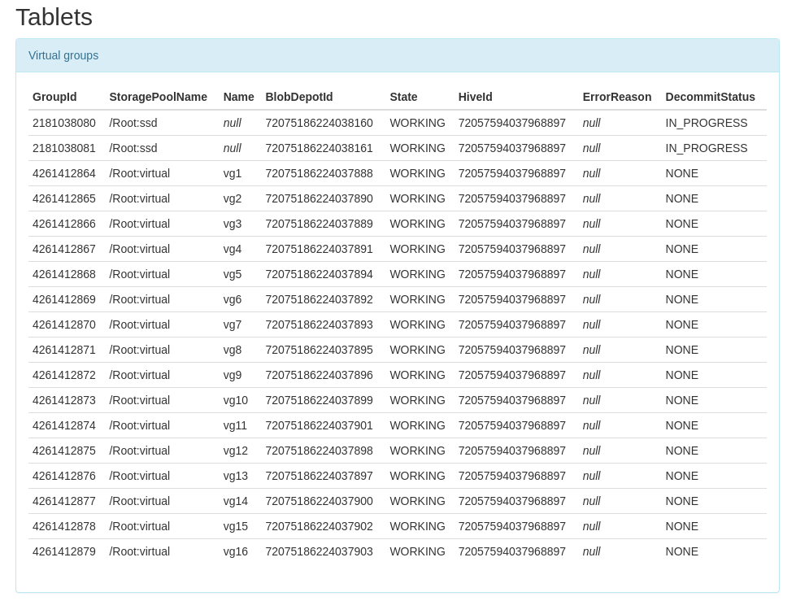

The table has the following columns:

Field | Description
---- | --------
GroupId | Group number.
StoragePoolName | Name of the pool in which the group is located.
Name | Name of the virtual group; it is unique across the entire cluster. For decommissioned groups, this will be null.
BlobDepotId | Number of the BlobDepot tablet that is responsible for servicing this group.
State | [BlobDepot state](#vg-check-running); can be NEW, WORKING, CREATED\_FAILED.
HiveId | Number of the Hive tablet within which the specified BlobDepot was created.
ErrorReason | When the state is CREATE\_FAILED, contains a text description of the reason for the creation error.
DecommitStatus | [Group decommissioning state](blobdepot_decommit.md#decommit-check-running); can be NONE, PENDING, IN\_PROGRESS, DONE.

### BlobDepot monitoring page {#diag-blobdepot}

The BlobDepot monitoring page shows the main parameters of the tablet's operation, grouped by tabs available via the "Contained data" link:

* [data](#mon-data)
* [refcount](#mon-refcount)
* [trash](#mon-trash)
* [barriers](#mon-barriers)
* [blocks](#mon-blocks)
* [storage](#mon-storage)

In addition, the main page provides brief information about the state of BlobDepot:

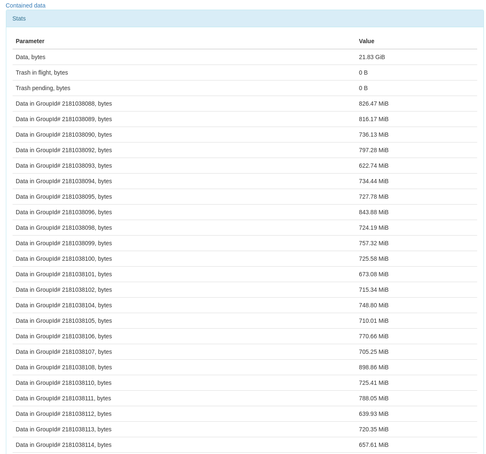

This table provides the following data:

* Data, bytes — the number of stored data bytes ([TotalStoredDataSize](#diag-sensors)).
* Trash in flight, bytes — the number of bytes of unnecessary data waiting for transactions to complete to become garbage ([InFlightTrashSize](#diag-sensors)).
* Trash pending, bytes — the number of garbage bytes that have not yet been passed to garbage collection ([TotalStoredTrashSize](#diag-sensors)).
* Data in GroupId# XXX, bytes — the number of data bytes in group XXX (both useful data and garbage not yet collected).

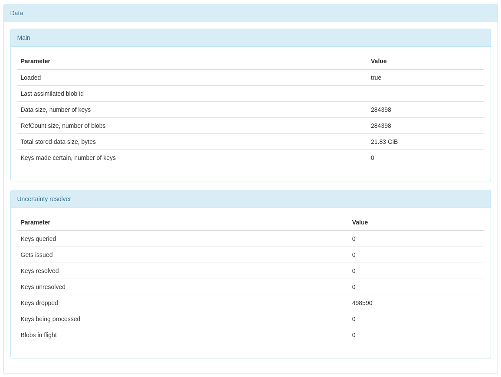

The purposes of the parameters are as follows:

* Loaded — a boolean value indicating whether all metadata from the tablet's local database has been loaded into memory.
* Last assimilated blob id — BlobId of the last read blob (metadata copying during decommissioning).
* Data size, number of keys — the number of stored data keys.
* RefCount size, number of blobs — the number of unique data blobs that BlobDepot stores in its namespace.
* Total stored data size, bytes — similar to "Data, bytes" from the table above.
* Keys made certain, number of keys — the number of incomplete keys that were then confirmed by reading.

The "Uncertainty resolver" section refers to the component that works with data written but not confirmed in BlobDepot.

#### data {#mon-data}

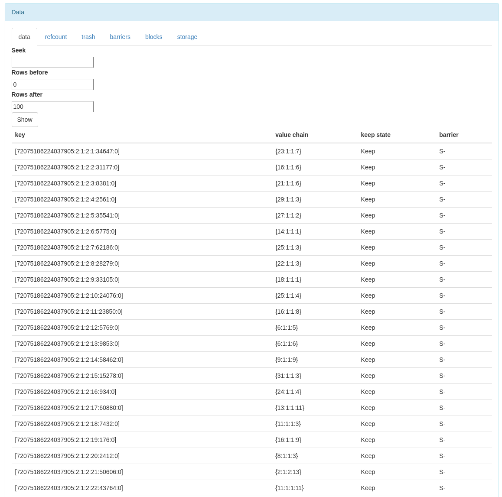

The data table contains the following columns:

* key — key identifier (BlobId in the client namespace);
* value chain — key value formed by concatenating blob fragments from the BlobDepot namespace (these blobs are listed in this field);
* keep state — the value of keep flags for this blob from the client's perspective (Default, Keep, DoNotKeep);
* barrier — a field showing which barrier this blob falls under (S — under the soft barrier, H — under the hard barrier; in fact, H never occurs, because blobs are synchronously removed from the table when the hard barrier is set).

Given the potentially large table size, only part of it is shown on the monitoring page. To find the desired blob, you can fill in the "seek" field by entering the BlobId of the blob you are looking for, then specify the number of rows of interest before and after this blob, and click the "Show" button.

#### refcount {#mon-refcount}

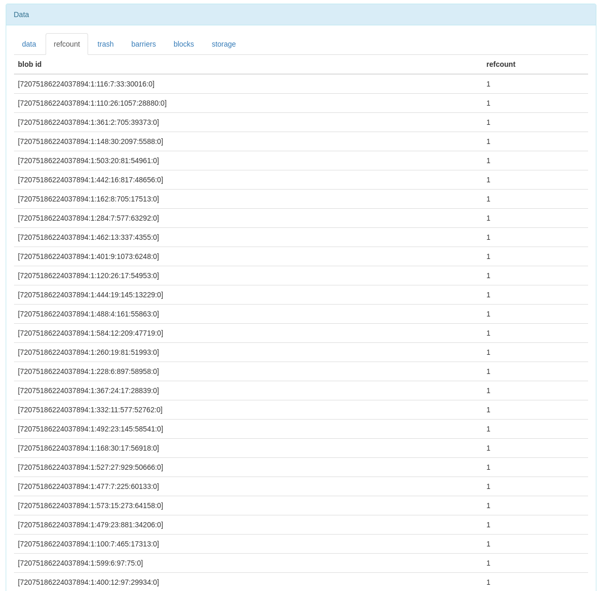

The refcount table contains two columns: "blob id" and "refcount". Blob id is the identifier of the stored blob written on behalf of BlobDepot to storage. Refcount is the number of references to this blob from the data table (from the value chain column).

The TotalStoredDataSize metric is formed from the sum of the sizes of all blobs in this table, each of which is counted exactly once, without taking the refcount field into account.

#### trash {#mon-trash}

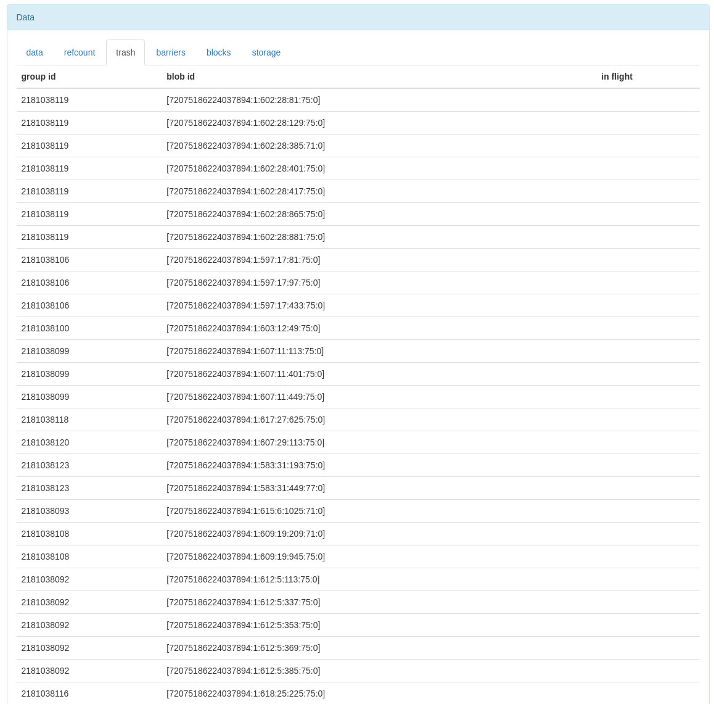

The table contains three columns: "group id", "blob id", and "in flight". Group id is the number of the group in which the no longer needed blob is stored. Blob id is the identifier of the blob itself. In flight is a sign that the blob is still going through a transaction, only after which it can be passed to the garbage collector.

The TotalStoredTrashSize and InFlightTrashSize metrics are formed from this table by summing the sizes of blobs without and with the in flight flag, respectively.

#### barriers {#mon-barriers}

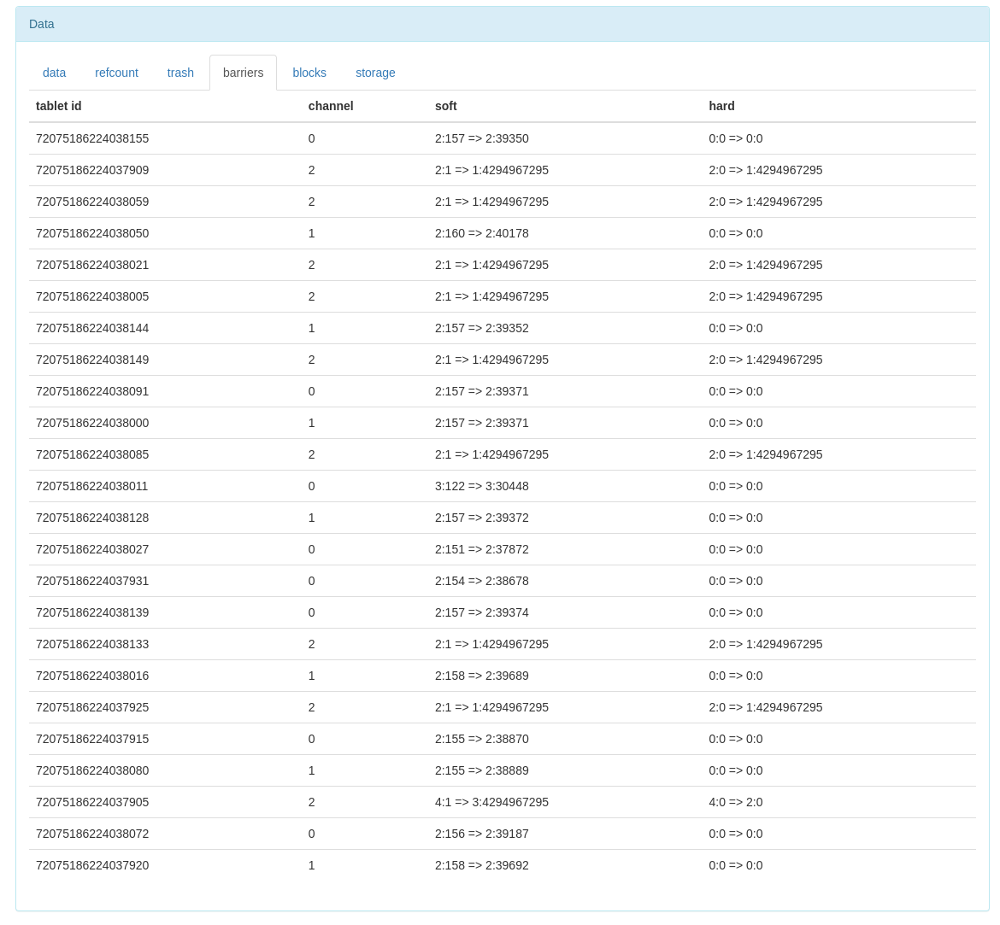

The barriers table contains information about client barriers that were passed to BlobDepot. It consists of the columns "tablet id" (tablet number), "channel" (channel number for which the barrier is recorded), as well as barrier values: "soft" and "hard". The value has the format gen:counter => collect\_gen:collect\_step, where gen is the tablet generation number in which this barrier was set, counter is the sequence number of the garbage collection command, collect\_gen:collect\_step is the barrier value (all blobs whose generation and step within the generation are less than or equal to the specified barrier are deleted).

#### blocks {#mon-blocks}

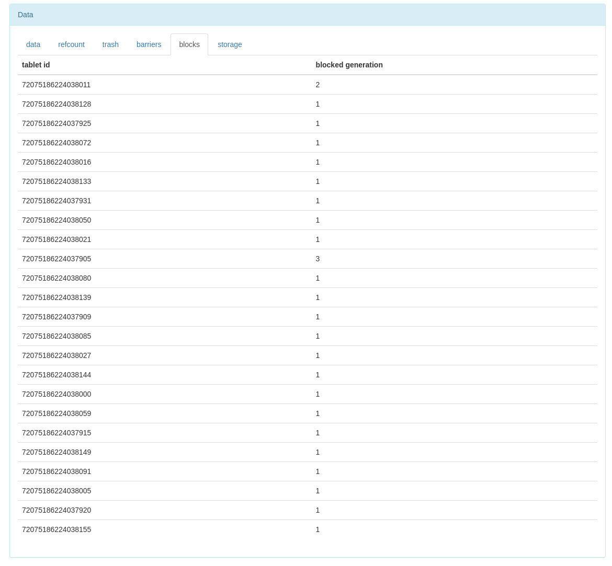

The blocks table contains a list of client tablet locks and consists of the columns "tablet id" (tablet number) and "blocked generation" (the generation number of this tablet in which nothing can be written).

#### storage {#mon-storage}

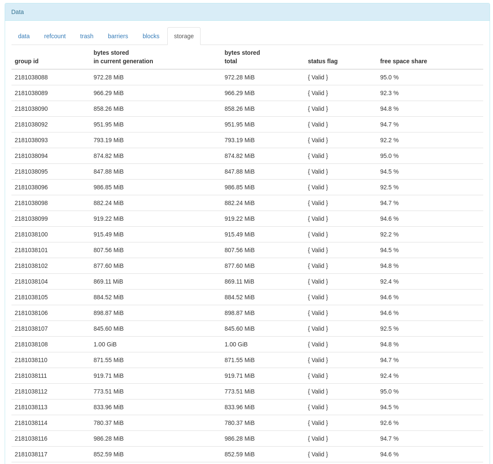


The storage table shows statistics on stored data for each group in which BlobDepot stores data. This table contains the following columns:

* group id — the number of the group in which data is stored;
* bytes stored in current generation — the amount of data written to this group in the current tablet generation (only useful data is counted, without garbage);
* bytes stored total — the amount of all data saved by this BlobDepot to the specified group;
* status flag — color flags of the group state;
* free space share — an indicator of group fullness (a value of 0 corresponds to a completely full group, 1 — completely free).

### Internal viewer {#diag-viewer}

On the Internal viewer monitoring page shown below, BlobDepots can be seen in the Storage section and as BD tablets.

In the Nodes section, you can see BD tablets running on different nodes of the system:

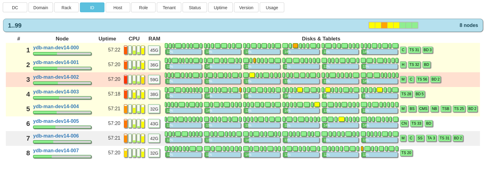

In the Storage section, you can see virtual groups that operate through BlobDepot. They can be distinguished by the link with the text BlobDepot in the Erasure column. The link in this column leads to the tablet monitoring page. Otherwise, virtual groups are displayed the same way, except that they have no PDisk and VDisk. However, decommissioned groups will look the same as virtual ones, but will have PDisk and VDisk until the decommissioning is complete.

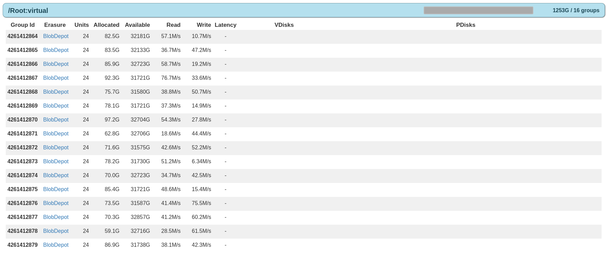

### Event log {#diag-log}

The BlobDepot tablet writes events to the log with the following component names:

* BLOB\_DEPOT — the BlobDepot tablet component.
* BLOB\_DEPOT\_AGENT — the BlobDepot agent component.
* BLOB\_DEPOT\_TRACE — a special component for debug tracing of all events related to data.

BLOB\_DEPOT and BLOB\_DEPOT\_AGENT are output as structured records that have fields allowing identification of the BlobDepot and the group it services. For BLOB\_DEPOT this field is Id and has the format {TabletId:GroupId}:Generation, where TabletId is the BlobDepot tablet number, GroupId is the number of the group it services, Generation is the generation in which the running BlobDepot writes messages to the log. For BLOB\_DEPOT\_AGENT this field is called AgentId and has the format {TabletId:GroupId}.

At the DEBUG level, most events that occur will be written to the log, both on the tablet side and on the agent side. This mode is used for debugging and is not recommended in production environments due to the large number of generated events.

### Graphs {#diag-sensors}

Each BlobDepot tablet produces the following graphs:

Graph               | Type          | Description
-------------------- | ------------ | --------
TotalStoredDataSize  | simple      | The amount of stored user data net (if there are multiple references to one blob, it is counted once).
TotalStoredTrashSize | simple      | The number of bytes in garbage data that is no longer needed but has not yet been passed to garbage collection.
InFlightTrashSize    | simple      | The number of garbage bytes still waiting for confirmation of writing to the local database (they cannot even be started to be collected yet).
BytesToDecommit      | simple      | The number of data bytes remaining to [decommission](blobdepot_decommit.md#decommit-progress) (if this BlobDepot operates in group decommissioning mode).
Puts/Incoming        | cumulative | The rate of incoming write requests (in items per unit time).
Puts/Ok              | cumulative | The number of successfully completed write requests.
Puts/Error           | cumulative | The number of write requests completed with an error.
Decommit/GetBytes    | cumulative | The rate of data reading during [decommissioning](blobdepot_decommit.md#decommit-progress).
Decommit/PutOkBytes  | cumulative | The rate of data writing during [decommissioning](blobdepot_decommit.md#decommit-progress) (only successfully completed writes are counted).
