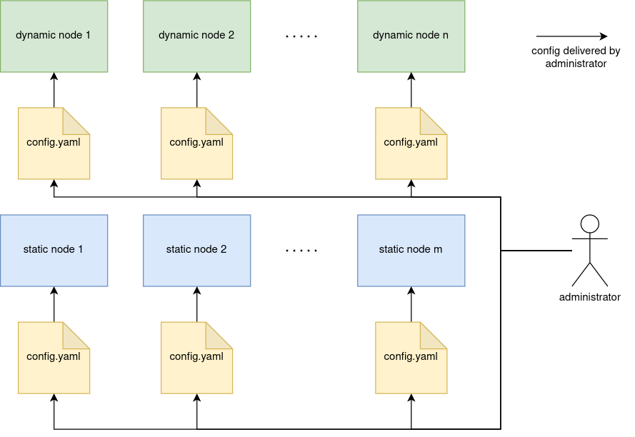

# Configuration overview

A {{ ydb-short-name }} node requires configuration to run. There are two types of configurations:

* **Static** — a YAML file stored on the node's local disk.
* **Dynamic** — a YAML document stored in the {{ ydb-short-name }} configuration repository.

Static nodes in the cluster use static configuration. Dynamic nodes can use static configuration, dynamic configuration, or a combination of both.

## Static configuration

Static configuration is a YAML file stored on the cluster nodes. This file lists all the system settings. The path to the file is passed to the `ydbd` process at startup via a command-line parameter. Distributing the static configuration across the cluster and maintaining it in a consistent state on all nodes is the responsibility of the cluster administrator. Details on using static configuration can be found in the section [{#T}](../../deploy/configuration/config.md). This configuration is **required** for running static nodes.

### Basic usage scenario

1. Copy the [standard configuration](https://github.com/ydb-platform/ydb/tree/main/ydb/deploy/yaml_config_examples/) from GitHub.
2. Modify the configuration according to your requirements.
3. Place identical configuration files on all cluster nodes.
4. Start all cluster nodes, explicitly specifying the path to the configuration file using the `--yaml-config` command-line argument.

## Dynamic configuration

Dynamic configuration is a YAML document securely stored in the cluster in a Console [tablet](../../concepts/glossary.md#tablet). Unlike static configuration, uploading it to the cluster is sufficient, as {{ ydb-short-name }} will handle its distribution and maintenance in a consistent state. Dynamic configuration, using selectors, allows handling complex scenarios while remaining within a single configuration file. A description of the dynamic configuration is provided in the section [{#T}](./dynamic-config.md).

### Basic usage scenario

1. Copy the [standard configuration](https://github.com/ydb-platform/ydb/tree/main/ydb/deploy/yaml_config_examples/) from GitHub.
2. Modify the configuration according to your requirements.
3. Place identical configuration files on all static cluster nodes.
4. Start all static cluster nodes, explicitly specifying the path to the configuration file using the `--yaml-config` command-line argument.
5. Extend the configuration file to the [dynamic configuration format](./dynamic-config.md#example).
6. Upload the resulting configuration to the cluster using `{{ ydb-cli }} admin config replace -f dynconfig.yaml`.