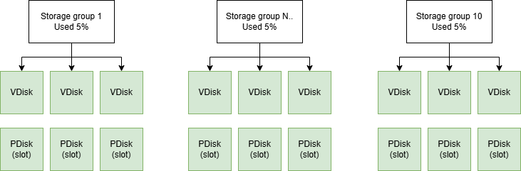
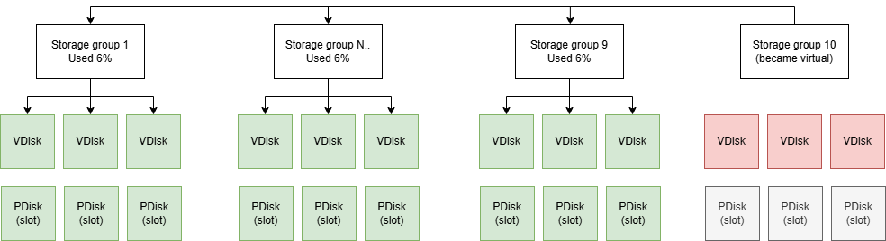

# Decommissioning groups using virtual groups



The decommission operation is extremely dangerous and can lead to irreversible data loss. Before performing a decommission, **be sure** to create a backup of all cluster data.





The ability to roll back a storage group decommission is under development. At the moment, the operation is irreversible. It is recommended to use decommissioning only in exceptional cases when it is necessary to free up resources once.



## How it works

Physical [storage groups](../../concepts/glossary.md#storage-group) are a limited resource in a [cluster](../../concepts/glossary.md#cluster): their number is determined by the cluster size, and they cannot be deleted as long as they store data. This can lead to a situation where there are not enough groups to create a new [database](../../concepts/glossary.md#database) or expand an existing one, and space on physical disks cannot be freed because old groups contain data.

Consider an example: a database uses 10 storage groups. Each of these groups contains some amount of user data, but they are only 5% full. Throughput is also not fully utilized. As a result, all groups are formally occupied, and when trying to create a new database, a new storage group cannot be allocated — there are no more free [slots](../../concepts/glossary.md#slot) on [PDisks](../../concepts/glossary.md#pdisk). At the same time, existing groups are used inefficiently.



In such a situation, the task arises to free up some of the storage groups (decommission them) from the current database in order to return them to the pool of available resources for subsequent use.

To solve this problem, a storage group decommission mechanism is used. As part of this mechanism, one new [virtual storage group](../../concepts/glossary.md#virtual-storage-groups) is created for the original physical group, which replaces this physical group. After performing the operation, the system moves to the following state:

- The original physical storage group is replaced by a virtual one.
- Data is copied from the source group to the remaining physical groups of the cluster (increasing their usage).
- The virtual group stores data in the remaining physical groups of the cluster.
- Resources used by the source group are freed ([VDisks](../../concepts/glossary.md#vdisk) are deleted, [PDisk slots](../../concepts/glossary.md#slot) are freed).



## Decommissioning process stages



Access to data is preserved during decommissioning — users can read and write data as usual. All data movements occur in the background in parallel with the main application work. It is worth noting that during decommissioning, an increased load is still created on the storage system.



**In the following, by the source physical group we will mean the group over which the decommissioning process is taking place.**

### Initialization of a virtual storage group and blocking writes to the source physical group

**What happens:**

- A virtual group is created.
- Writing new data to the source physical group is blocked.
- All new writes start going to the virtual group.

**Status:** `DecommitStatus: PENDING` → `IN_PROGRESS`

**Time:** Usually fractions of a second

### Metadata copying

**What happens:**

- Metadata of all blobs (information about what data exists, but not the data itself) is copied from the source physical group to the remaining physical storage groups

**Status:** `DecommitStatus: IN_PROGRESS`

**Time:** Usually seconds

### Data copying

**What happens:**

- Data is read from the source physical group.
- Written to the remaining physical groups of the cluster through the virtual group.
- Data is distributed across several groups for balancing.

**Status:** `DecommitStatus: IN_PROGRESS`

**Time:** Depends on the volume of data (can be hours for large groups)

### Freeing resources of the source physical group

**What happens:**

- All data is copied.
- The source physical group and its VDisks are deleted.
- [PDisk](../../concepts/glossary.md#pdisk) resources are freed.
- The group is marked as decommissioned.

**Status:** `DecommitStatus: IN_PROGRESS` → `DONE`

**Time:** Minutes (VDisk deletion)

## Prerequisites

The group decommission instructions work if the following conditions are met:

1. A deployed {{ ydb-short-name }} [cluster](../../concepts/glossary.md#cluster). Deployment instructions are available in the [Initial Deployment](../../devops/deployment-options/manual/initial-deployment.md) section.
2. The `ydb-dstool` utility is installed. Installation instructions are available in the [{{ ydb-short-name }} DSTool installation documentation](../../reference/ydb-dstool/install.md).
3. An authentication token generated for cluster access:

```bash
{{ ydb-cli }} -e grpc://<cluster-endpoint> -d <db_path> --user <user> auth get-token -f > ~/ydb_token
```

Replace `<cluster-endpoint>` with your cluster address, `<db_path>` with the database path, and `<user>` with the username for authorization.



Decommissioning can be performed even on an empty cluster; the presence of data is not required. However, if there is data in the cluster, this will allow checking its consistency after decommissioning. If necessary, you can load test data using the `ydb workload tpcc` utility:

```bash
{{ ydb-cli }} workload tpcc --path tpcc/10wh init -w 100
{{ ydb-cli }} workload tpcc --path tpcc/10wh import -w 100
```

And run the TPC-C test before and after decommissioning:

```bash
{{ ydb-cli }} workload tpcc --path tpcc/10wh run -w 100
```

More about working with test load in the [ydb workload tpcc documentation](../../reference/ydb-cli/workload-tpcc.md).



## Starting decommissioning

### Selecting a group for decommissioning

Before starting decommissioning, you must select the group (group ID) you want to decommission. You can choose any group, but it is recommended to choose a less busy group — this will help complete the decommissioning process faster. This can be done through the cluster web interface or using the CLI:



- UI (Web interface)
  1. Open the cluster management web interface `https://<cluster-endpoint>:8765`.
  2. Open the `Storage` tab.
  3. Select the group you need and save the `Group ID`.

- CLI
  1. Run the command to get a list of storage groups

  ```bash
  ydb-dstool -e <cluster-endpoint> \
    --ca-file <path-to-ca-cert> \
    --token-file ~/ydb_token \
    group list
  ```

  2. In the command output, find the group you need and save its `Group ID`.



### Command to start

To start decommissioning, run the `ydb-dstool` command with the `group decommit` parameter; it will automatically create a virtual group and start the decommissioning process:

```bash
ydb-dstool -e grpcs://<cluster-endpoint>:2135 \
  --ca-file <path-to-ca-cert> \
  --token-file ~/ydb_token \
  group decommit \
  --group-ids <GROUP_ID> \
  --database /Root/<database-name> \
  --wait
```

### Command parameters

* `-e <endpoint>` — cluster address (e.g., `grpcs://static-node-1.ydb-cluster.com:2135`);
* `--ca-file <path>` — path to the CA certificate file for TLS connection;
* `--token-file <path>` — path to the file with the authentication token;
* `--group-ids <GROUP_ID>` — ID of the group to decommission (multiple groups can be specified separated by spaces);
* `--database=<DB>` — path to the [database](../../concepts/glossary.md#database) or domain where decommissioning is performed (e.g., `/Root/database`);
* `--wait` — wait for decommissioning to start; if a start error occurs, the error is displayed on the screen, and decommissioning is cancelled automatically (only when this option is specified).

### Command example

```bash
ydb-dstool -e grpcs://static-node-1.ydb-cluster.com:2135 \
  --ca-file /home/ubuntu/ansible-11-nov-244/3-nodes-mirror-3-dc/files/TLS/certs/ca.crt \
  --token-file ~/ydb_token \
  group decommit \
  --group-ids 2181038081 \
  --database=/Root/database \
  --wait
```

## Checking decommissioning status

After starting decommissioning, you can check its status using the command:

```bash
ydb-dstool -e grpcs://<cluster-endpoint>:2135 \
  --ca-file <path-to-ca-cert> \
  --token-file ~/ydb_token \
  group list --columns GroupId PoolName \
  ErasureSpecies OperatingStatus VDisks_TOTAL BlobDepotId DecommitStatus
```

In the command output for groups for which the decommissioning procedure was started, an additional `DecommitStatus` field appears, which can take one of the following values:

* `NONE` — decommissioning for the specified group is not performed;
* `PENDING` — group decommissioning is expected but not yet running (a virtual group is being created);
* `IN_PROGRESS` — group decommissioning is being performed (all writes already go to the virtual group, reads go to the virtual group and the old group);
* `DONE` — decommissioning is fully completed (the physical group has turned into a virtual one).

### Command output example

```text
┌────────────┬────────────────────┬────────────────┬─────────────────┬──────────────┬───────────────────┬────────────────┐
│ GroupId    │ PoolName           │ ErasureSpecies │ OperatingStatus │ VDisks_TOTAL │ BlobDepotId       │ DecommitStatus │
├────────────┼────────────────────┼────────────────┼─────────────────┼──────────────┼───────────────────┼────────────────┤
│ 2181038080 │ /Root/database:ssd │ mirror-3-dc    │ FULL            │ 9            │ 0                 │ NONE           │
│ 2181038081 │ /Root/database:ssd │ mirror-3-dc    │ FULL            │ 0            │ 72075186224038889 │ DONE           │
│ 2181038082 │ /Root/database:ssd │ mirror-3-dc    │ FULL            │ 9            │ 0                 │ NONE           │
│ 2181038083 │ /Root/database:ssd │ mirror-3-dc    │ FULL            │ 9            │ 0                 │ NONE           │
│ 2181038084 │ /Root/database:ssd │ mirror-3-dc    │ FULL            │ 9            │ 0                 │ NONE           │
│ 2181038085 │ /Root/database:ssd │ mirror-3-dc    │ FULL            │ 9            │ 0                 │ NONE           │
│ 2181038086 │ /Root/database:ssd │ mirror-3-dc    │ FULL            │ 9            │ 0                 │ NONE           │
│ 2181038087 │ /Root/database:ssd │ mirror-3-dc    │ FULL            │ 9            │ 0                 │ NONE           │
└────────────┴────────────────────┴────────────────┴─────────────────┴──────────────┴───────────────────┴────────────────┘
```

Note that in the above output example for group `2181038081`, the number of VDisks has changed (it became 0), the virtual group ID appeared in the `BlobDepotId` field, and the decommissioning status (`DecommitStatus`) changed to `DONE`. This reflects the successful completion of the decommissioning procedure for this group.
