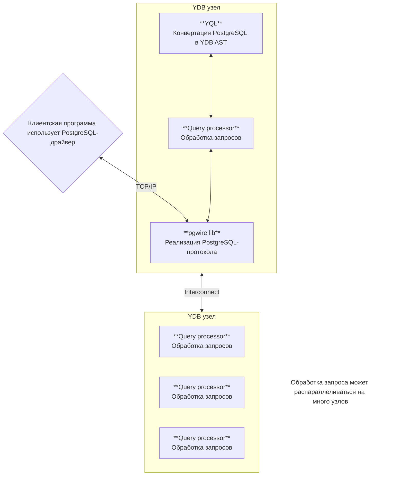

```mermaid
flowchart TD
    A{Клиентская программа использует PostgreSQL-драйвер}
    A <--TCP/IP--> C1
    subgraph YDB_node_1 [YDB узел]
        A1["**YQL**<br>Конвертация PostgreSQL в YDB AST"]<--> 
        B1["**Query processor**<br>Обработка запросов"]<-->
        C1["**pgwire lib**<br>Реализация PostgreSQL-протокола"]
    end

    YDB_node_1 <--Interconnect--> YDB_node_2

    subgraph main[" "]
        style main stroke:none, fill: none, header:none
        subgraph YDB_node_2 [YDB узел]
            A2["**Query processor**<br>Обработка запросов"] 
            B2["**Query processor**<br>Обработка запросов"] 
            C2["**Query processor**<br>Обработка запросов"]
        end

        many_nodes[Обработка запроса может распараллеливаться на много узлов]
            style many_nodes stroke: none, fill: none
    end
```