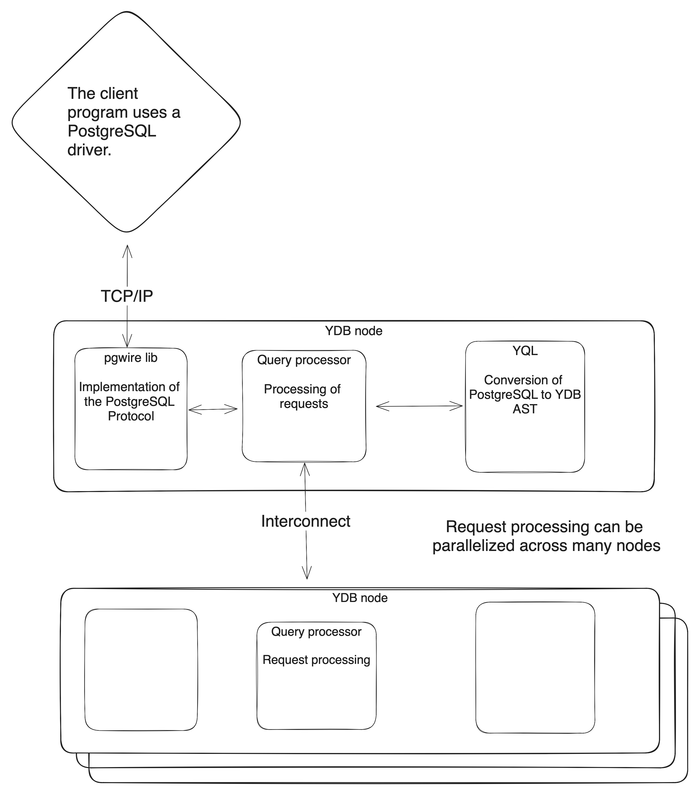

# {{ ydb-short-name }} compatibility with PostgreSQL



PostgreSQL compatibility is a mechanism for executing SQL queries in the PostgreSQL dialect on YDB infrastructure using the PostgreSQL wire protocol. This feature allows the use of familiar PostgreSQL tools such as [psql](https://www.postgresql.org/docs/14/app-psql.html) and drivers (e.g., [pq](https://github.com/lib/pq) for Golang and [psycopg2](https://pypi.org/project/psycopg2/) for Python). Developers can write queries using the PostgreSQL syntax while benefiting from YDB's advantages such as horizontal scalability and fault tolerance.

YDB's compatibility with PostgreSQL simplifies the migration of applications that were previously operating within the PostgreSQL ecosystem. This feature allows for a smoother transition of database-driven applications to YDB. At present, a limited set of PostgreSQL 14 instructions and functions are supported. PostgreSQL compatibility enables switching from PostgreSQL to YDB without modifying the project code (provided that the SQL constructs used in the project are supported by YDB), by merely changing the connection parameters.

The operation of PostgreSQL compatibility can be described as follows:

1. The application sends queries to YDB, where they are processed by a component known as pgwire. Pgwire implements the [wire protocol](https://postgrespro.ru/docs/postgresql/14/protocol) of PostgreSQL and forwards commands to the query processor.
2. The query processor translates the PostgreSQL queries into YQL AST.
3. After the queries are processed, the results are compiled and sent back to the application that issued the query via the PostgreSQL wire protocol. During query processing, it can be parallelized and executed on any number of YDB nodes.

The functionality of PostgreSQL compatibility can be graphically represented as follows:

