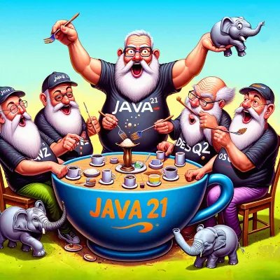

## When Postgres is not enough: performance evaluation of PostgreSQL vs. Distributed DBMSs {#2024-pub-medium-postgresql}



The [research](https://blog.ydb.tech/when-postgres-is-not-enough-performance-evaluation-of-postgresql-vs-distributed-dbmss-23bf39db2d31) presented is the result of our joint effort and close collaboration with [Evgeny Efimkin](https://www.linkedin.com/in/evgeny-efimkin-4061a893/), an expert in PostgreSQL who doesn’t work on YDB.

## How we switched to Java 21 virtual threads and got a deadlock in TPC-C for PostgreSQL {#2024-pub-medium-java-21}



In this [post](https://blog.ydb.tech/how-we-switched-to-java-21-virtual-threads-and-got-deadlock-in-tpc-c-for-postgresql-cca2fe08d70b), we present a case study on how we encountered a deadlock with virtual threads in TPC-C for PostgreSQL, even without the dining philosophers problem. This post might be helpful for Java developers who are considering switching to virtual threads.