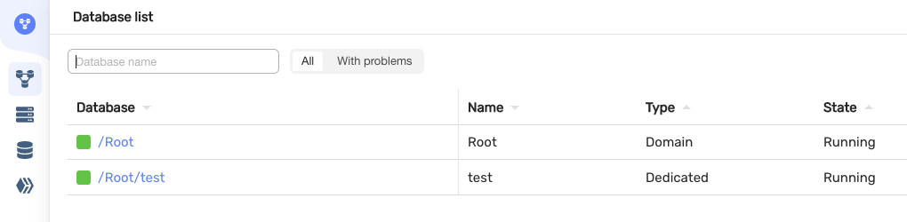
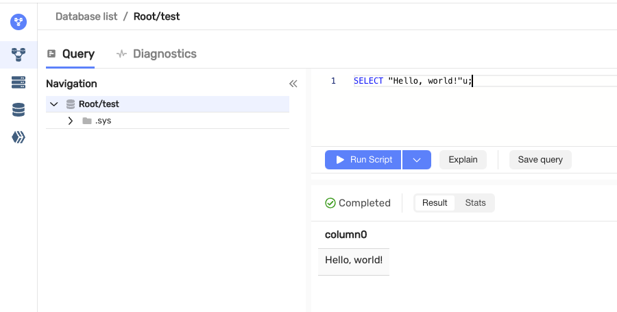

# {{ ydb-short-name }} Quick Start

In this guide, you will install a single-node local [{{ ydb-short-name }} cluster](concepts/glossary.md#cluster) and execute simple queries against your [database](concepts/glossary.md#database).

Normally, {{ ydb-short-name }} stores data on multiple SSD/NVMe or HDD raw disk devices without any filesystem. However, for simplicity, this guide emulates disks in RAM or using a file in a regular filesystem. Thus, this setup is unsuitable for any production usage or even benchmarks. See the [documentation for DevOps Engineers](devops/index.md) to learn how to run {{ ydb-short-name }} in a production environment.

## Install and start {{ ydb-short-name }} {#install}



- Linux x86_64

   

   The recommended environment to run {{ ydb-short-name }} is x86_64 Linux. If you don't have access to one, feel free to switch to the instructions on the "Docker" tab.

   

   1. Create a directory for {{ ydb-short-name }} and use it as the current working directory:

      ```bash
      mkdir ~/ydbd && cd ~/ydbd
      ```

   2. Download and run the installation script:

      ```bash
      curl {{ ydbd-install-url }} | bash
      ```

      This will download and unpack the archive containing the `ydbd` executable, libraries, configuration files, and scripts needed to start and stop the local cluster.

      The script is executed entirely with the current user privileges (notice the lack of `sudo`). Therefore, it can't do much on the system. You can check which exactly commands it runs by opening the same URL in your browser.

   3. Start the cluster in one of the following storage modes:

      * In-memory data:

         ```bash
         ./start.sh ram
         ```

         In this case, all data is stored only in RAM, it will be lost when the cluster is stopped.

      * Data on disk:

         ```bash
         ./start.sh disk
         ```

         When you run this command an 80GB `ydb.data` file will be created in the working directory if it weren't there before. Make sure there's enough disk space available to create it. This file will be used to emulate a raw disk device, which would have been used in production environments.

      * Data on a real disk drive:

         ```bash
         ./start.sh drive "/dev/$DRIVE_NAME"
         ```

         Replace `/dev/$DRIVE_NAME` with an actual device name that is not used for anything else, for example `/dev/sdb`. The first time you run this command, the specified disk drive will be fully wiped and then used for {{ ydb-short-name }} data storage. It is recommended to use a NVMe or SSD drive with at least 800Gb data volume. Such setup can be used for single-node performance testing or other environments that do not have any fault-tolerance requirements.

      Result:

      ```text
      Starting storage process...
      Initializing storage ...
      Registering database ...
      Starting database process...

      Database started. Connection options for YDB CLI:

      -e grpc://localhost:2136 -d /Root/test
      ```

- Docker

   1. Create a directory for {{ ydb-short-name }} and use it as the current working directory:

      ```bash
      mkdir ~/ydbd && cd ~/ydbd
      mkdir ydb_data
      mkdir ydb_certs
      ```

   2. Run the Docker container:

      ```bash
      docker run -d --rm --name ydb-local -h localhost \
        --platform linux/amd64 \
        -p 2135:2135 -p 2136:2136 -p 8765:8765 \
        -v $(pwd)/ydb_certs:/ydb_certs -v $(pwd)/ydb_data:/ydb_data \
        -e GRPC_TLS_PORT=2135 -e GRPC_PORT=2136 -e MON_PORT=8765 \
        -e YDB_USE_IN_MEMORY_PDISKS=true \
        {{ ydb_local_docker_image}}:{{ ydb_local_docker_image_tag }}
      ```

      If the container starts successfully, you'll see the container's ID. The container might take a few minutes to initialize. The database will not be available until container initialization is complete.

      The `YDB_USE_IN_MEMORY_PDISKS` setting makes all data volatile, stored only in RAM. Currently, data persistence by turning it off is supported only on x86_64 processors.

- Minikube

   1. Install the Kubernetes CLI [kubectl](https://kubernetes.io/docs/tasks/tools/install-kubectl) and [Helm 3](https://helm.sh/docs/intro/install/) package manager.

   2. Install and run [Minikube](https://kubernetes.io/ru/docs/tasks/tools/install-minikube/).

   3. Clone the repository with [{{ ydb-short-name }} Kubernetes Operator](https://github.com/ydb-platform/ydb-kubernetes-operator):

      ```bash
      git clone https://github.com/ydb-platform/ydb-kubernetes-operator && cd ydb-kubernetes-operator
      ```

   4. Install the {{ ydb-short-name }} controller in the cluster:

      ```bash
      helm upgrade --install ydb-operator deploy/ydb-operator --set metrics.enabled=false
      ```

   5. Apply the manifest for creating a {{ ydb-short-name }} cluster:

      ```bash
      kubectl apply -f samples/minikube/storage.yaml
      ```

   6. Wait for `kubectl get storages.ydb.tech` to become `Ready`.

   7. Apply the manifest for creating a database:

      ```bash
      kubectl apply -f samples/minikube/database.yaml
      ```

   8. Wait for `kubectl get databases.ydb.tech` to become `Ready`.

   9. After processing the manifest, a StatefulSet object that describes a set of dynamic nodes is created. The created database will be accessible from inside the Kubernetes cluster by the `database-minikube-sample` DNS name on port 2135.

   10. To continue, get access to port 8765 from outside Kubernetes using `kubectl port-forward database-minikube-sample-0 8765`.




## Run your first "Hello, world!" query

The simplest way to launch your first {{ ydb-short-name }} query is via the built-in web interface. It is launched by default on port 8765 of the {{ ydb-short-name }} server. If you have launched it locally, open [localhost:8765](http://localhost:8765) in your web browser. If not, replace `localhost` with your server's hostname in this URL or use `ssh -L 8765:localhost:8765 my-server-hostname-or-ip.example.com` to set up port forwarding and still open [localhost:8765](http://localhost:8765). You'll see a page like this:



{{ ydb-short-name }} is designed to be a multi-tenant system, with potentially thousands of users working with the same cluster simultaneously. Hence, most logical entities inside a {{ ydb-short-name }} cluster reside in a flexible hierarchical structure more akin to Unix's virtual filesystem rather than a fixed-depth schema you might be familiar with from other database management systems. As you can see, the first level of hierarchy consists of databases running inside a single {{ ydb-short-name }} process that might belong to different tenants. `/Root` is for system purposes, while `/Root/test` or `/local` (depending on the chosen installation method) is a playground created during installation in the previous step. Click on either `/Root/test` or `/local`, enter your first query, and hit the "Run" button:

```sql
SELECT "Hello, world!"u;
```

The query returns the greeting, as it is supposed to:





Did you notice the odd `u` suffix? {{ ydb-short-name }} and its query language, YQL, are strongly typed. Regular strings in {{ ydb-short-name }} can contain any binary data, while this suffix indicates that this string literal is of the `Utf8` data type, which can only contain valid [UTF-8](https://en.wikipedia.org/wiki/UTF-8) sequences. [Learn more](yql/reference/types/index.md) about {{ ydb-short-name }}'s type system.



The second simplest way to run a SQL query with {{ ydb-short-name }} is the [command line interface (CLI)](reference/ydb-cli/index.md), while most real-world applications will likely communicate with {{ ydb-short-name }} via one of the available [software development kits (SDK)](reference/ydb-sdk/index.md). Feel free to follow the rest of the guide using either the CLI or one of the SDKs instead of the web UI if you feel comfortable doing so.

## Create your first table

The main purpose of database management systems is to store data for later retrieval. As an SQL-based system, {{ ydb-short-name }}'s primary abstraction for data storage is a table. To create our first one, run the following query:

```sql
CREATE TABLE example
(
    key UInt64,
    value String,
    PRIMARY KEY (key)
);
```

As you can see, it is a simple key-value table. Let's walk through the query step-by-step:

* Each SQL statement kind like `CREATE TABLE` has more detailed explanation in [YQL reference](yql/reference/index.md).
* `example` is the table name identifier, while `key` and `value` are column name identifiers. It is recommended to use simple names for identifiers like these, but if you need one that contains non-trivial symbols, wrap the name in backticks.
* `UInt64` and `String` are data type names. `String` represents a binary string, and `UInt64` is a 64-bit unsigned integer. Thus, our example table stores string values identified by unsigned integer keys. More details [about data types](yql/reference/types/index.md).
* `PRIMARY KEY` is one of the fundamental concepts of SQL that has a significant impact on both application logic and performance. Following the SQL standard, the primary key also implies an unique constraint, meaning the table cannot have multiple rows with equal primary keys. In this example table, it's quite straightforward which column should be chosen as the primary key, which we specify as `(key)` in round brackets after the respective keyword. In real-world scenarios, tables often have dozens of columns, and primary keys can be compound (consisting of multiple columns in a specified order), making choosing the right primary key more of an art. If you are interested in this topic, there's a [guide on choosing the primary key for maximizing performance](dev/primary-key/row-oriented.md). YDB tables are required to have a primary key.

## Add sample data

Now let's fill our table with some data. The simplest way is to just use literals:

```sql
INSERT INTO example (key, value)
VALUES (123, "hello"),
       (321, "world");
```

Step-by-step walkthrough:

* `INSERT INTO` is the classic SQL statement for adding new rows to a table. However, it is not the most performant, as according to the SQL standard, it has to check whether the table already has rows with the given primary key values, and raise an error if they exist. Thus, if you run this query multiple times, all attempts except the first will return an error. If your application logic doesn't require this behavior, it is better to use `UPSERT INTO` instead of `INSERT INTO`. Upsert (which stands for "update or insert") will blindly write the provided values, overwriting existing rows if there were any. The rest of the syntax will be the same.
* `(key, value)` specifies the names of the columns we're inserting and their order. The values provided next need to match this specification, both in the number of columns and their data types.
* After the `VALUES` keyword, there's a list of tuples, each representing a table row. In this example, we have two rows identified by 123 and 321 in the `key` column, and "hello" and "world" values in the `value` column, respectively.

To double-check that the rows were indeed added to the table, there's a common query that should return `2` in this case:

```sql
SELECT COUNT(*) FROM example;
```

A few notable details in this one:

* The `FROM` clause specifies a table to retrieve data from.
* `COUNT` is an aggregate function that counts the number of values. By default, when there are no other special clauses around, the presence of any aggregate function collapses the result to one row containing aggregates over the whole input data (the `example` table in this case).
* Asterisk `*` is a placeholder that normally means "all columns"; thus, `COUNT` will return the overall row count.

Another common way to fill a table with data is by combining `INSERT INTO` (or `UPSERT INTO`) and `SELECT`. In this case, values to be stored are calculated inside the database instead of being provided by the client as literals. We'll use a slightly more realistic query to demonstrate this:

```sql
$subquery = SELECT ListFromRange(1000, 10000) AS keys;

UPSERT INTO example
SELECT
    key,
    CAST(RandomUuid(key) AS String) AS value
FROM $subquery
FLATTEN LIST BY keys AS key
```

There's quite a lot going on in this query; let's dig into it:

* `$subquery` is a named expression. This syntax is YQL's extension to the SQL standard that allows making complex queries more readable. It behaves the same as if you wrote that first `SELECT` inline where `$subquery` is later used on the last row, but it allows comprehending what's going on piece by piece, like variables in regular programming languages.
* `ListFromRange` is a function that produces a list of consecutive integers, starting from the value provided in the first argument and ending with the value provided in the second argument. There's also a third optional argument that can allow skipping integers with a specified step, but we omit it in our example, which defaults to returning all integers in the given range. `List` is one of the most common [container data types](yql/reference/types/containers.md).
* `AS` is a keyword used to give a name to the value we're returning from `SELECT`; in this example, `keys`.
* `FROM ... FLATTEN LIST BY ... AS ...` has a few notable things happening:
  * Another `SELECT` used in the `FROM` clause is called a subquery. That's why we chose this name for our `$subquery` named expression, but we could have chosen something more meaningful to explain what it is. Subqueries normally aren't materialized; they just pass the output of one `SELECT` to the input of another on the fly. They can be used as a means to produce arbitrarily complex execution graphs, especially if used in conjunction with other YQL features.
  * `FLATTEN LIST BY` clause modifies input passed via `FROM` in the following way: for each row in the input data, it takes a column of list data type and produces multiple rows according to the number of elements in that list. Normally, that list column is replaced by the column with the current single element, but the `AS` keyword in this context allows access to both the whole list (under the original name) and the current element (under the name specified after `AS`), or just to make it more clear what is what, like in this example.
* `RandomUuid` is a function that returns a pseudorandom [UUID version 4](https://datatracker.ietf.org/doc/html/rfc4122#section-4.4). Unlike most other functions, it doesn't actually use what is passed as an argument (the `key` column); instead, it indicates that we need to call the function on each row. See the [reference](yql/reference/builtins/basic.md#random) for more examples of how this works.
* `CAST(... AS ...)` is a common function for converting values to a specified data type. In this context, the type specification is expected after `AS` (in this case, `String`), not an arbitrary name.
* `UPSERT INTO` will blindly write the values to the specified tables, as we discussed previously. Note that it didn't require `(key, value)` column names specification when used in conjunction with `SELECT`, as now columns can just be matched by names returned from `SELECT`.



What will the `SELECT COUNT(*) FROM example;` query return now?



## Stop the cluster {#stop}

Stop the local {{ ydb-short-name }} cluster after you have finished experimenting:



- Linux x86_64

   To stop the local cluster, run the following command:

   ```bash
   ~/ydbd/stop.sh
   ```

   Optionally, you can then clean up your filesystem by removing your working directory with the `rm -rf ~/ydbd` command. All data inside the local {{ ydb-short-name }} cluster will be lost.

- Docker

   To stop the Docker container with the local cluster, run the following command:

   ```bash
   docker kill ydb-local
   ```

   Optionally, you can then clean up your filesystem by removing your working directory with the `rm -rf ~/ydbd` command. All data inside the local {{ ydb-short-name }} cluster will be lost.

- Minikube

   To delete the {{ ydb-short-name }} database, it is enough to delete the Database resource associated with it:

   ```bash
   kubectl delete database.ydb.tech database-minikube-sample
   ```
   To delete the {{ ydb-short-name }} cluster, execute the following commands (all data will be lost):

   ```bash
   kubectl delete storage.ydb.tech storage-minikube-sample
   ```
   To remove the {{ ydb-short-name }} controller from the Kubernetes cluster, delete the release created by Helm:

   ```bash
   helm delete ydb-operator
   ```



## Done! What's next?

After getting a hold of some basics demonstrated in this guide, you should be ready to jump into more advanced topics. Choose what looks the most relevant depending on your use case and role:

* Walk through a more detailed [YQL tutorial](yql/reference/index.md) that focuses on writing queries.
* Try to build your first app storing data in {{ ydb-short-name }} using [one of the SDKs](reference/ydb-sdk/index.md).
* Learn how to set up a [production-ready deployment of {{ ydb-short-name }}](devops/index.md).
* Read about [{{ ydb-short-name }} concepts](concepts/index.md).
