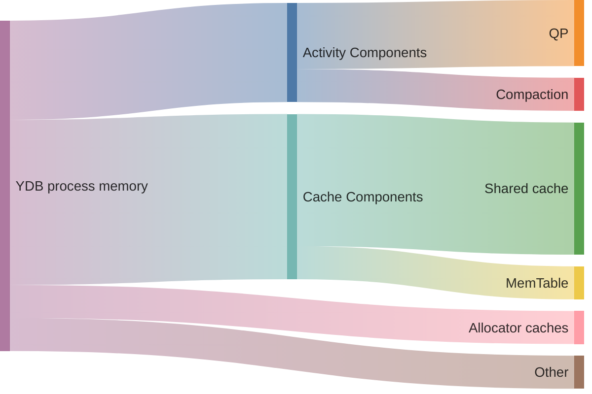

# memory_controller_config

Inside [nodes](../../concepts/glossary.md#database-node), {{ ydb-short-name }} runs many different components that use memory. Most of them require a fixed amount of memory, but some can flexibly vary the amount of memory they use, thereby improving the performance of the entire system.

## Overview of memory consumption inside a YDB node by component





If {{ ydb-short-name }} components allocate more memory than is physically available, the operating system will likely [terminate](https://en.wikipedia.org/wiki/Out_of_memory#Recovery) the entire {{ ydb-short-name }} process, which is highly undesirable. The goal of the memory controller is to allow {{ ydb-short-name }} to avoid out-of-memory situations while efficiently using the available memory.

Examples of components managed by the memory controller:

- [Shared cache](../../concepts/glossary.md#shared-cache): stores recently accessed data pages read from [distributed storage](../../concepts/glossary.md#distributed-storage) to reduce disk I/O operations and speed up data retrieval.
- [MemTable](../../concepts/glossary.md#memtable): contains data that has not yet been written to [SST](../../concepts/glossary.md#sst).
- [Query Processor](../../concepts/glossary.md#kqp): stores intermediate query processing results.
- [Compaction](../../concepts/glossary.md#compaction): the process of ordering and cleaning data that runs automatically (in the background) to optimize storage volume.
- Allocator caches: store memory blocks that have been freed but not yet returned to the operating system.

Memory limits can be configured to control overall memory usage, ensuring efficient database operation within available resources.

## Hard memory limit {#hard-memory-limit}

The hard memory limit defines the total amount of memory available to the {{ ydb-short-name }} process.

By default, the hard memory limit for the {{ ydb-short-name }} process equals the memory limit specified in its [cgroups](https://en.wikipedia.org/wiki/Cgroups).

In environments without a cgroups memory limit, the default hard memory limit equals the total amount of available host memory. This configuration allows the database to use all available resources but may lead to resource contention with other processes on the same host. Although the memory controller tries to account for this external consumption, such usage is not recommended.

The hard memory limit can also be set in the configuration. Note that the database process may still exceed this limit. Therefore, it is strongly recommended to use cgroups memory limits in production environments for strict memory control.

Most other memory limits can be configured either in absolute bytes or as percentages relative to the hard memory limit. Using percentages is convenient for managing clusters with nodes of different capacities. If both absolute byte limits and percentage limits are specified, the memory controller uses a combination of both (maximum for lower limits and minimum for upper limits).

Example of a `memory_controller_config` section with a specified hard memory limit:


```yaml
memory_controller_config:
  hard_limit_bytes: 16106127360
```


## Soft memory limit {#soft-memory-limit}

The soft memory limit defines a dangerous threshold that the {{ ydb-short-name }} process should not exceed under normal circumstances.

If the soft limit is exceeded, {{ ydb-short-name }} gradually reduces the size of the [shared cache](../../concepts/glossary.md#shared-cache) to zero. In this case, you should add more database nodes to the cluster or reduce memory limits for individual components as soon as possible.

## Target memory usage {#target-memory-utilization}

Target memory usage defines a memory usage threshold for the {{ ydb-short-name }} process that is considered optimal.

Flexible cache sizes are calculated according to their limits to keep the process memory consumption near this value.

For example, in a database that uses little memory for query execution, caches use memory near this threshold, and the remaining memory stays free. If query execution starts consuming more memory, caches begin to reduce their sizes to the minimum threshold.

## Memory limits for individual components

Inside {{ ydb-short-name }}, there are two different types of components.

The first type of components, or cache components, function as caches, for example, storing recently used data. Each cache component has minimum and maximum threshold values for the memory limit, allowing it to dynamically adjust its capacity based on the current memory consumption of the {{ ydb-short-name }} process.

The second type of components, or activity components, allocate memory for specific tasks, such as executing queries or the compaction process. Each activity component has a fixed memory limit. There is also an additional shared memory limit for such components, from which they attempt to obtain the necessary memory.

Many other auxiliary components and processes run in parallel with the {{ ydb-short-name }} process, consuming memory. Currently, these components do not have any memory limits.

### Memory limits for cache components {#cache-memory-limits}

Cache components include:

- Shared cache.
- MemTable.

The limits of each cache component are dynamically recalculated every second, so that each component consumes memory proportionally to its limit values, and the total memory consumption remains around the target memory usage.

The minimum threshold of the memory limit for cache components is not reserved, meaning that memory remains available until it is actually used. However, once this memory is filled, components typically retain data, operating within their current memory limit. Thus, the sum of the minimum memory limits of cache components is expected to be less than the target memory usage.

If necessary, both minimum and maximum threshold values should be overridden; otherwise, if a threshold value is missing, it will take the default value.

Example of the `memory_controller_config` section with specified shared cache limits:


```yaml
memory_controller_config:
  shared_cache_min_percent: 10
  shared_cache_max_percent: 30
```


### Memory limits for activity components

Activity components include:

- Query Processor.
- Compaction.

The memory limit for each activity component specifies the maximum amount of memory it can attempt to use. However, to prevent the {{ ydb-short-name }} process from exceeding the soft memory limit, the total consumption of activity components is limited by an additional limit called the activity memory limit. If the total memory usage of active components exceeds this limit, any additional memory requests will be denied. When query execution approaches the memory limits, {{ ydb-short-name }} activates [spilling](../../concepts/query_execution/spilling.md) to temporarily save intermediate data to disk, preventing memory limit violations.

Thus, although the total individual limits of activity components may collectively exceed the activity memory limit, the individual limit of each component must be less than this overall limit. Additionally, the sum of the minimum memory limits for cache components plus the activity memory limit must be less than the soft memory limit.

There are other activity components that currently do not have any individual memory limits.

Example of the `memory_controller_config` section with the specified limit for QP:


```yaml
memory_controller_config:
  query_execution_limit_percent: 25
```


#### Query Processor memory limit {#query-execution-limit}

The `query_execution_limit_percent` (default 20% of the [hard memory limit](#hard-memory-limit)) and `query_execution_limit_bytes` parameters set the size of the RAM pool that Resource Manager allocates to queries on a node:

If both parameters are set, the effective limit is `min(query_execution_limit_percent × hard_limit_bytes / 100, query_execution_limit_bytes)`. If only one parameter is set, its value is used.

The computed limit is passed to Resource Manager via Resource Broker.

The [`spilling_percent`](table_service_config.md#spilling-percent) threshold in `table_service_config` is calculated relative to this pool.

## Configuration parameters

Each configuration parameter applies in the context of a single database node.

As mentioned earlier, the sum of the minimum memory limits for cache components plus the activity memory limit is expected to be less than the soft memory limit.

This constraint can be expressed in a simplified form:

$shared_cache_min_percent + mem_table_min_percent + activities_limit_percent < soft_limit_percent$

Or in a detailed form:

$Max(shared_cache_min_percent * hard_limit_bytes / 100, shared_cache_min_bytes) + Max(mem_table_min_percent * hard_limit_bytes / 100, mem_table_min_bytes) + Min(activities_limit_percent * hard_limit_bytes / 100, activities_limit_bytes) < Min(soft_limit_percent * hard_limit_bytes / 100, soft_limit_bytes)$

| Parameters | Default value | Description |
| --- | --- | --- |
| `hard_limit_bytes` | CGroup memory limit /<br/>Host memory | Hard limit for memory usage. |
| `soft_limit_percent` /<br/>`soft_limit_bytes` | 75% | Soft limit for memory usage. |
| `target_utilization_percent` /<br/>`target_utilization_bytes` | 50% | Target memory usage. |
| `activities_limit_percent` /<br/>`activities_limit_bytes` | 30% | Memory limit for activities. |
| `shared_cache_min_percent` /<br/>`shared_cache_min_bytes` | 20% | Minimum threshold for the shared cache memory limit. |
| `shared_cache_max_percent` /<br/>`shared_cache_max_bytes` | 50% | Maximum threshold for the shared cache memory limit. |
| `mem_table_min_percent` /<br/>`mem_table_min_bytes` | 1% | Minimum threshold for the MemTable memory limit. |
| `mem_table_max_percent` /<br/>`mem_table_max_bytes` | 3% | Maximum threshold for the MemTable memory limit. |
| `query_execution_limit_percent` /<br/>`query_execution_limit_bytes` | 20% | Memory limit for QP. |
| `compaction_limit_percent` /<br/>`compaction_limit_bytes` | 10% | Memory limit for compaction. |
