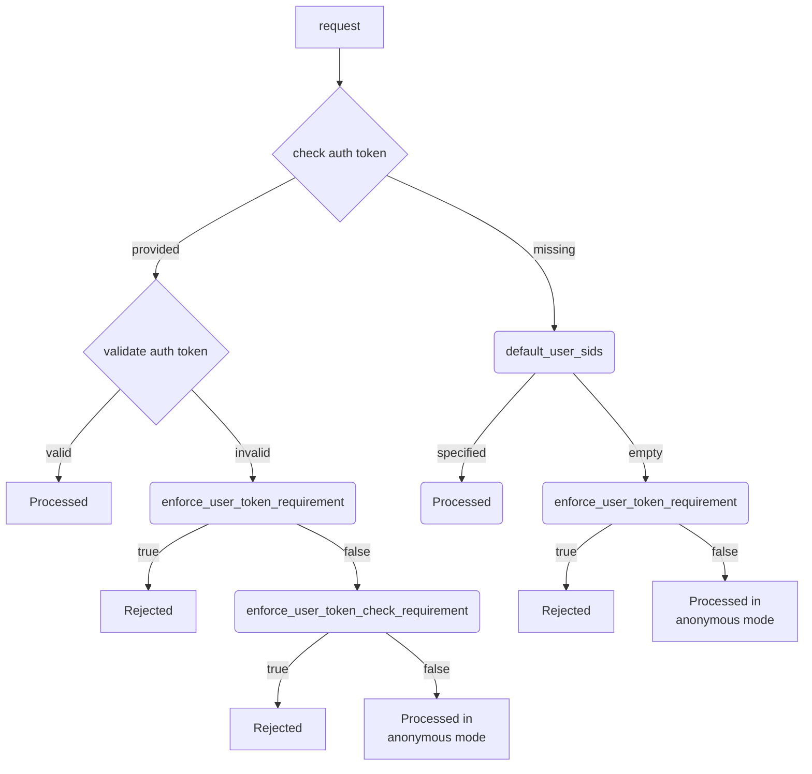

# security_config

The `security_config` section defines [authentication](../../security/authentication.md) modes, the initial configuration of local [users](../../concepts/glossary.md#access-user) and [groups](../../concepts/glossary.md#access-group), and their [access rights](../../concepts/glossary.md#access-right).

```yaml
security_config:
  # authentication mode configuration
  enforce_user_token_requirement: false
  enforce_user_token_check_requirement: false
  default_user_sids: <authentication token for anonymous requests>
  all_authenticated_users: <group name for all authenticated users>
  all_users_group: <group name for all users>

  # initial security configuration
  default_users: <default user list>
  default_groups: <default group list>
  default_access: <default access rights on the cluster scheme root>

  # access list configuration
  viewer_allowed_sids: <list of SIDs that are allowed to view the cluster state>
  monitoring_allowed_sids: <list of SIDs that are allowed to monitor and change the cluster state>
  administration_allowed_sids: <list of SIDs that are allowed cluster administration>
  register_dynamic_node_allowed_sids: <list of SIDs that are allowed to register database nodes in the cluster>

  # built-in security configuration
  disable_builtin_security: false
  disable_builtin_groups: false
  disable_builtin_access: false
```

## Configuring Authentication Mode {#security-auth}

#|
|| Parameter | Description ||
|| `enforce_user_token_requirement` | Selects user [authentication](../../security/authentication.md) mode.

- `enforce_user_token_requirement: true` — User authentication is mandatory. Requests to {{ ydb-short-name }} must include an [auth token](../../concepts/glossary.md#auth-token).

    Requests to {{ ydb-short-name }} undergo authentication and authorization.

- `enforce_user_token_requirement: false` — User authentication is optional. Requests to {{ ydb-short-name }} are not required to include an [auth token](../../concepts/glossary.md#auth-token).

    Requests without an auth token are processed in [anonymous mode](../../security/authentication.md#anonymous) without authorization.

    Requests with an auth token undergo authentication and authorization. However, requests are still processed in anonymous mode if an authentication error occurs.

    When `enforce_user_token_check_requirement: true`, requests with authentication errors are blocked.

[//]: # (TODO: Add a reference to errors during access rights verification, when the doc is added)

If the `default_user_sids` parameter is defined and not empty (see the description below), its value is used instead of the missing auth token. In this case, authentication and authorization are performed for the [access subject](../../concepts/glossary.md#access-subject) defined in `default_user_sids`.

Default value: `false`.
    ||
|| `enforce_user_token_check_requirement` | Forbids ignoring authentication errors in the `enforce_user_token_requirement: false` mode.

Default value: `false`.
    ||
|| `default_user_sids` | Specifies a list of [SIDs](../../concepts/glossary.md#access-sid) for authenticating incoming requests without an [auth token](../../concepts/glossary.md#auth-token).

`default_user_sids` acts as an auth token for anonymous requests. The first element in the list must be a user SID. The following elements must be the SIDs of groups to which the user belongs.

If the `default_user_sids` list is not empty, mandatory authentication mode (`enforce_user_token_requirement: true`) can be used for anonymous requests. This mode can be used in some {{ ydb-short-name }} testing scenarios or for educational purposes in local {{ ydb-short-name }} installations.

Default value: empty.
    ||
|| `all_authenticated_users` | Specifies the name of the virtual [group](../../concepts/glossary.md#access-group) that includes all authenticated [users](../../concepts/glossary.md#access-user).

This virtual group is created automatically by {{ ydb-short-name }}. You cannot delete this virtual group, list its members, or modify them.
You can use this group to grant [access rights](../../concepts/glossary.md#access-right) on [scheme objects](../../concepts/glossary.md#scheme-object).



You can get information about access rights on scheme objects in the system views. For more information see, [{#T}](../../dev/system-views#informaciya-o-pravah-dostupa).



Default value: `all-users@well-known`.
    ||
|| `all_users_group` | Specifies the name of the [group](../../concepts/glossary.md#access-group) that includes all local [users](../../concepts/glossary.md#access-user).

If `all_users_group` is not empty, all local users will be added to the group with this name upon creation. The group specified in this parameter must exist when new users are added.

The `all_users_group` parameter is used during the initialization of [built-in security](../../security/builtin-security.md).

Default value: empty.
    ||
|#

The following diagram displays the relationship between authentication mode parameters described above:



## Bootstrapping Security {#security-bootstrap}

The `default_users`, `default_groups`, and `default_access` parameters affect the initial {{ ydb-short-name }} cluster configuration that occurs when {{ ydb-short-name }} starts for the first time. During subsequent runs, the initial configuration is not repeated, and these parameters are ignored.

See [{#T}](../../security/builtin-security.md) and the related [`domains_config`](domains_config.md) parameters.

#|
|| Parameter | Description ||
|| `default_users` | The list of [users](../../concepts/glossary.md#access-user) to be created when the {{ ydb-short-name }} cluster starts for the first time.

The list consists of login-password pairs. The first user in the list is a [superuser](../../security/builtin-security.md#superuser).



Passwords are specified in plain text, so it is unsafe to use them for an extended period. You must change these passwords in {{ ydb-short-name }} after the first start. For example, use the [`ALTER USER`](../../yql/reference/syntax/alter-user.md) statement.

[//]: # (TODO: Elaborate on blocking these users, when this feature is available)



Example:

```yaml
default_users:
- name: root
  password: <...>
- name: user1
  password: <...>
```

Errors in the `default_users` list, such as duplicate logins, are logged but do not affect {{ ydb-short-name }} cluster startup.

    ||
|| `default_groups` | The list of [groups](../../concepts/glossary.md#access-group) to be created when the {{ ydb-short-name }} cluster starts for the first time.

The list includes groups and their members.



These groups are created for the entire {{ ydb-short-name }} cluster.



Example:

```yaml
default_groups:
- name: ADMINS
  members: root
- name: USERS
  members:
  - ADMINS
  - root
  - user1
```

The order of groups in this list matters: groups are created in the order in which they appear in the `default_groups` parameter. Group members must exist before the group is created. Nonexistent users will not be added to the group.

Failures to add users to groups are logged but do not affect the {{ ydb-short-name }} cluster startup.

    ||
|| `default_access` | The list of [access rights](../../concepts/glossary.md#access-right) to be granted on the cluster scheme root.

Access rights are specified using the [short access control notation](../../security/short-access-control-notation.md).

Example:

```yaml
default_access:
- +(CDB|DDB|GAR):ADMINS
- +(ConnDB):USERS
```

    ||
|#

Errors in access right entries are logged but do not affect {{ ydb-short-name }} cluster startup. Access rights with errors will not be granted.

## Configuring Administrative and Other Privileges {#security-access-levels}

Access control in {{ ydb-short-name }} is divided into two segments:

- [Access control lists](../../concepts/glossary.md#access-control-list) for [scheme objects](../../concepts/glossary.md#scheme-object)
- [Access level lists](../../concepts/glossary.md#access-level-list) to define additional privileges or restrictions

Both segments are used in combination: a [subject](../../concepts/glossary.md#access-subject) is granted the privilege to perform an action only if both segments allow it. The action is not allowed if either segment denies it.

Access levels are defined by the `viewer_allowed_sids`, `monitoring_allowed_sids`, and `administration_allowed_sids` lists in the cluster configuration. The access levels of subjects determine their privileges to manage [scheme objects](../../concepts/glossary.md#scheme-object) as well as privileges that are not related to scheme objects.

[//]: # (TODO: add a link to the viewer api reference and the required privileges, when available)

#|
|| Parameter | Description ||
|| `viewer_allowed_sids` | The list of [SIDs](../../concepts/glossary.md#access-sid) with the viewer access level.

This level allows viewing the cluster state, which is not publicly accessible (including most pages in the [Embedded UI](../embedded-ui/ydb-monitoring.md)). No changes are allowed.
    ||
|| `monitoring_allowed_sids` | The list of [SIDs](../../concepts/glossary.md#access-sid) with the operator access level.

This level grants additional privileges to monitor and modify the cluster state. For example, it allows performing a backup, restoring a database, or executing YQL statements in the Embedded UI.
    ||
|| `administration_allowed_sids` | The list of [SIDs](../../concepts/glossary.md#access-sid) with the administrator access level.

This level grants privileges to administer the {{ ydb-short-name }} cluster and its databases.
    ||
|| `register_dynamic_node_allowed_sids` | The list of [SIDs](../../concepts/glossary.md#access-sid) that are allowed to register database nodes.

For technical reasons, this list must include `root@builtin`.
    ||
|#



The access level lists are empty by default.

An empty list grants its access level to any user, including anonymous users.

If all three lists are empty, any user has the administrative access level.

For a secure {{ ydb-short-name }} deployment, plan the access model beforehand and define the group lists before starting the cluster for the first time.



The access level lists can include the SIDs of [users](../../concepts/glossary.md#access-user) or [user groups](../../concepts/glossary.md#access-group). A user belongs to an access level list if the list includes the SID of the user or the SID of a group to which the user or its subgroup (recursively) belongs.

It is recommended to add user groups and separate service accounts to the `*_allowed_sids` access level lists. This way, granting access levels to individual users does not require changing the {{ ydb-short-name }} cluster configuration.



Access level lists are layers of additional privileges:

- An access subject that is not included in any access level list can view only publicly available information about the cluster (for example, [a list of databases on the cluster](../embedded-ui/ydb-monitoring.md#tenant_list_page) or [a list of cluster nodes](../embedded-ui/ydb-monitoring.md#node_list_page)).
- Each of the `viewer_allowed_sids`, `monitoring_allowed_sids`, and `administration_allowed_sids` lists adds privileges to the access subject. For the maximum level of privileges, an access subject must be added to all three access level lists.
- Adding an access subject to the `monitoring_allowed_sids` or `administration_allowed_sids` list without adding it to `viewer_allowed_sids` has no effect.

For example:

- An operator (the SID of the user or the group to which the user belongs) must be added to `viewer_allowed_sids` and `monitoring_allowed_sids`.
- An administrator must be added to `viewer_allowed_sids`, `monitoring_allowed_sids`, and `administration_allowed_sids`.



## Built-in Security Configuration

The `disable_builtin_security`, `disable_builtin_groups`, and `disable_builtin_access` flags affect the built-in security configuration that occurs when {{ ydb-short-name }} starts for the first time.

#|
|| Parameter | Description ||
|| `disable_builtin_security` | Disable the [built-in security configuration](../../security/builtin-security.md).
Built-in security configuration automatically creates a `root` superuser, a set of built-in user groups, and grants access rights to these groups at the root of the cluster.

This flag is not saved in the cluster configuration.

Default value: `false`.
    ||
|| `disable_builtin_groups` | Do not create [built-in user groups](../../security/builtin-security.md) even if the default user groups are not specified in the [`security_config.default_groups`](security_config.md) parameter.

Default value: `false`
    ||
|| `disable_builtin_access` | Do not add access rights at the root of the cluster scheme for the [built-in user groups](../../security/builtin-security.md) even if the default access rights are not specified in the [`security_config.default_access`](security_config.md) parameter.

Default value: `false`
    ||
|#