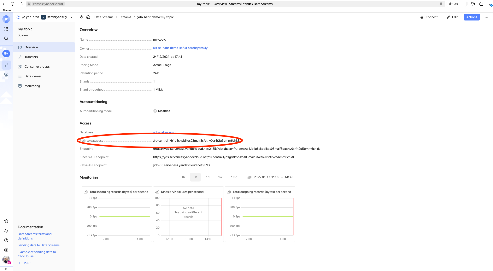
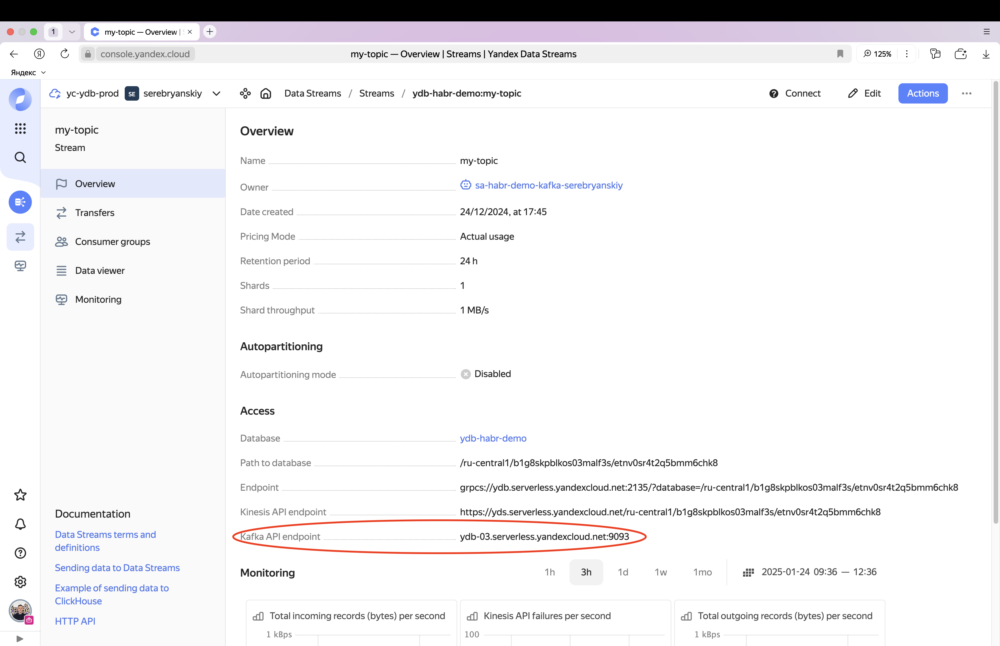

# Kafka API Usage examples

This example shows a code snippet for reading data from a topic via Kafka API without a consumer group (Manual Partition Assignment).
You don't need to create a consumer for this reading mode.

Before proceeding with the examples:

1. [Create a topic](../ydb-cli/topic-create.md).
2. [Add a consumer](../ydb-cli/topic-consumer-add.md).
3. If authentication is enabled, [create a user](../../security/authorization.md#user).

## How to Try the Kafka API {#how-to-try-kafka-api}

### In Docker {#how-to-try-kafka-api-in-docker}

Run Docker following [this guide](../../quickstart#install) and the Kafka API will be available on port 9092.

### In Yandex Cloud {#how-to-try-kafka-api-in-cloud}

You can try working with YDB topics via the Kafka API for free ([in small volumes](https://yandex.cloud/en/docs/data-streams/pricing?from=int-console-help-center-or-nav#prices)) in Yandex Cloud.
To do this in your [Yandex Cloud console](https://console.yandex.cloud):

1. Create a [YDB database](https://yandex.cloud/en/docs/ydb/quickstart) if you don't have one yet
2. Create a [Yandex Data Streams queue](https://yandex.cloud/en/docs/data-streams/quickstart)
3. Create a [service account](https://yandex.cloud/en/docs/iam/operations/sa/create) if you don't have one yet
   and assign this service account the roles of ydb.viewer (to read data from the stream), ydb.editor (to write data to the stream), and ydb.kafkaApi.client (to access the data stream via the Kafka API)
4. Create an [API key](https://yandex.cloud/en/docs/iam/operations/sa/create-access-key) for this service account.
   For the key, select Scope - yc.ydb.topics.manage, you can also set a description and expiration date.

Authentication is required to work with Yandex Cloud, see authentication examples [below](#authentication-in-cloud-examples).

## Kafka API Usage Examples

### Reading

When reading, the distinctive features of the Kafka API are:

- absence of support for the [check.crcs](https://kafka.apache.org/documentation/#consumerconfigs_check.crcs) option;
- only one partition assignment strategy - roundrobin;
- no ability to read without a pre-created consumer group

Therefore, in the consumer configuration, you must always specify the **consumer group name** and the parameters:

- `check.crc=false`
- `partition.assignment.strategy=org.apache.kafka.clients.consumer.RoundRobinAssignor`

Below are examples of reading using the Kafka protocol for various applications, programming languages, and frameworks without authentication.
For examples of how to set up authentication, see the section [Authentication Examples](#authentication-examples)



- Built-in Kafka CLI tools

  

  When using Kafka CLI tools with Java 23 and encountering the error
  `java.lang.UnsupportedOperationException: getSubject is supported only if a security manager is allowed`,
  either run the command using a different version of Java ([how to change the Java version on macOS](https://stackoverflow.com/questions/21964709/how-to-set-or-change-the-default-java-jdk-version-on-macos)),
  or run the command specifying the java flag `-Djava.security.manager=allow`.
  For example: `KAFKA_OPTS=-Djava.security.manager=allow kafka-topics --bootstrap-servers localhost:9092 --list`

  

  ```bash
  kafka-console-consumer --bootstrap-server localhost:9092 \
    --topic my-topic  \
    --group my-group \
    --from-beginning \
    --consumer-property check.crcs=false \
    --consumer-property partition.assignment.strategy=org.apache.kafka.clients.consumer.RoundRobinAssignor
  ```

- kcat

  ```bash
  kcat -C \
      -b <ydb-endpoint> \
      -X check.crcs=false \
      -X partition.assignment.strategy=org.apache.kafka.clients.consumer.RoundRobinAssignor \
      -G <consumer-name> <topic-name>
  ```

- Java

  ```java
  String HOST = "<ydb-endpoint>";
  String TOPIC = "<topic-name>";
  String CONSUMER = "<consumer-name>";

  Properties props = new Properties();

  props.put("bootstrap.servers", HOST);

  props.put("key.deserializer", StringDeserializer.class.getName());
  props.put("value.deserializer", StringDeserializer.class.getName());

  props.put("check.crcs", false);
  props.put("partition.assignment.strategy", RoundRobinAssignor.class.getName());

  props.put("group.id", CONSUMER);
  Consumer<String, String> consumer = new KafkaConsumer<>(props);
  consumer.subscribe(Arrays.asList(new String[] {TOPIC}));

  while (true) {
      ConsumerRecords<String, String> records = consumer.poll(10000); // timeout 10 sec
      for (ConsumerRecord<String, String> record : records) {
          System.out.println(record.key() + ":" + record.value());
      }
  }
  ```

- Spark

   Apache Spark when working with Kafka does not use any of the existing limitations of the Kafka API in YDB Topics. Due to this,
   all features of Spark-Kafka integrations should work through YDB Topics Kafka API.

  ```java
  public class ExampleReadApp {
      public static void main(String[] args) {
        var conf = new SparkConf().setAppName("my-app").setMaster("local");
        var context = new SparkContext(conf);

        context.setCheckpointDir("checkpoints");
        SparkSession spark = SparkSession.builder()
                .sparkContext(context)
                .config(conf)
                .appName("Simple Application")
                .getOrCreate();

        Dataset<Row> df = spark
                .read()
                .format("kafka")
                .option("kafka.bootstrap.servers", "localhost:9092")
                .option("subscribe", "flink-demo-input-topic")
                .option("kafka.group.id", "spark-example-app")
                .option("startingOffsets", "earliest")
                .option("kafka." + ConsumerConfig.CHECK_CRCS_CONFIG, "false")
                .load();

        df.foreach((ForeachFunction<Row>) row -> {
            System.out.println(row);
        });
      }
  }
  ```

  In the example above, Apache Spark 2.12:3.5.3 with dependency on `org.apache.spark:spark-streaming-kafka-0-10_2.12:3.5.3` was used.

- Flink

  

   Currently, not all functionality of Flink is supported for reading and writing. The following limitations exist:
  - Exactly once functionality via Kafka API is not supported at the moment, as transaction support in Kafka API is still under development;
  - Subscription to topics using a pattern is currently unavailable;
  - Using message CreateTime as a watermark is not available at the moment, as the current read time is used instead of CreateTime (this bug will be fixed in future versions).

  

  ```java
    public class YdbKafkaApiReadExample {
   
        public static void main(String[] args) throws Exception {
            final StreamExecutionEnvironment env = StreamExecutionEnvironment.getExecutionEnvironment()
                    .enableCheckpointing(5000, CheckpointingMode.AT_LEAST_ONCE);
   
            Configuration config = new Configuration();
            config.set(CheckpointingOptions.CHECKPOINT_STORAGE, "filesystem");
            config.set(CheckpointingOptions.CHECKPOINTS_DIRECTORY, "file:///path/to/your/checkpoints");
            env.configure(config);
   
            KafkaSource<String> kafkaSource = KafkaSource.<String>builder()
                    .setBootstrapServers("localhost:9092")
                    .setProperty(ConsumerConfig.CHECK_CRCS_CONFIG, "false")
                    .setGroupId("flink-demo-consumer")
                    .setTopics("my-topic")
                    .setStartingOffsets(OffsetsInitializer.earliest())
                    .setBounded(OffsetsInitializer.latest())
                    .setValueOnlyDeserializer(new SimpleStringSchema())
                            .build();
   
            env.fromSource(kafkaSource, WatermarkStrategy.noWatermarks(), "kafka-source").print();
   
            env.execute("YDB Kafka API example read app");
        }
    }
  ```

  In the example above, Apache Flink 1.20 is used along with [flink datastream connector](https://nightlies.apache.org/flink/flink-docs-release-1.20/docs/connectors/datastream/kafka/) to Kafka.



#### Frequent problems and solutions

##### Unexpected error in join group response

Full text of an exception:

```txt
Unexpected error in join group response: This most likely occurs because of a request being malformed by the client library or the message was sent to an incompatible broker. See the broker logs for more details.
```

Most likely it means that consumer group is not specified or if specified it does not exist in YDB cluster.

Solution: create consumer group in YDB using [CLI](../ydb-cli/topic-consumer-add) or [SDK](../ydb-sdk/topic#alter-topic)

### Запись



Currently, writing via Kafka API using Kafka transactions is not supported. Transactions are only available when using the [YDB Topic API](https://ydb.tech/docs/ru/reference/ydb-sdk/topic#write-tx).

Otherwise, writing to Apache Kafka and YDB Topics through Kafka API is no different.





- Built-in Kafka CLI tools

  

  When using Kafka CLI tools with Java 23 and encountering the error
  `java.lang.UnsupportedOperationException: getSubject is supported only if a security manager is allowed`,
  either run the command using a different version of Java ([how to change the Java version on macOS](https://stackoverflow.com/questions/21964709/how-to-set-or-change-the-default-java-jdk-version-on-macos)),
  or run the command specifying the java flag `-Djava.security.manager=allow`.
  For example: `KAFKA_OPTS=-Djava.security.manager=allow kafka-topics --bootstrap-servers localhost:9092 --list`

  

  ```bash
  kafka-console-producer --broker-list localhost:9092 --topic my-topic
  ```

- kcat

  ```bash
  echo "test message" | kcat -P \
    -b <ydb-endpoint> \
    -t <topic-name> \
    -k key
  ```

- Java

  ```java
  String HOST = "<ydb-endpoint>";
  String TOPIC = "<topic-name>";

  Properties props = new Properties();
  props.put("bootstrap.servers", HOST);
  props.put("acks", "all");

  props.put("key.serializer", StringSerializer.class.getName());
  props.put("key.deserializer", StringDeserializer.class.getName());
  props.put("value.serializer", StringSerializer.class.getName());
  props.put("value.deserializer", StringDeserializer.class.getName());

  props.put("compression.type", "none");

  Producer<String, String> producer = new KafkaProducer<>(props);
  producer.send(new ProducerRecord<String, String>(TOPIC, "msg-key", "msg-body"));
  producer.flush();
  producer.close();
  ```

- Spark

  Apache Spark when working with Kafka does not use any of the existing limitations of the Kafka API in YDB Topics. Due to this,
  all features of Spark-Kafka integrations should work through YDB Topics Kafka API.

  ```java
  public class ExampleWriteApp {
    public static void main(String[] args) {
        var conf = new SparkConf().setAppName("my-app").setMaster("local");
        var context = new SparkContext(conf);
        context.setCheckpointDir("path/to/dir/with/checkpoints");
        SparkSession spark = SparkSession.builder()
            .sparkContext(context)
              .config(conf)
              .appName("Simple Application")
              .getOrCreate();
 
        spark
              .createDataset(List.of("spark-1", "spark-2", "spark-3", "spark-4"), Encoders.STRING())
              .write()
              .format("kafka")
              .option("kafka.bootstrap.servers", "localhost:9092")
              .option("topic", "flink-demo-output-topic")
              .option("kafka.group.id", "spark-example-app")
              .option("startingOffsets", "earliest")
              .save();
      }
  }
  ```

  In the example above, Apache Spark 2.12:3.5.3 with dependency on `org.apache.spark:spark-streaming-kafka-0-10_2.12:3.5.3` was used.

- Flink

  

  Currently, not all functionality of Flink is supported for reading and writing. The following limitations exist:
   - Exactly once functionality via Kafka API is not supported at the moment, as transaction support in Kafka API is still under development;
   - Subscription to topics using a pattern is currently unavailable;
   - Using message CreateTime as a watermark is not available at the moment, as the current read time is used instead of CreateTime (this bug will be fixed in future versions).

  

  ```java
  public class YdbKafkaApiProduceExample {
      private static final String TOPIC = "my-topic";
 
      public static void main(String[] args) throws Exception {
          final StreamExecutionEnvironment env = StreamExecutionEnvironment.getExecutionEnvironment();
 
          Sink<String> kafkaSink = KafkaSink.<String>builder()
                  .setBootstrapServers("localhost:9092") // assuming ydb is running locally with kafka proxy on 9092 port
                  .setRecordSerializer(KafkaRecordSerializationSchema.builder()
                          .setTopic(TOPIC)
                          .setValueSerializationSchema(new SimpleStringSchema())
                          .setKeySerializationSchema(new SimpleStringSchema())
                          .build())
                  .setRecordSerializer((el, ctx, ts) -> new ProducerRecord<>(TOPIC, el.getBytes()))
                  .setDeliveryGuarantee(DeliveryGuarantee.AT_LEAST_ONCE)
                          .build();
 
          env.setParallelism(1)
                  .fromSequence(0, 10)
                  .map(i -> i + "")
                  .sinkTo(kafkaSink);
 
          // Execute program, beginning computation.
          env.execute("ydb_kafka_api_write_example");
      }
  }
  ```

  In the example above, Apache Flink 1.20 is used along with [flink datastream connector](https://nightlies.apache.org/flink/flink-docs-release-1.20/docs/connectors/datastream/kafka/) to Kafka.

- Logstash

  ```ruby
  output {
    kafka {
      codec => json
      topic_id => "<topic-name>"
      bootstrap_servers => "<ydb-endpoint>"
      compression_type => none
    }
  }
  ```

- Fluent Bit

  ```ini
  [OUTPUT]
    name                          kafka
    match                         *
    Brokers                       <ydb-endpoint>
    Topics                        <topic-name>
    rdkafka.client.id             Fluent-bit
    rdkafka.request.required.acks 1
    rdkafka.log_level             7
    rdkafka.sasl.mechanism        PLAIN
  ```



### Examples with Authentication {#authentication-examples}

For more details on authentication, see the section [Authentication](./auth.md). Below are examples of authentication in a cloud database and a local database.



Currently, the only available authentication mechanism with Kafka API in YDB Topics is `SASL_PLAIN`



#### Examples with Authentication in Yandex Cloud {#authentication-in-cloud-examples}

Instructions on how to try working with the Kafka API over YDB Topics in Yandex Cloud are [above](#how-to-try-kafka-api-in-cloud).

For authentication, add the following values to the Kafka connection parameters:

- `security.protocol` with value `SASL_SSL`
- `sasl.mechanism` with value `PLAIN`
- `sasl.jaas.config` with value `org.apache.kafka.common.security.plain.PlainLoginModule required username="@<path_to_database>" password="<Service Account API Key>";`

Below are examples of reading from a cloud topic, where:

- <path_to_database> is the path to the database from the topic page in YDS Yandex Cloud
  
- <kafka_api_endpoint> is the Kafka API Endpoint from the description page of YDS Yandex Cloud. It should be used as `bootstrap.servers`
  
- <api_key> is the API Key of the service account that has access to YDS

Note: in path_to_database the username is not specified, only @ is indicated, followed by the path to your database.



  ```bash
  kafka-console-consumer --bootstrap-server <kafka_api_endpoint> \
    --topic <topic-name>  \
    --group <consumer-name> \
    --from-beginning \
    --consumer-property check.crcs=false \
    --consumer-property partition.assignment.strategy=org.apache.kafka.clients.consumer.RoundRobinAssignor \
    --consumer-property security.protocol=SASL_SSL \
    --consumer-property sasl.mechanism=PLAIN \
    --consumer-property "sasl.jaas.config=org.apache.kafka.common.security.plain.PlainLoginModule required username=\"@<path_to_database>\" password=\"<api_key>\";"
  ```

- kcat

  ```bash
  kcat -C \
      -b <kafka_api_endpoint> \
      -X security.protocol=SASL_SSL \
      -X sasl.mechanism=PLAIN \
      -X sasl.username="@<path_to_database>" \
      -X sasl.password="<api_key>" \
      -X check.crcs=false \
      -X partition.assignment.strategy=roundrobin \
      -G <consumer-name> <topic-name>
  ```

- Java

  ```java
  String TOPIC = "<topic-name>";
  String CONSUMER = "<consumer-name>";

  Properties props = new Properties();

  props.put("bootstrap.servers", <kafka_api_endpoint>);

  props.put("key.deserializer", StringDeserializer.class.getName());
  props.put("value.deserializer", StringDeserializer.class.getName());

  props.put("check.crcs", false);
  props.put("partition.assignment.strategy", RoundRobinAssignor.class.getName());
 
  props.put("security.protocol", "SASL_SSL");
  props.put("sasl.mechanism", "PLAIN");
  props.put("sasl.jaas.config", "sasl.jaas.config=org.apache.kafka.common.security.plain.PlainLoginModule required username=\"@<path_to_database>\" password=\"<api_key>\";");

  props.put("group.id", CONSUMER);
  Consumer<String, String> consumer = new KafkaConsumer<>(props);
  consumer.subscribe(Arrays.asList(new String[] {TOPIC}));

  while (true) {
      ConsumerRecords<String, String> records = consumer.poll(10000); // timeout 10 sec
      for (ConsumerRecord<String, String> record : records) {
          System.out.println(record.key() + ":" + record.value());
      }
  }
  ```



#### Examples with Authentication in a local database

To test working with authentication in a local database:

1. Create a user. [How to do this in YQL](https://ydb.tech/docs/ru/yql/reference/syntax/create-user). [How to execute YQL from CLI](https://ydb.tech/docs/ru/reference/ydb-cli/yql).
2. Connect to the Kafka API as shown in the examples below. In all examples, it is assumed that:

   - YDB is running locally with the environment variable YDB_KAFKA_PROXY_PORT=9092, meaning that the Kafka API is available at localhost:9092. You can run YDB in Docker for instance as described [here](https://ydb.tech/docs/ru/quickstart#install).
   - <username> is the username you specified when creating the user.
   - <password> is the user's password you specified when creating the user.

Examples are shown for reading, but the same configuration parameters work for writing to a topic as well.



  ```bash
  kafka-console-consumer --bootstrap-server localhost:9092 \
    --topic <topic-name>  \
    --group <consumer-name> \
    --from-beginning \
    --consumer-property check.crcs=false \
    --consumer-property partition.assignment.strategy=org.apache.kafka.clients.consumer.RoundRobinAssignor \
    --consumer-property security.protocol=SASL_PLAINTEXT \
    --consumer-property sasl.mechanism=PLAIN \
    --consumer-property "sasl.jaas.config=org.apache.kafka.common.security.plain.PlainLoginModule required username=\"<username>\" password=\"<password>\";"
  ```

- kcat

  ```bash
  kcat -C \
      -b localhost:9092 \
      -X security.protocol=SASL_PLAINTEXT \
      -X sasl.mechanism=PLAIN \
      -X sasl.username="<username>" \
      -X sasl.password="<password>" \
      -X check.crcs=false \
      -X partition.assignment.strategy=roundrobin \
      -G <consumer-name> <topic-name>
  ```

- Java

  ```java
  String TOPIC = "<topic-name>";
  String CONSUMER = "<consumer-name>";

  Properties props = new Properties();

  props.put("bootstrap.servers", "localhost:9092");

  props.put("key.deserializer", StringDeserializer.class.getName());
  props.put("value.deserializer", StringDeserializer.class.getName());

  props.put("check.crcs", false);
  props.put("partition.assignment.strategy", RoundRobinAssignor.class.getName());
 
  props.put("security.protocol", "SASL_PLAINTEXT");
  props.put("sasl.mechanism", "PLAIN");
  props.put("sasl.jaas.config", "sasl.jaas.config=org.apache.kafka.common.security.plain.PlainLoginModule required username=\"<username>\" password=\"<password>\";");

  props.put("group.id", CONSUMER);
  Consumer<String, String> consumer = new KafkaConsumer<>(props);
  consumer.subscribe(Arrays.asList(new String[] {TOPIC}));

  while (true) {
      ConsumerRecords<String, String> records = consumer.poll(10000); // timeout 10 sec
      for (ConsumerRecord<String, String> record : records) {
          System.out.println(record.key() + ":" + record.value());
      }
  }
  ```

