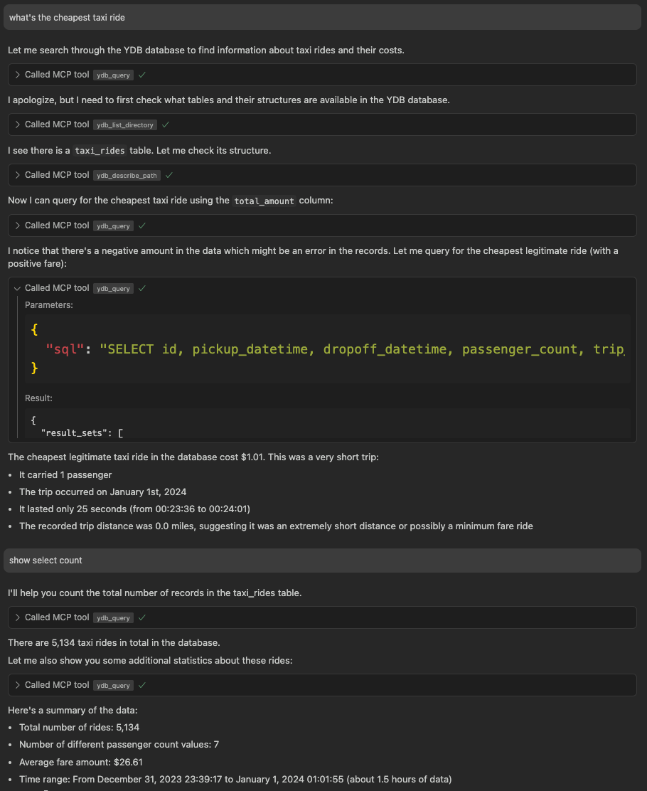

# {{ ydb-short-name }} Model Context Protocol Server

[{{ ydb-short-name }} Model Context Protocol (MCP) server](https://github.com/ydb-platform/ydb-mcp) allows you to work with {{ ydb-short-name }} databases from any [Large Language Model (LLM)](https://en.wikipedia.org/wiki/Large_language_model) that supports [MCP](https://github.com/modelcontextprotocol/servers) using any of the [MCP clients](https://modelcontextprotocol.io/clients). This integration enables AI-powered database operations and natural language interactions with your {{ ydb-short-name }} instances.

## Getting Started

### Prerequisites

{{ ydb-short-name }} MCP server is a Python application that is typically co-hosted with the MCP client. There are multiple options for installing and running the {{ ydb-short-name }} MCP server explained below, but all of them require a pre-installed Python 3.10+ environment.

### Anonymous Authentication



- uvx

  [uvx](https://docs.astral.sh/uv/guides/tools/) allows you to run Python applications without explicitly installing them.

  Configure {{ ydb-short-name }} MCP in your MCP client settings:

  ```json
  {
    "mcpServers": {
      "ydb": {
        "command": "uvx",
        "args": [
          "ydb-mcp",
          "--ydb-endpoint", "grpc://localhost:2136/local"
        ]
      }
    }
  }
  ```

- pipx

  [pipx](https://pipx.pypa.io/stable/installation/) allows you to run applications from PyPI without explicit installation (pipx itself must be installed first).

  Configure {{ ydb-short-name }} MCP in your MCP client settings:

  ```json
  {
    "mcpServers": {
      "ydb": {
        "command": "pipx",
        "args": [
          "run", "ydb-mcp",
          "--ydb-endpoint", "grpc://localhost:2136/local"
        ]
      }
    }
  }
  ```

- pip

  Optionally, create and activate a [Python virtual environment](https://docs.python.org/3/library/venv.html). Install {{ ydb-short-name }} MCP using [pip](https://pypi.org/project/pip/):

  ```bash
  pip install ydb-mcp
  ```

  Configure {{ ydb-short-name }} MCP in your MCP client settings:

  ```json
  {
    "mcpServers": {
      "ydb": {
        "command": "python3",
        "args": [
          "-m", "ydb_mcp",
          "--ydb-endpoint", "grpc://localhost:2136/local"
        ]
      }
    }
  }
  ```



## Login-Password Authentication



- uvx

  Configure login/password authentication with `uvx`:

  ```json
  {
    "mcpServers": {
      "ydb": {
        "command": "uvx",
        "args": [
          "ydb-mcp",
          "--ydb-endpoint", "grpc://localhost:2136/local",
          "--ydb-auth-mode", "login-password",
          "--ydb-login", "<your-username>",
          "--ydb-password", "<your-password>"
        ]
      }
    }
  }
  ```

- pipx

  Configure login/password authentication with `pipx`:

  ```json
  {
    "mcpServers": {
      "ydb": {
        "command": "pipx",
        "args": [
          "run", "ydb-mcp",
          "--ydb-endpoint", "grpc://localhost:2136/local",
          "--ydb-auth-mode", "login-password",
          "--ydb-login", "<your-username>",
          "--ydb-password", "<your-password>"
        ]
      }
    }
  }
  ```

- pip

  Configure login/password authentication with `pip`-installed {{ ydb-short-name }} MCP:

  ```json
  {
    "mcpServers": {
      "ydb": {
        "command": "python3",
        "args": [
          "-m", "ydb_mcp",
          "--ydb-endpoint", "grpc://localhost:2136/local",
          "--ydb-auth-mode", "login-password",
          "--ydb-login", "<your-username>",
          "--ydb-password", "<your-password>"
        ]
      }
    }
  }
  ```



### Run Queries

Ask your LLM questions regarding the data stored in {{ ydb-short-name }} using the MCP client configured above. The language model will see the tools available to it via MCP and will use them to execute [YQL](../../../yql/reference/index.md) queries and other {{ ydb-short-name }} API calls. An example of how it might look:



## Available Tools

{{ ydb-short-name }} MCP provides the following tools for interacting with {{ ydb-short-name }} databases:

* `ydb_query`: Run a SQL query against a {{ ydb-short-name }} database
  * Parameters:
    * `sql`: SQL query string to execute

* `ydb_query_with_params`: Run a parameterized SQL query with JSON parameters
  * Parameters:
    * `sql`: SQL query string with parameters
    * `params`: JSON string containing parameter values

* `ydb_list_directory`: List directory contents in {{ ydb-short-name }}
  * Parameters:
    * `path`: YDB directory path to list

* `ydb_describe_path`: Get detailed information about a [scheme object](../../../concepts/glossary.md#scheme-object) (table, directory, etc) located at the specified {{ ydb-short-name }} path
  * Parameters:
    * `path`: {{ ydb-short-name }} path to describe

* `ydb_status`: Get the current status of the {{ ydb-short-name }} connection

## Learn More

For more information visit the [{{ ydb-short-name }} MCP GitHub repository](https://github.com/ydb-platform/ydb-mcp).
