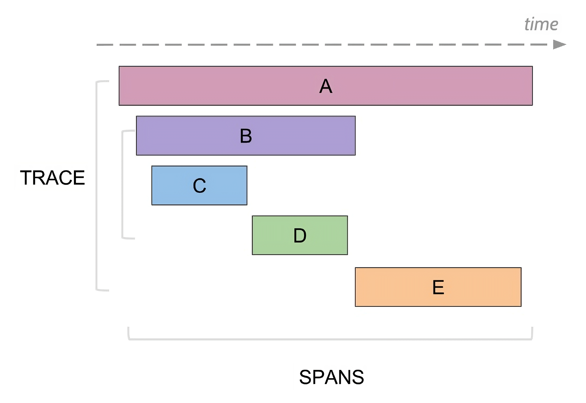

# Tracing in {{ ydb-short-name }}



The [OpenTelemetry](https://opentelemetry.io/) website describes the concept of tracing in detail in the [Observability Primer](https://opentelemetry.io/docs/concepts/observability-primer/) article.



Tracing is a tool that allows you to view the detailed path of a request through a distributed system. A set of spans describes the path of a single request (trace). A span is a time segment usually associated with the execution time of a specific operation (e.g., writing information to disk or executing a transaction). Spans form a tree, often with the subtree of a span as its detail, but this is not always the case.



To aggregate disparate spans into traces, they are sent to a *collector*. This service aggregates and stores received spans for subsequent trace analysis. {{ ydb-short-name }} does not include this service; the administrator must set it up independently. Typically, [Jaeger](https://www.jaegertracing.io/) is used as a collector.

## Minimal configuration

To enable tracing in {{ ydb-short-name }}, add the following section to the [configuration](../../../deploy/configuration/config.md):

```yaml
tracing_config:
  backend:
    opentelemetry:
      collector_url: grpc://example.com:4317
      service_name: ydb
  external_throttling:
    - max_traces_per_minute: 10
```

Here, the `collector_url` field sets the URL of an [OTLP-compatible](https://opentelemetry.io/docs/specs/otlp/) span collector. More details on the backend section can be found in the [relevant section](./setup.md#backend).

With this configuration, no requests are sampled, and no more than ten requests per minute with an [external trace-id](./external-traces.md) are traced by each cluster node.

## Section descriptions

### Backend {#backend}

#### Example section

```yaml
tracing_config:
  # ...
  backend:
    opentelemetry:
      collector_url: grpc://example.com:4317
      service_name: ydb
```

#### Description

This section describes the span collector. Currently, the only option is `opentelemetry`. Spans are pushed from the cluster node to the collector, requiring the collector to be [OTLP](https://opentelemetry.io/docs/specs/otlp/) compatible.

In the `opentelemetry` section:
* `collector_url` — the URL of the span collector. The scheme can be either `grpc://` for an insecure connection or `grpcs://` for a TLS connection.
* `service_name` — the name under which all spans will be marked.

Both parameters are mandatory.

### Uploader {#uploader}

#### Example section

```yaml
tracing_config:
  # ...
  uploader:
    max_exported_spans_per_second: 30
    max_spans_in_batch: 100
    max_bytes_in_batch: 10485760 # 10 MiB
    max_export_requests_inflight: 3
    max_batch_accumulation_milliseconds: 5000
    span_export_timeout_seconds: 120
```

#### Description

The uploader is a cluster node component responsible for sending spans to the collector. To avoid overloading the span collector, the uploader will not send more than `max_exported_spans_per_second` spans per second on average.

For optimization, the uploader sends spans in batches. Each batch contains no more than `max_spans_in_batch` spans with a total serialized size of no more than `max_bytes_in_batch` bytes. Each batch accumulates for no more than `max_batch_accumulation_milliseconds` milliseconds. Batches can be sent in parallel, with the maximum number of simultaneously sent batches controlled by the `max_export_requests_inflight` parameter. If more than `span_export_timeout_seconds` seconds have passed since the uploader received the span, the uploader may delete it to send fresher spans.

Default values:
* `max_exported_spans_per_second = inf` (no limits)
* `max_spans_in_batch = 150`
* `max_bytes_in_batch = 20000000`
* `max_batch_accumulation_milliseconds = 1000`
* `span_export_timeout_seconds = inf` (no spans are deleted by the uploader)
* `max_export_requests_inflight = 1`

The `uploader` section may be completely absent, in which case each parameter will use its default value.



The uploader is a node-local component. Therefore, the described limits apply to each node separately, not to the entire cluster.



### External throttling {#external-throttling}

#### Example section

```yaml
tracing_config:
  # ...
  external_throttling:
    - scope:
        database: /Root/db1
      max_traces_per_minute: 60
      max_traces_burst: 3
```

#### Description

{{ ydb-short-name }} supports the transmission of external trace-ids to build a coherent request trace. The method for transmitting an external trace-id is described on the [{#T}](./external-traces.md) page. To avoid overloading the collector, {{ ydb-short-name }} has a mechanism to limit the number of externally traced requests. The limits are described in this section and are a sequence of rules. Each rule contains:

* `scope` – a set of selectors for filtering the request.
* `max_traces_per_minute` – the maximum average number of requests per minute traced by this rule. A positive integer is expected.
* `max_traces_burst` – the maximum burst of externally traced requests. A non-negative integer is expected.

The only mandatory parameter is `max_traces_per_minute`.

A detailed description of these options is provided in the [{#T}](./setup.md#semantics) section.

The `external_throttling` section is not mandatory; if it is absent, all trace-ids in requests are **ignored** (no external traces are continued).

This section can be modified without restarting the node using the [dynamic configuration](../../../maintenance/manual/dynamic-config.md) mechanism.

### Sampling

#### Example section

```yaml
tracing_config:
  # ...
  sampling:
    - fraction: 0.01
      level: 10
      max_traces_per_minute: 5
      max_traces_burst: 2
    - scope:
        request_types:
          - KeyValue.ExecuteTransaction
          - KeyValue.Read
      fraction: 0.1
      level: 15
      max_traces_per_minute: 5
      max_traces_burst: 2
```

#### Description

For diagnosing system issues, looking at a sample request trace can be useful regardless of whether users trace their requests or not. For this purpose, {{ ydb-short-name }} has a request sampling mechanism. For a sampled request, a random trace-id is generated. This section controls request sampling in a format similar to [`external_throttling`](./setup.md#external-throttling). Each rule has two additional fields:

* `fraction` – the fraction of requests sampled by this rule. A floating-point number between 0 and 1 is expected.
* `level` — the detail level of the trace. An integer from 0 to 15 is expected. This parameter is described in more detail in the [{#T}](./setup.md#tracing-levels) section.

Both fields are mandatory.

The `sampling` section is not mandatory; no requests will be sampled if it is absent.

This section can be modified without restarting the node using the [dynamic configuration](../../../maintenance/manual/dynamic-config.md) mechanism.

## Rule semantics {#semantics}

### Selectors

Each rule includes an optional `scope` field with a set of selectors that determine which requests the rule applies to. Currently, the supported selectors are:

* `request_types`
    
    Accepts a list of request types. A request matches this selector if its type is in the list.

    


- KeyValue.CreateVolume
- KeyValue.DropVolume
- KeyValue.AlterVolume
- KeyValue.DescribeVolume
- KeyValue.ListLocalPartitions
- KeyValue.AcquireLock
- KeyValue.ExecuteTransaction
- KeyValue.Read
- KeyValue.ReadRange
- KeyValue.ListRange
- KeyValue.GetStorageChannelStatus
- Table.CreateSession
- Table.KeepAlive
- Table.AlterTable
- Table.CreateTable
- Table.DropTable
- Table.DescribeTable
- Table.CopyTable
- Table.CopyTables
- Table.RenameTables
- Table.ExplainDataQuery
- Table.ExecuteSchemeQuery
- Table.BeginTransaction
- Table.DescribeTableOptions
- Table.DeleteSession
- Table.CommitTransaction
- Table.RollbackTransaction
- Table.PrepareDataQuery
- Table.ExecuteDataQuery
- Table.BulkUpsert
- Table.StreamExecuteScanQuery
- Table.StreamReadTable
- Table.ReadRows
- Query.ExecuteQuery
- Query.ExecuteScript
- Query.FetchScriptResults
- Query.CreateSession
- Query.DeleteSession
- Query.AttachSession
- Query.BeginTransaction
- Query.CommitTransaction
- Query.RollbackTransaction
- Discovery.WhoAmI
- Discovery.NodeRegistration
- Discovery.ListEndpoints



Tracing is supported not only for the request types listed above. This list includes request types that are supported by the `request_types` selector.





Note that the QueryService API is [experimental](https://github.com/ydb-platform/ydb/blob/e3af273efaef7dfa21205278f17cd164e247820d/ydb/public/api/grpc/ydb_query_v1.proto#L9) and may change in the future.





* `database`

    Filters requests to the specified database.

A request matches a rule if it matches all selectors. `scope` can be absent, which is equivalent to an empty set of selectors, and all requests will fall under this rule.

### Rate limiting

The `max_traces_per_minute` and `max_traces_burst` parameters limit the number of requests. In the case of sampling, they limit the number of requests sampled by this rule. In the case of external throttling, they limit the number of external traces that enter the system.

A variation of the [leaky bucket](https://en.wikipedia.org/wiki/Leaky_bucket) is used for rate limiting with a bucket size equal to `max_traces_burst + 1`. For example, if `max_traces_per_minute = 60` and `max_traces_burst = 0`, then with a flow of 10,000 requests per minute, one request will be traced every second. If `max_traces_burst = 20`, then with the same request flow, the first 21 requests will be traced, and then one request per second will be traced.



The limits on the number of traced requests are local to the cluster node. For example, if each cluster node has a rule specifying `max_traces_per_minute = 1`, then no more than one request per minute will be traced **from each cluster node** by this rule.



### Detail levels {#tracing-levels}

As with [logs](../../../reference/embedded-ui/logs.md), diagnosing most system issues does not require the most detailed trace. Therefore, in {{ ydb-short-name }}, each span has its own level described by an integer from 0 to 15 inclusive. Each rule in the `sampling` section must include the detail level of the generated trace (`level`); spans with a level less than or equal to `level` will be included in it.

The [{{ ydb-short-name }} architecture](../../../concepts/_includes/index/how_it_works.md#ydb-architecture) section describes the system's division into 5 layers:

| Layer | Components |
| ---- | --------- |
| 1 | gRPC Proxies |
| 2 | Query Processor |
| 3 | Distributes Transactions |
| 4 | Tablet, System tablet |
| 5 | Distributed Storage |

Each layer has seven detail levels:

| Level | Value |
| ------- | -------- |
| `Off` | No tracing |
| `TopLevel` | Lowest detail, no more than two spans per request to the component |
| `Basic` | Spans of main component operations |
| `Detailed` | Highest detail applicable for diagnosing problems in production |
| `Diagnostic` | Detailed debugging information for developers |
| `Trace` | Very detailed debugging information |

The table below shows the distribution of system layer detail levels by trace detail levels:

| Trace detail level | gRPC Proxies | Query Processor | Distributed Transactions | Tablets | Distributed Storage |
| ------------------------- | ------------ | --------------- | ------------------------ | ------- | ------------------- |
|  0 | `TopLevel` | `Off` | `Off` | `Off` | `Off` |
|  1 | `TopLevel` | **`TopLevel`** | `Off` | `Off` | `Off` |
|  2 | `TopLevel` | `TopLevel` | **`TopLevel`** | `Off` | `Off` |
|  3 | `TopLevel` | `TopLevel` | `TopLevel` | **`TopLevel`** | `Off` |
|  4 | `TopLevel` | `TopLevel` | `TopLevel` | `TopLevel` | **`TopLevel`** |
|  5 | **`Basic`** | `TopLevel` | `TopLevel` | `TopLevel` | `TopLevel` |
|  6 | `Basic` | **`Basic`** | `TopLevel` | `TopLevel` | `TopLevel` |
|  7 | `Basic` | `Basic` | **`Basic`** | `TopLevel` | `TopLevel` |
|  8 | `Basic` | `Basic` | `Basic` | **`Basic`** | `TopLevel` |
|  9 | `Basic` | `Basic` | `Basic` | `Basic` | **`Basic`** |
| 10 | **`Detailed`** | **`Detailed`** | `Basic` | `Basic` | `Basic` |
| 11 | `Detailed` | `Detailed` | **`Detailed`** | `Basic` | `Basic` |
| 12 | `Detailed` | `Detailed` | `Detailed` | **`Detailed`** | `Basic` |
| 13 | `Detailed` | `Detailed` | `Detailed` | `Detailed` | **`Detailed`** |
| 14 | **`Diagnostic`** | **`Diagnostic`** | **`Diagnostic`** | **`Diagnostic`** | **`Diagnostic`** |
| 15 | **`Trace`** | **`Trace`** | **`Trace`** | **`Trace`** | **`Trace`** |

### Rules

#### External throttling

The semantics of each rule are as follows: it allocates a quota for the number of requests in this category. For example, if the `external_throttling` section looks like this:

```yaml
tracing_config:
  external_throttling:
    - max_traces_per_minute: 60
    - scope:
        request_types:
          - KeyValue.ReadRange
      max_traces_per_minute: 20
```

With a sufficient flow of requests with an external trace-id, at least 60 requests per minute and at least 20 `KeyValue.ReadRange` type requests per minute will be traced. A total of up to 80 requests per minute will be traced.

The algorithm is as follows: for a request with an external trace-id, the rules that apply to this request are determined. The request consumes the quota of all rules that still have it. The request is not traced only if none of the rules have any quota left.

#### Sampling

The semantics of the rule for sampling are similar: with a sufficiently low flow of requests in this category, at least a `fraction` of the requests with at least `level` detail will be sampled.

The algorithm is similar: the set of rules that apply to this request is determined for a request without an external trace-id (either due to its initial absence or due to a previous decision not to trace this request). The request consumes the quota of all rules that still have it and that have randomly "decided" to sample it. It is not sampled if no rule decides to sample the request (all rules that "decided" to sample the request have no quota left). Otherwise, the detail level is determined as the maximum among the rules into whose quota the request fell.

For example, with the following `sampling` configuration:

```yaml
tracing_config:
  sampling:
    - scope:
        database: /Root/db1
      fraction: 0.5
      level: 5 
      max_traces_per_minute: 100
    - scope:
        database: /Root/db1
      fraction: 0.01
      level: 15
      max_traces_per_minute: 5
```

With a sufficiently low flow of requests to the `/Root/db1` database, the following will be sampled:

* 1% of requests with a detail level of 15
* 49.5% of requests with a detail level of 5

With a sufficiently high flow of requests to the `/Root/db1` database, the following will be sampled:

* 5 requests per minute with a detail level of 15
* between 95 and 100 requests per minute with a detail level of 5