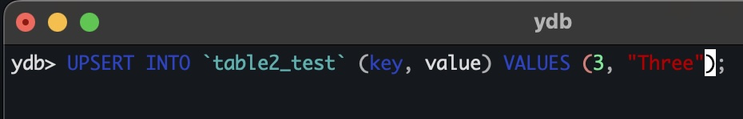
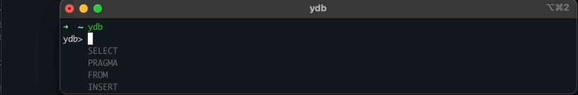
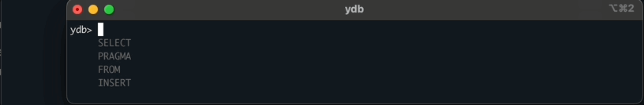
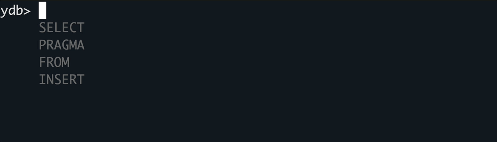

# Interactive query execution mode

Executing `{{ ydb-cli }}` command without subcommands launches the interactive query execution mode. The console or terminal will be switched to the interactive mode. After that, you can enter queries directly into the console or terminal. When you enter a newline character, the query is considered completed and it starts to execute. The query text can be either a YQL query or a [special command](#spec-commands).

General format of the command:

```bash
{{ ydb-cli }} [global options...]
```

* `global options` — [global parameters](commands/global-options.md).

Example usage:


## Features {#features}

* [Syntax highlighting](#syntax-highlighting)
* [Hotkeys](#hotkeys)
* [Query history](#query-history)
* [Auto completion](#auto-completion)
* [Special commands](#spec-commands)

### Syntax highlighting {#syntax-highlighting}



Interactive mode supports YQL syntax highlighting, which helps to better understand query structure. Different colors are used for the following groups of elements:

* YQL keywords (SELECT, FROM, WHERE, INSERT, UPDATE and others)
* Table and column names
* String literals (text in quotes)
* Numeric literals
* Operators (=, <, >, +, - and others)
* Special characters (brackets, commas, dots)
* Comments

## Hotkeys {#hotkeys}

| Hotkey        | Description                                                               |
|---------------|---------------------------------------------------------------------------|
| `Up arrow`    | Shows previous query from history.                                        |
| `Down arrow`  | Shows next query from history.                                            |
| `TAB`         | Completes the current word based on YQL syntax.                          |
| `CTRL + R`    | Searches for a query in history containing a specified substring.         |
| `CTRL + D`    | Exits interactive mode.                                                   |

### Query history {#query-history}

You can navigate through the query history using up and down arrow keys:


History is stored locally and persists between CLI launches.

A query search function (`CTRL + R`) is also supported:



## Auto completion {#auto-completion}

Auto completion helps you write queries more efficiently. While typing, it suggests possible completions for the current word based on YQL syntax.

It also searches for schema object names in database where possible.

There are two types of suggestions: auto completion by pressing `TAB` key and interactive hints.

### Auto completion by pressing `TAB` key {#auto-completion-tab}

While in interactive mode, pressing `TAB` key will show a list of suggestions of completion of current word according to the YQL syntax.



If there is only one available option, pressing TAB will automatically complete the current word.
If all available options share a common prefix, pressing TAB will automatically insert it.

### Interactive Hints {#interactive-hints}

While typing in interactive mode, a list of hints will appear under the cursor, showing first 4 suggestions of completion of current word according to the YQL grammar.



This feature provides quick guidance without overwhelming you with all possible options, helping you stay on track while writing queries.

## Special commands {#spec-commands}

Special commands are CLI-specific commands and are not part of the YQL syntax. Their purpose is to perform various functions that cannot be accomplished through a YQL query.

| Command                  | Description                                                                                                                                                                      |
|--------------------------|----------------------------------------------------------------------------------------------------------------------------------------------------------------------------------|
| `SET param = value`      | Sets the value of the [internal variable](#internal-vars) `param` to `value`.                                                                                                    |
| `EXPLAIN query-text`     | Outputs the query plan for `query-text`. Equivalent to the command [ydb table query explain](commands/explain-plan.md#explain-plan).                                             |
| `EXPLAIN AST query-text` | Outputs the query plan for `query-text` along with the [AST](commands/explain-plan.md). Equivalent to the command [ydb table query explain --ast](commands/explain-plan.md#ast). |

### List of internal variables {#internal-vars}

Internal variables determine the behavior of commands and are set using the [special command](#spec-commands) `SET`.

| Variable | Description |
|----------|---|
| `stats`  | The statistics collection mode for subsequent queries.<br/>Acceptable values:<ul><li>`none` (default): Do not collect.</li><li>`basic`: Collect statistics.</li><li>`full`: Collect statistics and query plan.</li></ul> |

### Example {#examples}

Executing a query in the `full` statistics collection mode:

```bash
$ ydb
ydb> SET stats = full
ydb> select * from table1 limit 1
┌────┬─────┬───────┐
│ id │ key │ value │
├────┼─────┼───────┤
│ 10 │ 0   │ ""    │
└────┴─────┴───────┘

Statistics:
query_phases {
  duration_us: 14987
  table_access {
    name: "/ru-central1/a1v7bqj3vtf10qjleyow/laebarufb61tguph3g22/table1"
    reads {
      rows: 9937
      bytes: 248426
    }
  }
  cpu_time_us: 2925
  affected_shards: 1
}
process_cpu_time_us: 3816
total_duration_us: 79530
total_cpu_time_us: 6741


Full statistics:
Query 0:
ResultSet
└──Limit (Limit: 1)
   TotalCpuTimeUs: 175
   TotalTasks: 1
   TotalInputBytes: 6
   TotalInputRows: 1
   TotalOutputBytes: 16
   TotalDurationMs: 0
   TotalOutputRows: 1
   └──<UnionAll>
      └──Limit (Limit: 1)
      └──TableFullScan (ReadColumns: ["id","key","value"], ReadRanges: ["key (-∞, +∞)"], Table: impex_table)
         Tables: ["table1"]
         TotalCpuTimeUs: 154
         TotalTasks: 1
         TotalInputBytes: 0
         TotalInputRows: 0
         TotalOutputBytes: 16
         TotalDurationMs: 0
         TotalOutputRows: 1
```
