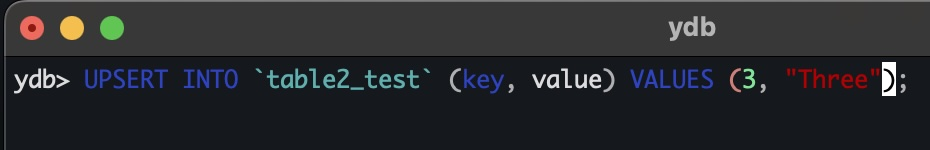
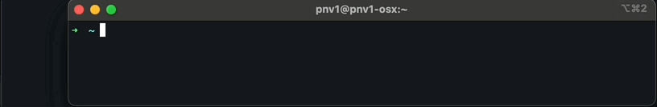
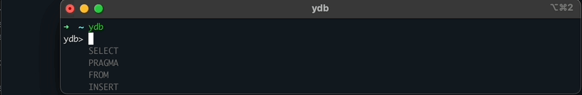
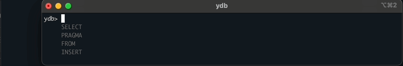

# Interactive query execution mode
## General Description

After executing the `{{ ydb-cli }}` command without subcommands, the interactive query execution mode is launched. After that, you can enter queries directly into the console or terminal. When you enter a line break character, the query is considered complete and begins to be executed. The query text can be either a YQL query or a [special command](#spec-commands).

The general form of the command:
```bash
{{ ydb-cli }} [global options...]
```
* `global options` — [global options](commands/global-options.md).

Please note that to run the commands, [connection parameters](connect.md) must be specified. It can be a default profile, an explicitly specified profile, and/or a set of connection parameters.

Example of use:


The interactive mode for executing queries in {{ ydb-short-name }} CLI provides the following features:

* [Syntax highlighting](#syntax-highlighting)
* [Hotkeys](#hotkeys)
* [Query history](#query-history)
* [Autocompletion](#auto-completion)
* [Special commands](#spec-commands)
## Syntax Highlighting {#syntax-highlighting}



The interactive mode supports syntax highlighting for YQL, which helps to better understand the structure of queries. The following groups of elements are highlighted in different colors:

* YQL keywords (SELECT, FROM, WHERE, INSERT, UPDATE, and others)
* Table and column names
* String literals (text in quotes)
* Numeric literals
* Operators (=, <, >, +, - and others)
* Special characters (parentheses, commas, periods)
* Comments
## Hot Keys {#hotkeys}

You can use these hot keys when working in interactive mode:

Hot key | Description
---|---
`Up arrow` | Shows the previous query from history.
`Down arrow` | Shows the next query from history.
`TAB` | Completes the current word based on YQL syntax.
`CTRL + R` | Searches for a query in history by the entered substring.
`CTRL + D` | Exits interactive mode.
## Query History {#query-history}

The up and down arrow keys allow you to navigate through the query history:



The history is saved locally and is available between CLI launches.

The search function for queries is also supported (CTRL + R):


## Auto-completion {#auto-completion}

Auto-completion helps to write queries more efficiently. As you type, possible options for completing the current word based on YQL syntax are suggested.

It also searches for schema object names in the database where possible.

There are two types of hints: auto-completion by pressing the `TAB` key and interactive hints.

### Auto-completion by pressing the TAB key {#auto-completion-tab}

In interactive mode, pressing the `TAB` key displays a list of options for completing the current word in accordance with YQL syntax.


Continue typing to reduce the number of matching options.

If only one option is available, pressing `TAB` will automatically complete the current word to it.

If all available options have a common prefix, pressing `TAB` will automatically insert it.

### Interactive hints {#interactive-hints}

As you type in interactive mode, a list of hints appears under the cursor, showing the first 4 options for completing the current word according to YQL grammar.



This feature provides quick hints without overwhelming you with all possible options, helping to adhere to the correct syntax when writing queries.
## Special commands {#spec-commands}

Special commands are specific to the CLI and are not part of the YQL syntax. They are designed to perform various functions that cannot be executed via a YQL query.

Command | Description
---|---
`SET param = value` | Sets the value of the [internal variable](#internal-vars) `param` to `value`.
`EXPLAIN query-text` | Displays the execution plan for the `query-text` query. Equivalent to the [ydb sql --explain](sql.md) command.
`EXPLAIN AST query-text` | Displays the execution plan for the `query-text` query along with the [AST](commands/explain-plan.md). Equivalent to the [ydb sql --explain-ast](sql.md) command.

### List of internal variables {#internal-vars}

Internal variables set the behavior of commands and are set using the [special command](#spec-commands) `SET`.

Variable | Description
---|---
`stats` | Statistics collection mode for subsequent queries.<br/>Possible values:<ul><li>`none` (default) — do not collect;</li><li>`basic` — collect statistics;</li><li>`full` — collect statistics and the query plan.</li></ul>
`resource_pool` | Defines the resource pool for executing subsequent queries. Expects the name of the pool as a value.

### Examples {#examples}

Executing a query in `full` statistics collection mode:
```bash
$ ydb
ydb> SET stats = full
ydb> select * from table1 limit 1
┌────┬─────┬───────┐
│ id │ key │ value │
├────┼─────┼───────┤
│ 10 │ 0   │ ""    │
└────┴─────┴───────┘

Statistics:
query_phases {
  duration_us: 14987
  table_access {
    name: "/ru-central1/a1v7bqj3vtf10qjleyow/laebarufb61tguph3g22/table1"
    reads {
      rows: 9937
      bytes: 248426
    }
  }
  cpu_time_us: 2925
  affected_shards: 1
}
process_cpu_time_us: 3816
total_duration_us: 79530
total_cpu_time_us: 6741


Full statistics:
Query 0:
ResultSet
└──Limit (Limit: 1)
   TotalCpuTimeUs: 175
   TotalTasks: 1
   TotalInputBytes: 6
   TotalInputRows: 1
   TotalOutputBytes: 16
   TotalDurationMs: 0
   TotalOutputRows: 1
   └──<UnionAll>
      └──Limit (Limit: 1)
      └──TableFullScan (ReadColumns: ["id","key","value"], ReadRanges: ["key (-∞, +∞)"], Table: impex_table)
         Tables: ["table1"]
         TotalCpuTimeUs: 154
         TotalTasks: 1
         TotalInputBytes: 0
         TotalInputRows: 0
         TotalOutputBytes: 16
         TotalDurationMs: 0
         TotalOutputRows: 1
```
Executing a query in the `default` resource pool:
```bash
$ ydb
ydb> SET resource_pool = default
Resource pool set to "default".

ydb> select 1;
┌─────────┐
│ column0 │
├─────────┤
│ 1       │
└─────────┘
```
