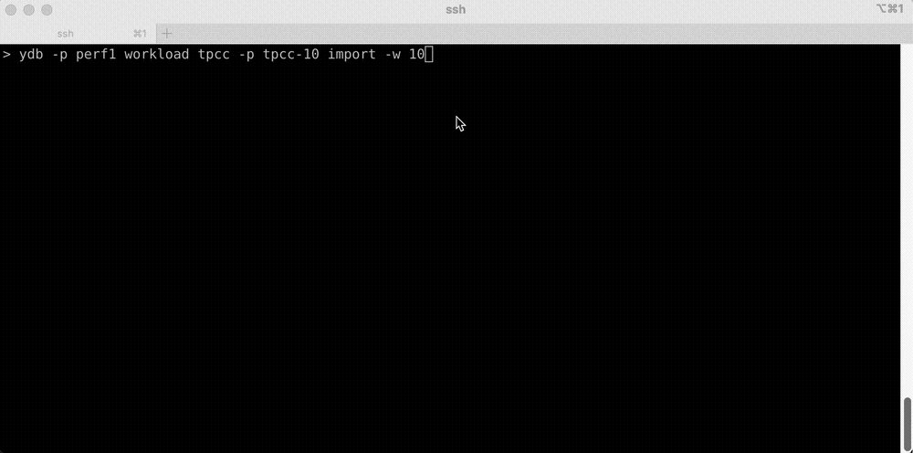
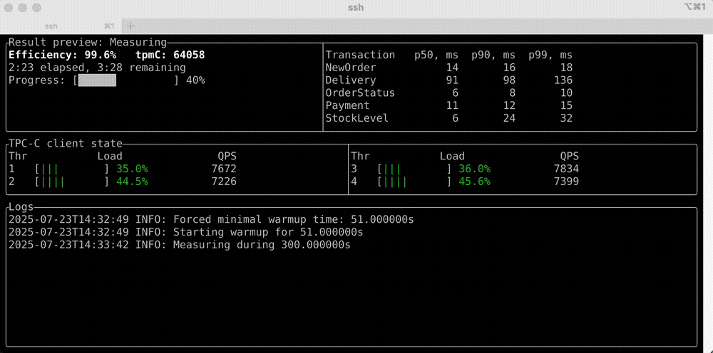

# TPC-C Workload

The workload is based on the TPC-C [specification](https://www.tpc.org/tpc_documents_current_versions/pdf/tpc-c_v5.11.0.pdf), with the queries and table schemas adapted for {{ ydb-short-name }}.

TPC-C is an industry-standard [On-Line Transaction Processing (OLTP)](https://en.wikipedia.org/wiki/Online_transaction_processing) benchmark. It simulates a retail company with a configurable number of warehouses, each containing 10 districts and 3,000 customers per district. A corresponding inventory exists for the warehouses. Customers place orders composed of several items. The company tracks payments, deliveries, and order history, and periodically performs inventory checks.

As a result, the benchmark generates a workload of concurrent distributed transactions with varying types and complexities.

Here is a quick start snippet:

```bash
{{ ydb-cli }} workload tpcc --path tpcc/10wh init -w 10
{{ ydb-cli }} workload tpcc --path tpcc/10wh import -w 10
{{ ydb-cli }} workload tpcc --path tpcc/10wh run -w 10
```

By default, when executed in an interactive terminal, both the `import` and `run` commands display their execution progress using a [Terminal User Interface (TUI)](https://en.wikipedia.org/wiki/Text-based_user_interface).

## Common Command Options

All commands support the common `--path` option, which specifies the path to the directory containing the benchmark tables in the database:

```bash
{{ ydb-cli }} workload tpcc --path tpcc/10wh ...
```

### Available Options {#common_options}

| Name             | Description                                           | Default value |
|------------------|-------------------------------------------------------|----------------|
| `--path` or `-p` | Database path where the benchmark tables are located. | `/`            |

## Initializing a Load Test {#init}

Before running the benchmark, create the tables:

```bash
{{ ydb-cli }} workload tpcc --path tpcc/10wh init --warehouses 10
```

See the command description:

```bash
{{ ydb-cli }} workload tpcc init --help
```

### Available parameters {#init_options}

| Name                         | Description                    | Default value |
|------------------------------|--------------------------------|---------------|
| `--warehouses` or `-w`       | A number of TPC-C warehouses.  | 10            |

## Loading data into a table { #load }

The data will be generated and loaded into the tables directly by {{ ydb-cli }}:

```bash
{{ ydb-cli }} workload tpcc --path tpcc/10wh import --warehouses 10
```

Example usage:



See the command description:

```bash
{{ ydb-cli }} workload tpcc import --help
```

### Available options { #load_options }

| Name                         | Description                                                    | Default value |
|------------------------------|----------------------------------------------------------------|---------------|
| `--warehouses` or `-w`       | A number of TPC-C warehouses.                                  | 10            |
| `--threads`                  | A number of threads loading the TPC-C data to the database.    | 10            |
| `--no-tui`                   | Disable TUI, which is enabled by default in interactive mode.  |               |

The optimal number of loading threads depends on your YDB cluster’s size and configuration. As a rule of thumb, for clusters with several hundred CPU cores, starting with around 50 loading threads is reasonable. For larger clusters, you can scale this number further.

However, on the client side, it is recommended to keep the number of loading threads to no more than 50–75% of the available CPU cores.

## Run the load test { #run }

Run the load:

```bash
{{ ydb-cli }} workload tpcc --path tpcc/10wh run --warehouses 10
```

During the benchmark, the CLI displays a preview of the results and various client side load statistics:


See the command description:

```bash
{{ ydb-cli }} workload tpcc run --help
```

### Available options { #run_options }

| Name                         | Description                                                    | Default value |
|------------------------------|----------------------------------------------------------------|---------------|
| `--warehouses` or `-w`       | A number of TPC-C warehouses.                                  | 10            |
| `--warmup`                   | Warmup time. Example: 10s, 5m, 1h.                             | 30m           |
| `--time` or `-t`             | Execution time. Example: 10s, 5m, 1h.                          | 2h            |
| `--max-sessions` or `-m`     | A soft limit on the number of DB sessions.                     | 100           |
| `--threads`                  | A number of threads executing queries                          | auto          |
| `--format` or `-f`           | Output format: 'Pretty', 'Json'                                | Pretty        |
| `--no-tui`                   | Disable TUI, which is enabled by default in interactive mode.  |               |

The optimal number of sessions depends on your YDB cluster’s size and configuration. As a rule of thumb, a good starting point is to multiply the total number of CPU cores allocated to YDB compute (dynnodes) by 5–10.

We recommend starting with a multiplier of 5. If YDB is underutilized during the benchmark run, consider increasing the number of sessions.

### Results

Benchmark results include tpmC, efficiency, and per-transaction-type latencies. As stated by the official specification:

> “The performance metric reported by TPC-C is a “business throughput” measuring the number of orders processed per minute. Multiple transactions are used to simulate the business activity of processing an order, and each transaction is subject to a response time constraint. The performance metric for this benchmark is expressed in transactions-per-minute-C (tpmC).”

The TPC-C specification limits the number of transactions that can be processed per warehouse. The theoretical maximum is 12.86 tpmC per warehouse. To increase the overall load—and thereby the tpmC—you must scale the number of warehouses.

Efficiency is calculated using the following formula:

$$
\text{efficiency} = \frac{\text{tpmC}}{12.86 \times \text{warehouses}} \times 100
$$

## Test data cleaning { #cleanup }

Run cleaning:

```bash
{{ ydb-cli }} workload tpcc --path tpcc/10wh clean
```

The command has no parameters.

## Data consistency check { #consistency_check }

`check` command verifies the consistency of TPC-C data. It can be executed after either the `import` or `run` commands. The `check` command is intended primarily for development and is of limited interest to end users.

Example:

```bash
{{ ydb-cli }} workload tpcc --path tpcc/10wh check
```

See the command description:

```bash
{{ ydb-cli }} workload tpcc check --help
```

### Available options { #check_options }

| Name                         | Description                                                                                                         | Default value |
|------------------------------|---------------------------------------------------------------------------------------------------------------------|---------------|
| `--warehouses` or `-w`       | A number of TPC-C warehouses.                                                                                       | 10            |
| `--just-imported`            | Turns on additional checks. Should be used only when data has been just imported and no runs have been done yet.    |               |
