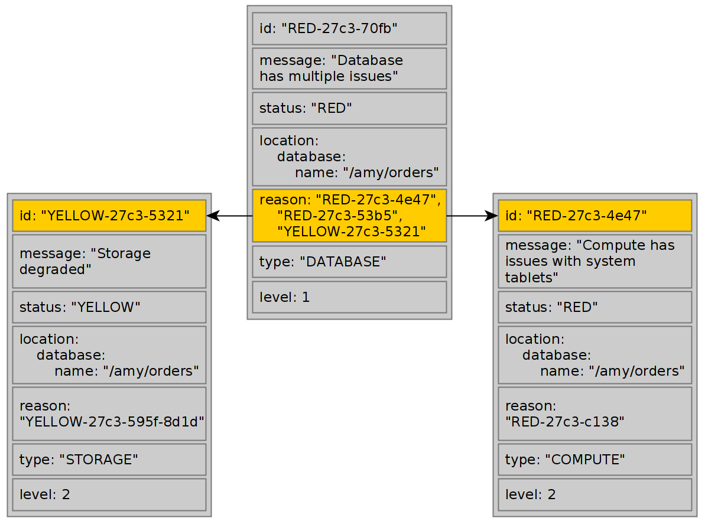
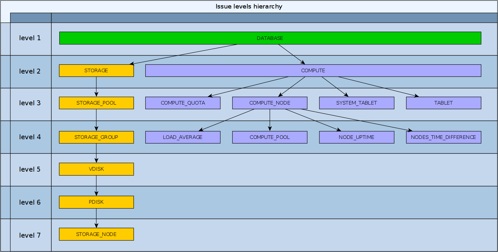

# Health Check API

{{ ydb-short-name }} has a built-in self-diagnostic system, which can be used to get a brief report on the database status and information about existing issues.

To initiate the check, call the `SelfCheck` method from `NYdb::NMonitoring` namespace in the SDK. You must also pass the name of the checked DB as usual.



- C++

  App code snippet for creating a client:
  ```cpp
  auto client = NYdb::NMonitoring::TMonitoringClient(driver);
  ```

  Calling `SelfCheck` method:

  ```
  auto settings = TSelfCheckSettings();
  settings.ReturnVerboseStatus(true);
  auto result = client.SelfCheck(settings).GetValueSync();
  ```



## Call parameters {#call-parameters}

`SelfCheck` method provides information in the form of a [set of issues](#emergency-example) which could look like this:

```json
{
  "id": "RED-27c3-70fb",
  "status": "RED",
  "message": "Database has multiple issues",
  "location": {
    "database": {
      "name": "/slice"
    }
  },
  "reason": [
    "RED-27c3-4e47",
    "RED-27c3-53b5",
    "YELLOW-27c3-5321"
  ],
  "type": "DATABASE",
  "level": 1
}
```

This is a short messages each about a single issue. All parameters will affect the amount of information the service returns for the specified database.

The complete list of extra parameters is presented below:



- C++

  ```c++
  struct TSelfCheckSettings : public TOperationRequestSettings<TSelfCheckSettings>{
      FLUENT_SETTING_OPTIONAL(bool, ReturnVerboseStatus);
      FLUENT_SETTING_OPTIONAL(EStatusFlag, MinimumStatus);
      FLUENT_SETTING_OPTIONAL(ui32, MaximumLevel);
  };
  ```



| Parameter | Type | Description |
|:----|:----|:----|
| `ReturnVerboseStatus` | `bool`         | If `ReturnVerboseStatus` is specified, the response will also include a summary of the overall health of the database in the `database_status` field ([Example](#example-verbose)). Default is false. |
| `MinimumStatus`       | [EStatusFlag] (#issue-status) | Each issue has a `status` field. If `minimum_status` is specified, issues with a higher `status` will be discarded. By default, all issues will be listed. |
| `MaximumLevel`        | `int32`        | Each issue has a `level` field. If `maximum_level` is specified, issues with deeper levels will be discarded. By default, all issues will be listed. |

## Response structure {#response-structure}

For the full response structure, see the [ydb_monitoring.proto](https://github.com/ydb-platform/ydb/public/api/protos/ydb_monitoring.proto) file in the {{ ydb-short-name }} Git repository.
Calling the `SelfCheck` method will return the following message:

```protobuf
message SelfCheckResult {
    SelfCheck.Result self_check_result = 1;
    repeated IssueLog issue_log = 2;
    repeated DatabaseStatus database_status = 3;
    LocationNode location = 4;
}
```

The shortest `HealthCheck` response looks like [this](#examples) . It is returned if there is nothing wrong with the database.

If any issues are detected, the `issue_log` field will contain descriptions of the issues with the following structure:

```protobuf
message IssueLog {
    string id = 1;
    StatusFlag.Status status = 2;
    string message = 3;
    Location location = 4;
    repeated string reason = 5;
    string type = 6;
    uint32 level = 7;
}
```

#### Description of fields in the response {#fields-description}

| Field | Description |
|:----|:----|
| `self_check_result` | enum field which contains the [database check result](#selfcheck-result) |
| `issue_log.id` | A unique issue ID within this response. |
| `issue_log.status` |  enum field which contains the [issue status](#issue-status) |
| `issue_log.message` | Text that describes the issue. |
| `issue_log.location` | Location of the issue. This can be a physical location or an execution context. |
| `issue_log.reason` | This is a set of elements, each of which describes an issue in the system at a certain level. |
| `issue_log.type` | Issue category (by subsystem). Each type is at a certain level and interconnected with others through a [rigid hierarchy](#issues-hierarchy) (as shown in the picture above). |
| `issue_log.level` | Issue [nesting depth](#issues-hierarchy). |
| `database_status` | If the settings include `ReturnVerboseStatus` parameter, the `database_status` field will be populated. <br/>This field offers a comprehensive summary of the overall health of the database. <br/>It is designed to provide a quick overview of the database's condition, helping to assess its health and identify any major issuehs at a high level. [Example](#example-verbose). For the full response structure, see the [ydb_monitoring.proto](https://github.com/ydb-platform/ydb/public/api/protos/ydb_monitoring.proto) file in the {{ ydb-short-name }} Git repository. |
| `location` | Contains information about the host, where the `HealthCheck` service was called |

#### Issues hierarchy {#issues-hierarchy}

Issues can be arranged hierarchically with `id` and `reason` fields, which help to visualize how issues in a separate module affect the state of the system as a whole. All issues are arranged in a hierarchy where higher levels can depend on nested levels:



Each issue has a nesting `level`. The higher the `level`, the deeper the issue is in the hierarchy. Issues with the same `type` always have the same `level`, and they can be represented as a hierarchy.



#### Database check result {#selfcheck-result}

The most general statuses of the database, which can have the following values:

| Value | Description |
|:----|:----|
| `GOOD` | No issues were detected. |
| `DEGRADED` | Degradation of at least one of the database systems was detected, but the database is still functioning (for example, allowable disk loss). |
| `MAINTENANCE_REQUIRED` | Significant degradation was detected, there is a risk of database unavailability, and human intervention is required. |
| `EMERGENCY` | A serious problem was detected in the database, with complete or partial unavailability. |

#### Issue status {#issue-status}

Status (severity) of the current issue:

| Value | Description |
|:----|:----|
| `GREY` | Failed to determine the status (an issue with the self-diagnostic subsystem). |
| `GREEN` | No issues were detected. |
| `BLUE` | Temporary minor degradation that does not affect database availability; the system is expected to switch to `GREEN`. |
| `YELLOW` | A minor issue, no risks to availability. It is recommended to continue monitoring the issue. |
| `ORANGE` | A serious issue, a step away from losing availability. Maintenance may be required. |
| `RED` | A component is faulty or unavailable. |

## Possible issues {#issues}

### DATABASE

#### Database has multiple issues, Database has compute issues, Database has storage issues

**Description:** These issues depend solely on the underlying `COMPUTE` and `STORAGE` layers. This is the most general status of a database.

### STORAGE

#### There are no storage pools

**Description:** Information about storage pools is unavailable. Most likely, storage pools aren't configured.

#### Storage degraded, Storage has no redundancy, Storage failed

**Description:** These issues depend solely on the underlying `STORAGE_POOLS` layer.

#### System tablet BSC didn't provide information

**Description:** Storage diagnostics will be generated alternatively.

#### Storage usage over 75%, Storage usage over 85%, Storage usage over 90%

**Description:** Some data needs to be removed, or the database needs to be reconfigured with additional disk space.

### STORAGE_POOL

#### Pool degraded, Pool has no redundancy, Pool failed

**Description:** These issues depend solely on the underlying `STORAGE_GROUP` layer.

### STORAGE_GROUP

#### Group has no vslots

**Description:** This case is not expected; it is an internal issue.

#### Group degraded

**Description:** A number of disks allowed in the group are not available.operations.
**Logic of work:** `HealthCheck` checks various parameters (fault tolerance mode, number of failed disks, disk status, etc.) and sets the appropriate status for the group accordingly.
**Actions:** In [YDB Embedded UI](../embedded-ui/ydb-monitoring.md), navigate to the database page, select the `Storage` tab, set the `Groups` and `Degraded` filters, and use the known group `id` to check the availability of nodes and disks on the nodes.

#### Group has no redundancy

**Description:** A storage group lost its redundancy. Another failure of vdisk may lead to the loss of the group.operations.
**Logic of work:** `HealthCheck` checks various parameters (fault tolerance mode, number of failed disks, disk status, etc.) and sets the appropriate status for the group accordingly.
**Actions:** In [YDB Embedded UI](../embedded-ui/ydb-monitoring.md), navigate to the database page, select the `Storage` tab, set the `Groups` and `Degraded` filters, and use the known group `id` to check the availability of nodes and disks on the nodes.

#### Group failed

**Description:** A storage group lost its integrity. Data is not available. `HealthCheck` checks various parameters (fault tolerance mode, number of failed disks, disk status, etc.) and, depending on them, sets the appropriate status and displays a message.operations.
**Logic of work:** `HealthCheck` checks various parameters (fault tolerance mode, number of failed disks, disk status, etc.) and sets the appropriate status for the group accordingly.
**Actions:** In [YDB Embedded UI](../embedded-ui/ydb-monitoring.md), navigate to the database page, select the `Storage` tab, set the `Groups` and `Degraded` filters, and use the known group `id` to check the availability of nodes and disks on the nodes.

### VDISK

#### System tablet BSC didn't provide known status

**Description:** This case is not expected; it is an internal issue.

#### VDisk is not available

**Description:** The disk is not operational at all.
**Actions:** In [YDB Embedded UI](../embedded-ui/ydb-monitoring.md), navigate to the database page, select the `Storage` tab, and set the `Groups` and `Degraded` filters. The group `id` can be found through the related `STORAGE_GROUP` issue. Hover over the relevant `vdisk` to identify the node with the problem. Check the availability of nodes and disks on the nodes.

#### VDisk is being initialized

**Description:** Initialization in process.
**Actions:** In [YDB Embedded UI](../embedded-ui/ydb-monitoring.md), navigate to the database page, select the `Storage` tab, and set the `Groups` and `Degraded` filters. The group `id` can be found through the related `STORAGE_GROUP` issue. Hover over the relevant `vdisk` to identify the node with the problem. Check the availability of nodes and disks on the nodes.

#### Replication in progress

**Description:** The disk accepts queries, but not all the data was replicated.
**Actions:** In [YDB Embedded UI](../embedded-ui/ydb-monitoring.md), navigate to the database page, select the `Storage` tab, and set the `Groups` and `Degraded` filters. The group `id` can be found through the related `STORAGE_GROUP` issue. Hover over the relevant `vdisk` to identify the node with the problem. Check the availability of nodes and disks on the nodes.

#### VDisk have space issue

**Description:** These issues depend solely on the underlying `PDISK` layer.

### PDISK

#### Unknown PDisk state

**Description:** `HealthCheck` the system can't parse pdisk state.

#### PDisk state is ...

**Description:** Indicates state of physical disk.
**Actions:** In [YDB Embedded UI](../embedded-ui/ydb-monitoring.md), navigate to the database page, select the `Storage` tab, set the `Nodes` and `Degraded` filters, and use the known node `id` and `pdisk` to check the availability of nodes and disks on the nodes.

#### Available size is less than 12%, Available size is less than 9%, Available size is less than 6%

**Description:** Free space on the physical disk is running out.
**Actions:** In [YDB Embedded UI](../embedded-ui/ydb-monitoring.md), navigate to the database page, select the `Storage` tab, set the `Nodes` and `Out of Space` filters, and use the known node `id` and `pdisk` to check the available space.

#### PDisk is not available

**Description:** A physical disk is not available.
**Actions:** In [YDB Embedded UI](../embedded-ui/ydb-monitoring.md), navigate to the database page, select the `Storage` tab, set the `Nodes` and `Degraded` filters, and use the known node `id` and `pdisk` to check the availability of nodes and disks on the nodes.

### STORAGE_NODE
#### Storage node is not available
**Description:** A storage node is not available.

### COMPUTE

#### There are no compute nodes

**Description:** The database has no nodes to start the tablets. Unable to determine `COMPUTE_NODE` issues below.

#### Compute has issues with system tablets

**Description:** These issues depend solely on the underlying `SYSTEM_TABLET` layer.

#### Some nodes are restarting too often

**Description:** These issues depend solely on the underlying `NODE_UPTIME` layer.

#### Compute is overloaded

**Description:** These issues depend solely on the underlying `COMPUTE_POOL` layer.

#### Compute quota usage

**Description:** These issues depend solely on the underlying `COMPUTE_QUOTA` layer.

#### Compute has issues with tablets

**Description:** These issues depend solely on the underlying `TABLET` layer.

### COMPUTE_QUOTA

#### Paths quota usage is over than 90%, Paths quota usage is over than 99%, Paths quota exhausted, Shards quota usage is over than 90%, Shards quota usage is over than 99%, Shards quota exhausted

**Description:** Quotas exhausted.
**Actions:** Check the number of objects (tables, topics) in the database and delete any unnecessary ones.

### SYSTEM_TABLET

#### System tablet is unresponsive, System tablet response time over 1000ms, System tablet response time over 5000ms

**Description:** The system tablet is not responding or takes too long to respond.
**Actions:** In [YDB Embedded UI](../embedded-ui/ydb-monitoring.md), go to the `Storage` tab and set the `Nodes` filter. Check the `Uptime` and status of the nodes. If the `Uptime` is short, review the logs to determine the reasons for the node restarts.

### TABLET

#### Tablets are restarting too often

**Description:** Tablets are restarting too often.
**Actions:** In [YDB Embedded UI](../embedded-ui/ydb-monitoring.md), go to the `Nodes` tab. Check the `Uptime` and status of the nodes. If the `Uptime` is short, review the logs to determine the reasons for the node restarts.

#### Tablets/Followers are dead

**Description:** Tablets are not running (probably cannot be started).
**Actions:** In [YDB Embedded UI](../embedded-ui/ydb-monitoring.md), go to the `Nodes` tab. Check the `Uptime` and status of the nodes. If the `Uptime` is short, review the logs to determine the reasons for the node restarts.

### LOAD_AVERAGE

#### LoadAverage above 100%

**Description:** ([Load](https://en.wikipedia.org/wiki/Load_(computing)).) A physical host is overloaded. This indicates that the system is working at or beyond its capacity, potentially due to a high number of processes waiting for I/O operations.
**Logic of work:**
Load Information:
  Source: `/proc/loadavg`
We use the first number of the three — the average load over the last 1 minute.
Logical Cores Information:
  Primary Source: `/sys/fs/cgroup/cpu.max`
  Fallback Source: `/sys/fs/cgroup/cpu/cpu.cfs_quota_us`, `/sys/fs/cgroup/cpu/cpu.cfs_period_us`.
The number of cores is calculated by dividing the quota by the period (quota / period).
**Actions:** Check the CPU load on the nodes.

### COMPUTE_POOL

#### Pool usage is over than 90%, Pool usage is over than 95%, Pool usage is over than 99%

**Description:** One of the pools' CPUs is overloaded.
**Actions:** Add cores to the configuration of the actor system for the corresponding CPU pool.

### NODE_UPTIME

#### The number of node restarts has increased

**Description:** The number of node restarts has exceeded the threshold. By default, 10 restarts per hour.
**Actions:** Check the logs to determine the reasons for the process restart.

#### Node is restarting too often

**Description:** The number of node restarts has exceeded the threshold. By default, 30 restarts per hour.
**Actions:** Check the logs to determine the reasons for the process restart.

### NODES_TIME_DIFFERENCE

#### Node is ... ms behind peer [id], Node is ... ms ahead of peer [id]

**Description:** Time drift on nodes might lead to potential issues with coordinating distributed transactions. This issue starts to appear from 5 ms.
**Actions:** Check for discrepancies in system time between the nodes listed in the alert, and verify the operation of the time synchronization process.

## Examples {#examples}

The shortest `HealthCheck` response looks like this. It is returned if there is nothing wrong with the database
```json
{
  "self_check_result": "GOOD"
}
```

#### Verbose example {#example-verbose}

`GOOD` response with `verbose` parameter:
```json
{
    "self_check_result": "GOOD",
    "database_status": [
        {
            "name": "/amy/db",
            "overall": "GREEN",
            "storage": {
                "overall": "GREEN",
                "pools": [
                    {
                        "id": "/amy/db:ssdencrypted",
                        "overall": "GREEN",
                        "groups": [
                            {
                                "id": "2181038132",
                                "overall": "GREEN",
                                "vdisks": [
                                    {
                                        "id": "9-1-1010",
                                        "overall": "GREEN",
                                        "pdisk": {
                                            "id": "9-1",
                                            "overall": "GREEN"
                                        }
                                    },
                                    {
                                        "id": "11-1004-1009",
                                        "overall": "GREEN",
                                        "pdisk": {
                                            "id": "11-1004",
                                            "overall": "GREEN"
                                        }
                                    },
                                    {
                                        "id": "10-1003-1011",
                                        "overall": "GREEN",
                                        "pdisk": {
                                            "id": "10-1003",
                                            "overall": "GREEN"
                                        }
                                    },
                                    {
                                        "id": "8-1005-1010",
                                        "overall": "GREEN",
                                        "pdisk": {
                                            "id": "8-1005",
                                            "overall": "GREEN"
                                        }
                                    },
                                    {
                                        "id": "7-1-1008",
                                        "overall": "GREEN",
                                        "pdisk": {
                                            "id": "7-1",
                                            "overall": "GREEN"
                                        }
                                    },
                                    {
                                        "id": "6-1-1007",
                                        "overall": "GREEN",
                                        "pdisk": {
                                            "id": "6-1",
                                            "overall": "GREEN"
                                        }
                                    },
                                    {
                                        "id": "4-1005-1010",
                                        "overall": "GREEN",
                                        "pdisk": {
                                            "id": "4-1005",
                                            "overall": "GREEN"
                                        }
                                    },
                                    {
                                        "id": "2-1003-1013",
                                        "overall": "GREEN",
                                        "pdisk": {
                                            "id": "2-1003",
                                            "overall": "GREEN"
                                        }
                                    },
                                    {
                                        "id": "1-1-1008",
                                        "overall": "GREEN",
                                        "pdisk": {
                                            "id": "1-1",
                                            "overall": "GREEN"
                                        }
                                    }
                                ]
                            }
                        ]
                    }
                ]
            },
            "compute": {
                "overall": "GREEN",
                "nodes": [
                    {
                        "id": "50073",
                        "overall": "GREEN",
                        "pools": [
                            {
                                "overall": "GREEN",
                                "name": "System",
                                "usage": 0.000405479
                            },
                            {
                                "overall": "GREEN",
                                "name": "User",
                                "usage": 0.00265229
                            },
                            {
                                "overall": "GREEN",
                                "name": "Batch",
                                "usage": 0.000347933
                            },
                            {
                                "overall": "GREEN",
                                "name": "IO",
                                "usage": 0.000312022
                            },
                            {
                                "overall": "GREEN",
                                "name": "IC",
                                "usage": 0.000945925
                            }
                        ],
                        "load": {
                            "overall": "GREEN",
                            "load": 0.2,
                            "cores": 4
                        }
                    },
                    {
                        "id": "50074",
                        "overall": "GREEN",
                        "pools": [
                            {
                                "overall": "GREEN",
                                "name": "System",
                                "usage": 0.000619053
                            },
                            {
                                "overall": "GREEN",
                                "name": "User",
                                "usage": 0.00463859
                            },
                            {
                                "overall": "GREEN",
                                "name": "Batch",
                                "usage": 0.000596071
                            },
                            {
                                "overall": "GREEN",
                                "name": "IO",
                                "usage": 0.0006241
                            },
                            {
                                "overall": "GREEN",
                                "name": "IC",
                                "usage": 0.00218465
                            }
                        ],
                        "load": {
                            "overall": "GREEN",
                            "load": 0.08,
                            "cores": 4
                        }
                    },
                    {
                        "id": "50075",
                        "overall": "GREEN",
                        "pools": [
                            {
                                "overall": "GREEN",
                                "name": "System",
                                "usage": 0.000579126
                            },
                            {
                                "overall": "GREEN",
                                "name": "User",
                                "usage": 0.00344293
                            },
                            {
                                "overall": "GREEN",
                                "name": "Batch",
                                "usage": 0.000592347
                            },
                            {
                                "overall": "GREEN",
                                "name": "IO",
                                "usage": 0.000525747
                            },
                            {
                                "overall": "GREEN",
                                "name": "IC",
                                "usage": 0.00174265
                            }
                        ],
                        "load": {
                            "overall": "GREEN",
                            "load": 0.26,
                            "cores": 4
                        }
                    }
                ],
                "tablets": [
                    {
                        "overall": "GREEN",
                        "type": "SchemeShard",
                        "state": "GOOD",
                        "count": 1
                    },
                    {
                        "overall": "GREEN",
                        "type": "SysViewProcessor",
                        "state": "GOOD",
                        "count": 1
                    },
                    {
                        "overall": "GREEN",
                        "type": "Coordinator",
                        "state": "GOOD",
                        "count": 3
                    },
                    {
                        "overall": "GREEN",
                        "type": "Mediator",
                        "state": "GOOD",
                        "count": 3
                    },
                    {
                        "overall": "GREEN",
                        "type": "Hive",
                        "state": "GOOD",
                        "count": 1
                    }
                ]
            }
        }
    ]
}
```

#### Emergency example {#example-emergency}

Response with `EMERGENCY` status:
```json
{
  "self_check_result": "EMERGENCY",
  "issue_log": [
    {
      "id": "RED-27c3-70fb",
      "status": "RED",
      "message": "Database has multiple issues",
      "location": {
        "database": {
          "name": "/slice"
        }
      },
      "reason": [
        "RED-27c3-4e47",
        "RED-27c3-53b5",
        "YELLOW-27c3-5321"
      ],
      "type": "DATABASE",
      "level": 1
    },
    {
      "id": "RED-27c3-4e47",
      "status": "RED",
      "message": "Compute has issues with system tablets",
      "location": {
        "database": {
          "name": "/slice"
        }
      },
      "reason": [
        "RED-27c3-c138-BSController"
      ],
      "type": "COMPUTE",
      "level": 2
    },
    {
      "id": "RED-27c3-c138-BSController",
      "status": "RED",
      "message": "System tablet is unresponsive",
      "location": {
        "compute": {
          "tablet": {
            "type": "BSController",
            "id": [
              "72057594037989391"
            ]
          }
        },
        "database": {
          "name": "/slice"
        }
      },
      "type": "SYSTEM_TABLET",
      "level": 3
    },
    {
      "id": "RED-27c3-53b5",
      "status": "RED",
      "message": "System tablet BSC didn't provide information",
      "location": {
        "database": {
          "name": "/slice"
        }
      },
      "type": "STORAGE",
      "level": 2
    },
    {
      "id": "YELLOW-27c3-5321",
      "status": "YELLOW",
      "message": "Storage degraded",
      "location": {
        "database": {
          "name": "/slice"
        }
      },
      "reason": [
        "YELLOW-27c3-595f-8d1d"
      ],
      "type": "STORAGE",
      "level": 2
    },
    {
      "id": "YELLOW-27c3-595f-8d1d",
      "status": "YELLOW",
      "message": "Pool degraded",
      "location": {
        "storage": {
          "pool": {
            "name": "static"
          }
        },
        "database": {
          "name": "/slice"
        }
      },
      "reason": [
        "YELLOW-27c3-ef3e-0"
      ],
      "type": "STORAGE_POOL",
      "level": 3
    },
    {
      "id": "RED-84d8-3-3-1",
      "status": "RED",
      "message": "PDisk is not available",
      "location": {
        "storage": {
          "node": {
            "id": 3,
            "host": "man0-0026.ydb-dev.nemax.nebiuscloud.net",
            "port": 19001
          },
          "pool": {
            "group": {
              "vdisk": {
                "pdisk": [
                  {
                    "id": "3-1",
                    "path": "/dev/disk/by-partlabel/NVMEKIKIMR01"
                  }
                ]
              }
            }
          }
        }
      },
      "type": "PDISK",
      "level": 6
    },
    {
      "id": "RED-27c3-4847-3-0-1-0-2-0",
      "status": "RED",
      "message": "VDisk is not available",
      "location": {
        "storage": {
          "node": {
            "id": 3,
            "host": "man0-0026.ydb-dev.nemax.nebiuscloud.net",
            "port": 19001
          },
          "pool": {
            "name": "static",
            "group": {
              "vdisk": {
                "id": [
                  "0-1-0-2-0"
                ]
              }
            }
          }
        },
        "database": {
          "name": "/slice"
        }
      },
      "reason": [
        "RED-84d8-3-3-1"
      ],
      "type": "VDISK",
      "level": 5
    },
    {
      "id": "YELLOW-27c3-ef3e-0",
      "status": "YELLOW",
      "message": "Group degraded",
      "location": {
        "storage": {
          "pool": {
            "name": "static",
            "group": {
              "id": [
                "0"
              ]
            }
          }
        },
        "database": {
          "name": "/slice"
        }
      },
      "reason": [
        "RED-27c3-4847-3-0-1-0-2-0"
      ],
      "type": "STORAGE_GROUP",
      "level": 4
    }
  ],
  "location": {
    "id": 5,
    "host": "man0-0028.ydb-dev.nemax.nebiuscloud.net",
    "port": 19001
  }
}
```
