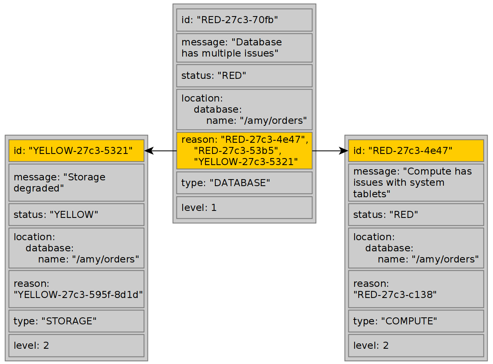
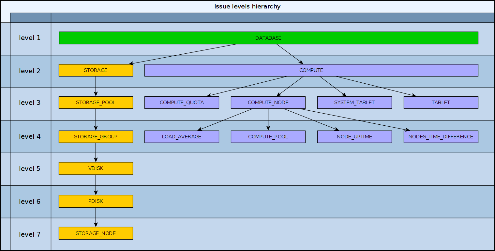

# Health Check API

{{ ydb-short-name }} has a built-in self-diagnostic system, which can be used to get a brief report on the database status and information about existing issues.

To initiate the check, call the `SelfCheck` method from `NYdb::NMonitoring` namespace in the SDK. You must also pass the name of the checked DB as usual.



- Go

  This functionality is not currently supported.

- C++

  App code snippet for creating a client:


  ```cpp
  auto client = NYdb::NMonitoring::TMonitoringClient(driver);
  ```


  Calling `SelfCheck` method:


  ```c++
  auto settings = TSelfCheckSettings();
  settings.ReturnVerboseStatus(true);
  auto result = client.SelfCheck(settings).GetValueSync();
  ```

- Java

  This functionality is not currently supported.

- Python

  This functionality is not currently supported.

- JavaScript

  This functionality is not currently supported.

  You can create a monitoring client and call the check methods yourself:


  ```javascript
  const monitoring = driver.createClient(MonitoringServiceDefinition);
  await monitoring.selfCheck();
  ```

- Rust

  This functionality is not currently supported.

- PHP

  This functionality is not currently supported.



## Call parameters {#call-parameters}

`SelfCheck` method provides information in the form of a [set of issues](#example-emergency) which could look like this:


```json
{
  "id": "RED-27c3-70fb",
  "status": "RED",
  "message": "Database has multiple issues",
  "location": {
    "database": {
      "name": "/slice"
    }
  },
  "reason": [
    "RED-27c3-4e47",
    "RED-27c3-53b5",
    "YELLOW-27c3-5321"
  ],
  "type": "DATABASE",
  "level": 1
}
```


This is a short message about one of the issues. All call parameters can affect the amount of information contained in the response.

This is a short messages each about a single issue. All parameters will affect the amount of information the service returns for the specified database.



- Go

  This functionality is not currently supported.

- C++

  ```c++
  struct TSelfCheckSettings : public TOperationRequestSettings<TSelfCheckSettings>{
      FLUENT_SETTING_OPTIONAL(bool, ReturnVerboseStatus);
      FLUENT_SETTING_OPTIONAL(EStatusFlag, MinimumStatus);
      FLUENT_SETTING_OPTIONAL(ui32, MaximumLevel);
  };
  ```

- Java

  This functionality is not currently supported.

- Python

  This functionality is not currently supported.

- JavaScript

  This functionality is not currently supported.

- Rust

  This functionality is not currently supported.

- PHP

  This functionality is not currently supported.



| Parameter | Type | Description |
| :--- | :--- | :--- |
| `ReturnVerboseStatus` | `bool` | If set, the response will also contain a summary of the overall database state in the `database_status` field ( [Example](#example-verbose)). By default, `false`. |
| `MinimumStatus` | [EStatusFlag](#issue-status) | Each issue contains a `status` field. If `minimum_status` is defined, issues with a less severe status will be discarded. By default, all issues will be listed. |
| `MaximumLevel` | `int32` | Each issue has a `level` field. If `maximum_level` is specified, issues with deeper levels will be discarded. By default, all issues will be listed. |

## Response structure {#response-structure}

You can view the full response structure in the [ydb_monitoring.proto](https://github.com/ydb-platform/ydb/public/api/protos/ydb_monitoring.proto) file in the {{ ydb-short-name }} Git repository.
The following structure will be returned as a result of calling this method:


```protobuf
message SelfCheckResult {
    SelfCheck.Result self_check_result = 1;
    repeated IssueLog issue_log = 2;
    repeated DatabaseStatus database_status = 3;
    LocationNode location = 4;
}
```


If any issues are detected, the `issue_log` field will contain descriptions of the issues with the following structure:


```protobuf
message IssueLog {
    string id = 1;
    StatusFlag.Status status = 2;
    string message = 3;
    Location location = 4;
    repeated string reason = 5;
    string type = 6;
    uint32 level = 7;
}
```


### Response field descriptions {#fields-Описание}

| Field | Description |
| :--- | :--- |
| `self_check_result` | enum field which contains the [database check result](#selfcheck-result) |
| `issue_log` | A list of issues; each entry describes a problem at a particular level of the system. |
| `issue_log.id` | A unique issue ID within this response. |
| `issue_log.status` | enum field which contains the [issue status](#issue-status) |
| `issue_log.message` | Text that describes the issue. |
| `issue_log.location` | Location of the issue. This can be a physical location or an execution context. |
| `issue_log.reason` | This is a set of elements, each of which describes an issue in the system at a certain level. |
| `issue_log.type` | Issue category (by subsystem). Each type is at a certain level and interconnected with others through a [rigid hierarchy](#issues-hierarchy) (as shown in the picture above). |
| `issue_log.level` | Issue [nesting depth](#issues-hierarchy). |
| `database_status` | If the `verbose` parameter is set in the settings, the `database_status` field will be populated. It provides a summary of the overall database state and is used for a quick assessment of the database state and identification of serious issues at a high level. [Example](#example-verbose). You can view the full response structure in the [ydb_monitoring.proto](https://github.com/ydb-platform/ydb/public/api/protos/ydb_monitoring.proto) file in the {{ ydb-short-name }} Git repository. |
| `location` | Contains information about the host, where the `HealthCheck` service was called |

### Issues hierarchy {#issues-hierarchy}

Issues can be arranged hierarchically using the `id` and `reason` fields, which help visualize how issues in different modules affect the overall system state. All issues are arranged in a hierarchy where higher levels can depend on nested levels:



Each issue has a nesting `level`. The higher the `level`, the deeper the issue is within the hierarchy. Issues with the same `type` always have the same `level`, and they can be represented hierarchically.



### Database check result {#selfcheck-result}

The most general status of the database. It can have the following values:

| Value | Description |
| :--- | :--- |
| `GOOD` | No issues were detected. |
| `DEGRADED` | Degradation of at least one of the database systems was detected, but the database is still functioning (for example, allowable disk loss). |
| `MAINTENANCE_REQUIRED` | Significant degradation was detected, there is a risk of database unavailability, and human intervention is required. |
| `EMERGENCY` | A serious problem was detected in the database, with complete or partial unavailability. |

#### Issue status {#issue-status}

The status (severity) of the current issue:

| Value | Description |
| :--- | :--- |
| `GREY` | Unable to determine the status (an issue with the self-diagnostic subsystem). |
| `GREEN` | No issues detected. |
| `BLUE` | Temporary minor degradation that does not affect database availability; the system is expected to return to `GREEN`. |
| `YELLOW` | A minor issue with no risks to availability. It is recommended to continue monitoring the issue. |
| `ORANGE` | A serious issue, a step away from losing availability. Maintenance may be required. |
| `RED` | A component is faulty or unavailable. |

## Possible issues {#issues}

### DATABASE

#### Database has multiple issues, Database has compute issues, Database has storage issues

**Description:** These issues depend solely on the underlying `COMPUTE` and `STORAGE` layers. This represents the most general status of a database.

### STORAGE

#### There are no storage pools

**Description:** Information about storage pools is unavailable. Most likely, the storage pools are not configured.

#### Storage degraded, Storage has no redundancy, Storage failed

**Description:** These issues depend solely on the underlying `STORAGE_POOLS` layer.

#### System tablet BSC didn't provide information

**Description:** Storage diagnostics will be generated using an alternative method.

#### Storage usage over 75%, Storage usage over 85%, Storage usage over 90%

**Description:** Some data needs to be removed, or the database needs to be reconfigured with additional disk space.

### STORAGE_POOL

#### Pool degraded, Pool has no redundancy, Pool failed

**Description:** These issues depend solely on the underlying `STORAGE_GROUP` layer.

### STORAGE_GROUP

#### Group has no vslots

**Description:** This situation is not expected; it is an internal issue.

#### Group layout is incorrect

**Description:** The storage group was configured incorrectly.

**Actions:** In the Embedded UI, navigate to the database page, select the `Storage` tab, and use the known group `id` to check the configuration of nodes and disks on the nodes.

#### Group degraded

**Description:** The group does not have the required number of available disks.
**How it works:** `HealthCheck` checks various parameters (fault tolerance mode, number of failed disks, disk status, etc.) and sets the appropriate group status accordingly.
**Actions on trigger:** In YDB Embedded UI, go to the database page, select the `Storage` tab, set the `Groups` and `Degraded` filters, and using the known `id` of the group, check the availability of nodes and disks on the nodes.

#### Group has no redundancy

**Description:** The storage group has lost redundancy. One more disk failure could lead to the loss of the group.
**How it works:** `HealthCheck` checks various parameters (fault tolerance mode, number of failed disks, disk status, etc.) and sets the appropriate group status accordingly.
**Actions on trigger:** In YDB Embedded UI, go to the database page, select the `Storage` tab, set the `Groups` and `Degraded` filters, and using the known `id` of the group, check the availability of nodes and disks on the nodes.

#### Group failed

**Description:** The storage group has lost integrity and is inoperable. Data is unavailable.
**How it works:** `HealthCheck` checks various parameters (fault tolerance mode, number of failed disks, disk status, etc.) and sets the appropriate group status accordingly.
**Actions on trigger:** In YDB Embedded UI, go to the database page, select the `Storage` tab, set the `Groups` and `Degraded` filters, and using the known `id` of the group, check the availability of nodes and disks on the nodes.

### VDISK

#### System tablet BSC did not provide known status

**Description:** This situation is not expected; it is an internal issue.

#### VDisk is not available

**Actions:** In YDB Embedded UI, navigate to the database page, select the `Storage` tab, and apply the `Groups` and `Degraded` filters. The group `id` can be found through the related `STORAGE_GROUP` issue. Hover over the relevant VDisk to identify the node with the problem and check the availability of nodes and disks on those nodes.

#### VDisk is being initialized

**Actions:** In Embedded UI, navigate to the database page, select the `Storage` tab, and apply the `Groups` and `Degraded` filters. The group `id` can be found through the related `STORAGE_GROUP` issue. Hover over the relevant VDisk to identify the node with the problem and check the availability of nodes and disks on those nodes.

#### Replication in progress

**Actions:** In Embedded UI, navigate to the database page, select the `Storage` tab, and apply the `Groups` and `Degraded` filters. The group `id` can be found through the related `STORAGE_GROUP` issue. Hover over the relevant VDisk to identify the node with the problem and check the availability of nodes and disks on those nodes.

#### VDisk have space issue

**Description:** These issues depend solely on the underlying `PDISK` layer.

### PDISK

#### Unknown PDisk state

**Description:** `HealthCheck` the system can't parse pdisk state.

#### PDisk state is

**Description:** Reports the state of a physical disk.
**Actions on trigger:** In Embedded UI, go to the database page, select the `Storage` tab, set the `Nodes` and `Degraded` filters. Using the known `id` of the node and pDisk, check the availability of nodes and disks on the nodes.

#### Available size is less than 12%, Available size is less than 9%, Available size is less than 6%

**Description:** The physical disk is running out of free space.
**Actions on trigger:** In Embedded UI, go to the database page, select the `Storage` tab, set the `Nodes` and `Out of Space` filters, and using the known `id` of the node and PDisk, view the available space.

#### PDisk is not available

**Description:** The physical disk is missing.
**Actions on trigger:** In Embedded UI, go to the database page, select the `Storage` tab, set the `Nodes` and `Degraded` filters, and using the known `id` of the node and PDisk, check the availability of nodes and disks on the nodes.

### STORAGE_NODE

#### Storage node is not available

**Description:** The storage node is missing. This information helps in diagnosing the upper layer `PDISK`.

### COMPUTE

#### There are no compute nodes

**Description:** The database has no nodes available to start the tablets. Unable to determine `COMPUTE_NODE` issues below.

#### Compute has issues with system tablets

**Description:** These issues depend solely on the underlying `SYSTEM_TABLET` layer.

#### Some nodes are restarting too often

**Description:** These issues depend solely on the underlying `NODE_UPTIME` layer.

#### Compute is overloaded

**Description:** These issues depend solely on the underlying `COMPUTE_POOL` layer.

#### Compute quota usage

**Description:** These issues depend solely on the underlying `COMPUTE_QUOTA` layer.

#### Compute has issues with tablets

**Description:** These issues depend solely on the underlying `TABLET` layer.

### COMPUTE_QUOTA

#### Paths quota usage is over than 90%, Paths quota usage is over than 99%, Paths quota exhausted, Shards quota usage is over than 90%, Shards quota usage is over than 99%, Shards quota exhausted

**Actions:** Check the number of objects (tables, topics) in the database and delete any unnecessary ones.

### SYSTEM_TABLET

#### System tablet is unresponsive, System tablet response time over 1000ms, System tablet response time over 5000ms

**Actions:** In Embedded UI, navigate to the `Storage` tab and apply the `Nodes` filter. Check the `Uptime` and the nodes' statuses. If the `Uptime` is short, review the logs to determine the reasons for the node restarts.

### TABLET

#### Tablets are restarting too often

**Actions:** In Embedded UI, navigate to the `Nodes` tab. Check the `Uptime` and the nodes' statuses. If the `Uptime` is short, review the logs to determine the reasons for the node restarts.

#### Tablets/Followers are dead

**Actions:** In Embedded UI, navigate to the `Nodes` tab. Check the `Uptime` and the nodes' statuses. If the `Uptime` is short, review the logs to determine the reasons for the node restarts.

### LOAD_AVERAGE

#### LoadAverage above 100%

**Description:** A physical host is overloaded, meaning the system is operating at or beyond its capacity, potentially due to a high number of processes waiting for I/O operations. For more information on load, see [Load (computing)](https://en.wikipedia.org/wiki/Load_(computing)).

Load Information:

- Source: `/proc/loadavg`
- Logical Cores Information:

  - Primary Source: `/sys/fs/cgroup/cpu.max`
  - Fallback Sources: `/sys/fs/cgroup/cpu/cpu.cfs_quota_us`, `/sys/fs/cgroup/cpu/cpu.cfs_period_us`
- The number of cores is calculated by dividing the quota by the period (`quota / period`).

**Actions:** Check the CPU load on the nodes.

### COMPUTE_POOL

#### Pool usage is over than 90%, Pool usage is over than 95%, Pool usage is over than 99%

**Actions:** Add cores to the configuration of the actor system for the corresponding CPU pool.

### NODE_UPTIME

#### The number of node restarts has increased

**Actions:** Check the logs to determine the reasons for the process restarts.

#### Node is restarting too often

**Actions:** Check the logs to determine the reasons for the process restarts.

### NODES_TIME_DIFFERENCE

#### Node is ... ms behind peer [id], Node is ... ms ahead of peer [id]

**Actions:** Check for discrepancies in system time between the nodes listed in the alert, and verify the operation of the time synchronization process.

## Examples {#examples}

The shortest service response will look as follows. It is returned if the database is all right:


```json
{
  "self_check_result": "GOOD"
}
```


### Verbose example {#example-verbose}

`GOOD` response with `verbose` parameter:


```json
{
    "self_check_result": "GOOD",
    "database_status": [
        {
            "name": "/amy/db",
            "overall": "GREEN",
            "storage": {
                "overall": "GREEN",
                "pools": [
                    {
                        "id": "/amy/db:ssdencrypted",
                        "overall": "GREEN",
                        "groups": [
                            {
                                "id": "2181038132",
                                "overall": "GREEN",
                                "vdisks": [
                                    {
                                        "id": "9-1-1010",
                                        "overall": "GREEN",
                                        "pdisk": {
                                            "id": "9-1",
                                            "overall": "GREEN"
                                        }
                                    },
                                    {
                                        "id": "11-1004-1009",
                                        "overall": "GREEN",
                                        "pdisk": {
                                            "id": "11-1004",
                                            "overall": "GREEN"
                                        }
                                    },
                                    {
                                        "id": "10-1003-1011",
                                        "overall": "GREEN",
                                        "pdisk": {
                                            "id": "10-1003",
                                            "overall": "GREEN"
                                        }
                                    },
                                    {
                                        "id": "8-1005-1010",
                                        "overall": "GREEN",
                                        "pdisk": {
                                            "id": "8-1005",
                                            "overall": "GREEN"
                                        }
                                    },
                                    {
                                        "id": "7-1-1008",
                                        "overall": "GREEN",
                                        "pdisk": {
                                            "id": "7-1",
                                            "overall": "GREEN"
                                        }
                                    },
                                    {
                                        "id": "6-1-1007",
                                        "overall": "GREEN",
                                        "pdisk": {
                                            "id": "6-1",
                                            "overall": "GREEN"
                                        }
                                    },
                                    {
                                        "id": "4-1005-1010",
                                        "overall": "GREEN",
                                        "pdisk": {
                                            "id": "4-1005",
                                            "overall": "GREEN"
                                        }
                                    },
                                    {
                                        "id": "2-1003-1013",
                                        "overall": "GREEN",
                                        "pdisk": {
                                            "id": "2-1003",
                                            "overall": "GREEN"
                                        }
                                    },
                                    {
                                        "id": "1-1-1008",
                                        "overall": "GREEN",
                                        "pdisk": {
                                            "id": "1-1",
                                            "overall": "GREEN"
                                        }
                                    }
                                ]
                            }
                        ]
                    }
                ]
            },
            "compute": {
                "overall": "GREEN",
                "nodes": [
                    {
                        "id": "50073",
                        "overall": "GREEN",
                        "pools": [
                            {
                                "overall": "GREEN",
                                "name": "System",
                                "usage": 0.000405479
                            },
                            {
                                "overall": "GREEN",
                                "name": "User",
                                "usage": 0.00265229
                            },
                            {
                                "overall": "GREEN",
                                "name": "Batch",
                                "usage": 0.000347933
                            },
                            {
                                "overall": "GREEN",
                                "name": "IO",
                                "usage": 0.000312022
                            },
                            {
                                "overall": "GREEN",
                                "name": "IC",
                                "usage": 0.000945925
                            }
                        ],
                        "load": {
                            "overall": "GREEN",
                            "load": 0.2,
                            "cores": 4
                        }
                    },
                    {
                        "id": "50074",
                        "overall": "GREEN",
                        "pools": [
                            {
                                "overall": "GREEN",
                                "name": "System",
                                "usage": 0.000619053
                            },
                            {
                                "overall": "GREEN",
                                "name": "User",
                                "usage": 0.00463859
                            },
                            {
                                "overall": "GREEN",
                                "name": "Batch",
                                "usage": 0.000596071
                            },
                            {
                                "overall": "GREEN",
                                "name": "IO",
                                "usage": 0.0006241
                            },
                            {
                                "overall": "GREEN",
                                "name": "IC",
                                "usage": 0.00218465
                            }
                        ],
                        "load": {
                            "overall": "GREEN",
                            "load": 0.08,
                            "cores": 4
                        }
                    },
                    {
                        "id": "50075",
                        "overall": "GREEN",
                        "pools": [
                            {
                                "overall": "GREEN",
                                "name": "System",
                                "usage": 0.000579126
                            },
                            {
                                "overall": "GREEN",
                                "name": "User",
                                "usage": 0.00344293
                            },
                            {
                                "overall": "GREEN",
                                "name": "Batch",
                                "usage": 0.000592347
                            },
                            {
                                "overall": "GREEN",
                                "name": "IO",
                                "usage": 0.000525747
                            },
                            {
                                "overall": "GREEN",
                                "name": "IC",
                                "usage": 0.00174265
                            }
                        ],
                        "load": {
                            "overall": "GREEN",
                            "load": 0.26,
                            "cores": 4
                        }
                    }
                ],
                "tablets": [
                    {
                        "overall": "GREEN",
                        "type": "SchemeShard",
                        "state": "GOOD",
                        "count": 1
                    },
                    {
                        "overall": "GREEN",
                        "type": "SysViewProcessor",
                        "state": "GOOD",
                        "count": 1
                    },
                    {
                        "overall": "GREEN",
                        "type": "Coordinator",
                        "state": "GOOD",
                        "count": 3
                    },
                    {
                        "overall": "GREEN",
                        "type": "Mediator",
                        "state": "GOOD",
                        "count": 3
                    },
                    {
                        "overall": "GREEN",
                        "type": "Hive",
                        "state": "GOOD",
                        "count": 1
                    }
                ]
            }
        }
    ]
}
```


### Emergency example {#example-emergency}

The response in case of problems may look like this:


```json
{
  "self_check_result": "EMERGENCY",
  "issue_log": [
    {
      "id": "RED-27c3-70fb",
      "status": "RED",
      "message": "Database has multiple issues",
      "location": {
        "database": {
          "name": "/slice"
        }
      },
      "reason": [
        "RED-27c3-4e47",
        "RED-27c3-53b5",
        "YELLOW-27c3-5321"
      ],
      "type": "DATABASE",
      "level": 1
    },
    {
      "id": "RED-27c3-4e47",
      "status": "RED",
      "message": "Compute has issues with system tablets",
      "location": {
        "database": {
          "name": "/slice"
        }
      },
      "reason": [
        "RED-27c3-c138-BSController"
      ],
      "type": "COMPUTE",
      "level": 2
    },
    {
      "id": "RED-27c3-c138-BSController",
      "status": "RED",
      "message": "System tablet is unresponsive",
      "location": {
        "compute": {
          "tablet": {
            "type": "BSController",
            "id": [
              "72057594037989391"
            ]
          }
        },
        "database": {
          "name": "/slice"
        }
      },
      "type": "SYSTEM_TABLET",
      "level": 3
    },
    {
      "id": "RED-27c3-53b5",
      "status": "RED",
      "message": "System tablet BSC didn't provide information",
      "location": {
        "database": {
          "name": "/slice"
        }
      },
      "type": "STORAGE",
      "level": 2
    },
    {
      "id": "YELLOW-27c3-5321",
      "status": "YELLOW",
      "message": "Storage degraded",
      "location": {
        "database": {
          "name": "/slice"
        }
      },
      "reason": [
        "YELLOW-27c3-595f-8d1d"
      ],
      "type": "STORAGE",
      "level": 2
    },
    {
      "id": "YELLOW-27c3-595f-8d1d",
      "status": "YELLOW",
      "message": "Pool degraded",
      "location": {
        "storage": {
          "pool": {
            "name": "static"
          }
        },
        "database": {
          "name": "/slice"
        }
      },
      "reason": [
        "YELLOW-27c3-ef3e-0"
      ],
      "type": "STORAGE_POOL",
      "level": 3
    },
    {
      "id": "RED-84d8-3-3-1",
      "status": "RED",
      "message": "PDisk is not available",
      "location": {
        "storage": {
          "node": {
            "id": 3,
            "host": "man0-0026.ydb-dev.nemax.nebiuscloud.net",
            "port": 19001
          },
          "pool": {
            "group": {
              "vdisk": {
                "pdisk": [
                  {
                    "id": "3-1",
                    "path": "/dev/disk/by-partlabel/NVMEKIKIMR01"
                  }
                ]
              }
            }
          }
        }
      },
      "type": "PDISK",
      "level": 6
    },
    {
      "id": "RED-27c3-4847-3-0-1-0-2-0",
      "status": "RED",
      "message": "VDisk is not available",
      "location": {
        "storage": {
          "node": {
            "id": 3,
            "host": "man0-0026.ydb-dev.nemax.nebiuscloud.net",
            "port": 19001
          },
          "pool": {
            "name": "static",
            "group": {
              "vdisk": {
                "id": [
                  "0-1-0-2-0"
                ]
              }
            }
          }
        },
        "database": {
          "name": "/slice"
        }
      },
      "reason": [
        "RED-84d8-3-3-1"
      ],
      "type": "VDISK",
      "level": 5
    },
    {
      "id": "YELLOW-27c3-ef3e-0",
      "status": "YELLOW",
      "message": "Group degraded",
      "location": {
        "storage": {
          "pool": {
            "name": "static",
            "group": {
              "id": [
                "0"
              ]
            }
          }
        },
        "database": {
          "name": "/slice"
        }
      },
      "reason": [
        "RED-27c3-4847-3-0-1-0-2-0"
      ],
      "type": "STORAGE_GROUP",
      "level": 4
    }
  ],
  "location": {
    "id": 5,
    "host": "man0-0028.ydb-dev.nemax.nebiuscloud.net",
    "port": 19001
  }
}
```
