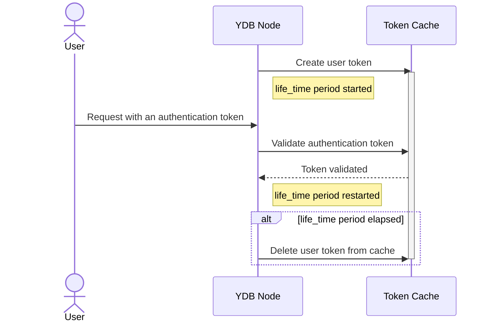

```mermaid
sequenceDiagram
    actor user as User
    participant node as YDB Node
    participant cache as Token Cache

    node->>cache: Create user token
    activate cache
    Note right of node: life_time period started

    user->>node: Request with an authentication token
    node->>cache: Validate authentication token
    cache-->>node: Token validated
    Note right of node: life_time period restarted

    alt life_time period elapsed
    node->>cache: Delete user token from cache
    deactivate cache
    end
```