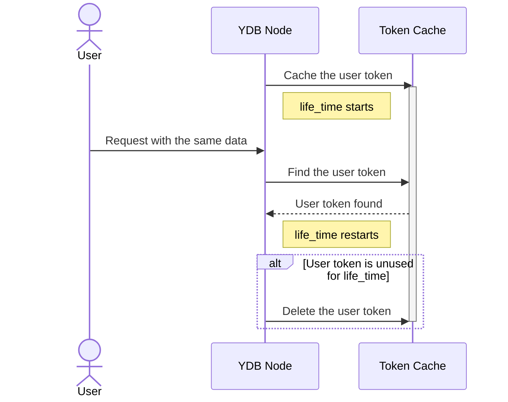

```mermaid
sequenceDiagram
    actor user as User
    participant node as YDB Node
    participant cache as Token Cache

    node->>cache: Cache the user token
    activate cache
    Note right of node: life_time starts

    user->>node: Request with the same data
    node->>cache: Find the user token
    cache-->>node: User token found
    Note right of node: life_time restarts

    alt User token is unused for life_time
    node->>cache: Delete the user token
    deactivate cache
    end
```