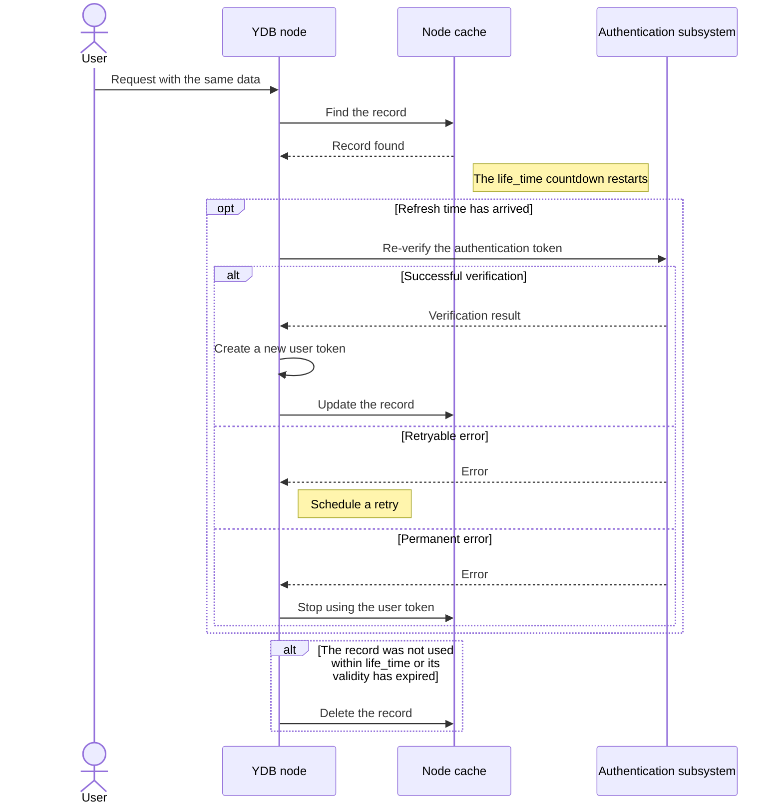

```mermaid
sequenceDiagram
    actor user as User
    participant node as YDB node
    participant cache as Node cache
    participant auth as Authentication subsystem

    user->>node: Request with the same data
    node->>cache: Find the record
    cache-->>node: Record found
    Note right of cache: The life_time countdown restarts

    opt Refresh time has arrived
        node->>auth: Re-verify the authentication token
        alt Successful verification
            auth-->>node: Verification result
            node->>node: Create a new user token
            node->>cache: Update the record
        else Retryable error
            auth-->>node: Error
            Note right of node: Schedule a retry
        else Permanent error
            auth-->>node: Error
            node->>cache: Stop using the user token
        end
    end

    alt The record was not used within life_time or its validity has expired
        node->>cache: Delete the record
    end
```
