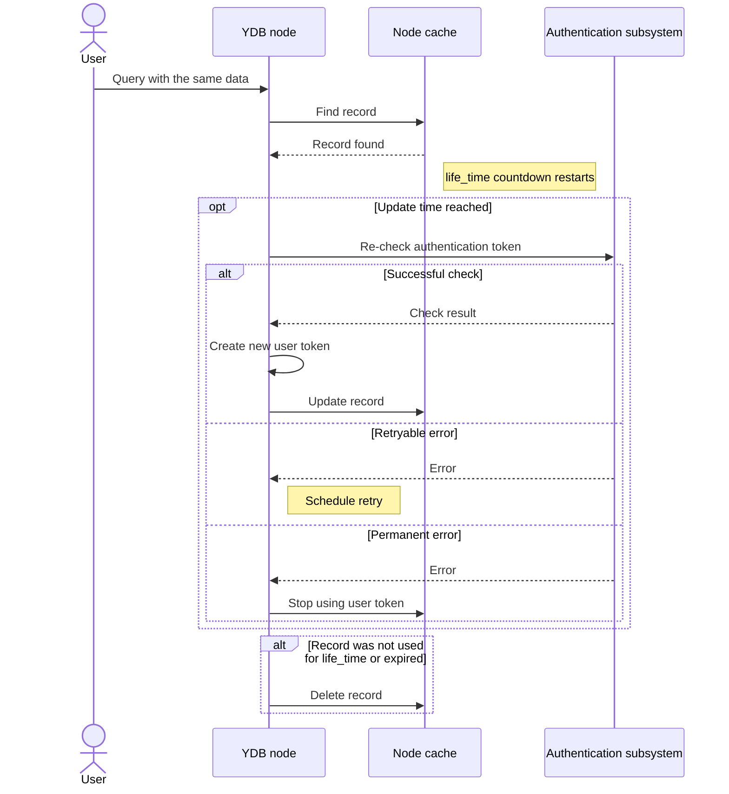

```mermaid
sequenceDiagram
    actor user as User
    participant node as YDB node
    participant cache as Node cache
    participant auth as Authentication subsystem

    user->>node: Query with the same data
    node->>cache: Find record
    cache-->>node: Record found
    Note right of cache: life_time countdown restarts

    opt Update time reached
        node->>auth: Re-check authentication token
        alt Successful check
            auth-->>node: Check result
            node->>node: Create new user token
            node->>cache: Update record
        else Retryable error
            auth-->>node: Error
            Note right of node: Schedule retry
        else Permanent error
            auth-->>node: Error
            node->>cache: Stop using user token
        end
    end

    alt Record was not used for life_time or expired
        node->>cache: Delete record
    end
```
