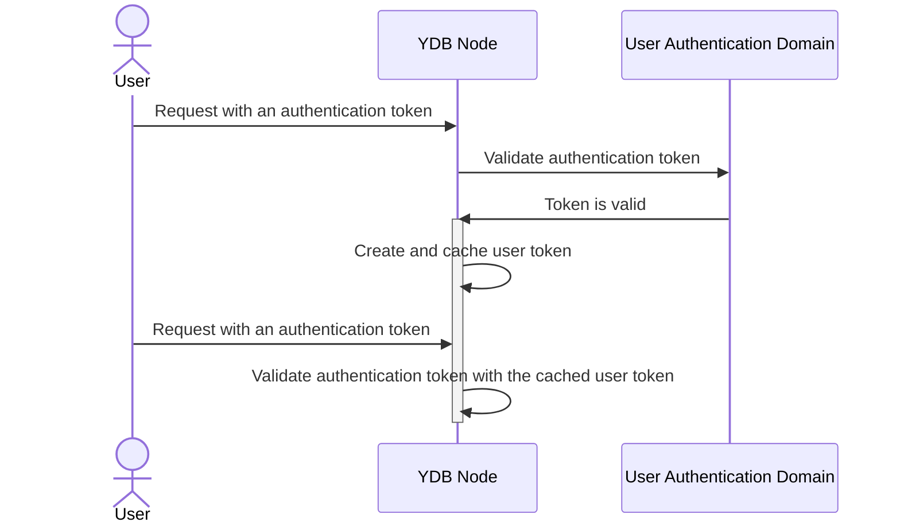

```mermaid
sequenceDiagram
    actor user as User
    participant node as YDB Node
    participant auth as User Authentication Domain

    user->>node: Request with an authentication token
    node->>auth: Validate authentication token
    auth->>node: Token is valid

    activate node
    node->>node: Create and cache user token
    user->>node: Request with an authentication token
    node->>node: Validate authentication token with the cached user token
    deactivate node
```