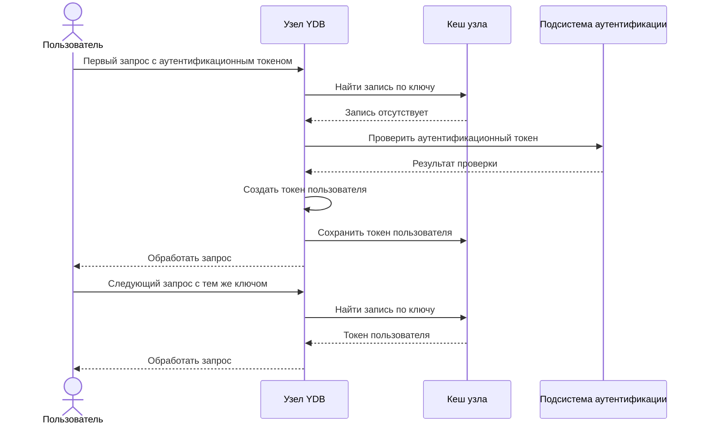

```mermaid
sequenceDiagram
    actor user as Пользователь
    participant node as Узел YDB
    participant cache as Кеш узла
    participant auth as Подсистема аутентификации

    user->>node: Первый запрос с аутентификационным токеном
    node->>cache: Найти запись по ключу
    cache-->>node: Запись отсутствует
    node->>auth: Проверить аутентификационный токен
    auth-->>node: Результат проверки
    node->>node: Создать токен пользователя
    node->>cache: Сохранить токен пользователя
    node-->>user: Обработать запрос

    user->>node: Следующий запрос с тем же ключом
    node->>cache: Найти запись по ключу
    cache-->>node: Токен пользователя
    node-->>user: Обработать запрос
```
