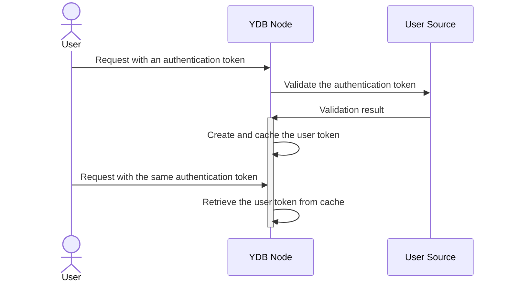

```mermaid
sequenceDiagram
    actor user as User
    participant node as YDB Node
    participant auth as User Source

    user->>node: Request with an authentication token
    node->>auth: Validate the authentication token
    auth->>node: Validation result

    activate node
    node->>node: Create and cache the user token
    user->>node: Request with the same authentication token
    node->>node: Retrieve the user token from cache
    deactivate node
```