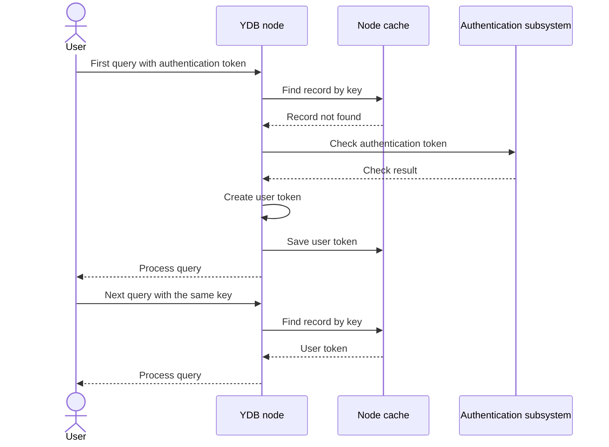

```mermaid
sequenceDiagram
    actor user as User
    participant node as YDB node
    participant cache as Node cache
    participant auth as Authentication subsystem

    user->>node: First query with authentication token
    node->>cache: Find record by key
    cache-->>node: Record not found
    node->>auth: Check authentication token
    auth-->>node: Check result
    node->>node: Create user token
    node->>cache: Save user token
    node-->>user: Process query

    user->>node: Next query with the same key
    node->>cache: Find record by key
    cache-->>node: User token
    node-->>user: Process query
```
