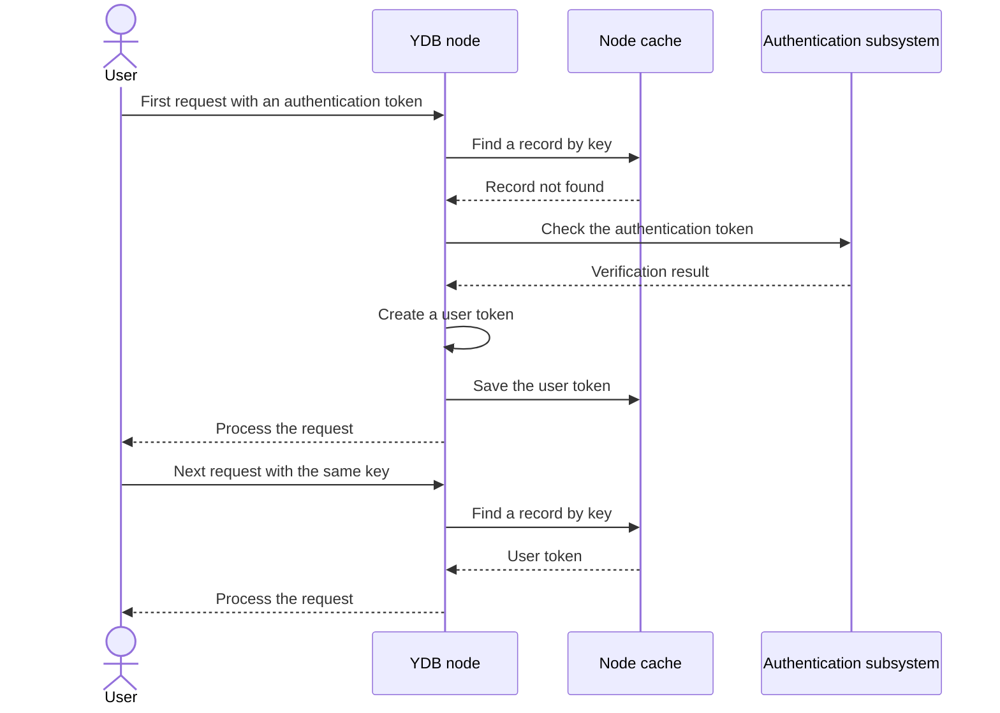

```mermaid
sequenceDiagram
    actor user as User
    participant node as YDB node
    participant cache as Node cache
    participant auth as Authentication subsystem

    user->>node: First request with an authentication token
    node->>cache: Find a record by key
    cache-->>node: Record not found
    node->>auth: Check the authentication token
    auth-->>node: Verification result
    node->>node: Create a user token
    node->>cache: Save the user token
    node-->>user: Process the request

    user->>node: Next request with the same key
    node->>cache: Find a record by key
    cache-->>node: User token
    node-->>user: Process the request
```
