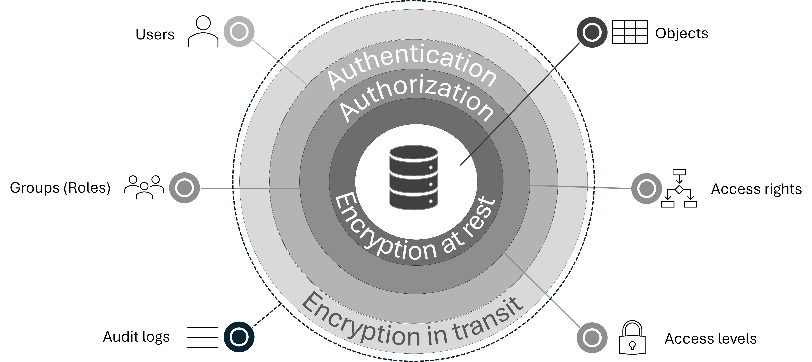

# {{ ydb-short-name }} for Security Engineers

This section of {{ ydb-short-name }} documentation covers security-related aspects of working with {{ ydb-short-name }}. It'll be useful for compliance purposes too.

## {{ ydb-short-name }} security elements and concepts

Security model in {{ ydb-short-name }} introduces the following concepts:

- **Access subjects**:

    - **Users**. {{ ydb-short-name }} supports both internal [users](./authorization.md#user) and external users from third-party directory services, such as LDAP and IAM systems.

    - **Groups**. {{ ydb-short-name }} allows grouping users into named collections. The list of users in a group can be modified later. A group can be empty.

- **Access objects** in {{ ydb-short-name }} are scheme objects (tables, views, etc) for which access rights are configured.

- **Access rights** in {{ ydb-short-name }} are used to determine the list of permitted operations with access objects for a given user or group.

    Access rights represent permission for an access subject to perform a specific set of operations (create, drop, select, update, etc) in a cluster or database on a specific access object.

    Access rights can be granted to a user or a group. When a user is added to a group, the user gets the access rights that were granted to the group. When a user is removed from a group, the user loses the access rights of the group.

    For more information about access rights, see [{#T}](./authorization.md#right).

- **Access levels** in {{ ydb-short-name }} are used to determine the list of additional cluster management operations permitted for a given user or group. {{ ydb-short-name }} uses three access levels:

    - **Viewer** allows viewing the cluster state, which is not publicly accessible.
    - **Operator** grants additional privileges to monitor and modify the cluster state.
    - **Administrator** grants privileges to administer the {{ ydb-short-name }} cluster and its databases.

    Similarly to access rights, one or more access levels can be granted to a user or a group. An access subject that does not have any access levels can view only publicly available information about the cluster. Each access level adds privileges to the access subject. For the maximum level of privileges, an access subject must have all three access levels.

    For more information about access levels, see [{#T}](../reference/configuration/security_config.md#security-access-levels).

- **[Authentication](./authentication.md) and [authorization](./authorization.md)**. The access control system in {{ ydb-short-name }} provides data protection in a {{ ydb-short-name }} cluster. Due to the access system, only authorized [access subjects](../concepts/glossary.md#access-subject) (users and groups) can work with data. Access to data can be restricted.

    - **Authentication**. When a [user](../concepts/glossary.md#access-user) connects to a {{ ydb-short-name }} cluster, {{ ydb-short-name }} first identifies the user's account. This process is called [authentication](./authentication.md). {{ ydb-short-name }} supports various authentication modes. For more information, see [Authentication](./authentication.md).

        Regardless of an authentication mode, after passing [authentication](./authentication.md), a user gets a [SID](./authorization.md#sid) and an authentication token.

        - {{ ydb-short-name }} cluster uses a [SID](./authorization.md#sid) for user identification. For example, a SID for a local user is the user login. SIDs for external users also include information about the system where they were created. User SIDs can also be found in [system views](../dev/system-views.md#auth) describing the security configuration.

        - The authentication token is used by {{ydb-short-name }} nodes to authorize user access before processing user requests.

            The user can then use the received authentication token repeatedly when making requests to the {{ydb-short-name }} cluster. For more information about the authentication token and related configuration parameters, see [{#T}](../reference/configuration/auth_config.md).

    - **Authorization**. Based on the authentication data, a user then goes through [authorization](./authorization.md) — a process that verifies whether a user has sufficient [access rights](../concepts/glossary.md#access-right) and [access levels](../concepts/glossary.md#access-level) to perform user operations.

- **Audit logs**. {{ ydb-short-name }} provides [audit logs](./audit-log.md) that include data about all operations that attempted to change the {{ ydb-short-name }} objects, such as changing access rights, creating or deleting scheme objects, whether successful or not. Audit logs are intended for people responsible for information security.

- **Encryption**. {{ ydb-short-name }} is a distributed system typically running on a cluster, often spanning multiple datacenters. To protect user data, {{ ydb-short-name }} provides the following technologies:

    - [encryption in transit](./encryption/data-in-transit.md) to secure data transmitted between a client and {{ ydb-short-name }}, and between nodes of the {{ ydb-short-name }} cluster.

    - [data encryption at rest](./encryption/data-at-rest.md).
