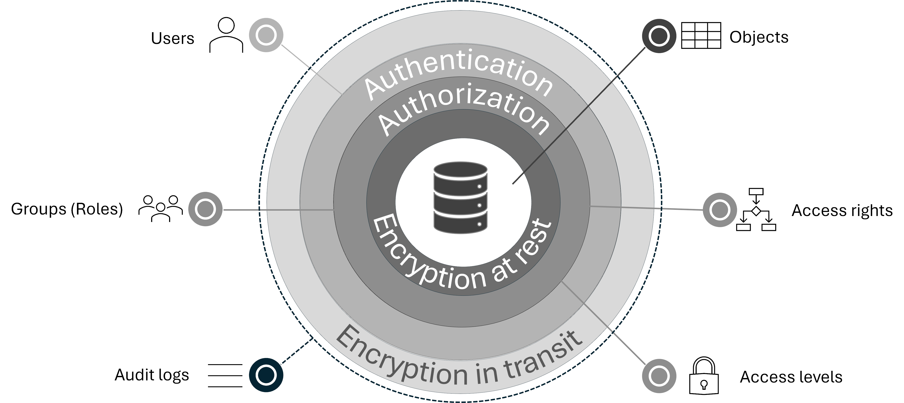

# {{ ydb-short-name }} for security engineers

This section of the {{ ydb-short-name }} documentation covers security-related aspects of working with {{ ydb-short-name }}. It is also useful for compliance purposes.

## Key security elements and concepts of {{ ydb-short-name }}

The {{ ydb-short-name }} security system operates with the following concepts:

- **Access subjects**:

  - **Users**. {{ ydb-short-name }} allows working with both local [users](./authorization.md#user) and users from external sources (LDAP directories, IAM systems, etc.).
  - **Groups**. {{ ydb-short-name }} allows combining users into named sets. The composition of users in a group can be changed later. A group can also be empty — containing no users.
- **Access objects**. In {{ ydb-short-name }}, access objects are schema objects (tables, system views, etc.) for which access rights are configured.
- **Access rights**. Using **access rights** in {{ ydb-short-name }}, the list of allowed operations on access objects for a specific user or group is defined.

  Access rights are the ability to perform certain actions (create, delete, read, update, etc.) on an access object.

  Access rights can be granted to a specific user or group. A user added to a group is granted the rights previously granted to that group for as long as they remain in the group.

  For more information about access rights, see the section [{#T}](./authorization.md#right).
- **Access levels**. Using **access levels** in {{ ydb-short-name }}, access to additional cluster management capabilities is defined for a specific user or group. {{ ydb-short-name }} uses hierarchical access levels: database, viewer, monitoring, and administration. Higher levels automatically include all lower ones. Additionally, there are two special non-hierarchical lists: bootstrap (for initial cluster initialization) and register node (for registering dynamic nodes).

  For more information about access levels, see the section [{#T}](./authorization.md#access-level-lists).
- **[Authentication](./authentication.md) and [authorization](./authorization.md)**. The access control system in {{ ydb-short-name }} provides a data protection mechanism in the {{ ydb-short-name }} cluster. Only authenticated [access subjects](../concepts/glossary.md#access-subject) (users and groups) can work with data, and data access can be restricted.

  - **[Device authentication](./authentication.md#device-auth)**. When opening a TLS connection, {{ ydb-short-name }} can verify the [client certificate](../concepts/glossary.md#client-certificate) and thereby restrict the network perimeter. Such authentication is optional and is configured for supported interfaces. After device authentication, user [authentication](./authentication.md) may still be required to access data.
  - **Client authentication**. When accessing the {{ ydb-short-name }} cluster, [users](../concepts/glossary.md#access-user) undergo [authentication](./authentication.md) — a verification process that confirms the user's identity. {{ ydb-short-name }} supports various authentication mechanisms; their detailed description can be found in the corresponding [authentication](./authentication.md) section.

    It is important to note that, regardless of the mechanism used, successful authentication results in users receiving an identifier (SID) and an authentication token.

    - The identifier in the form of [SID](./authorization.md#sid) is used to identify the user in {{ ydb-short-name }}. For example, for local users, the user's login serves as the SID. For external users, the SID also contains information about the user's source. The user's SID can also be found in [system views](../dev/system-views.md#auth) that describe the current security settings.
    - The authentication token is used by {{ ydb-short-name }} nodes to authorize user access before processing their requests.

      The user can reuse the obtained authentication token multiple times in their work when executing queries to the {{ ydb-short-name }} cluster. For more information about the authentication token, such as caching parameters, etc., see the [{#T}](../reference/configuration/auth_config.md) section.
  - **Authorization**. Based on authentication data, [authorization](./authorization.md) is performed — the process of verifying that the user has the required [access rights](../concepts/glossary.md#access-right) and [access levels](../concepts/glossary.md#access-level) to perform the requested operation.
- **Audit logs**. Actions aimed at changing security settings are additionally logged in a separate journal called the [audit log](./audit-log.md). This journal will primarily be of interest to those responsible for information security. The audit log records actions such as creating or deleting access objects, creating or deleting users, changing passwords, granting or revoking access rights, and so on.
- **Encryption**. {{ ydb-short-name }} is a distributed system that typically runs on clusters located in multiple data centers. To protect user data, {{ ydb-short-name }} provides the following mechanisms:

  - [data encryption in transit](./encryption/data-in-transit.md) to ensure the security of data transmitted between the client and {{ ydb-short-name }}, and between the nodes of the {{ ydb-short-name }} cluster itself
  - [data encryption at rest](./encryption/data-at-rest.md).
