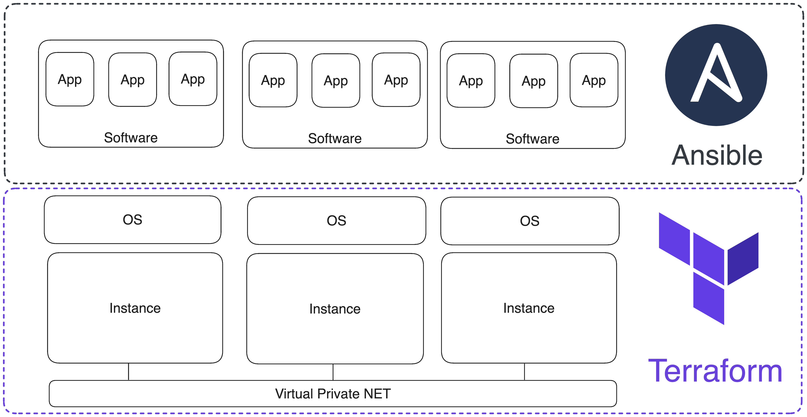

# Deploying infrastructure for cluster {{ ydb-short-name }} using Terraform

There are three recommended ways to deploy {{ ydb-short-name }} clusters for production use: using [Ansible](initial-deployment.md), [Kubernetes](../kubernetes/initial-deployment.md) or [manually](../../deploy/index.md). If the option with Kubernetes is practically self-sufficient, then for the options with Ansible and manually, you need ssh access to the required number of correctly configured servers or virtual machines to start. This article describes how you can create and configure the set of virtual machines required for the {{ ydb-short-name }} cluster on various cloud providers.

**[Terraform](https://www.terraform.io/)** is open source infrastructure management software based on the Infrastructure as Code model. The same approach is used in Ansible, a configuration management system. Terraform and Ansible work at different levels: Terraform manages the infrastructure, and Ansible configures the environments on the VM:



The configuration for setting up the VM environment is described in YAML format, and the infrastructure code is written in [HCL](https://github.com/hashicorp/hcl) (Terraform configuration language). The basic logical unit of recording in HCL is the "block". A block consists of a keyword identifying its type, a name, and curly braces indicating the body of the block. For example, this is what a virtual server control block in AWS might look like:
```hcl
resource "aws_instance" "ydb-vm" {
   count = var.instance_count
   ami = "ami-008fe2fc65df48dac"
   instance_type = "t2.micro"
   key_name = var.req_key_pair
   vpc_security_group_ids = [var.input_security_group_id]
   subnet_id = element(var.input_subnet_ids, count.index % length(var.input_subnet_ids))
  
   tags = {
     Name = "ydb-node-${count.index +1}"
     Username = "ubuntu"
   }

}
```

Blocks can be located one after another in one file and be independent, they can refer to each other and be dependent, and they can also be nested inside each other.

Main block types:
* `resource` – block for initializing an infrastructure resource (VM, network, subnet, disk, DNS zone, etc.);
* `provider` – block initialization of the provider, API version and authentication data;
* `variable` – a variable with both a default value and an empty one for storing data entered by the user or transmitted by other blocks;
* `output` – output data to the terminal and save it in a variable;
* `data` – variable for requesting data from external cloud resources that are not represented in the created infrastructure;
* `module` – logical grouping of resources that can be reused several times within the same or different projects;
* `terraform` – a block for setting the behavior of Terraform itself, including the version of Terraform and the providers used, as well as settings for the backend, which is used to store Terraform state.

Blocks are written in files with a `.tf` extension and are logically grouped in directories, which in Terraform terminology are called modules. A module usually consists of the following files:
* `main.tf` – the main file that contains the infrastructure code. There may be multiple files containing infrastructure code.
* `variables.tf` – local module variables that receive data from other modules or have default values.
* `outputs.tf` – variables that contain the results of the resource (VM IP addresses, network/subnet IDs, etc.).

Modules are connected to the project in the root file `main.tf` as follows:
```
module "vpc" {
   source = "./modules/vpc"
   subnets_count = var.subnets_count
   subnets_availability_zones = var.availability_zones
}
```
In the example, the `vpc` module is connected (the module name is assigned when connecting). The required parameter is `source` - the path to the directory where the module is located. `subnets_count` and `subnets_availability_zones` are variables inside the `vpc` module that take values from the global level variables `var.subnets_count`, `var.availability_zones`.

Modules, as well as blocks, are located one after another in the root `main.tf` of the project. The main advantage of the modular approach to project organization is the ability to easily manage logically related sets of resources. Therefore, our [repository](https://github.com/ydb-platform/ydb-terraform) with ready-made Terraform scripts is organized as follows:
```txt
.
├── README.md
├── README_RU.md
├── aws
│   ├── README.md
│   ├── README_RU.md
│   ├── main.tf
│   ├── modules
│   │   ├── dns
│   │   ├── eip
│   │   ├── instance
│   │   ├── key_pair
│   │   ├── security
│   │   └── vpc
│   └── variables.tf
├── azure
│   ├── README.md
│   ├── README_RU.md
│   ├── main.tf
│   ├── modules
│   │   ├── dns
│   │   ├── resource_group
│   │   ├── security
│   │   ├── vm
│   │   └── vpc
│   └── variables.tf
├── ...
```

Поддиректории содержат два `readme`, файл `variables.td` с локальными переменными модуля и основной файл `main.tf`, который подключает модули из поддиректории `modules`. Набор модулей зависит от облачного провайдера. Базовые модули, функционально одинаковые для всех провайдеров имеют одинаковые названия:
* `vpc` – модуль управления облачной сетью и подсетями.
* `dns` – модуль управления DNS-зоной и DNS-записями.
* `security` – модуль управления группами безопасности.
* `instance` – модуль управления ВМ.

Для того, чтобы воспользоваться готовыми Terraform сценариями из репозитория, нужно скачать репозиторий командой `git clone https://github.com/ydb-platform/ydb-terraform.git`, внести изменения в конфигурационный файл Terraform `~/.terraformrc`, задать актуальные значения глобальных переменных сценария и скачать CLI того облачного провайдера, где будет создана инфраструктура.

Если вы планируете использовать несколько провайдеров, можно добавить следующий код в `~/.terraformrc`, который установит пути скачивания для всех провайдеров описанных ниже:
```
provider_installation {
  network_mirror {
    url     = "https://terraform-mirror.yandexcloud.net/"
    include = ["registry.terraform.io/*/*"]
  }
  direct {
    exclude = ["registry.terraform.io/*/*"]
    exclude = ["terraform.storage.ydb.tech/*/*"]
  }

  filesystem_mirror {
    path    = "/Applications/
    }
  }
```

The subdirectories contain two `readme`, a file `variables.td` with local module variables and a main file `main.tf`, which includes modules from the `modules` subdirectory. The set of modules depends on the cloud provider. Basic modules, functionally the same for all providers, have the same names:
* `vpc` – cloud network and subnet management module.
* `dns` – module for managing DNS zone and DNS records.
* `security` – security group management module.
* `instance` – VM control module.

In order to use ready-made Terraform scripts from the repository, you need to download the repository with the command `git clone https://github.com/ydb-platform/ydb-terraform.git`, make changes to the Terraform configuration file `~/.terraformrc`, set the current values of global script variables and download the CLI of the cloud provider where the infrastructure will be created.

If you plan to use multiple providers, you can add the following code to `~/.terraformrc`, which will set the download paths for all providers described below:
```
provider_installation {
   network_mirror {
     url = "https://terraform-mirror.yandexcloud.net/"
     include = ["registry.terraform.io/*/*"]
   }
   direct {
     exclude = ["registry.terraform.io/*/*"]
     exclude = ["terraform.storage.ydb.tech/*/*"]
   }

   filesystem_mirror {
     path = "/Applications/
     }
   }
```

If you are already using Terraform providers provided in the [official repository](https://registry.terraform.io/browse/providers), they will continue to work.

The following are step-by-step instructions for creating infrastructure in [AWS](#aws-cluster), [Azure](#aws-cluster), [GCP](#gcp-cluster), [Yandex Cloud](#gcp-cluster). The scenarios proposed by Terraform deploy the same type of infrastructure:

The infrastructure includes:

* Nine virtual VMs (16 CPU, 32 GB RAM, additional 200 GB disk).
* Cloud network and three subnets (one subnet per availability zone).
* Private DNS zone.
* Security groups allowing traffic on ports: 22, icmp, 8765.

Most cluster parameters are adjustable (number of VMs, size and type of connected disk, number of networks, DNS zone domain, etc.), but please note that there are recommended values for cluster parameters that are already defined as default values. Changing them downward can render the cluster inoperable. These recommended values for cluster parameters are:
* Number of CPU cores. The minimum recommended number of CPU cores is 16 pieces.
* RAM size. The minimum recommended amount of RAM is 32 GB.
* Volume of the attached disk. The minimum recommended size of the attached disk is 200 GB.

## Create infrastructure in AWS to deploy {{ ydb-short-name }} cluster {#aws-cluster}



## Create infrastructure in Azure to deploy {{ ydb-short-name }} cluster {#azure-cluster}



## Creating infrastructure in Google Cloud Platform to deploy {{ ydb-short-name }} cluster {#gcp-cluster}



## Creating an infrastructure in Yandex Cloud for deploying the {{ ydb-short-name }} cluster {#yc-cluster}



With the help of Yandex Cloud provider, you can not only create an infrastructure for further deployment of a YDB cluster on it using [Ansible](./initial-deployment.md), but also manage [serverless or dedicated](https://cloud.yandex.ru/ru /services/ydb) version of YDB directly from Terraform. Read about the possibilities of working with YDB in Yandex Cloud in the section [Working with YDB via Terraform](https://cloud.yandex.ru/ru/docs/ydb/terraform/intro) of the Yandex Cloud documentation.