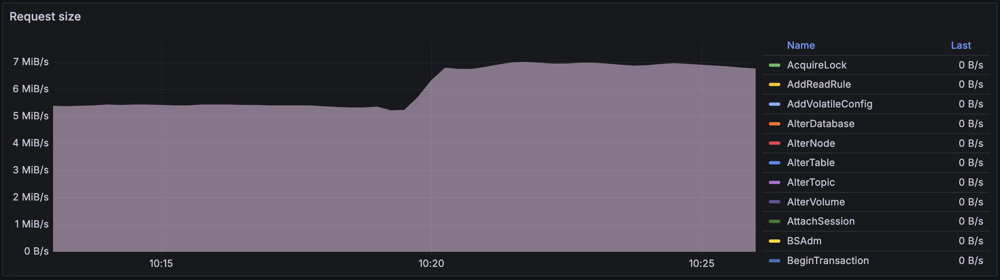
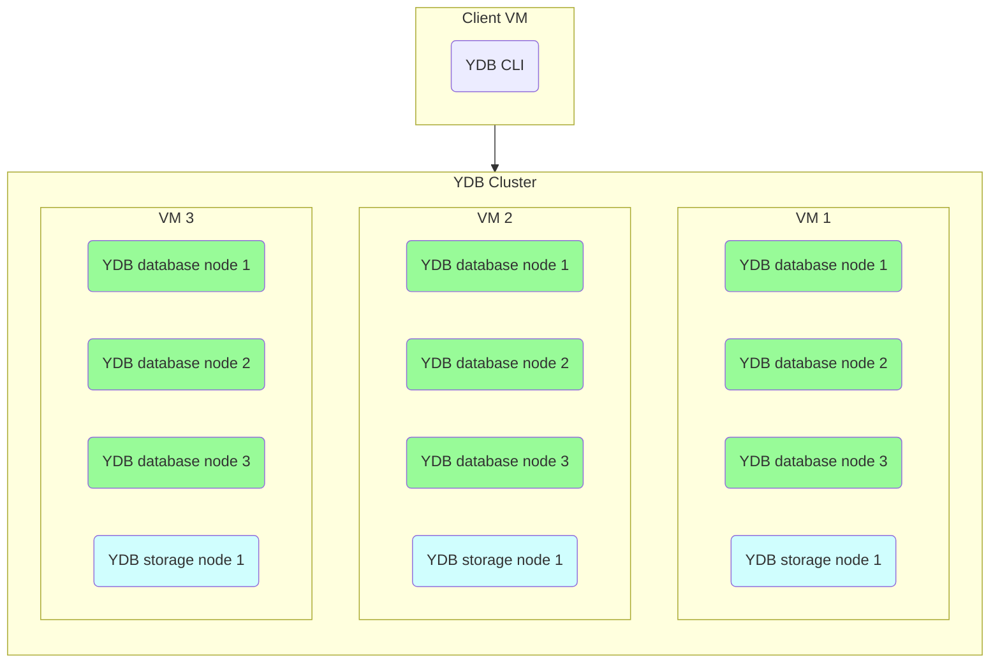

# Overloaded shard example

This article describes an example of how to diagnose overloaded shards and resolve the issue.

For more information about overloaded shards and the causes for this issue, see the article [{#T}](../../performance/schemas/overloaded-shards.md).

The article starts with [stating the problem](#initial-problem). Then we'll take a look at diagrams in Grafana and information on the **Diagnostics** tab in the [Embedded UI](../../../reference/embedded-ui/index.md) to [solve the problem](#solution) and [watch the solution in action](#aftermath).

Also, in the end of the article you can see the steps how to [reproduce the situation](#testbed).

## Initial problem {#initial-problem}

You were notified that your system started taking too long to process user requests.

Let's take a look at the **Latency** diagrams in the [DB overview](../../../reference/observability/metrics/grafana-dashboards.md#dboverview) Grafana dashboard to see if the problem has to do with the {{ ydb-short-name }} cluster:




The diagram shows the transaction latency percentiles. At approximately ##10:19:30## these values increased by two to three times.






The diagram shows the heatmap of transaction latencies. The transactions here are grouped into buckets based on their latency, each bucket has a different color. So on this diagram you can see both the number of transactions processed by {{ ydb-short-name }} per second and the latency distribution among the transactions.

By ##10:20:30## the share of transactions with the lowest latencies (`Bucket 1`, dark green) dropped by four to five times. `Bucket 4` grew by approximately five times. And there appeared a new group of slower transactions - `Bucket 8`.



Indeed, the latencies have increased. Now we need to localize the problem.

## Diagnostics {#diagnostics}

Let's find out why the latencies increased. Perhaps, the reason is the increased workload? Here is the **Requests** diagram from the **API details** section of the [DB overview](../../../reference/observability/metrics/grafana-dashboards.md#dboverview) Grafana dashboard:


<!--

-->

The number of user requests has increased from ~27000 to ~35000 at around ##10:20:00##. But can {{ ydb-short-name }} handle the increased load without additional hardware resources?

The CPU load has increased, you can see it on the **CPU by execution pool** diagram.




If we take a look at the **CPU** Grafana dashboard, the CPU usage increased [in the user pool and in the interconnect pool](../../../concepts/glossary.md#actor-system-pool):




We can also see the overall CPU usage on the **Diagnostics** tab of the [Embedded UI](../../../reference/embedded-ui/index.md):


It looks like the {{ ydb-short-name }} cluster is not utilizing all of its CPU capacity.

If we look at the **DataShard** and **DataShard details** sections of the [DB overview](../../../reference/observability/metrics/grafana-dashboards.md#dboverview) Grafana dashboard, we can see that after the load on the cluster increased, one of its data shards got overloaded.




This diagram shows that the number of rows read per second in the {{ ydb-short-name }} database increased from ~26000 to ~33500 rows per second.






This diagram shows the heatmap of data shard distribution by workload. Data shards are grouped into ten buckets by their workload. So on this diagram you can see how many data shards your {{ ydb-short-name }} cluster contains and how loaded they are.

The diagram shows only one data shard, which workload changed at about ##10:19:30## — the data shard moved to `Bucket 70` that contains shards with workload between 60% and 70%.






Just like the previous diagram, the **Overloaded shard count** is a heatmap of data shard distribution by load. But it displays only data shards which workload exceeds 60%.

On this diagram we can see that the workload on one data shard grew up to 70% at about ##10:19:30##.



To determine what table the overloaded data shard is processing, let's open the **Diagnostics > Top shards** tab in the Embedded UI:


See that one of the data shards that processes queries for the `kv_test` table is loaded by 67%.

Let's take a look at the `kv_test` table on the **Info** tab:




The `kv_test` table was created with partitioning by load disabled and has only one partition.

It means that only one data shard processes requests to this table. And we know that a data shard can process only one request at a time. This is really bad practice.



## Solution {#solution}

We should enable partitioning by load for the `kv_test` table:

1. In the Embedded UI, select the database.
2. Open the **Query** tab.
3. Run the following query:

    ```sql
    ALTER TABLE kv_test SET (
        AUTO_PARTITIONING_BY_LOAD = ENABLED
    );
    ```

## Aftermath {#aftermath}

As soon as we enable automatic partitioning for the `kv_test` table, the overloaded data shard split in two.




The diagram shows that the number of data shards increased at about ##10:28:00##. Their workload does not exceed 40% judging by the bucket color.






The overloaded shard disappeared from the diagram at about ##10:28:00##.



Two data shards are processing queries to the `kv_test` table now, none of them are overloaded:


Let's make sure the latencies are back to normal:




At about ##10:28:00## p50, p75, p95 latencies dropped almost to the original level. The p99 latency decrease is less pronounced, but still, it's a twofold drop.






The diagram shows that transactions are grouped into six buckets now. Approximately half of the transactions are back to `Bucket 1`, meaning that their latency is less than one millisecond. More than a third of the transactions are in `Bucket 2` with the latencies from one up to two milliseconds. One sixth of the transactions are in `Bucket 4`. The size of other buckets is insignificant.



The latencies are almost as low as they used to be before the workload increased. We did not add any additional hardware resources, just enabled automatic partitioning by load.

#|
|| Bucket name
| Latencies, ms
|
Transactions,
single overloaded data shard
|
Transactions,
multiple data shards
||
|| 1
| 0-1
| 2110
| ⇧ 16961
||
|| 2
| 1-2
| 5472
| ⇧ 13147
||
|| 4
| 2-4
| 16437
| ⇩ 6041
||
|| 8
| 4-8
| 9430
| ⇩ 432
||
|| 16
| 8-16
| 98.8
| ⇩ 52.4
||
|| 32
| 16-32
| —
| ⇧ 0.578
||
|#

## Testbed {#testbed}

### Topology

For the example, we used a {{ ydb-short-name }} cluster consisting of three servers running Ubuntu 22.04 LTS.



### Hardware configuration

Each virtual machine has the following computing resources:

- Platform: Intel Broadwell
- Guaranteed vCPU performance: 100%
- vCPU: 28
- RAM: 32 GB

### Test

The load on the {{ ydb-short-name }} was generated with the `ydb workload` CLI command. For more information, see [{#T}](../../../reference/ydb-cli/commands/workload/index.md).

To reproduce the load, follow these steps:

1. Initialize the tables for the workload test:

    ```shell
    ydb workload kv init --min-partitions 1 --auto-partition 0
    ```

    We deliberately disable automatic partitioning for the created tables by using the `--min-partitions 1 --auto-partition 0` options.

1. Emulate the standard workload on the {{ ydb-short-name }} cluster:

    ```shell
    ydb workload kv run select -s 600 -t 100
    ```

    We ran a simple load type using a {{ ydb-short-name }} database as a Key-Value storage. Specifically, we used the `select` load to create SELECT queries and get rows based on an exact match of the primary key.

    The `-t 100` parameter is used to ran the test in 100 threads.


1. Overload the {{ ydb-short-name }} cluster:

    ```shell
    ydb workload kv run select -s 1200 -t 250
    ```

    To simulate the overload, as soon as the first test ended, we ran the same load test in 250 threads.

## See also

- [Troubleshooting performance issues](../../performance/index.md) > [Overloaded shards](../../performance/schemas/overloaded-shards.md)